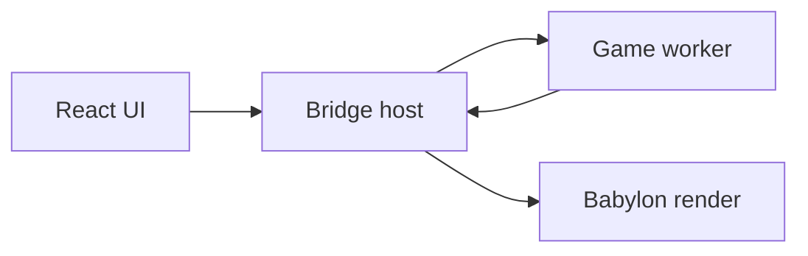

# Architecture overview

Authoritative detail lives in [engineplan.md](../engineplan.md). This page orients contributors.

## Monorepo (current P0)

```
apps/editor/          Editor shell + main-thread renderer
packages/core/        GUIDs, schemas, command bus (was shared)
packages/vfs/         Storage port, adapters, platform detection (was storage)
packages/render/      Babylon viewport (was engine)
packages/graph-ui/    React Flow graph editor (was graph)
packages/ui/          shadcn primitives
packages/editor-kit/  Touch-shell hooks and components (context menu, SelectableText)
packages/test-kit/    Golden-file and style-audit test helpers
```

## Target threading (P4+)



Game logic and physics share one worker; transforms use SAB or transferable snapshots; structural commands use ordered messages.

## Data flow today

- **Documents**: `ProjectService` + `DocumentService` + Dockview layout JSON per tab.
- **Files**: `ProjectStorage` via `createStorage()` — never Capacitor from panels.
- **Graph → engine**: `engineCommandBus` in `core` (minimal commands today).
- **Viewport**: `createEngine()` on main thread (demo loop until P4). Scene-only helpers live in `render/viewport.ts` so they are testable under `NullEngine`; `create-engine.ts` holds the canvas-bound parts.

## Package rules

Boundaries are enforced by `no-restricted-imports` patterns in `eslint.config.js`:

| Package | May not import |
| --- | --- |
| `core`, `test-kit` | React, Babylon, Capacitor |
| `vfs` | React, Babylon |
| `render` | React, Capacitor |
| `ui`, `editor-kit`, `graph-ui` | Babylon, Capacitor |
| `apps/editor/src` | Capacitor |

Patterns rather than exact module names, so deep imports such as `@babylonjs/core/Engines/engine` are caught too.

Platform detection lives behind `getHostPlatform()` in `vfs`, so Capacitor stays in one package.

See [CODING_STANDARDS.md](../CODING_STANDARDS.md) for conventions, [theming.md](theming.md) for the UI palette, and [testing.md](testing.md) for the test topology.
