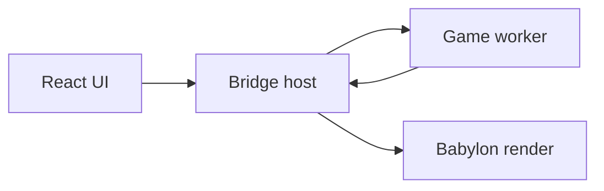

# Architecture overview

Authoritative detail lives in [engineplan.md](../engineplan.md). This page orients contributors.

## Monorepo (current P0)

```
apps/editor/          Editor shell + main-thread renderer
packages/core/        GUIDs, schemas, command bus (was shared)
packages/vfs/         Storage port + adapters (was storage)
packages/render/      Babylon viewport (was engine)
packages/graph-ui/    React Flow graph editor (was graph)
packages/ui/          shadcn primitives
packages/editor-kit/  Reusable editor hooks/components (P0 stub)
packages/test-kit/    Test helpers and golden utilities (P0 stub)
```

## Target threading (P4+)



Game logic and physics share one worker; transforms use SAB or transferable snapshots; structural commands use ordered messages.

## Data flow today

- **Documents**: `ProjectService` + `DocumentService` + Dockview layout JSON per tab.
- **Files**: `ProjectStorage` via `createStorage()` — never Capacitor from panels.
- **Graph → engine**: `engineCommandBus` in `core` (minimal commands today).
- **Viewport**: `createEngine()` on main thread (demo loop until P4).

## Package rules

See [CODING_STANDARDS.md](../CODING_STANDARDS.md) and ESLint import restrictions.
