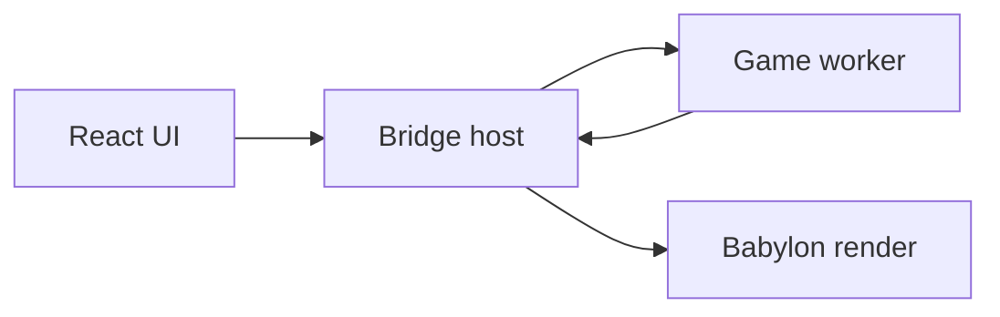

# Architecture overview

Authoritative detail lives in [engineplan.md](../engineplan.md). This page orients contributors.

## Monorepo (P3)

```
apps/editor/          Editor shell + Homepage + Content Browser + main-thread renderer
packages/core/        GUIDs, Result, math, seeded RNG, schemas, command bus, storage port
packages/vfs/         Storage adapters, platform detection, app settings
packages/assets/      Containers, asset registry, importers, encode queue
packages/edit/        Per-document undo stacks and reversible commands
packages/object-model/ Headless BObject / Actor / World / tick / class registry
packages/render/      Babylon viewport + KTX2 transcoder config
packages/graph-ui/    React Flow graph editor (mutations via edit)
packages/ui/          shadcn primitives
packages/editor-kit/  Touch-shell hooks and components
packages/test-kit/    Golden-file, fixtures, deterministic runtime harness
```

Shared-surface design notes: [containers.md](containers.md), [vfs.md](vfs.md), [command-layer.md](command-layer.md), [asset-registry.md](asset-registry.md), [object-model.md](object-model.md).

## Target threading (P4+)



Game logic and physics share one worker; transforms use SAB or transferable snapshots; structural commands use ordered messages.

## Data flow today

- **Lifecycle**: Homepage opens/creates a `.babproject`; editor shell only runs against an open project.
- **Documents**: `ProjectService` + `DocumentService` + Dockview layout JSON per tab.
- **Files**: binary `ProjectStorage` via `createStorage()` — never Capacitor from panels.
- **Containers / registry**: `@babylonslate/assets` encodes containers and owns the content-root-aware guid index (header-only).
- **Edits**: `@babylonslate/edit` owns per-document undo; graph UI routes mutations through commands.
- **Object model**: `@babylonslate/object-model` owns headless World, class registry, and deterministic tick (P3); Play/bridge lands in P4.
- **Graph → engine**: `engineCommandBus` in `core` (minimal commands today).
- **Viewport**: `createEngine()` on main thread (demo loop until P4). Scene-only helpers live in `render/viewport.ts` so they are testable under `NullEngine`; `create-engine.ts` holds the canvas-bound parts.

## Package rules

Boundaries are enforced by `no-restricted-imports` patterns in `eslint.config.js`:

| Package | May not import |
| --- | --- |
| `core`, `edit`, `object-model`, `test-kit` | React, Babylon, Capacitor |
| `assets` | React, Babylon, Capacitor |
| `vfs` | React, Babylon |
| `render` | React, Capacitor |
| `ui`, `editor-kit`, `graph-ui` | Babylon, Capacitor |
| `apps/editor/src` | Capacitor |

Patterns rather than exact module names, so deep imports such as `@babylonjs/core/Engines/engine` are caught too.

Platform detection lives behind `getHostPlatform()` in `vfs`, so Capacitor stays in one package.

See [CODING_STANDARDS.md](../CODING_STANDARDS.md) for conventions, [theming.md](theming.md) for the UI palette, and [testing.md](testing.md) for the test topology.
