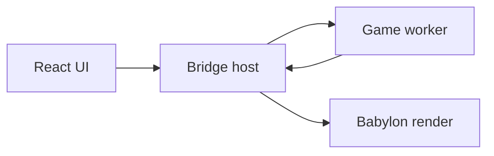

# Architecture overview

Authoritative detail lives in [engineplan.md](../engineplan.md). This page orients contributors.

## Monorepo (P7 physics in progress)

```
apps/editor/          Editor shell + Homepage + Content Browser + Play overlay + main-thread renderer
packages/core/        GUIDs, Result, math, seeded RNG, schemas, command bus, storage port, formatValue (P5)
packages/vfs/         Storage adapters, platform detection, app settings
packages/assets/      Containers, asset registry, importers, encode queue
packages/edit/        Per-document undo stacks and reversible commands
packages/object-model/ Headless BObject / Actor / World / tick / class registry
packages/physics/     Body/shape protocol; Havok 3D + Rapier 2D backends (P7)
packages/bridge/      SAB + transferable transports, snapshot layout, typed RPC
packages/runtime/     Game worker + in-process driver, snapshot writer, diagnostics, module loader, script host
packages/input/       Raw input ring + action/axis mapping model and `InputResolver`
packages/render/      Snapshot sync, render-on-demand, resource cache, editor tools, KTX2 transcoder
packages/scripting/   Graph IR, pin types, validator, JS codegen + anchors (P5)
packages/scripting-nodes/ Data-driven node catalog (P5)
packages/graph-ui/    React Flow graph editor (mutations via edit); P5 touch shell rework
packages/ui/          shadcn primitives
packages/editor-kit/  Touch-shell hooks, property grid, tree view, panel frame, asset picker, parameter-list editor
packages/test-kit/    Golden-file, fixtures, deterministic + multi-transport harness
```

Shared-surface design notes: [containers.md](containers.md), [vfs.md](vfs.md), [command-layer.md](command-layer.md), [asset-registry.md](asset-registry.md), [object-model.md](object-model.md), [physics.md](physics.md), [bridge.md](bridge.md), [render.md](render.md), [scripting.md](scripting.md), [scene-editing.md](scene-editing.md), [input.md](input.md).

## Threading (P4)



Game logic and physics share one worker; transforms use SAB or transferable snapshots; structural commands use ordered messages. See [bridge.md](bridge.md).

## Data flow today

- **Lifecycle**: Homepage opens/creates a `.babproject`; editor shell only runs against an open project.
- **Documents**: `ProjectService` + `DocumentService` + Dockview layout JSON per tab.
- **Files**: binary `ProjectStorage` via `createStorage()` — never Capacitor from panels.
- **Containers / registry**: `@babylonslate/assets` encodes containers and owns the content-root-aware guid index (header-only).
- **Edits**: `@babylonslate/edit` owns per-document undo; graph and scene panels route mutations through commands (`applyGraphChange` / `applySceneChange`).
- **Scene editing (P6)**: `SerializedScene` v2 actors/components; shared `SceneEditingProvider` selection; viewport gizmo + 2D mode via `@babylonslate/render` editor tools. See [scene-editing.md](scene-editing.md).
- **Input mappings (P6)**: Project Settings → `InputResolver` → runtime `TickContext` and scripting input nodes. See [input.md](input.md).
- **Object model**: `@babylonslate/object-model` owns headless World, class registry, and deterministic tick.
- **Bridge / runtime**: `@babylonslate/bridge` + `@babylonslate/runtime` own Play transports, fixed-step worker, and diagnostics.
- **Graph → engine**: `engineCommandBus` in `core` for light UI commands; Play hot path uses the bridge.
- **Visual scripting (P5)**: `@babylonslate/scripting` compiles logic graphs to JS modules with anchor tables; `@babylonslate/scripting-nodes` supplies the catalog; `runtime.ScriptHost` loads those modules and binds Begin Play / Tick entry points to actor lifecycle hooks, and Preview ships compiled project graphs to the worker (see [scripting.md](scripting.md)).
- **Viewport**: App-lifetime `Engine`; editor and Play scenes via `registerView`; dirty-driven render-on-demand.

## Package rules

Boundaries are enforced by `no-restricted-imports` patterns in `eslint.config.js`:

| Package | May not import |
| --- | --- |
| `core`, `edit`, `object-model`, `physics`, `bridge`, `runtime`, `input`, `test-kit`, `scripting`, `scripting-nodes` | React, Babylon, Capacitor |
| `assets` | React, Babylon, Capacitor |
| `vfs` | React, Babylon |
| `render` | React, Capacitor |
| `ui`, `editor-kit`, `graph-ui` | Babylon, Capacitor |
| `apps/editor/src` | Capacitor |

Patterns rather than exact module names, so deep imports such as `@babylonjs/core/Engines/engine` are caught too.

Platform detection lives behind `getHostPlatform()` in `vfs`, so Capacitor stays in one package.

See [CODING_STANDARDS.md](../CODING_STANDARDS.md) for conventions, [theming.md](theming.md) for the UI palette, and [testing.md](testing.md) for the test topology.
