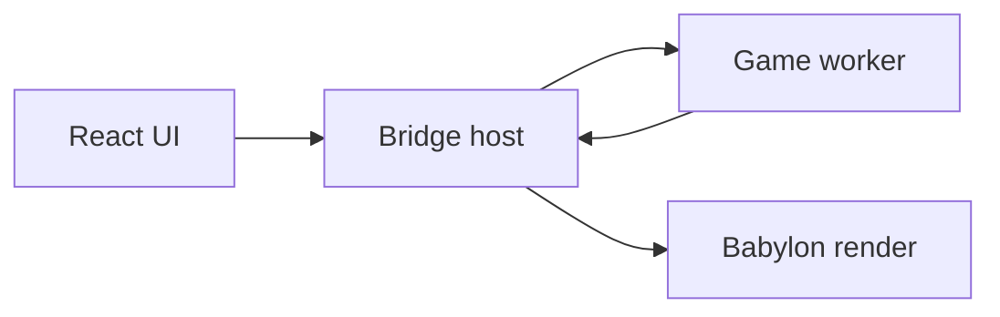

# Architecture overview

Authoritative detail lives in [engineplan.md](../engineplan.md). This page orients contributors.

`docs/` markdown is the source of truth for GitHub and the VitePress site at [https://hideoutgames.github.io/BabylonSlate/docs/](https://hideoutgames.github.io/BabylonSlate/docs/).

## Monorepo

```
apps/editor/          Editor shell + Homepage + Content Browser + Play overlay + main-thread renderer
apps/player/          Packaged game host (itch zip + Preview Build iframe); no React shell
apps/desktop/         Electron main + preload; Node VFS + userData for the editor
apps/docs/            VitePress site; content is the markdown in `docs/`
engine-logos/         Slate wordmark and icon (dark/light ink); copied into editor and docs `public/branding/`
packages/core/        GUIDs, Result, math, seeded RNG, schemas, command bus, storage port, formatValue (P5)
packages/vfs/         Storage adapters (OPFS, Capacitor, Electron IPC, Node), platform detection, app settings
packages/assets/      Containers, asset registry, search index, importers, encode queue
packages/exporter/    Headless game packer: export closure, `.babpack`, zip (P14)
packages/edit/        Per-document undo stacks and reversible commands
packages/object-model/ Headless BObject / Actor / World / tick / class registry
packages/physics/     Body/shape protocol; Havok 3D + Rapier 2D backends (P7)
packages/bridge/      SAB + transferable transports, snapshot layout, typed RPC
packages/runtime/     Game worker + in-process driver, snapshot writer, diagnostics, module loader, script host
packages/debugger/    Command registry, parser, BDebugCommand helpers, stats budget, trace recorder (P8)
packages/ui-runtime/  Widget tree, anchors, layout, font-stack compiler, cycle check (P9)
packages/anim-graph/  AnimationGraph evaluator in the game worker (P9)
packages/behaviour-tree/ Tree IR, blackboard, explicit-stack evaluator (P11)
packages/navigation/  Recast bake/query port, 2D remap, Scene navmesh chunk (P11)
packages/shader-graph/ Shader IR; compile-to-NodeMaterial in render (P9)
packages/input/       Raw input ring + action/axis mapping model and `InputResolver`
packages/render/      Snapshot sync, visibility-gated editor loop, resource cache, editor tools, KTX2 transcoder, FontFace registry, Babylon GUI apply
packages/scripting/   Graph IR, pin types, validator, JS codegen + anchors (P5)
packages/scripting-nodes/ Data-driven node catalog (P5)
packages/graph-ui/    React Flow graph editor with Blueprint node chrome (mutations via edit); see [components.md](components.md)
packages/ui/          shadcn primitives; catalog in [components.md](components.md)
packages/editor-kit/  Touch-shell hooks, property grid, tree view, panel frame, asset picker, SearchInput, parameter-list editor; see [components.md](components.md)
packages/test-kit/    Golden-file, fixtures, deterministic + multi-transport harness
engine-plugins/       First-party plugins (Starter Content); packed to `public/engine-plugins/` at editor build
```

Shared-surface design notes: [containers.md](containers.md), [vfs.md](vfs.md), [command-layer.md](command-layer.md), [asset-registry.md](asset-registry.md), [plugins.md](plugins.md), [global-search.md](global-search.md), [object-model.md](object-model.md), [physics.md](physics.md), [bridge.md](bridge.md), [render.md](render.md), [scripting.md](scripting.md), [scene-editing.md](scene-editing.md), [input.md](input.md), [debugger.md](debugger.md), [ui-runtime.md](ui-runtime.md), [fonts.md](fonts.md), [sprites.md](sprites.md), [tilemaps.md](tilemaps.md), [anim-graph.md](anim-graph.md), [behaviour-tree.md](behaviour-tree.md), [navigation.md](navigation.md), [shader-graph.md](shader-graph.md), [theming.md](theming.md), [components.md](components.md), [editor-extensions.md](editor-extensions.md), [exporter.md](exporter.md).

## Threading (P4)



Game logic and physics share one worker; transforms use SAB or transferable snapshots; structural commands use ordered messages. See [bridge.md](bridge.md).

## Data flow today

- **Lifecycle**: Homepage opens/creates a `.babproject`; editor shell only runs against an open project.
- **Documents**: `ProjectService` + `DocumentService` + Dockview layout JSON per tab. The global **Windows** menu toggles dock panels for the active DockView document (Scene, Class, Enum, Structure, ScriptInterface, Sprite, Tileset, Tilemap, UserInterface / EditorUtilityInterface, PluginSettings, …) and stores last **addPanel-relative** placements in `layout.json`. New asset editors must be DockView documents — see [Asset document docks](#asset-document-docks).
- **Files**: binary `ProjectStorage` via `createStorage()` — never Capacitor from panels.
- **Containers / registry**: `@babylonslate/assets` encodes containers and owns the content-root-aware guid index (header-only). Enabled plugins mount as extra roots ([plugins.md](plugins.md)); engine plugins unpack into a separate read-only Memory storage. New projects copy them into `plugins/` with the same guids (project copy shadows the engine original).
- **Global search**: `ProjectSearchIndex` (same package) may load Scene/Graph document JSON for actors/nodes from the asset’s root storage; it must not load binary payloads. Toolbar Search opens a centered dialog; see [global-search.md](global-search.md).
- **Edits**: `@babylonslate/edit` owns per-document undo; graph, scene, and P9 asset documents (UserInterface / Font / Sprite / AnimationGraph / Shader) route mutations through commands (`applyGraphChange` / `applySceneChange` / `applyAssetDocumentChange`).
- **Scene editing (P6)**: `SerializedScene` v2 actors/components; shared `SceneEditingProvider` selection; viewport gizmo + 2D mode via `@babylonslate/render` editor tools. See [scene-editing.md](scene-editing.md).
- **Input mappings (P6)**: Project Settings → `InputResolver` → runtime `TickContext` and scripting input nodes. See [input.md](input.md).
- **Object model**: `@babylonslate/object-model` owns headless World, class registry, and deterministic tick.
- **Bridge / runtime**: `@babylonslate/bridge` + `@babylonslate/runtime` own Play transports, fixed-step worker, and diagnostics. Play `load` carries the open `SerializedScene`; the worker instantiates those actors (no demo seeds), binds compiled graphs to matching class ids, and emits `assignMesh` `meshKind` so Play primitives match `MeshComponent`.

- **Graph → engine**: `engineCommandBus` in `core` for light UI commands; Play hot path uses the bridge.
- **Visual scripting (P5)**: `@babylonslate/scripting` compiles logic graphs to JS modules with anchor tables; `@babylonslate/scripting-nodes` supplies the catalog; `runtime.ScriptHost` loads those modules and binds Begin Play / Tick entry points to actor lifecycle hooks, and Preview ships compiled project graphs to the worker (see [scripting.md](scripting.md)). `ExecuteConsoleCommand` runs through `@babylonslate/debugger` (see [debugger.md](debugger.md)).
- **Viewport**: App-lifetime `Engine`; Play overlay via `registerView(..., true)` (clear-before-copy blit); visible editor canvases render at `viewportFrameCap` and freeze when hidden or a modal is open; Play holds a continuous lease and renders at project `playFrameCap` (default 60). Play hosts viewport-layer HUD as a Babylon GUI Layer on the Play scene (`BabylonUiApplyHost`); TouchJoystick / TouchDPad / TouchButton write `touchAxis` into the P6 input ring (default Move + Jump). **Preview Build** (Debug checkbox, off by default) packages via `@babylonslate/exporter` and hosts `apps/player` in a same-origin iframe with its own Engine — see [exporter.md](exporter.md).

## Asset document docks

New editor tabs for assets are per-document **DockView** layouts (`DockviewShell`), not a full-page `AssetDocumentWorkspace` and not shadcn `Tabs` as the document shell. That keeps panels resizable, dockable beside each other, and able to host **Windows → Editor Utilities** live Babylon GUI tabs. UserInterface / EditorUtilityInterface **authoring** is the same DockView path (Design / Hierarchy / Details / Logic; EUI adds Settings).

Wire every new kind through `apps/editor/src/shell/window-catalog.ts` (`DockviewDocumentKind` + `listDockWindows`), `panel-registry.tsx`, `document-workspace.tsx` (`DockviewShell` with the real kind), `documentKindForAssetType`, and `FOCUS_PRIMARY_PANEL`. **Windows** stays disabled unless `isDockviewDocumentKind(activeKind)` is true. Agent rule: [`.cursor/rules/dockview-editor-tabs.mdc`](../../.cursor/rules/dockview-editor-tabs.mdc).

Existing compact Texture / Material / Model / Audio / Animation `asset-settings` tabs and pinned Content Browser are exceptions until converted — do not add new types to that path.

## Package rules

Boundaries are enforced by `no-restricted-imports` patterns in `eslint.config.js`:

| Package | May not import |
| --- | --- |
| `core`, `edit`, `object-model`, `bridge`, `runtime`, `debugger`, `ui-runtime`, `anim-graph`, `behaviour-tree`, `navigation`, `shader-graph`, `input`, `test-kit`, `scripting`, `scripting-nodes`, `exporter` | React, Babylon, Capacitor |
| `physics` | React, Capacitor, editor Babylon packages (gui/loaders/inspector). May import `@babylonjs/core` Physics V2 and `@babylonjs/havok` on a worker-local NullEngine Scene. |
| `assets` | React, Babylon, Capacitor |
| `vfs` | React, Babylon |
| `render` | React, Capacitor |
| `ui`, `editor-kit`, `graph-ui` | Babylon, Capacitor |
| `apps/editor/src` | Capacitor |
| `apps/player` | React, Capacitor (Babylon is allowed; no Dockview / editor chrome) |

Patterns rather than exact module names, so deep imports such as `@babylonjs/core/Engines/engine` are caught too.

Platform detection lives behind `getHostPlatform()` in `vfs`, so Capacitor stays in one package.

See [CODING_STANDARDS.md](../CODING_STANDARDS.md) for conventions, [theming.md](theming.md) for the UI palette, and [testing.md](testing.md) for the test topology.
