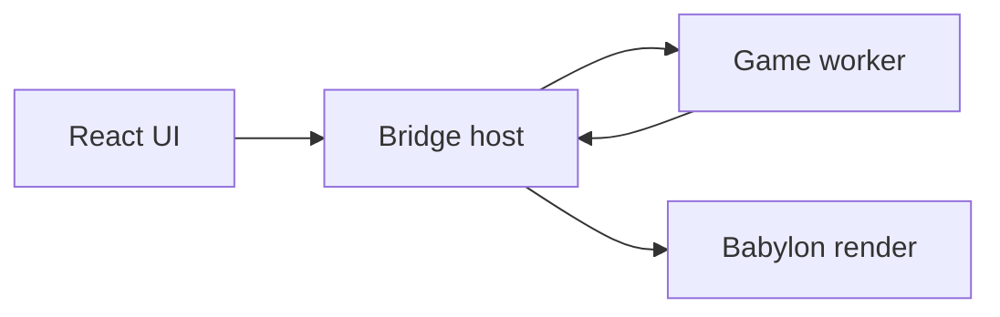

# Architecture overview

Authoritative detail lives in [engineplan.md](../engineplan.md). This page orients contributors.

`docs/` markdown is the source of truth for GitHub and the VitePress site at [https://hideoutgames.github.io/BabylonSlate/docs/](https://hideoutgames.github.io/BabylonSlate/docs/).

The docs site resolves JSON qualification evidence to its actual `docs/` path on GitHub, preserving query strings and anchors. Source links that leave `docs/`, including repository JSON configuration, also resolve to GitHub.

## Monorepo

```
apps/editor/          Editor shell + Homepage + Content Browser + Play overlay + main-thread renderer
apps/player/          Packaged game host (itch zip + Preview Build iframe); no React shell
apps/desktop/         Electron main + preload; Node VFS + userData for the editor
apps/docs/            VitePress site; content is the markdown in `docs/`
engine-logos/         Slate wordmark and icon (dark/light ink); copied into editor and docs `public/branding/`
engine-content/       Engine default skybox faces (`skybox/px.png` … `nz.png`, copied to editor/player public); Kenney packs are present, not wired
packages/core/        GUIDs, Result, math, seeded RNG, schemas, command bus, storage port, formatValue, print HUD helper (P5)
packages/vfs/         Storage adapters (OPFS, Capacitor, Electron IPC, Node), platform detection, app settings, SecretStore, nativeHttp
packages/assets/      Containers, asset registry, search index, importers, encode queue
packages/exporter/    Headless game packer: export closure, `.babpack`, zip (P14)
packages/source-control/ Git LFS locking client behind LockProvider (P15)
packages/edit/        Per-document undo stacks and reversible commands
packages/object-model/ Headless BObject / Actor / World / tick / class registry
packages/physics/     Body/shape protocol; Havok 3D + Rapier 2D backends (P7)
packages/bridge/      SAB + transferable transports, snapshot layout, typed channel messages
packages/runtime/     Game worker + in-process driver, snapshot writer, diagnostics, module loader, script host
packages/debugger/    Command registry, parser, BDebugCommand helpers, stats budget, trace recorder (P8)
packages/anim-graph/  AnimationGraph evaluator in the game worker (P9)
packages/behaviour-tree/ Tree IR, blackboard, explicit-stack evaluator (P11)
packages/navigation/  Recast bake/query port, 2D remap, Scene navmesh chunk (P11)
packages/shader-graph/ Shader IR; compile-to-NodeMaterial in render (P9)
packages/particle-graph/ Particle Graph IR; lowered to Node Particle blocks in render (`p-particle-graph`)
packages/input/       Raw input ring + action/axis mapping model and `InputResolver`
packages/render/      Snapshot sync, visibility-gated editor loop, resource cache, editor tools, KTX2 transcoder, FontFace registry
packages/scripting/   Graph IR, pin types, validator, JS codegen + anchors (P5)
packages/scripting-nodes/ Data-driven node catalog (P5)
packages/graph-ui/    React Flow graph editor with Blueprint node chrome (mutations via edit); see [components.md](components.md)
packages/ui/          shadcn primitives; catalog in [components.md](components.md)
packages/editor-kit/  Touch-shell hooks, property grid, tree view, panel frame, asset picker, SearchInput, parameter-list editor; see [components.md](components.md)
packages/test-kit/    Golden-file, fixtures, deterministic + multi-transport harness
engine-plugins/       First-party plugins (Starter Content); packed to `public/engine-plugins/` at editor build
```

Shared-surface design notes: [containers.md](containers.md), [vfs.md](vfs.md), [command-layer.md](command-layer.md), [asset-registry.md](asset-registry.md), [plugins.md](plugins.md), [global-search.md](global-search.md), [object-model.md](object-model.md), [physics.md](physics.md), [bridge.md](bridge.md), [render.md](render.md), [scripting.md](scripting.md), [scene-editing.md](scene-editing.md), [scene-layers.md](scene-layers.md), [input.md](input.md), [debugger.md](debugger.md), [console-commands.md](console-commands.md), [fonts.md](fonts.md), [sprites.md](sprites.md), [tilemaps.md](tilemaps.md), [anim-graph.md](anim-graph.md), [behaviour-tree.md](behaviour-tree.md), [navigation.md](navigation.md), [audio.md](audio.md), [shader-graph.md](shader-graph.md), [particles.md](particles.md), [theming.md](theming.md), [components.md](components.md), [editor-extensions.md](editor-extensions.md), [exporter.md](exporter.md), [source-control.md](source-control.md).

## Project browser and accounts

- `App` retains settings, theme, and the project/document owner. `AppRoutes` loads mutually exclusive Home and Editor route modules. Play, validation, search, utility execution, and renderer hosts mount only with the Editor route.
- The launcher theme toggle and Engine Settings share `appearance.theme`. Light/dark changes apply across both routes and loading cards; System follows the OS through the shared theme provider.
- The Slate project browser owns its dialogs, account UI, styles, and animation lifecycle. Opening a project unmounts that entire surface, including its inline stylesheet. Returning to the browser creates fresh menu state; project state stays with `DocumentProvider`. JavaScript modules may remain in the browser's import cache.
- Opening, reconnecting, recovery, updates, and removal show operation status and keep launcher actions disabled until the operation settles. Web project options explain browser-local storage and Export Project backups.
- Web and Electron keep account sign-in optional, including phone-sized browser windows. Native iOS and Android require an active Clerk session or explicit **Use Temporary Demo Account** selection before the project browser mounts. Missing configuration, loading failures, and pending sessions keep project actions hidden until that selection. Demo is in-memory local testing access, not a Clerk identity: it creates no tokens or cloud entitlements, survives home/editor route changes, and ends on app restart or Profile → **End Demo**. Local projects remain in App Documents and are not deleted when demo ends. This account requirement is separate from subscription plans.
- The native account frame reserves all four viewport safe-area insets, including the top inset above its Slate header, in every sign-in, loading, and failure state. CSS owns these insets so the iOS status bar never overlays account chrome.
- When configured on web, the launcher lazy-loads `@clerk/react` to restore the avatar. The launcher's own profile dropdown reads the user from `useUser` and calls `useClerk` for the Clerk sign-in modal (`openSignIn`), account management (`openUserProfile`), and `signOut`. It shares its Manage Subscription, Application Settings, and Engine Settings entries with guest and native menus. Polling, focus-touch requests, and telemetry are disabled. Electron restores native session identity for its compact profile menu and loads the shared native email-code form when Sign In is selected, using the public Clerk Frontend API through VFS native HTTP. Mobile uses that form as its account gate. Account providers, forms, and UI unmount on entry to the editor. No Clerk dependency enters engine packages.
- **Manage Subscription** is a presentation-only preview. Free and Pro include the same editor features; Pro is planned to add mobile app access. There are no prices, checkout actions, subscription mutations, or plan-based restrictions.

### Clerk configuration

Create a Clerk application, copy `apps/editor/.env.example` to `apps/editor/.env.local`, and set `VITE_CLERK_PUBLISHABLE_KEY` to its publishable key. Restart Vite after changes. Never expose a Clerk secret key through Vite. See Clerk's [React quickstart](https://clerk.com/docs/react/getting-started/quickstart) and [provider options](https://clerk.com/docs/react/reference/components/clerk-provider).

Distribution builds read the key from the repository variable `VITE_CLERK_PUBLISHABLE_KEY` (see [Distribution maintainer setup](../development/distribution.md#maintainer-setup)). Without it, packaged desktop builds are guest-only and Android/iPadOS builds offer only the temporary demo account.

Web sign-in, sign-up, and account settings use Clerk-managed modal UI; redirect fallbacks honor Vite's deployment base. Configure the Clerk application for the deployed web origin. No account or key is provisioned by the repository. Local projects do not become cloud-synced by signing in.

For Electron and native iOS/Android, enable **Native API** in the Clerk dashboard's Native applications page. Enable email addresses for sign-in and sign-up, **Sign-in with email code**, and email verification codes at sign-up. Use email-only registration without other required profile fields, passwords, or MFA; the native flow handles email codes and refuses authenticated access when additional verification or session tasks remain. Desktop guests can still create and open projects. See Clerk's [email-code configuration](https://clerk.com/docs/guides/development/custom-flows/authentication/email-sms-otp) and [native-client terminology](https://clerk.com/docs/guides/development/sdk-development/terminology).

`services/native-clerk.ts` serializes public Frontend API requests with native-client headers, reads the rotating client token from response headers, and stores it through `SecretStore`. iOS uses Keychain. Electron's `app://babylonslate` renderer uses native HTTP and a dedicated account store: OS-encrypted persistence when available, otherwise process memory. Android currently keeps its token in process memory because the repository has no Keystore adapter; restarting a process-memory session requires sign-in again. No client token is persisted in local storage or project data. The native form supports email-code sign-in/sign-up, resend, restoration, and sign-out; it does not implement system-browser OAuth or account management.

New and restored sessions must appear active in Clerk's response. While the account UI is mounted, window focus or foreground visibility revalidates a signed-in session; mobile project actions stay hidden until that check succeeds. These listeners and forms unmount on entering the editor (desktop sign-in forms also unmount when their modal closes). Authentication failure never gates desktop project access. The configured Clerk application and actual desktop/mobile host transport still require end-to-end validation before distribution; unit tests exercise controlled external HTTP/storage boundaries.

## Threading (P4)


```mermaid
flowchart LR
  UI[React UI] --> Bridge[Bridge host]
  Bridge --> Worker[Game worker]
  Worker --> Bridge
  Bridge --> Render[Babylon render]
```

Game logic and physics share one worker; transforms use SAB or transferable snapshots; structural commands use ordered messages. See [bridge.md](bridge.md).

## Data flow today

- **Lifecycle**: Homepage opens/creates a project folder; editor shell only runs against an open project.
- **Documents**: `ProjectService` + `DocumentService` + `DocumentEditingService` (edit pipeline: apply, Undo / Redo, journal, prefab sync — see [command-layer.md](command-layer.md#editor-edit-pipeline)) + the Play content service (`collectPlay*` loaders, script compilation, compile signatures — see [command-layer.md](command-layer.md#play-content-service)) + Dockview layout JSON per tab. **Open** (tab in the chrome bar, JSON + undo in `DocumentService`) is not the same as **mounted** (DockView / Babylon hosts in the React tree). Inactive workspaces idle-unmount after 2 minutes, cap 3 warm non-CB tabs (`p18-inactive-documents`) — see [command-layer.md](command-layer.md#document-tab-lifecycle). The global **Windows** menu toggles dock panels for the active DockView document (Scene, Class, Enum, Structure, ScriptInterface, Sprite, Tileset, Tilemap, Material, Material Function, Animation Graph, Behaviour Tree, Audio, Audio Mixer / Channel / Attenuation, PluginSettings, …) and stores last **addPanel-relative** placements in `layout.json`. New asset editors must be DockView documents — see [Asset document docks](#asset-document-docks).
- **Files**: binary `ProjectStorage` via `createStorage()` — never Capacitor from panels.
- **Containers / registry**: `@babylonslate/assets` encodes containers and owns the content-root-aware guid index (header-only). Enabled plugins mount as extra roots ([plugins.md](plugins.md)); engine plugins unpack into a separate read-only Memory storage. New projects copy them into `plugins/` with the same guids (project copy shadows the engine original).
- **Editor context updates**: `DocumentProvider` publishes the actions, the route, narrow state slices and per-document subscriptions; components read the narrowest one that covers what they render ([document subscriptions](command-layer.md#document-subscriptions)):
  - `useDocuments()` is the deprecated facade: every action plus documents, project and registry state. It gets a new value after every edit, tab change and save, because it reads open documents and dirty state from the services, so each caller re-renders with it. Only `PlayProvider` and the Content Browser still read it. The always-mounted Content Browser reads it (and `useValidation()`) in a thin wrapper around a `React.memo` body that skips every render while the browser stays hidden behind another tab; the hide still renders, and showing it renders the current documents, registry, thumbnails, locks and diagnostics. Context it reads itself (search reveals, Play, phone layout) still reaches the hidden body. Its document fields change only with what they report:

    | Field | Changes when |
    | --- | --- |
    | `documentRevisions` (per kind) | A document of that kind opens, closes, moves, is reordered, edited (Undo / Redo, reloads and patches included), relaid out, or changes dirty state ([document revisions](command-layer.md#document-revisions)) |
    | `tabsRevision` | The open set, the tab order or the active tab changes |
    | `openDocuments` | Any document revision advances (entries are mutated in place, so the array, not an entry, signals a change) |
    | `tabOrder` | Tab ids or their order change; an active-tab change keeps it |
    | `dirtyDocuments` | Any document revision advances |
    | `currentGraphSignature` | A Class graph or Input Action / Axis document changes, or `registryEpoch` advances |
    | `registryEpoch` | The registry or a registry-adjacent setting changes (below) |

    Registry-only updates (encode progress, thumbnails, plugins) and active-tab changes therefore keep `openDocuments`, `tabOrder` and `dirtyDocuments`. A memo that reads other open documents keys on the kinds it reads with `useOpenDocumentsOfKinds`, not on `openDocuments`.
  - `useDocumentActions()` returns only the callbacks. The object and every callback keep their identity for the provider's lifetime; each reads documents, the project document, Anim modes, templates and the pending exclusive scene when it runs. Action-only consumers use it and never re-render through document state. Texture preview is a `React.memo` boundary: it skips its panel's re-render while its path and content object are unchanged.
  - Panels, chrome and providers combine the actions with narrow hooks: `useOpenDocument(id)` for their own document, `useOpenDocumentsOfKinds` for other documents they read, and slices for the project, registry, active tab, save, compile, shell and source control state. An edit re-renders the edited document's subscribers and readers of its kind, not every panel; a tab switch re-renders the active tab's readers.
  - `useAppRoute()` returns only `route` (Homepage or editor). `AppRoutes` reads it, so an edit no longer re-renders the route tree from the top. `EditorLayout` subscribes to nothing; the chrome bar (tab strip, Undo / Redo, Save All, Compile) with its unsaved / migration / external-change prompts, the dirty count and `beforeunload` guard, the status bar and each panel subscribe themselves. The chrome bar mounts each Project / Engine Settings modal on its first open (it then stays mounted), so a never-opened modal does not re-run its hooks on every edit.
  - A component that calls an action while rendering (`isDockWindowOpen`, `textureUsageBlockedReason`, …) must also subscribe to the state the result depends on.

  `registryEpoch` changes only when the asset registry's generation or a plugin, search-index or Show Plugin Content change advances it, so registry-derived views key on `[assetRegistry, registryEpoch]` instead of rebuilding per edit ([asset-registry.md](asset-registry.md#generation)). Callbacks that only need documents when they run (Play requests, the Extension write guard, editor utility boot, search rebuilds, the audio reverb Save flush) read them at call time — through the live `getOpenDocuments()` getter or a ref updated after commit — instead of a render-time snapshot, so they stay correct without being recreated per edit, and the Play context value keeps its identity across edits ([command-layer.md](command-layer.md)).
- **Global search**: `ProjectSearchIndex` (same package) may load Scene/Graph document JSON for actors/nodes from the asset’s root storage; it must not load binary payloads. Toolbar Search opens a centered dialog; see [global-search.md](global-search.md).
- **Edits**: `@babylonslate/edit` owns per-document undo; graph, scene, and P9 asset documents (Font / Sprite / AnimationGraph / Shader) route mutations through commands (`applyGraphChange` / `applySceneChange` / `applyAssetDocumentChange`). When Source Control is enabled, the first mutating apply auto-locks the document path ([source-control.md](source-control.md)).
- **Scene editing (P6)**: `SerializedScene` v2 actors/components; shared `SceneEditingProvider` selection; viewport gizmo + 2D mode via `@babylonslate/render` editor tools. See [scene-editing.md](scene-editing.md).
- **Input mappings (P6)**: Project Settings → `InputResolver` → runtime `TickContext` and scripting input nodes. See [input.md](input.md).
- **Object model**: `@babylonslate/object-model` owns headless World, class registry, and deterministic tick.
- **Bridge / runtime**: `@babylonslate/bridge` + `@babylonslate/runtime` own Play transports, fixed-step worker, and diagnostics. Play `load` carries the open `SerializedScene`; the worker instantiates those actors (no demo seeds), binds compiled graphs to matching class ids, and emits `assignMesh` `meshKind` so Play primitives match `MeshComponent`.
- **Runtime driver subsystems** (internal to `packages/runtime`, no protocol or public API change):
  - `RuntimeDriver` (`driver.ts`, `createInProcessRuntime`) is the orchestrator; its public `RuntimeDriver` / `RuntimeDriverOptions` types live in `driver-types.ts` and are re-exported from `driver.ts` and the package index. The driver builds the subsystems below, owns the session state they read through lazy host callbacks (stop, pause reasons, boot loading, frame id, Play Scene and Scene library, input), runs the tick phases and Stop, keeps its public methods as delegates and routes every command through `emit()` (inspector annotation, command revision, log ring, then the host's `onCommand`).
  - Construction order: owner admission and the subsystems that take it directly (render slots, render commands, audio/particles, Delays, navigation, streams, Scene realizer, Session boundaries, animation graphs, behaviour trees, actor realization), then `RuntimeCamera`, which takes none directly, and `SimulationWaits`; `SimulationSession`; `ScriptRuntime` (its Class asset guid map feeds startup console commands and ScriptHost actor bindings); `RuntimeInspectorService` (before anything can emit); settings (material parameters, then `RuntimePropertyWrites`), physics worlds and the Scene library; console, loop guard, startup documents, input and physics content; the World and what takes it directly (snapshots, tick pipeline, component runtimes, Scene Layer overlay, Scene Layers); World input; ScriptHost; `RuntimeSubsystems` registration; then Scene asset Classes and the Game Instance. Subsystem constructors build only their own state and call no host callback, and construction emits no command: an empty Preview's demo actors spawn (with their `spawn` commands) at the first `realizePlayWorld`, before the Scene realizer runs, or at `start` for a host that starts without it; a session stopped first spawns none.
  - Tick phases (`runTick`, inside `TickPipeline`): the step (fixed `dt` times time dilation) is captured once at tick start and passed to every phase, so a dilation change made during the tick applies from the next tick. Phases: input; World (tweens, text reveal, painters, Scene Layer focus, World tick with physics, deferred owner work, streamed Scenes; a tick that stopped the session ends here); Scene systems (Delays, animation graphs, tile animation time, behaviour trees, crowd); component commands (painters, text reveal, deformers); publish (frame id, snapshot, debug views), then stats and trace.
  - Stop phases: dispose asset preloads, end the console and reject Scene Layer waiters; mark stopped and end diagnostics, inspector, boundary queue, pending pause changes, tweens and overlay; cancel (lifecycle id, Scene change, `SimulationWaits` waiters, `RuntimeSubsystems.cancelPending`); finalize the trace; destroy components and end the World; dispose scripts, unregister Classes, release Scene sources; clear owner queues and the layer table, then `RuntimeSubsystems.dispose`.
  - `RuntimeSubsystems` (`runtime-subsystems.ts`) holds driver-owned subsystems in registration order. Hooks: `cancelPending` (Stop phase 1, after the session is marked stopped), `resetForSceneLoad` (main Scene replacement, after departing actors leave), `dispose` (Stop phase 2, after the World, scripts and Scene sources end), `retireActor` (an actor instance is being removed, before its despawn) and `releaseSlot` (its render slot returns to the free list; repeats after `retireActor`). Construction is init.
  - The driver registers once, in Stop order: Delays, scene streams, ragdolls, cables, dynamic meshes, movement, the physics worlds (`RuntimePhysicsWorlds`), navigation, animation graphs, behaviour trees, then the slot-only hooks (2D text reveal, the render command emitter's sent-command state, `RuntimeCamera` possession), Scene Layers, and the Scene realizer last. Stop, Scene replacement, actor removal and slot release iterate that list instead of hand-maintained call sequences. Removing a streaming actor therefore retires its stream before the other `retireActor` hooks run. Stream actors drop their crowd agent explicitly in the stream's own removal; other agents leave on the next crowd tick.
  - `SceneStreams` (`scene-streams.ts`) owns scene streaming: the stream table keyed by SceneStreamingActor guid, load/unload (blocking loads hold the simulation through a counter the driver's tick, pause and boundary gates read), cooperative realization of the streamed actors, `sceneStreamLoading` / `sceneStreamRealized` / `sceneStreamRemoved` / `sceneStreamBlocking` commands, host readiness (`notifySceneStreamReady/Progress/Failed`), Streamed Scene Loaded/Unloaded notifications, retirement and the stream-ownership queries (actor readiness, instance ids, spawn adoption). Its `cancelPending` retires every stream in Stop phase 1 and its `retireActor` retires a removed streaming actor's stream. Change Scene still retires streams explicitly when the scene change commits, inside the main Scene's teardown scope, because `resetForSceneLoad` runs later. `RuntimeDriver` keeps its stream methods as delegates. It flushes, queues and drops owner work and wraps streamed Scene script hooks through `OwnerAdmission` directly.
  - `SceneLayers` (`scene-layers.ts`) owns the Scene Layer lifecycle: the load table keyed by layer guid (load id, realized, presented, ready), immediate, cooperative (after the host's `sceneLayerLoadingPainted`) and latent script creation with its 30-second readiness waiter, scene-owned layer creation inside the main Scene's realization steps, host readiness (`notifySceneLayerReady`, held during Play boot loading), removal and Clear, and the layer post-process stack. It emits `sceneLayerLoading` / `sceneLayerCreate` / `sceneLayerRealized` / `sceneLayerLoadFailed` / `sceneLayerRemove` / `sceneLayerClear` / `sceneLayerPostProcess`. It takes the Scene Layer overlay directly: the overlay realizes a layer's created actors and forgets a removed layer's layout and focus state. Its `cancelPending` (registered just before the Scene realizer, so it runs where the explicit loop ran) cancels independent creation and removes those layers; Stop still rejects readiness waiters before marking the session stopped and clears the load table after the owner queues, explicitly. `RuntimeDriver` keeps its Scene Layer methods as delegates and `createSceneLayerHostBindings` supplies the ScriptHost services.
  - `SceneRealizer` (`scene-realizer.ts`) owns main Scene realization and Change Scene: the in-flight realization (abort controller, acquired actors and layers, the departing Scene's objects and sources), immediate or cooperative steps (`sceneLoading` paint, retirement, native physics and navigation preparation, actors, owned layers), failure (`sceneLoadFailed`) and cancellation cleanup, the readiness latch (`sceneRealized` until `notifySceneModelsReady` and owned layers are ready), the load id, Play boot's held Scene, and prepared Scene source acquisition and release. Its `cancelPending` (registered last) cancels the realization after every other subsystem; Stop still aborts a pending Scene source first and releases Scene sources after scripts end, explicitly. `RuntimeDriver` keeps `realizePlayWorld`, `changeSceneAsync`, `notifySceneLoadingPainted` and `notifySceneModelsReady` as delegates; command order is unchanged.
  - `SceneLayerOverlay` (`scene-layer-overlay.ts`) owns the Scene Layer overlay: layout and virtualization (deferred across a Save Game boundary, then published once), anchors against each actor's design pose, the safe area and Play canvas size (also read by cursor projection), pointer, scroll, `sceneLayerControl` and focus input with focus navigation's per-tick input, Scene Layer Actor Switchers and their spawned screens, and the bounded passes that spawn, anchor and assign a layer's created actors. It emits `sceneLayerLayout` and focus `setUIControl2D` acknowledgements; layout runs on every publish, after component property writes and on resize, in the same order as before. The driver supplies script hooks, slots, actor preparation, realization, removal and snapshot publishing through host callbacks, keeps the physics write path, and calls it at actor removal (switcher retirement first, design pose last) and Stop. `createSceneLayerOverlayHostBindings` supplies the switcher and focus target ScriptHost services. It is not a registered subsystem.
  - `OwnerAdmission` (`owner-admission.ts`) owns owner-action admission: the tick gates (`canTickScene`, `canTickActor`, ready Scene Layers), run gates for every owner kind (actors, components, materials, Scenes, Scene Layers, Game Instance, Game/Scene Subsystems), the per-owner queues of deferred script work with their flush order (SceneSubsystems first; an actor spawned from queued work drains only its own queue), authored creation/destruction bookkeeping (Begin Play waits for its owner; On Destroyed runs only after creation) and the script error guard. It reads driver state through lazy host callbacks (stream and layer readiness from `SceneStreams` and `SceneLayers`) and is not a registered subsystem: actor removal and Stop drop its queues at their existing points. `SceneStreams`, `SceneLayers`, `LatentDelays` and `AudioParticleEmitter` take it directly; queue order and flush points are unchanged.
  - `RenderSlots` (`render-slots.ts`) owns the render slot table: allocation (last-released slot first, else the next new id), snapshot capacity growth through `SnapshotPublisher`, the free list, and actor/guid lookups. Slots belong to actor objects (no guid → slot table), so a successor reusing a departed actor's guid never receives its slot. Its release runs every `releaseSlot` hook while the slot still names its owner, then frees the slot; ids and reuse order are unchanged.
  - `SnapshotPublisher` (`snapshot-publisher.ts`) owns the Actor pose snapshot: the seq-locked buffer pair and its capacity growth (`snapshotLayout`), the floating origin, publishing (overlay layout, then the removal pass that retires detached streams and despawns and releases each slot whose own actor left the World, then `WorldTransformComposer` poses written through one reused `ActorSlot`, skipping layout-only anchors), the deferred write that `advance()` catch-up ticks share, publish timing for stats and profiles, and sheared-pose warnings. `RuntimeDriver.copySnapshot` keeps its session gate and delegates the read. Layout, bytes, publish points and command order are unchanged; the worker's transport backpressure stays in `worker-entry.ts`.
  - `TickPipeline` (`tick-pipeline.ts`) owns the bookkeeping around a fixed-step tick: the tick gate and reentrancy flag (pause changes requested mid-tick apply when it ends), the `advance()` accumulator and 4-tick catch-up cap inside `SnapshotPublisher.deferWrites`, script/physics phase timing (World `onPhase` marks), per-tick profile samples for the diagnostic recorder it creates, the throttled `stats` command and trace frames (console `snapshot start/stop`, `stopTrace`). The driver's `runTick` keeps the phase order and calls it at fixed points (print reset, timing start and close, then stats and trace after the publish point); `tick()` and `advance()` delegate. Phase order, timing, payloads and command order are unchanged. It is not a registered subsystem.
  - `SessionBoundaries` (`session-boundaries.ts`) owns Save Game and host session boundaries: `configureSaveGame` (the `SaveGameWorld` state and `SaveGameService` wiring, its `atBoundary` with the active-boundary flag, capture/stage/apply/reset callbacks and the deferred On Game Loaded notifications), Save Game actor registration with the spawned-actor set, and `requestSessionBoundary` (validation, the microtask-flushed queue, pause and input reset, and the boundary result). `OwnerAdmission`, `SceneLayerOverlay`, `TickPipeline` and the runtime inspector read the active-boundary flag lazily through it. `RuntimeDriver` keeps its Save Game and boundary methods as delegates, flushes the queue explicitly in Stop, and keeps pause state. `SimulationSession` reads its boundary result. It is not a registered subsystem.
  - `SimulationWaits` (`simulation-waits.ts`) owns script continuations that wait for the simulation: the waiter set, the blocked check (blocking scene stream, Pause, pending boundary pause, a pause change requested mid-tick; never once stopped or for a destroyed owner), `continueSimulation` (no extra microtask hop when unblocked; `RuntimeContinuationCancelled` when the session stopped or the owner went away or is not stream-ready; its message names that cause rather than Scene realization), resumption when Pause releases or a blocking stream settles (still held while a blocking stream remains), Stop's release of every waiter, and gameplay asset preloads (`preloadAssets`: acquire, latest-only progress through `OwnerAdmission`, then the same wait; release on failure). The ScriptHost actor, asset, timing and Scene Layer services and `waitForSimulation` call it; `reportError` still drops a cancelled continuation silently after Stop; otherwise (for example, an owner destroyed while Pause held its continuation) the diagnostic carries that message. Pause state (reasons, pending changes, `setPauseReason`) stays in the driver because the console, `OwnerAdmission`, `TickPipeline`, `SessionBoundaries`, `SimulationSession`, tweens and input all read or change it; so does `simulationDt` (fixed step times console time dilation), which is tick timing rather than a wait. It is not a registered subsystem: Stop releases waiters explicitly, before `cancelPending`.
  - `SimulationSession` (`simulation-session.ts`) owns Simulation quiesce and capture: the immutable baseline and starting Scene, the prepared asset and data scopes (replaced by `registerSceneContent`), the independent stream/SceneLayer instance and scene-transition `simulationRetentionUnavailable` notices, the quiescent flag and capture request ids, and `captureSimulationScene` input assembly. It also owns the Simulate-mode write gate and per-actor live edit eligibility `RuntimeInspectorService` uses. `RuntimeDriver` keeps `quiesceSimulation` and `captureSimulationState` as delegates and keeps pause state; its pause gate reads the quiescent flag lazily, so Resume cannot release the final hold. Nothing resets on Stop or Scene change, so it is not a registered subsystem.
  - `RuntimeInspectorService` (`runtime-inspector-service.ts`) owns the driver side of the runtime inspector: the validated, microtask-flushed request queue (superseded ids, 32-request cap, cancellation), the lazily created `RuntimeInspector` evaluator (`runtime-inspector.ts`) with its property, transform and material appliers, the deferred `RuntimeMaterialEditGate` with its prepared-edit token on the matching material command, Simulate-mode runtime identities on `spawn` / `assignMesh`, and the interpolation reset and snapshot an edit publishes. `RuntimeDriver` keeps `requestRuntimeInspector`, `cancelRuntimeInspector` and `applyRuntimeMaterialEditResult` as delegates, routes every command through `emit()` (which asks the service to annotate it) and calls its `stop()` explicitly in Stop; its property and material appliers call the shared `RuntimePropertyWrites` path. `SimulationSession` reads its gate and flushes its queue through host callbacks. It is not a registered subsystem.
  - `RuntimeConsole` (`runtime-console.ts`) owns the Play console host: the `@babylonslate/debugger` command registry (builtins plus bound user command Classes), on-demand user command asset preparation with its session-lifetime abort signal, the `ConsoleCommandHost` adapter whose builtins call `SceneRealizer.change`, scalability, physics (`showcollision`), navigation and BT debug, actor destroy/possess, pause/step and `TickPipeline` trace, console actor lookup and the console volume. Both execution paths refuse once the session stopped (`The runtime session has ended`). `RuntimeDriver` keeps `executeConsoleCommand(Async)`, `registerUserCommand`, `bindUserCommand` and `listConsoleCommands` as delegates, keeps the log ring (`dumplog` reads it lazily) and time dilation, routes every command through `emit()` and calls its `stop()` explicitly in Stop. The ScriptHost console services call it directly. It is not a registered subsystem.
  - `ScriptRuntime` (`script-runtime.ts`) owns the driver side of compiled scripts: the loaded script sources (load and replacement serialized one after another, parent-first Class registration, source anchors and user command bindings), Class asset guids, the spawnable Class check, the session Game Instance with its lifecycle hooks (Init, Tick, Scene events, Shutdown), GameSubsystem installation, SceneSubsystem hooks with the silent main Scene teardown scope `SceneRealizer` enters, and the `Get <Subsystem>` cache. `ScriptHost` loads and runs the modules; every hook dispatches through `OwnerAdmission`. `RuntimeDriver` keeps `loadScripts` and `replaceScriptSources` as delegates, keeps the anchor table, and calls `unregisterClasses()` explicitly in Stop, after the World ends and ScriptHost is disposed and before Scene sources release. It is not a registered subsystem.
  - `RuntimePhysicsWorlds` (`runtime-physics-worlds.ts`) owns the main Scene world and one 2D world per physics-enabled Scene Layer instance, keyed by layer guid in creation order (`addLayer` / `removeLayer` from `SceneLayers`; created on first need, disposed with the layer, none for a layer without Enable Physics): software start-up, the native Havok/Rapier swap (`loadPhysics`, skipped with `preferSoftwarePhysics`), a Scene's world-kind replacement (native acquisition or software install), per-world gravity, the water/tile/sprite/model content bound to each world, complex-collision mesh requests and their unavailable diagnostics, the steps (main world at the driver's simulated water clock, then each 2D layer world, which never steps water, skipping empty ones; movement motors run inside each), Hit / Begin / End Overlap dispatch (main world, then layers in creation order), the disabled-physics layer diagnostic and the `showcollision` debug view. It replaces the worlds itself; the driver and its other subsystems read `main`, `layer(guid)` and `forActor(actor)` (null for a layer without physics) lazily. The driver keeps the physics phase order in World `onPhysics` (dynamic meshes, ragdolls, steps, cables, contacts) and its public physics and content methods as delegates.
  - `RenderCommandEmitter` (`render-command-emitter.ts`) builds and sends an actor's component render commands: `assignMesh`, `assignMaterial` (with captured parameter overrides), outlines, deformers (global revision counter, mid-tick changes flushed after the tick), fog volumes, render target capture, area lights and component transforms. It owns `RenderCommandState` (`render-command-state.ts`), which remembers which slots last received outlines, fog volumes, area lights, a capture and deformers, so a later call sends only a change or the clearing command and a reused slot starts clean. The driver decides when to emit (actor realization, illumination updates), as do `RuntimePropertyWrites` for component property and material parameter writes and `RuntimeInspectorService` for runtime inspector transform and material edits; the driver supplies World, Scene, payload providers and `emit` through lazy host callbacks; command content, order and dedupe are unchanged.
  - `RuntimePropertyWrites` (`runtime-property-writes.ts`) applies the side effects of a component property or material parameter write, shared by the script path and the runtime Inspector path: `refreshComponent` (UI control and overlay layout, overlay visual style, text reveal, deformers queued mid-tick, staged material assignments, capture, outlines, fog, component transforms, mesh reassignment, particles, voice gain, Nav Agent parameters, ragdoll and physics reconciliation) and `setMaterialParameter` (owner admission for scripts, Simulate live edit eligibility for the Inspector; catalog validation; `setMaterialParameter` / `setPostProcessMaterialParameter`; the recorded runtime value). It is separate from `RenderCommandEmitter` because it decides which subsystems a write touches (overlay, audio, navigation, physics, admission and Simulate gates), while the emitter only builds render commands. It holds no state and is not a registered subsystem; commands and order are unchanged.
  - `AudioParticleEmitter` (`audio-particle-emitter.ts`) sends Audio and Particle component playback: Play On Start `playSound` (queued through `OwnerAdmission` until the owner can run), `assignParticle`, refresh-time `setVoiceGain`, and the `stopSound` / cleared `assignParticle` stops sent before an actor's `despawn` or a script/console destroy. It holds no state.
  - `ActorRealization` (`actor-realization.ts`) owns actor realization and removal: script lifecycle hooks for Scene, stream, Scene Layer and Save Game actors, script-spawned actors and components (all through `OwnerAdmission`), Class actor defaults, loaded parent-cycle repair, slot assignment with its `spawn` command, the realization sequence (collider validation, mesh, audio and particle commands, World spawn, deferred owner work, the tick's first-spawned index), `spawnScriptedActor`, the empty-Preview demo actors, and removal (`retireActor` hooks, stops, `despawn`, slot release). The driver, `SceneStreams`, `SceneRealizer`, `SessionBoundaries`, `SceneLayers` and the overlay reach it through host callbacks; `spawnScriptedActor` stays a driver delegate. Order, commands and errors are unchanged. It is not a registered subsystem.
  - `RuntimeCamera` (`runtime-camera.ts`) owns camera possession and cursor projection: the script `Possess Camera` choice (script and console) and the possessed slot, the authored `attemptPossessViewTarget` fallback `SceneRealizer` runs after a Scene's actors spawn (yielding to a script choice or a spawned Default Camera), the reset when a new main Scene is entered, the Play camera actor (possessed, else the Scene's main camera, else the first main-Scene camera) that snapshots and `Project Cursor To Scene` read, and the cursor ray with its trace and debug draw. Its `releaseSlot` hook keeps the camera possession's registration position (last of the slot-only hooks). The driver supplies World, Scene, slots, cursor, canvas size, physics and `emit` through lazy host callbacks; commands and order are unchanged.
  - ScriptHost services are assembled from factories, each taking a small explicit deps object with lazy reads of replaceable driver fields (physics worlds, frame id, stop state): `runtime-host-output.ts` (log/diagnostic, print, debug draw, cursor), `runtime-host-actors.ts` (spawn, destroy, add component, bone attach; on-demand asset preparation), `runtime-host-timing.ts` (tweens, Delay), `runtime-host-physics.ts` (water, traces, overlaps, impulses, character moves, teleport; actor writes go to the actor's own world), `runtime-host-navigation.ts`, `runtime-host-render.ts` (illumination and camera, render targets, material parameters, scalability), `runtime-host-components.ts` (painters, UI controls, text reveal, dynamic meshes, movement, refresh), `createAudioHostBindings` and `createSceneStreamHostBindings` (Scene reference, Load / Unload Scene, scene state and progress, instance ids). `runtime-host-input.ts` builds the World input provider and `scene-library.ts` indexes Scene and Scene Layer documents and registers Scene asset Classes. `createSceneLayerHostBindings` (create, latent create, remove, clear, layer post-process) lives in `scene-layers.ts` and `createSceneLayerOverlayHostBindings` (Scene Layer actor switching, focus targets) in `scene-layer-overlay.ts`. The service names and behaviour are unchanged; Scene change calls `SceneRealizer.change`.
  - Extracted subsystems: `RuntimeNavigation` (navmesh, crowd, obstacles, MoveTo host, navigation debug), `AnimGraphRuntime` (AnimationGraph documents and per-component evaluation), `BehaviourTreeRuntime` (tree/Blackboard documents, per-slot evaluation, task/decorator/service hosts, Play Animation / Play Sound, BT debug snapshot, trace capture and restore) and `LatentDelays` (script Delay timers, counted while `OwnerAdmission` admits their owner's actions). They reach the driver only through a narrow host interface; each tick method (`tickCrowd`, `tick`, `advance`) takes the tick's captured step as an argument.

- **Graph → engine**: `engineCommandBus` in `core` for light UI commands; Play hot path uses the bridge.
- **Visual scripting (P5)**: `@babylonslate/scripting` compiles logic graphs to JS modules with anchor tables; `@babylonslate/scripting-nodes` supplies the catalog; `runtime.ScriptHost` loads those modules and binds Begin Play / Tick entry points to actor lifecycle hooks, and Preview ships compiled project graphs to the worker (see [scripting.md](scripting.md)). `ExecuteConsoleCommand` runs through `@babylonslate/debugger` (see [debugger.md](debugger.md)).
- **Viewport**: Project-lifetime `Engine`; Play overlay via `registerView(..., true)` (clear-before-copy blit); Prefab Preview on that Engine (`p18-shared-prefab-engine`); visible editor canvases always render at `viewportFrameCap` (default 30) and freeze when hidden or a modal is open; Play holds a continuous lease and renders at project `playFrameCap` (default 60). Debug Stats / Print overlays are DOM. **Preview Build** (Debug checkbox, off by default) packages via `@babylonslate/exporter` and hosts `apps/player` in a same-origin iframe with its own Engine — see [exporter.md](exporter.md).

## Asset document docks

`DocumentWorkspace` skips unmounted tabs before resolving scene/class metadata. Mounted scene, graph, and scene-layer tabs share one lazily built class-ancestry lookup and use the registry's path index for individual assets. The lookup is kept until `registryEpoch` changes, so edits do not rebuild it and registry changes still reach every tab.

New editor tabs for assets are per-document **DockView** layouts (`DockviewShell`), not a full-page `AssetDocumentWorkspace` and not shadcn `Tabs` as the document shell. That keeps panels resizable, dockable beside each other, and able to host extra dock tabs. Animation Graph uses a stacked-surface pattern with a chrome **State Machine | Animation Object** bar (`animEditorMode`; surfaces `stateMachine` / `animationObject`). Mode switches keep only the active DockView mounted. Inactive document tabs idle-unmount (`p18-inactive-documents`). Exception: [`.agents/rules/dockview-editor-tabs.md`](../../.agents/rules/dockview-editor-tabs.md).

Wire every new kind through `apps/editor/src/shell/window-catalog.ts` (`DockviewDocumentKind` + `listDockWindows`), `panel-registry.tsx`, `document-workspace.tsx` (`DockviewShell` with the real kind), and `documentKindForAssetType`. The kind's primary panel lives in `DOCK_PRIMARY_PANEL`; default layouts add `primaryDockPanel(kind)` first so side docks can split from it, and Focus falls back to it. **Windows** stays disabled unless `isDockviewDocumentKind(activeKind)` is true. Agent rule: [`.agents/rules/dockview-editor-tabs.md`](../../.agents/rules/dockview-editor-tabs.md).

Pinned Content Browser is an exception — do not add new types to the compact `asset-settings` path. Texture, Model, Skeleton, Animation, and Audio open Sprite-style DockView documents (**Preview** + **Details**; Audio also has **Clips**). Skybox Creator is a DockView helper (not a Skybox document) with **Preview**, **Cubemap**, and **Details**.

Content Browser splits Folders and Assets with the shared shadcn resizable panes. Drag **Resize Folders**, or focus the divider and use arrow keys, to redistribute their widths. Folders start at 224px with a 160px minimum; Assets retain at least 240px. Phones use the existing Folders drawer. Tree rows scroll on an immediate touch swipe; hold still for 250ms before moving to drag a row. Mouse rows drag on click-and-move, and scrollbar presses remain independent.

## Package rules

Boundaries are enforced by `no-restricted-imports` patterns in `eslint.config.js`:

| Package                                                                                                                                                                                                                            | May not import                                                                                                                                                        |
| ---------------------------------------------------------------------------------------------------------------------------------------------------------------------------------------------------------------------------------- | --------------------------------------------------------------------------------------------------------------------------------------------------------------------- |
| `core`, `edit`, `object-model`, `bridge`, `runtime`, `debugger`, `anim-graph`, `behaviour-tree`, `navigation`, `shader-graph`, `particle-graph`, `input`, `test-kit`, `scripting`, `scripting-nodes`, `exporter`, `source-control` | React, Babylon, Capacitor                                                                                                                                             |
| `physics`                                                                                                                                                                                                                          | React, Capacitor, editor Babylon packages (gui/loaders/inspector). May import `@babylonjs/core` Physics V2 and `@babylonjs/havok` on a worker-local NullEngine Scene. |
| `assets`                                                                                                                                                                                                                           | React, Babylon, Capacitor                                                                                                                                             |
| `vfs`                                                                                                                                                                                                                              | React, Babylon                                                                                                                                                        |
| `render`                                                                                                                                                                                                                           | React, Capacitor                                                                                                                                                      |
| `ui`, `editor-kit`, `graph-ui`                                                                                                                                                                                                     | Babylon, Capacitor                                                                                                                                                    |
| `apps/editor/src`                                                                                                                                                                                                                  | Capacitor                                                                                                                                                             |
| `apps/player`                                                                                                                                                                                                                      | React, Capacitor (Babylon is allowed; no Dockview / editor chrome)                                                                                                    |

Patterns rather than exact module names, so deep imports such as `@babylonjs/core/Engines/engine` are caught too.

Platform detection lives behind `getHostPlatform()` in `vfs`, so Capacitor stays in one package.

The editor bundle has a chunk import cycle (the `document-context` chunk imports the `@babylonslate/render` chunk, which imports helpers placed in the `editor-route` chunk), so `editor-route` modules evaluate before `document-context` finishes. A module-scope read of a value from another chunk, such as `const ROOT = PROJECT_CONTENT_ROOT_ID` or a call like `profileComponents(...)`, can therefore see `undefined` in built bundles while Vitest's unbundled modules look fine. Read such values at render or call time.

See [CODING_STANDARDS.md](../CODING_STANDARDS.md) for conventions, [theming.md](theming.md) for the UI palette, and [testing.md](testing.md) for the test topology.
