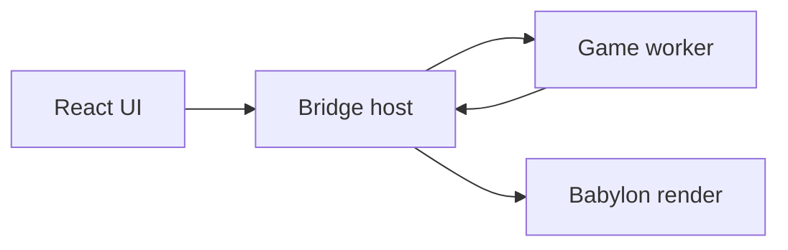

# Architecture overview

Authoritative detail lives in [engineplan.md](../engineplan.md). This page orients contributors.

`docs/` markdown is the source of truth for GitHub and the VitePress site at [https://hideoutgames.github.io/BabylonSlate/docs/](https://hideoutgames.github.io/BabylonSlate/docs/).

The docs site resolves JSON qualification evidence to its actual `docs/` path on GitHub, preserving query strings and anchors. Source links that leave `docs/`, including repository JSON configuration, also resolve to GitHub.

## Monorepo

```
apps/editor/          Editor shell + Homepage + Content Browser + Play overlay + main-thread renderer
apps/player/          Packaged game host (itch zip + Preview Build iframe); no React shell
apps/desktop/         Electron main + preload; Node VFS + userData for the editor
apps/docs/            VitePress site; content is the markdown in `docs/`
engine-logos/         Slate wordmark and icon (dark/light ink); copied into editor and docs `public/branding/`
engine-content/       Engine default skybox faces (`skybox/px.png` … `nz.png`, copied to editor/player public); Kenney packs are present, not wired
packages/core/        GUIDs, Result, math, seeded RNG, schemas, command bus, storage port, formatValue, print HUD helper (P5)
packages/vfs/         Storage adapters (OPFS, Capacitor, Electron IPC, Node), platform detection, app settings, SecretStore, nativeHttp
packages/assets/      Containers, asset registry, search index, importers, encode queue
packages/exporter/    Headless game packer: export closure, `.babpack`, zip (P14)
packages/source-control/ Git LFS locking client behind LockProvider (P15)
packages/edit/        Per-document undo stacks and reversible commands
packages/object-model/ Headless BObject / Actor / World / tick / class registry
packages/physics/     Body/shape protocol; Havok 3D + Rapier 2D backends (P7)
packages/bridge/      SAB + transferable transports, snapshot layout, typed channel messages
packages/runtime/     Game worker + in-process driver, snapshot writer, diagnostics, module loader, script host
packages/debugger/    Command registry, parser, BDebugCommand helpers, stats budget, trace recorder (P8)
packages/anim-graph/  AnimationGraph evaluator in the game worker (P9)
packages/behaviour-tree/ Tree IR, blackboard, explicit-stack evaluator (P11)
packages/navigation/  Recast bake/query port, 2D remap, Scene navmesh chunk (P11)
packages/shader-graph/ Shader IR; compile-to-NodeMaterial in render (P9)
packages/particle-graph/ Particle Graph IR; lowered to Node Particle blocks in render (`p-particle-graph`)
packages/input/       Raw input ring + action/axis mapping model and `InputResolver`
packages/render/      Snapshot sync, visibility-gated editor loop, resource cache, editor tools, KTX2 transcoder, FontFace registry
packages/scripting/   Graph IR, pin types, validator, JS codegen + anchors (P5)
packages/scripting-nodes/ Data-driven node catalog (P5)
packages/graph-ui/    React Flow graph editor with Blueprint node chrome (mutations via edit); see [components.md](components.md)
packages/ui/          shadcn primitives; catalog in [components.md](components.md)
packages/editor-kit/  Touch-shell hooks, property grid, tree view, panel frame, asset picker, SearchInput, parameter-list editor; see [components.md](components.md)
packages/test-kit/    Golden-file, fixtures, deterministic + multi-transport harness
engine-plugins/       First-party plugins (Starter Content); packed to `public/engine-plugins/` at editor build
```

Shared-surface design notes: [containers.md](containers.md), [vfs.md](vfs.md), [command-layer.md](command-layer.md), [asset-registry.md](asset-registry.md), [plugins.md](plugins.md), [global-search.md](global-search.md), [object-model.md](object-model.md), [physics.md](physics.md), [bridge.md](bridge.md), [render.md](render.md), [scripting.md](scripting.md), [scene-editing.md](scene-editing.md), [scene-layers.md](scene-layers.md), [input.md](input.md), [debugger.md](debugger.md), [console-commands.md](console-commands.md), [fonts.md](fonts.md), [sprites.md](sprites.md), [tilemaps.md](tilemaps.md), [anim-graph.md](anim-graph.md), [behaviour-tree.md](behaviour-tree.md), [navigation.md](navigation.md), [audio.md](audio.md), [shader-graph.md](shader-graph.md), [particles.md](particles.md), [theming.md](theming.md), [components.md](components.md), [editor-extensions.md](editor-extensions.md), [exporter.md](exporter.md), [source-control.md](source-control.md).

## Project browser and accounts

- `App` retains settings, theme, and the project/document owner. `AppRoutes` loads mutually exclusive Home and Editor route modules. Play, validation, search, utility execution, and renderer hosts mount only with the Editor route.
- The launcher theme toggle and Engine Settings share `appearance.theme`. Light/dark changes apply across both routes and loading cards; System follows the OS through the shared theme provider.
- The Slate project browser owns its dialogs, account UI, styles, and animation lifecycle. Opening a project unmounts that entire surface, including its inline stylesheet. Returning to the browser creates fresh menu state; project state stays with `DocumentProvider`. JavaScript modules may remain in the browser's import cache.
- Opening, reconnecting, recovery, updates, and removal show operation status and keep launcher actions disabled until the operation settles. Web project options explain browser-local storage and Export Project backups.
- Web and Electron keep account sign-in optional, including phone-sized browser windows. Native iOS and Android require an active Clerk session or explicit **Use Temporary Demo Account** selection before the project browser mounts. Missing configuration, loading failures, and pending sessions keep project actions hidden until that selection. Demo is in-memory local testing access, not a Clerk identity: it creates no tokens or cloud entitlements, survives home/editor route changes, and ends on app restart or Profile → **End Demo**. Local projects remain in App Documents and are not deleted when demo ends. This account requirement is separate from subscription plans.
- The native account frame reserves all four viewport safe-area insets, including the top inset above its Slate header, in every sign-in, loading, and failure state. CSS owns these insets so the iOS status bar never overlays account chrome.
- When configured on web, the launcher lazy-loads `@clerk/react` to restore the avatar. The launcher's own profile dropdown reads the user from `useUser` and calls `useClerk` for the Clerk sign-in modal (`openSignIn`), account management (`openUserProfile`), and `signOut`. It shares its Manage Subscription, Application Settings, and Engine Settings entries with guest and native menus. Polling, focus-touch requests, and telemetry are disabled. Electron restores native session identity for its compact profile menu and loads the shared native email-code form when Sign In is selected, using the public Clerk Frontend API through VFS native HTTP. Mobile uses that form as its account gate. Account providers, forms, and UI unmount on entry to the editor. No Clerk dependency enters engine packages.
- **Manage Subscription** is a presentation-only preview. Free and Pro include the same editor features; Pro is planned to add mobile app access. There are no prices, checkout actions, subscription mutations, or plan-based restrictions.

### Clerk configuration

Create a Clerk application, copy `apps/editor/.env.example` to `apps/editor/.env.local`, and set `VITE_CLERK_PUBLISHABLE_KEY` to its publishable key. Restart Vite after changes. Never expose a Clerk secret key through Vite. See Clerk's [React quickstart](https://clerk.com/docs/react/getting-started/quickstart) and [provider options](https://clerk.com/docs/react/reference/components/clerk-provider).

Distribution builds read the key from the repository variable `VITE_CLERK_PUBLISHABLE_KEY` (see [Distribution maintainer setup](../development/distribution.md#maintainer-setup)). Without it, packaged desktop builds are guest-only and Android/iPadOS builds offer only the temporary demo account.

Web sign-in, sign-up, and account settings use Clerk-managed modal UI; redirect fallbacks honor Vite's deployment base. Configure the Clerk application for the deployed web origin. No account or key is provisioned by the repository. Local projects do not become cloud-synced by signing in.

For Electron and native iOS/Android, enable **Native API** in the Clerk dashboard's Native applications page. Enable email addresses for sign-in and sign-up, **Sign-in with email code**, and email verification codes at sign-up. Use email-only registration without other required profile fields, passwords, or MFA; the native flow handles email codes and refuses authenticated access when additional verification or session tasks remain. Desktop guests can still create and open projects. See Clerk's [email-code configuration](https://clerk.com/docs/guides/development/custom-flows/authentication/email-sms-otp) and [native-client terminology](https://clerk.com/docs/guides/development/sdk-development/terminology).

`services/native-clerk.ts` serializes public Frontend API requests with native-client headers, reads the rotating client token from response headers, and stores it through `SecretStore`. iOS uses Keychain. Electron's `app://babylonslate` renderer uses native HTTP and a dedicated account store: OS-encrypted persistence when available, otherwise process memory. Android currently keeps its token in process memory because the repository has no Keystore adapter; restarting a process-memory session requires sign-in again. No client token is persisted in local storage or project data. The native form supports email-code sign-in/sign-up, resend, restoration, and sign-out; it does not implement system-browser OAuth or account management.

New and restored sessions must appear active in Clerk's response. While the account UI is mounted, window focus or foreground visibility revalidates a signed-in session; mobile project actions stay hidden until that check succeeds. These listeners and forms unmount on entering the editor (desktop sign-in forms also unmount when their modal closes). Authentication failure never gates desktop project access. The configured Clerk application and actual desktop/mobile host transport still require end-to-end validation before distribution; unit tests exercise controlled external HTTP/storage boundaries.

## Threading (P4)


```mermaid
flowchart LR
  UI[React UI] --> Bridge[Bridge host]
  Bridge --> Worker[Game worker]
  Worker --> Bridge
  Bridge --> Render[Babylon render]
```

Game logic and physics share one worker; transforms use SAB or transferable snapshots; structural commands use ordered messages. See [bridge.md](bridge.md).

## Data flow today

- **Lifecycle**: Homepage opens/creates a project folder; editor shell only runs against an open project.
- **Documents**: `ProjectService` + `DocumentService` + `DocumentEditingService` (edit pipeline: apply, Undo / Redo, journal, prefab sync — see [command-layer.md](command-layer.md#editor-edit-pipeline)) + the Play content service (`collectPlay*` loaders, script compilation, compile signatures — see [command-layer.md](command-layer.md#play-content-service)) + Dockview layout JSON per tab. **Open** (tab in the chrome bar, JSON + undo in `DocumentService`) is not the same as **mounted** (DockView / Babylon hosts in the React tree). Inactive workspaces idle-unmount after 2 minutes, cap 3 warm non-CB tabs (`p18-inactive-documents`) — see [command-layer.md](command-layer.md#document-tab-lifecycle). The global **Windows** menu toggles dock panels for the active DockView document (Scene, Class, Enum, Structure, ScriptInterface, Sprite, Tileset, Tilemap, Material, Material Function, Animation Graph, Behaviour Tree, Audio, Audio Mixer / Channel / Attenuation, PluginSettings, …) and stores last **addPanel-relative** placements in `layout.json`. New asset editors must be DockView documents — see [Asset document docks](#asset-document-docks).
- **Files**: binary `ProjectStorage` via `createStorage()` — never Capacitor from panels.
- **Containers / registry**: `@babylonslate/assets` encodes containers and owns the content-root-aware guid index (header-only). Enabled plugins mount as extra roots ([plugins.md](plugins.md)); engine plugins unpack into a separate read-only Memory storage. New projects copy them into `plugins/` with the same guids (project copy shadows the engine original).
- **Editor context updates**: `DocumentProvider` publishes three contexts:
  - `useDocuments()` is the facade: every action plus documents, project and registry state. It gets a new value after every edit, tab change and save, because it reads open documents and dirty state from the services, so each caller re-renders with it. The always-mounted Content Browser reads it (and `useValidation()`) in a thin wrapper around a `React.memo` body that skips every render while the browser stays hidden behind another tab; the hide still renders, and showing it renders the current documents, registry, thumbnails, locks and diagnostics. Context it reads itself (search reveals, Play, phone layout) still reaches the hidden body. Its document fields change only with what they report:

    | Field | Changes when |
    | --- | --- |
    | `documentRevisions` (per kind) | A document of that kind opens, closes, moves, is reordered, edited (Undo / Redo, reloads and patches included), relaid out, or changes dirty state ([document revisions](command-layer.md#document-revisions)) |
    | `tabsRevision` | The open set, the tab order or the active tab changes |
    | `openDocuments` | Any document revision advances (entries are mutated in place, so the array, not an entry, signals a change) |
    | `tabOrder` | Tab ids or their order change; an active-tab change keeps it |
    | `dirtyDocuments` | Any document revision advances |
    | `currentGraphSignature` | A Class graph or Input Action / Axis document changes, or `registryEpoch` advances |
    | `registryEpoch` | The registry or a registry-adjacent setting changes (below) |

    Registry-only updates (encode progress, thumbnails, plugins) and active-tab changes therefore keep `openDocuments`, `tabOrder` and `dirtyDocuments`. A memo that reads other open documents keys on the kinds it reads with `useOpenDocumentsOfKinds`, not on `openDocuments`.
  - `useDocumentActions()` returns only the callbacks. The object and every callback keep their identity for the provider's lifetime; each reads documents, the project document, Anim modes, templates and the pending exclusive scene when it runs. Action-only consumers (`EditorRoute`'s session store wiring, Audio preview and clips, Texture preview, Model source bytes, dock registration) use it, so they no longer subscribe to document state themselves. Of these, only `EditorRoute` stops re-rendering on edits: the others still re-render with their panels, which subscribe through `useDocuments()`, and the dock shell still reads Source Control state from it. Texture preview is a `React.memo` boundary: it skips its panel's re-render while its path and content object are unchanged.
  - `useAppRoute()` returns only `route` (Homepage or editor). `AppRoutes` reads it, so an edit no longer re-renders the route tree from the top. `EditorLayout` subscribes to nothing; the chrome bar with its unsaved / migration / external-change prompts, the dirty count and `beforeunload` guard, and each panel subscribe themselves. The chrome bar mounts each Project / Engine Settings modal on its first open (it then stays mounted), so a never-opened modal does not re-run its hooks on every edit.
  - A component that calls an action while rendering (`isDockWindowOpen`, `textureUsageBlockedReason`, …) must also subscribe to the state the result depends on.

  `registryEpoch` changes only when the asset registry's generation or a plugin, search-index or Show Plugin Content change advances it, so registry-derived views key on `[assetRegistry, registryEpoch]` instead of rebuilding per edit ([asset-registry.md](asset-registry.md#generation)). Callbacks that only need documents when they run (Play requests, the Extension write guard, editor utility boot, search rebuilds, the audio reverb Save flush) read them at call time — through the live `getOpenDocuments()` getter or a ref updated after commit — instead of a render-time snapshot, so they stay correct without being recreated per edit, and the Play context value keeps its identity across edits ([command-layer.md](command-layer.md)).
- **Global search**: `ProjectSearchIndex` (same package) may load Scene/Graph document JSON for actors/nodes from the asset’s root storage; it must not load binary payloads. Toolbar Search opens a centered dialog; see [global-search.md](global-search.md).
- **Edits**: `@babylonslate/edit` owns per-document undo; graph, scene, and P9 asset documents (Font / Sprite / AnimationGraph / Shader) route mutations through commands (`applyGraphChange` / `applySceneChange` / `applyAssetDocumentChange`). When Source Control is enabled, the first mutating apply auto-locks the document path ([source-control.md](source-control.md)).
- **Scene editing (P6)**: `SerializedScene` v2 actors/components; shared `SceneEditingProvider` selection; viewport gizmo + 2D mode via `@babylonslate/render` editor tools. See [scene-editing.md](scene-editing.md).
- **Input mappings (P6)**: Project Settings → `InputResolver` → runtime `TickContext` and scripting input nodes. See [input.md](input.md).
- **Object model**: `@babylonslate/object-model` owns headless World, class registry, and deterministic tick.
- **Bridge / runtime**: `@babylonslate/bridge` + `@babylonslate/runtime` own Play transports, fixed-step worker, and diagnostics. Play `load` carries the open `SerializedScene`; the worker instantiates those actors (no demo seeds), binds compiled graphs to matching class ids, and emits `assignMesh` `meshKind` so Play primitives match `MeshComponent`.
- **Runtime driver subsystems** (internal to `packages/runtime`, no protocol or public API change):
  - `RuntimeSubsystems` (`runtime-subsystems.ts`) holds driver-owned subsystems in registration order. Hooks: `cancelPending` (Stop phase 1, after the session is marked stopped), `resetForSceneLoad` (main Scene replacement, after departing actors leave), `dispose` (Stop phase 2, after the World, scripts and Scene sources end), `retireActor` (an actor instance is being removed, before its despawn) and `releaseSlot` (its render slot returns to the free list; repeats after `retireActor`). Construction is init.
  - The driver registers once, in Stop order: Delays, ragdolls, cables, dynamic meshes, movement, both physics worlds, navigation, animation graphs, then behaviour trees. Stop, Scene replacement, actor removal and slot release iterate that list instead of hand-maintained call sequences. Stream actors still drop their crowd agent explicitly; other agents leave on the next crowd tick.
  - Extracted subsystems: `RuntimeNavigation` (navmesh, crowd, obstacles, MoveTo host, navigation debug), `AnimGraphRuntime` (AnimationGraph documents and per-component evaluation), `BehaviourTreeRuntime` (tree/Blackboard documents, per-slot evaluation, task/decorator/service hosts, Play Animation / Play Sound, BT debug snapshot, trace capture and restore) and `LatentDelays` (script Delay timers). They reach the driver only through a narrow host interface.

- **Graph → engine**: `engineCommandBus` in `core` for light UI commands; Play hot path uses the bridge.
- **Visual scripting (P5)**: `@babylonslate/scripting` compiles logic graphs to JS modules with anchor tables; `@babylonslate/scripting-nodes` supplies the catalog; `runtime.ScriptHost` loads those modules and binds Begin Play / Tick entry points to actor lifecycle hooks, and Preview ships compiled project graphs to the worker (see [scripting.md](scripting.md)). `ExecuteConsoleCommand` runs through `@babylonslate/debugger` (see [debugger.md](debugger.md)).
- **Viewport**: Project-lifetime `Engine`; Play overlay via `registerView(..., true)` (clear-before-copy blit); Prefab Preview on that Engine (`p18-shared-prefab-engine`); visible editor canvases always render at `viewportFrameCap` (default 30) and freeze when hidden or a modal is open; Play holds a continuous lease and renders at project `playFrameCap` (default 60). Debug Stats / Print overlays are DOM. **Preview Build** (Debug checkbox, off by default) packages via `@babylonslate/exporter` and hosts `apps/player` in a same-origin iframe with its own Engine — see [exporter.md](exporter.md).

## Asset document docks

`DocumentWorkspace` skips unmounted tabs before resolving scene/class metadata. Mounted scene, graph, and scene-layer tabs share one lazily built class-ancestry lookup and use the registry's path index for individual assets. The lookup is kept until `registryEpoch` changes, so edits do not rebuild it and registry changes still reach every tab.

New editor tabs for assets are per-document **DockView** layouts (`DockviewShell`), not a full-page `AssetDocumentWorkspace` and not shadcn `Tabs` as the document shell. That keeps panels resizable, dockable beside each other, and able to host extra dock tabs. Animation Graph uses a stacked-surface pattern with a chrome **State Machine | Animation Object** bar (`animEditorMode`; surfaces `stateMachine` / `animationObject`). Mode switches keep only the active DockView mounted. Inactive document tabs idle-unmount (`p18-inactive-documents`). Exception: [`.agents/rules/dockview-editor-tabs.md`](../../.agents/rules/dockview-editor-tabs.md).

Wire every new kind through `apps/editor/src/shell/window-catalog.ts` (`DockviewDocumentKind` + `listDockWindows`), `panel-registry.tsx`, `document-workspace.tsx` (`DockviewShell` with the real kind), and `documentKindForAssetType`. The kind's primary panel lives in `DOCK_PRIMARY_PANEL`; default layouts add `primaryDockPanel(kind)` first so side docks can split from it, and Focus falls back to it. **Windows** stays disabled unless `isDockviewDocumentKind(activeKind)` is true. Agent rule: [`.agents/rules/dockview-editor-tabs.md`](../../.agents/rules/dockview-editor-tabs.md).

Pinned Content Browser is an exception — do not add new types to the compact `asset-settings` path. Texture, Model, Skeleton, Animation, and Audio open Sprite-style DockView documents (**Preview** + **Details**; Audio also has **Clips**). Skybox Creator is a DockView helper (not a Skybox document) with **Preview**, **Cubemap**, and **Details**.

Content Browser splits Folders and Assets with the shared shadcn resizable panes. Drag **Resize Folders**, or focus the divider and use arrow keys, to redistribute their widths. Folders start at 224px with a 160px minimum; Assets retain at least 240px. Phones use the existing Folders drawer. Tree rows scroll on an immediate touch swipe; hold still for 250ms before moving to drag a row. Mouse rows drag on click-and-move, and scrollbar presses remain independent.

## Package rules

Boundaries are enforced by `no-restricted-imports` patterns in `eslint.config.js`:

| Package                                                                                                                                                                                                                            | May not import                                                                                                                                                        |
| ---------------------------------------------------------------------------------------------------------------------------------------------------------------------------------------------------------------------------------- | --------------------------------------------------------------------------------------------------------------------------------------------------------------------- |
| `core`, `edit`, `object-model`, `bridge`, `runtime`, `debugger`, `anim-graph`, `behaviour-tree`, `navigation`, `shader-graph`, `particle-graph`, `input`, `test-kit`, `scripting`, `scripting-nodes`, `exporter`, `source-control` | React, Babylon, Capacitor                                                                                                                                             |
| `physics`                                                                                                                                                                                                                          | React, Capacitor, editor Babylon packages (gui/loaders/inspector). May import `@babylonjs/core` Physics V2 and `@babylonjs/havok` on a worker-local NullEngine Scene. |
| `assets`                                                                                                                                                                                                                           | React, Babylon, Capacitor                                                                                                                                             |
| `vfs`                                                                                                                                                                                                                              | React, Babylon                                                                                                                                                        |
| `render`                                                                                                                                                                                                                           | React, Capacitor                                                                                                                                                      |
| `ui`, `editor-kit`, `graph-ui`                                                                                                                                                                                                     | Babylon, Capacitor                                                                                                                                                    |
| `apps/editor/src`                                                                                                                                                                                                                  | Capacitor                                                                                                                                                             |
| `apps/player`                                                                                                                                                                                                                      | React, Capacitor (Babylon is allowed; no Dockview / editor chrome)                                                                                                    |

Patterns rather than exact module names, so deep imports such as `@babylonjs/core/Engines/engine` are caught too.

Platform detection lives behind `getHostPlatform()` in `vfs`, so Capacitor stays in one package.

The editor bundle has a chunk import cycle (the `document-context` chunk imports the `@babylonslate/render` chunk, which imports helpers placed in the `editor-route` chunk), so `editor-route` modules evaluate before `document-context` finishes. A module-scope read of a value from another chunk, such as `const ROOT = PROJECT_CONTENT_ROOT_ID` or a call like `profileComponents(...)`, can therefore see `undefined` in built bundles while Vitest's unbundled modules look fine. Read such values at render or call time.

See [CODING_STANDARDS.md](../CODING_STANDARDS.md) for conventions, [theming.md](theming.md) for the UI palette, and [testing.md](testing.md) for the test topology.
