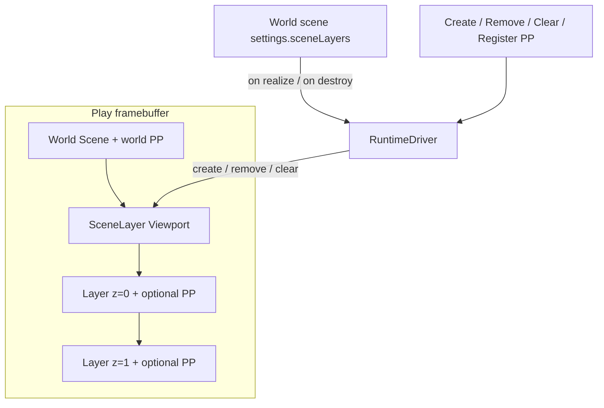

# SceneLayer overlays

Unlit 2D overlay documents stacked on a session compositor. Not a second world scene, not additive world streaming, and not a revival of the removed UserInterface / ADT HUD.

Schema: `packages/core/src/scene-layer.ts`. Runtime: `RuntimeDriver` compositor APIs. Render: extra Babylon `Scene`s on the shared Engine (`packages/render/src/scene-layer-compositor.ts`).

## One world Scene, overlay stack

Play still loads **one world Scene** at a time (`changeScene` / `changescene` swap that world). Overlay instances live on a session **SceneLayer Viewport** owned by Play/runtime, drawn **after** the world camera (and its post-process) so world PP never hits overlays.

Graph-created layers (`ownerSceneGuid === null`) survive world travel until Remove / Clear / Play stop. Scene-owned layers spawn from `SceneSettings.sceneLayers` and despawn when that world scene unloads. The same asset may exist as two instances (scene-owned + graph-created). Clear removes every layer.

## Asset

Content Browser type `SceneLayer` → document kind `scene-layer`. Payload is a slim scene cousin (actors, folders, 2D gravity, post-process stack). Always 2D. World `SceneSettings.sceneLayers` is `{ assetGuid, zOrder, enabled }[]`.

Editor tabs convert to a locked 2D `SerializedScene` (`sceneLayerToEditorScene`) so Viewport / Outliner / Details reuse the scene shell. Save writes `SerializedSceneLayer` (`editorSceneToSceneLayer`).

DockView: Viewport, Outliner, Details, Output Log. Hide the 3D/2D toolbar toggle; lock Unlit shading. Overlay Details (nothing selected): Name, Gravity, Timestep, Post Process. No Default Camera, fog/IBL, lights, or 3D/2D physics-world picker.

## Object model

`SceneLayer` extends `BObject` (`kind: "object"`). `SceneLayerActor` extends `Actor`. Overlay actors stay in the same `World` (same tick/snapshots) tagged `sceneLayerId`. `applyChangeScene` must not destroy them.

**Denylist only** (Add Component, Place Actors, serialize skip, overlay instantiate): Skybox, Camera, Light. Everything else is allowed, plus overlay-only `2DAnchor`, `2DTexture`, `2DMaterial`, `2DButton`, `2DText`, `2DRichText`. User Class prefabs that inherit `SceneLayerActor` follow the same denylist (strip Camera/Light/Skybox on Place). Spawn Actor and world-scene instantiate never create `SceneLayerActor` (or subclasses) in the world.

Place Actors in a SceneLayer document: `SceneLayerActor` and subclasses. World Scene Place Actors excludes them.

## Overlay 2D physics

Overlay actors always simulate in a dedicated Rapier 2D world on the Play session, independent of the world scene’s `physicsWorld` (Havok 3D vs Rapier 2D). Overlay and world bodies do not overlap. Tilemap collision / Blocking Volume on overlay actors go to this Rapier world.

## Render

Extra unlit ortho `Scene`s on the shared Engine:

- World: `autoClear = true`, existing camera PP unchanged.
- Each live SceneLayer: orthographic camera, `lightsEnabled = false`, unlit, no world PP.
- Draw order: world, then layers by `zOrder` (stable by instance id on ties).
- Layer with no PP: `autoClear = false` on color; clear depth so 2D quads sort.
- Layer with PP: render to an RTT, run that camera stack, alpha-composite onto the framebuffer (Babylon camera PP would otherwise replace the world). Engine Settings `postProcessingEnabled` still gates overlay PP in editor Play only.

The SceneLayer editor tab is a normal 2D viewport (one Babylon scene), not the Play compositor.

## Hit test and 2DAnchor

`HitTest` on `2DButton`, `2DMaterial`, `2DTexture`, `2DText`, and `2DRichText`: Ignore (default on texture/material/text), Block (default on button), Pass Through. `2DButton` is interaction-only: a sibling `2DTexture` / `2DMaterial` / `2DText` / `2DRichText` / Sprite / Mesh is the hit visual; otherwise Play emits a default unit quad.

Play overlay walks layers high `zOrder` → low, `scene.pick` each overlay scene, honors HitTest, then optionally the world. Overlay scenes participate in pointer-move picks for hover; world scenes keep `skipPointerMovePicking: true`. Hits still walk sibling visual Hit Test (`Ignore` / `Block` / `Pass Through`); the **button** is what opts the Actor into clickable overlay interaction.

`2DTexture` planes size to sniffed GPU bytes (KTX2, then PNG/JPEG) divided by Project Settings `pixelsPerUnit`. Missing guid or bytes stays **1×1**. `2DMaterial` and the default `2DButton` quad stay 1×1. Details has no Size field and Play does not write actor scale.

`2DButton` uses the same graph events on mouse and touch. Play captures the pointer, `preventDefault`s `touchstart` / `touchmove`, and treats `pointercancel` like a release (click if still over the button). Engine Settings `touchMinTargetPx` (default 44) is a **screen-space pick floor** through the overlay frustum — it inflates the pick AABB, not the visual.

`2DAnchor` pins actor XY to a 9-point layer/screen origin plus offset. On canvas / resolution change the worker reapplies XY so Get Actor Location matches the visual.

Pointer / click / press graph events come from adding a `2DButtonComponent` (same attach-gated pattern as Collider overlap). Add Event is empty of On Mouse Enter / Leave / Click / Press Start / Press End until a 2D Button is on the Actor; world Actors never see those rows (`2DButton` is overlay-exclusive). Multiple buttons → one override per event per instance (`Event On Click (2D Button 2)`). Dispatch keys hover/press by `actorGuid:componentId`. Overlay actors with only `2DText` / `2DTexture` still render; they do not get click/hover graph events until a 2D Button is added. Hit Test is a **variable** on the button (and sibling visuals for the pick walk), not an Add Event row. Old HUD event ids stay unmapped. SceneLayerActor has no native mouse stubs. There are no `onTouch*` nodes.

## Graph nodes

Category `scene-layer` (GameInstance and other graphs; instances live on the session compositor):

| Node | Runtime |
| --- | --- |
| Create Scene Layer | `ctx.createSceneLayer(guid, zOrder)` |
| Remove Scene Layer | Destroy instance + actors; no-op if already gone |
| Clear Scene Layer | Remove all |
| Register Scene Layer Post-Processing | Append a `postProcess` Material |
| Unregister Scene Layer Post-Processing | Missing material: error diagnostic / Output Log, Play continues |

Register/Unregister pickers require `domain === "postProcess"`.

## Play / export / player

Collect SceneLayer documents from every Play-library scene’s `sceneLayers` plus graph `assetRef("SceneLayer")` pin defaults. Pack textures, sprites, tilemaps, audio, particles, fonts, and materials those layer actors reference (same closure as a 2D scene), including `2DTexture.textureGuid`, `2DMaterial.materialGuid`, overlay `fontAssetGuid`, and RichText `[img]` texture guids (those guids live inside the markup string, so export does not see them via a naive string walk). Player `activeScene` still swaps **world** only; compositor commands follow the worker.

## 2D Text and 2D Rich Text

Overlay-only `2DTextComponent` / `2DRichTextComponent`. Shared per-glyph quads (not Babylon GUI / `TextRenderer.addParagraph`). **Renderer** is `bitmap` (default) or `msdf`.

| Renderer | When | How |
| --- | --- | --- |
| Bitmap | Always | Canvas `FontFace` glyphs packed onto an RGBA atlas when the paint is letter-shaped (not a solid slab filling the glyph box). A blank, full-canvas, or solid tofu fill (Node / NullEngine, broken headless 2D) uses the bundled 5×7 bitmap. Letter quads are sized to that raster cell. Missing Font uses the project default CSS stack. |
| MSDF | Font has a complete JSON + PNG pair | Same quads, atlas UVs + distance-field shader (crisp at any scale, shader stroke). Details greys out MSDF until the pair exists and writes `renderer` back to `bitmap` if the Font becomes incomplete. Missing atlas glyphs fall back to Bitmap cells. |

Size is px / Project Settings `pixelsPerUnit` (default 100). Overlay frustum stays height 9. Parent pick plane is the layout AABB; glyph and inline-image children are not pickable. RichText `[img]` is always a textured quad.

**2D Rich Text** markup is BBCode-like and nestable: `[b]` `[i]` `[u]`, `[color=…]` (named VGA + orange, or hex 3/4/6/8 with optional `#`), `[size=14]`, `[outline]` / `[outline-color]`, void `[img=<guid>]` / `[img=<guid> size=14]`, `[shake=1]`, `[wave=2]` (`intensity` default 1), `[hover]`, `[rotate=45]`. Unknown `[…]` stays literal. Unclosed wrappers apply to end of string. Letter effects combine on `onBeforeRender` and freeze while Play is paused.

Do not re-add `@babylonslate/ui-runtime`, UserInterface, WidgetComponent, or Babylon GUI. `p9-ui-anchoring` stays “do not rebuild” for HUD widgets; `2DAnchor` is overlay-actor layout only.
