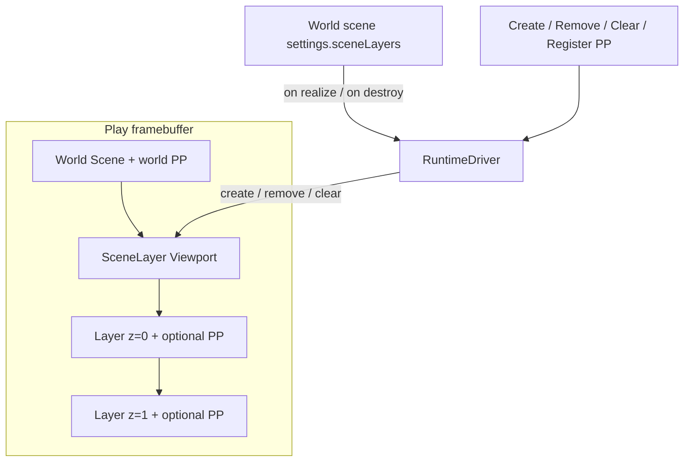

# SceneLayer overlays

Unlit 2D overlay documents stacked on a session compositor. Not a second world scene, not additive world streaming, and not a revival of the removed UserInterface / ADT HUD.

Schema: `packages/core/src/scene-layer.ts`. Runtime: `RuntimeDriver` compositor APIs, delegating layer lifecycle to `SceneLayers` (`packages/runtime/src/scene-layers.ts`). Render: extra Babylon `Scene`s on the shared Engine (`packages/render/src/scene-layer-compositor.ts`).

Runtime layout retains its entries across asynchronous visual replacement. It
indexes mesh names when layout or scene membership changes; unchanged frames
preserve cached component transforms without repeating name searches. Clip
inheritance still follows reparented descendants before drawing.

## One world Scene, overlay stack

Play still loads **one world Scene** at a time (`changeScene` / `changescene` swap that world). Overlay instances live on a session **SceneLayer Viewport** owned by Play/runtime, drawn **after** the world camera (and its post-process) so world PP never hits overlays.

```mermaid
flowchart TB
  subgraph play [Play framebuffer]
    WorldScene["World Scene + world PP"]
    Comp["SceneLayer Viewport"]
    L0["Layer z=0 + optional PP"]
    L1["Layer z=1 + optional PP"]
    WorldScene --> Comp
    Comp --> L0
    L0 --> L1
  end
  Driver["RuntimeDriver"] -->|"create / remove / clear"| Comp
  SceneA["World scene settings.sceneLayers"] -->|"on realize / on destroy"| Driver
  Graph["Create / Remove / Clear / Register PP"] --> Driver
```

Graph-created layers (`ownerSceneGuid === null`) survive world travel until Remove / Clear / Play stop. Scene-owned layers spawn from `SceneSettings.sceneLayers` and despawn when that world scene unloads. The same asset may exist as two instances (scene-owned + graph-created). Clear removes every layer.

Runtime readiness is per layer instance. `sceneLayerLoading` opens a monotonically identified load before its structural commands; `sceneLayerRealized` follows its complete assignments and snapshot. `sceneLayerReady` acknowledges that exact layer/load pair. Authored Begin Play, Logic Component creation, ticks, delays, physics and automatic playback wait for owner readiness; structural spawning continues so it can produce the resources being loaded. Ready global layers keep their script and physics state during world replacement. Game Instance world-loaded events wait for the world's presentation acknowledgment and all its owned layers. Removed, stopped and superseded identities cannot be activated by a late acknowledgment. Headless immediate consumers acknowledge after structural realization.

## Asset

Content Browser type `SceneLayer` → document kind `scene-layer`. Payload is a slim scene cousin (actors, folders, 2D gravity, post-process stack). Always 2D. World `SceneSettings.sceneLayers` is `{ assetGuid, zOrder, enabled }[]`.

Editor tabs convert to a locked 2D `SerializedScene` (`sceneLayerToEditorScene`) so Viewport / Outliner / Details reuse the scene shell. Save writes `SerializedSceneLayer` (`editorSceneToSceneLayer`).

DockView: Viewport, Outliner, Details, Output Log. Hide the 3D/2D toolbar toggle and fixed Unlit badge; lock Unlit shading. Overlay Details (nothing selected): Name, Gravity, Timestep, Post Process, **Layer Width**, **Layer Height**. No Default Camera, fog/IBL, lights, or 3D/2D physics-world picker. Layer Width/Height are the orange 2D camera outline (`cameraBounds2D` in the editor scene, `settings.layerBounds` on the SceneLayer document; default **32×18**). The outline is a freeze-stable XY plane (`__editor-camera-bounds__`) with a world-space `fwidth` 2px screen-space border (`CAMERA_BOUNDS_LINE_WIDTH`) in `RENDERING_GROUP.foreground` so sprites cannot hide it. World corners are `±width/2`, `±height/2` — the same rectangle `2DAnchor` uses. Show Grid hides only the tile grid; the orange frame stays visible (`boundsVisible` uniform, not mesh dispose). ViewportPanel applies `setGridSettings({ cameraBounds2D })` when the engine is created (`engineEpoch`) so the frame is not skipped on first mount. That rectangle is the design canvas. Play / Preview Build / export stretch it to the full viewport: each overlay camera’s ortho is `±layerBounds.width/2` × `±layerBounds.height/2` (default **32×18**), not a global height-9 aspect box. NDC maps that orange rectangle onto the framebuffer, so authored size and edge anchors stay WYSIWYG.

## Object model

`SceneLayer` extends `BObject` (`kind: "object"`). `SceneLayerActor` extends `Actor`. Overlay actors stay in the same `World` (same tick/snapshots) tagged `sceneLayerId` so graph nodes, `2DButton` events, and Get All Actors still see them. HUD **meshes** are not world Scene children — they live on compositor overlay Scenes. `applyChangeScene` must not destroy overlay actors.

`ENGINE_COMPONENT_DESCRIPTORS` is the placement authority used by Add Component, Place Actors, serialization, and overlay instantiation. World-only components include Landscape, Foliage, splines, water, Skybox, cameras, lights, fog, outlines, ragdolls, spring arms, render-target capture, and scene streaming. Overlay-only components are `2DAnchor`, `2DTexture`, `2DMaterial`, `2DButton`, `2DJoystick`, `2DText`, `2DRichText`, and `2DPanel`; components marked `any` remain available in both hosts. User Class prefabs that inherit `SceneLayerActor` follow the same derived denylist. Spawn Actor and world-scene instantiate never create `SceneLayerActor` (or subclasses) in the world.

Place Actors in a SceneLayer document: `SceneLayerActor` and subclasses, plus overlay stamps **2D Anchor**, **2D Texture**, **2D Material**, **2D Button**, **2D Joystick**, **2D Panel**, **2D Text**, **2D Rich Text** (each a `SceneLayerActor` with that component). Those Overlay stamps appear only when `placeActorsForHost({ overlay: true })` (SceneLayer host). World Scenes use `overlay: false` and never list them. World Scene Place Actors excludes overlay stamps and `SceneLayerActor` classes.

## Overlay 2D physics

Overlay actors always simulate in a dedicated Rapier 2D world on the Play session, independent of the world scene’s `physicsWorld` (Havok 3D vs Rapier 2D). Overlay and world bodies do not overlap. Tilemap collision / Blocking Volume on overlay actors go to this Rapier world.

## Render

Extra unlit ortho `Scene`s on the shared Engine:

- World: `autoClear = true`, existing camera PP unchanged.
- Each live SceneLayer: orthographic HUD camera at `(0, 0, -10)` looking at origin, `lightsEnabled = false`, unlit, no world PP. Each overlay `render` re-binds that camera (mode, pose, view/projection) so a shared Engine cannot reuse the world perspective camera.
- Draw order: world, then layers by `zOrder` (stable by instance id on ties).
- Layer with no PP: `autoClear = false` on color; clear depth so 2D quads sort.
- Layer with PP: render to an RTT, run the Scene-owned coordinator's stack, then alpha-composite onto the framebuffer. The coordinator draws through its FrameGraph; world and layer inputs remain isolated. Engine Settings `postProcessingEnabled` still gates overlay PP in editor Play only.

Play world and layer post-process attachment share the coordinator's entry/parameter ownership. Editor and caller-bound RTT previews keep native attachment. A layer RTT owns its sampleable depth attachment when supported. Stack or size replacement installs a new renderer and target without drawing. At most one previously presented target/blit is retained while its replacement prepares; an unrendered candidate is never used as a fallback. A pending first-frame check may replay only that prior image while preparation is incomplete; it cannot acknowledge the new load. Only a ready replacement frame and blit release it, after its old graph has also retired. Removing a layer detaches it immediately and waits for all its graph generations before disposing its Scene. Bounded cleanup reporting (`dispose()` / `whenDisposed()`) stays separate from confirmed actual release (`whenReleased()`): an uncertain bounded report only warns, the layer Scene and RTT are still disposed once actual release confirms, and a release that never confirms quarantines them alive with a warning instead of destroying a target still borrowed by pending work. Other layers remain independent.

Stopping a shared-Engine Play view stops scheduling, input and view ownership immediately. Scene, material-library and cache retains are released only after world and layer graph retirement confirms actual native release (`whenReleased`); a bounded report that rejects as uncertain only warns, while a rejected release quarantines the owners permanently. Whole-Engine teardown can cancel and dispose that Engine directly. Retirement waits for task ownership, while the managed GPU ledger separately retains charges until native deferred destruction; it does not force an extra frame.

The SceneLayer editor tab is a locked 2D viewport (one Babylon scene), not the Play compositor. Its clear is **opaque black** (`overlayEditor` on the converted editor scene plus `environmentColor [0,0,0]`). World 2D scenes keep chrome-gray clear even if environment is authored black. Play / player overlay scenes stay transparent `(0,0,0,0)` over the world. Overlay cameras are independent orthographic views — they are **not** parented to the world camera, and Play never copies world view/projection onto them, so translating, rotating, or changing FOV on a 3D Scene camera does not move overlay NDC or foreshorten the HUD. Overlay camera pose is HUD-space origin, not the Scene camera’s world position. Leftover `actor-*` meshes on the world Scene are disposed so the perspective camera cannot park the HUD at `(0,0)`. Selection uses a **2D transform box** on the gizmo utility layer (eight resize handles with ~44 CSS px pick targets and ¼-size visuals, interior drag to move, rotation knob just above the box for Z only) instead of Position/Rotation/Scale gizmos. Gestures still write actor XY position and Z rotation through `commitGizmoTransform`. Resize writes **actor XY scale** for Panel / Texture / Material / Button. Anchor-only objects have no viewport box. **2D Text / 2D Rich Text** use the same handles; resize commits `wrapWidth` / `wrapHeight` (px) and keeps `transform.scale`. Details **Scale** and NodeGraph Set Actor Scale still scale the wrap box and glyphs together after layout. World Scene 2D viewports keep axis gizmos. The toolbar hides Move / Rotate / Scale (Drag Select and Viewport Settings stay). SceneLayerActor prefabs use the same box.

## Hit test and 2DAnchor

An anchor-only Outliner object has no viewport mesh, billboard, pick target, gizmo, visibility control, or editable transform. Select it in the Outliner to edit Anchor and Offset settings. Placement, duplication, group transforms, and saving preserve its layout settings without assigning a spatial pose; the shared actor schema retains only an identity transform internally. Play omits anchors from pose snapshots so the renderer cannot create fallback visuals for them. Anchor components also omit local Transform controls in the Class/Prefab Inspector. Other components on a visual actor keep that actor's ordinary transform.

`HitTest` on `2DButton`, `2DMaterial`, `2DTexture`, `2DPanel`, `2DText`, and `2DRichText`: Ignore (default on texture/material/text/panel), Block (default on button), Pass Through. Hit Test is a catalog Get/Set variable on those components (`propertyKey` `hitTest`); 2D Text / Rich Text also expose Renderer, Outline, Outline Color, Alignment, Vertical Alignment, Bold, Italic, Underline, Wrap Width, and Wrap Height. `2DButton` is interaction-only: a sibling `2DTexture` / `2DMaterial` / `2DPanel` / `2DText` / `2DRichText` / Sprite / Mesh is the hit visual; otherwise Play emits a default unit quad. A **child** `2DButton` under a visual actor skips that default quad and picks the **parent** visual; graph events still fire on the actor that owns `2DButtonComponent`. Play `sceneLayerPointer` always invokes with that button’s id (including when the pick mesh is the parent), so `onClick` entries must be bound to the button — same as a same-actor sibling visual.

Play overlay walks layers high `zOrder` → low, `scene.pick` each overlay scene, honors HitTest, then optionally the world. Overlay scenes participate in pointer-move picks for hover; world scenes keep `skipPointerMovePicking: true`. Hits still walk sibling visual Hit Test (`Ignore` / `Block` / `Pass Through`); the **button** is what opts the Actor into clickable overlay interaction.

Runtime mesh assignments share one live-button lookup for Hit Test, button presence, and an unambiguous button ID. Own buttons take precedence; otherwise direct children are scanned once in world order. The lookup refreshes on each assignment, so it cannot retain stale component or hierarchy state. This removes repeated scans per assignment; child discovery still scans the world once for actors without their own buttons.

`2DTexture` planes size to the **SceneLayer object** extents: authored Texture payload width/height (import pixels) divided by Project Settings `pixelsPerUnit`, then multiplied by actor XY scale (the 2D transform box). Changing the Texture property rebuilds that native plane the same way in the SceneLayer tab; Details has no Size field and Play does not write actor scale. Editor texture LOD / KTX2 GPU bytes are for upload only — sniffing those bytes is a fallback when payload size is missing (WebP, GIF and Model-extracted Textures imported before those imports recorded their size; new imports of every image format record it). That fallback is approximate: LOD, Downsample and the compressed encode's rounding up to a multiple of 4 all change it, so such a 30×20 WebP sizes as 32×20 ([asset registry](asset-registry.md)). Preview Build / export record header `width`/`height` on the packed Texture index so the player does not size from LOD or packed GPU bytes. Missing guid or size stays **1×1**. `2DMaterial` and the default `2DButton` quad stay 1×1.

`2DTexture` / `2DMaterial` (and 2D Panel texture/material source) share the Engine `ResourceCache` with world Scenes. Assigning the default Mannequin albedo Texture or its Material must **reuse** that GPU wrapper — overlay NEAREST sampling, `hasAlpha`, pixel-art resample, and NodeMaterial dispose must not steal it or the 3D Mannequin goes black. Overlay `2DMaterial` / panel-from-material acquire a **scene-local unlit** NodeMaterial compile on the overlay Scene (separate cache key from the world PBR instance) so graphs draw without overlay lights. Play `assignMaterial` for an overlay slot must resolve that same overlay host + `:unlit` compile — a world-scene lit compile on a HUD mesh looks like the material is in the world. Overlay-only meshes never fall back onto the world Scene; leftover `actor-<slot>` / `actor-<slot>|…` world copies are disposed.

**2D Panel** is a 9-slice unlit plane (`source` texture or material, **0–1 source-texture fractions** (`0.5` = 50% of that edge), Hit Test Ignore). Values **above 1** stay legacy **pixels**. Corners stay `marginPx / pixelsPerUnit` in world space as the actor scale changes (mesh is a unit quad; dest is `|scale.xy|`). UV borders stay `marginPx / sourcePx` and do not shrink with dest. Edges stretch on one axis; the center stretches. Margins clamp when the destination is smaller than L+R or T+B. Editor Preview and Play share the same builder. Details shows a still frame of the Texture (or the Material’s first Texture Sample) with dashed margin lines and orange intersection dots; margins edit as 0–1 sliders.

Editor Preview shows unlit planes for `2DTexture` / `2DMaterial` / `2DPanel` / solo `2DButton`. A button with a sibling or parent visual does not add an extra quad (same as Play). A nested button helper stays an unpickable origin so viewport picks hit the parent visual; select that actor in the Outliner to edit the button. Other non-surface children of a visual actor (empty, script-only, RigidBody-only, area light) keep their pickable helper billboard.

`2DButton` uses the same graph events on mouse and touch. Play captures the pointer, `preventDefault`s `touchstart` / `touchmove`, and treats `pointercancel` like a release (click if still over the button). Engine Settings `touchMinTargetPx` (default 44) is a **screen-space pick floor** through the overlay frustum — it inflates the pick AABB, not the visual. Like `scene.pick`, the floor only widens enabled, visible, pickable buttons, so a hidden button gets no hover, press or click.

`2DAnchor` maps authored XY from the orange layer bounds onto the Play frustum. Origin is the 9-point on the orange rect (and the matching point on screen); `relative = (authoredXY + offset − origin) / layerBounds`; `runtimeXY = screenOrigin + relative × frustumSize`. Play’s frustum **is** `layerBounds`, so the map is identity plus design-space offset. Offsets are an extra design-space inset (default 0). Authoring is WYSIWYG inside the orange box.

Outliner parent/child: an anchor-only object configures its spatial parent; a root anchor with no parent is inert. An anchor component attached to a visual actor configures that actor. The uppermost configured anchor takes precedence throughout its subtree: descendants inherit the parent transform, and lower anchors do not apply a second offset or move ancestors. An actor's own anchor wins over an anchor helper attached beneath that same actor; among helper siblings, the first live anchor in Outliner order wins. Reparenting or changing anchor properties resolves this ownership again.

On canvas / resolution change the worker reapplies the controlling anchor from a cached design pose without accumulating offsets. Normalization preserves Anchor/Offset settings instead of baking them into actor positions. Child positions, rotations, and scales remain authored local values; the ordinary hierarchy carries the upper anchor's movement. Actor pose setters ignore anchor-only objects.

Pointer / click / press graph events come from adding a `2DButtonComponent` (same attach-gated pattern as Collider overlap). Add Event is empty of On Mouse Enter / Leave / Click / Press Start / Press End until a 2D Button is on the Actor; world Actors never see those rows (`2DButton` is overlay-exclusive). Multiple buttons → one override per event per instance (`Event On Click (2D Button 2)`). Dispatch keys hover/press by `actorGuid:componentId`. Overlay actors with only `2DText` / `2DTexture` still render; they do not get click/hover graph events until a 2D Button is added. Hit Test is a **variable** on the button (and sibling visuals for the pick walk), not an Add Event row. Old HUD event ids stay unmapped. SceneLayerActor has no native mouse stubs. There are no `onTouch*` nodes.

## Nested layout and scrolling

SceneLayer Outliner children and SceneLayerActor component children share the same layout rules. A root box component arranges its actor's child actors as well as components attached beneath that box. Boxes can nest in either hierarchy; sibling array/Outliner order determines layout order. Anchor-only Outliner actors are skipped when arranging their descendants, while their authored parent links remain intact. These remain actor components, with no separate widget asset system.

| Component | Behavior |
| --- | --- |
| 2D Vertical Box / 2D Horizontal Box | Arrange children top-to-bottom / left-to-right with Gap and alignment. |
| 2D Overlay Box | Arrange children in the same content rectangle, with alignment and existing draw order. |
| 2D Scroll Box | Clip nested content to its viewport; vertical, horizontal or both axes. Wheel, Shift+wheel, touch/pen drag and Scroll X/Y setters move it within measured content bounds. |
| 2D Padding | Nonvisual child modifier: Left/Right/Top/Bottom inset only the immediate parent's content area; it occupies no layout slot. |
| 2D Spacer | Nonvisual fixed space or a weighted share of the remaining main-axis space. |

Box Width/Height Mode selects Fixed, Content or Fill. Fill Weight divides remaining space between fill children; hidden children do not reserve slots. Width, Height, Gap, padding and scroll offsets use SceneLayer world units. Texture desired dimensions come from authored pixels / Pixels Per Unit; text uses its explicit wrap dimensions, or an estimate from parsed visible text and inline images when unwrapped. Layout recalculates after authored/script size, hierarchy or visibility changes, retaining original design transforms to avoid cumulative scaling. Editor preview and Play/player use the same solver. Scroll clipping applies to rendered geometry and pointer/touch picks; focus navigation reveals an offscreen target through its scroll ancestors. Clip render callbacks attach only to clipped meshes and detach when clipping or the layer is removed, preserving idle world shadow caching when an editor scene is reused. Hidden or disabled containers cannot scroll, and higher layers with blocking hits stop scrolling through to lower layers. A touch scroll cancels a pressed button instead of activating it on release.

## Focus navigation

**2D Button** supports keyboard and gamepad navigation. Add nonvisual **2D Focus Target** to another element for the same focus behavior. Actor and nested component transforms determine direction; helpers attached to a visual use that visual's bounds and visibility even when the layer has no layout boxes. Destroyed, hidden, disabled and not-ready owners are excluded. Navigation stays within the highest ready layer containing eligible targets. Explicit neighbor links cannot cross layer instances.

Project Settings **Focus Navigation** controls enablement, repeat delay/interval and wrapping. **Navigation Input** selects a 2D Input Axis (positive Y is up); **Activate Input** selects an Input Action. Their authored bindings and runtime rebinding use the existing input asset system. None uses arrows/WASD, D-Pad/left stick, and Enter/Space/bottom gamepad face button. Game input remains available to gameplay scripts; games own their menu input gating.

Each target has **Focus Enabled**, **Initial Focus**, and **Focus Up/Down/Left/Right**. Automatic selects a nearby target in that direction; an explicit unavailable neighbor stops movement. Initial Focus is applied once when the layer becomes active. Without an initial target, the first navigation or activation input selects the topmost, then leftmost target. Neighbor dropdowns include scene actors and attached focus components; Class/Prefab editing includes its attached components. Prefab component links resolve within the current actor instance, including when that sibling is unavailable. Duplicating controls remaps links to actors and components inside the copied selection and preserves external links.

Component-bound **On Focus Enter**, **On Focus Leave**, and **On Focus Activate** events support authored highlights and actions. **Focused** is readable; **Set Focus** returns Success, and **Clear Focus** releases that target. Button activation additionally uses **On Press Start**, **On Press End**, and **On Click**. Removing, hiding, disabling, or superseding a pressed target cancels its activation. Pointer press transfers focus to an eligible Button. Focus state is session-only and never saved to the SceneLayer document. Editor Play and exported players use the same runtime controller and project settings.

## Graph nodes

Category `scene-layer` (GameInstance and other graphs; instances live on the session compositor):

| Node | Runtime |
| --- | --- |
| Create Scene Layer | `ctx.createSceneLayer(guid, zOrder)` |
| Remove Scene Layer | Destroy instance + actors; no-op if already gone |
| Clear Scene Layer | Remove all |
| Register Scene Layer Post-Processing | Append a `postProcess` Material |
| Unregister Scene Layer Post-Processing | Missing material: error diagnostic / Output Log, Play continues |

Register/Unregister pickers require `domain === "postProcess"`.

World Scene Details **Scene Layers** (`settings.sceneLayers`) and **Create Scene Layer** both call `createSceneLayer`. They differ only in `ownerSceneGuid` (scene-owned vs graph/`null`). Neither path instantiates overlay meshes into the world Babylon Scene. The Details list does not copy overlay actors into the authored world `scene.actors`.

## Play / export / player

Collect SceneLayer documents from every Play-library scene’s `sceneLayers` plus graph `assetRef("SceneLayer")` pin defaults. Pack textures, sprites, tilemaps, audio, particles, fonts, and materials those layer actors reference (same closure as a 2D scene), including `2DTexture.textureGuid`, `2DMaterial.materialGuid`, `2DPanel` texture/material guids, overlay `fontAssetGuid`, and RichText `[img]` texture guids (those guids live inside the markup string, so export does not see them via a naive string walk). Player `activeScene` still swaps **world** only; compositor commands follow the worker.

A SceneLayer is a **HUD**: view-locked unlit orthographic overlay drawn after the world. Overlay XY lives in that layer’s `layerBounds` (default 32×18), stretched to the viewport. Overlay camera pose is HUD-space origin `(0, 0, -10)`, not the possessed Scene camera’s world position. World camera motion, rotation, and perspective FOV must not move overlay NDC or foreshorten HUD quads. Overlay cameras and meshes are **not** parented to the world camera; Play does not copy world view/projection onto overlay cameras.

Editor Play and the packaged player apply `sceneLayerCreate` / `Remove` / `Clear` / `PostProcess` (and `despawn`) on the engine handle via the shared `PLAY_ENGINE_COMMAND_TYPES` allowlist. Snapshots set `flags` bit 1 (`SNAPSHOT_FLAG_OVERLAY`) for actors with `sceneLayerId`. Overlay-flagged snapshot slots never call `createPlayVisual` on the world Scene. `assignMesh` carries optional `sceneLayerId` so the compositor can `noteSpawn` before routing. Overlay identity is that id / snapshot bit / overlay-only mesh kind. Sprites and tilemaps on overlay actors are still HUD: while the compositor exists they hold off the world Scene until a **world** spawn (no `sceneLayerId`) classifies the slot. Overlay visuals (including boxes/models tagged `sceneLayerId`) must not instantiate in the world Scene: skip until the overlay `Scene` is live, create there, `migratePlaySlotVisual` if a leftover world mesh exists, and dispose remaining world `actor-*` copies so the perspective camera cannot draw them. Overlay particles host on the overlay Scene. Overlay slots skip world-camera tilemap parallax. Overlay-only kinds (`2dtexture`, `2dmaterial`, `2djoystick`, `2dbutton`, `2dpanel`, `2dtext`, `2drichtext`) never fall back to `worldScene` while the compositor exists.

## 2D Text and 2D Rich Text

Visual components **2D Texture**, **2D Material**, **2D Panel**, **2D Text**, **2D Rich Text**, **2D Painter** and **2D Joystick** expose **Opacity** (0–1, default 1) and **Tint** (RGBA, default white). These multiply that component's existing visual output, including rich-text images/underlines and both joystick surfaces. Rich-text reveal alpha remains independent. A component's style does not propagate into other child components, change shared material assets, rebuild glyph atlases, or repaint a Painter canvas. Buttons animate their associated visual component. The runtime sends style updates separately from structural mesh assignments so a Tween can update them every simulation step without replacing the visual.

Component motion likewise uses `setComponentTransforms`, retaining geometry, material and glyph resources while updating component poses and nonvisual ancestor transforms. The renderer applies the same samples to prepared replacements and retains them while a layer scene is loading. Optimized singleton visuals compose the latest component pose with each actor snapshot; a motion command invalidates the cached snapshot even when the actor itself has not moved.

Overlay-only `2DTextComponent` / `2DRichTextComponent`. Shared per-glyph quads (not Babylon GUI / `TextRenderer.addParagraph`). **Renderer** is `bitmap` (default) or `msdf`.

**Text Material** accepts the dedicated **Text** Material domain. Its **Text Output** Color (RGBA) multiplies the glyph's baked Bitmap color or MSDF fill/outline color; the engine preserves letter coverage and rich-text spans. Underlines receive the same material, while inline images keep their image textures. None, a missing asset, or another material domain uses the normal text renderer. **Material UV** defaults to **Text Box** (0–1 across the wrap box); **Each Glyph** repeats 0–1 on each letter. Atlas coordinates remain private to text rendering. Both properties have component Get/Set variables, and Play/player carry the same material and UV settings as the editor.

Text materials share a scene-local compiled graph and bind each glyph's atlas/style on every draw, including frozen materials. Shader prewarming defers while a glyph atlas is uploading; normal draw readiness still waits for that atlas. Disposing or rebuilding one label releases its atlas without altering another label. Material preview displays sample text. Export and Play dependency collection include text materials and their texture/function dependencies.

| Renderer | When | How |
| --- | --- | --- |
| Bitmap | Always | Canvas `FontFace` glyphs packed onto an RGBA atlas when the paint is letter-shaped (not a solid slab filling the glyph box). A blank, full-canvas, or solid tofu fill (Node / NullEngine, broken headless 2D) uses the bundled 5×7 bitmap. Letter quads are sized to that raster cell. Missing Font uses the project default CSS stack. |
| MSDF | Font has a complete JSON + PNG pair | Same quads, atlas UVs + distance-field shader (crisp at any scale, shader stroke). Details greys out MSDF until the pair exists and writes `renderer` back to `bitmap` if the Font becomes incomplete. Missing atlas glyphs fall back to Bitmap cells. |

Size is px / Project Settings `pixelsPerUnit` (default 100). Overlay cameras use `layerBounds` (default height 18). Parent pick plane is the **wrap box** (`wrapWidth` × `wrapHeight` in px / ppu when both are > 0; otherwise the layout AABB). Glyphs wrap on **width** only; **height** is the frame — extra lines may overflow top/bottom and do not grow gizmo handles. When `wrapWidth` > 0, **Alignment** Left / Center / Right is against the wrap-box left edge, center, and right edge (not the actor origin). **Vertical Alignment** Top / Center / Bottom (default Center) pins the text block to the wrap-box top, center, or bottom. Place / Add default `wrapWidth` 200 and `wrapHeight` 64. Stored `0` stays newlines-only (legacy) until the first gizmo resize. Glyph and inline-image children are not pickable. RichText `[img]` is always a textured quad.

**2D Rich Text** markup is BBCode-like and nestable: `[b]` `[i]` `[u]`, `[color=…]` (named VGA + orange, or hex 3/4/6/8 with optional `#`), `[size=14]`, `[outline]` / `[outline-color]`, void `[img=<guid>]` / `[img=<guid> size=14]`, `[shake=1]`, `[wave=2]` (`intensity` default 1), `[hover]`, `[rotate=45]`. Unknown `[…]` stays literal. Unclosed wrappers apply to end of string. Letter effects combine on `onBeforeRender` and freeze while Play is paused. Underline is a shared line under each run of `[u]` / Underline glyphs (constant Y and thickness from the line, not each letter bbox) and does not inherit shake/wave/hover/rotate.

Shake uses smooth, time-based noise per letter with a small displacement; `[shake=1]` stays within 3% of the glyph height on each axis, and larger values scale the movement. Inline images align to the center of each line's visible text, accounting for bitmap transparency and glyph bearings. Different image sizes share that center; lines containing only images remain centered in their line box.

**Appear Modes** on 2D Rich Text is an array: combine **Fade**, **Scale**, and **Slide** once each, choose **Instant** alone, or remove every entry for **Off** (the default). Scene and Class/Prefab Details share the reusable Array Property editor. Choosing Instant replaces any combination. **Appear Transition** selects a curve, including Linear, Cubic Out, Cubic In Out, Bounce Out, and Instant. **Time Between Characters** defaults to `0.1 s`; `0` starts every character together. **Character Reveal Duration** defaults to `0.3 s`. Instant snaps each character at its scheduled time and ignores that duration, while preserving the interval.

Off disables the transition and timing controls; Instant mode disables transition and duration, and Instant transition disables duration. Their stored values remain intact when re-enabled. Appear Start stays editable. Reset on a scene prefab instance restores its prefab's authored modes.

Reveal runs after markup parsing and layout: tags consume no reveal time, each inline image counts as one character, and nested formatting and stacked letter effects remain applied. The full text determines wrapping and alignment throughout the animation, so unrevealed characters do not make the text reflow. **Appear Start** chooses Fully Revealed (default), Hidden, or Play On Start for the live component; editor authoring keeps the full label visible.

Fade uses smooth alpha blending on Bitmap glyphs, inline images, underlines, MSDF, and shared Text Materials; glyph coverage and existing styling remain intact. Underline segments reveal with their characters while retaining the line's baseline.

Continuous letter effects update only their affected glyphs. Reveal progress updates reuse component mesh references and avoid rebuilding or scanning the actor's glyph hierarchy each tick.

The component graph exposes **Set Appear Modes**, **Set Appear Transition**, **Set Appear Interval**, and **Set Appear Duration**. **Trigger Appear** restarts from hidden; **Play** continues toward fully revealed; **Play Reverse** continues toward hidden. **Get Appear Progress** returns normalized `0–1` progress (`0` hidden, `1` fully revealed), and **Get Is Revealed** is true only at `1`. Reversing during playback preserves the current progress. Live property edits preserve normalized progress; Appear Start only sets the initial state. Simulation time drives the timeline, so pause and owner readiness stop it. Off completes playback commands immediately at their destination.

Do not re-add `@babylonslate/ui-runtime`, UserInterface, WidgetComponent, or Babylon GUI. `p9-ui-anchoring` stays “do not rebuild” for HUD widgets; `2DAnchor` is overlay-actor layout only.

The shared host readiness coordinator tracks world and SceneLayer transitions independently. Each layer waits for its own model, texture, shader and first-frame work. Completing one owner does not dismiss another owner's loading UI; authored activation is acknowledged only after the host has painted the presented canvas, including after dismissal of the final loading blocker. Removed layers and stopped hosts cannot acknowledge delayed completion.

In cooperative Play/player sessions, `createSceneLayer` returns the live loading layer before creating its actors. Its tokenized `sceneLayerLoadingPainted` acknowledgement must arrive within 30 seconds; document normalization and bounded remap/create/spawn/anchor/assignment passes then run after the host paint. Game Instance and previously activated owners keep ticking between batches. Removal or Stop cancels the exact layer identity, cleans partial actors, and suppresses late assignment/ready markers. Immediate consumers retain synchronous creation. World-owned layers already run beneath the world transition's painted blocker.

Preview Build and the exported player own no loading screen: `Event On Scene Start Loading`, `Event On Scene Finish Loading` and `Get Scene Loading Progress` drive authored loading Scene Layers, which keep rendering throughout the transaction because the player never obstructs its scheduler. The engine's world/layer admission still withholds not-ready owners. Editor Play keeps its `SceneLoadingDialog`.

Layer post-process targets retain alpha so transparent pixels preserve the world and lower layers when composited. Play pass diagnostics count ready, enabled graph tasks.

## 2D Painter

`2DPainterComponent` is an overlay-only procedural drawing surface. Add Component and Place Actors expose **2D Painter**. Its centered Width/Height, coordinates, radii and Stroke Width use SceneLayer units; positive Y points up. Pixels Per Unit controls raster quality, bounded to 4096 pixels per side and four million pixels. The editor, Play and exported player use the same transparent, unlit canvas-backed plane. Hit Test uses its rectangular bounds.

- Component functions draw Line, Polyline, Rectangle, Circle, Ellipse and Polygon. Point lists are Vector 2 arrays; rectangles use a center and full size, and ellipses use X/Y radii. Fill/Stroke, RGBA colors, Stroke Width, Line Cap and Line Join are captured when a draw command is issued.
- Begin Path, Move To, Line To, Quadratic Curve To, Bezier Curve To, Arc and Close Path build reusable paths. Arc angles and rotation are radians. Fill Path and Stroke Path draw without discarding the path.
- Push Mask clips subsequent drawing to the current path; Pop Mask restores the previous clip. Fill Rule selects Nonzero or Even Odd for fills, masks and holes. Cut Out Path erases only this painter's existing pixels inside the current clip. Clear resets drawing, the path and the mask stack.
- Clear Each Frame defaults on and clears before an active owner's simulation Tick. Disable it for drawing that remains until Clear. Paused/not-ready owners retain their drawing. Independent components never share drawing or mask state, and drawing remains present in release players without debug settings.
- Native functions return Success. Invalid geometry, mask underflow/overflow and resource-limit violations return false without replacing existing drawing. Limits are 16,384 commands, 8,192 segments per path, 65,536 retained segments and 32 nested masks. Drawing commands update textures without rebuilding actor meshes; resource ownership follows the component visual lifecycle.

The serializable `commands` property supports authored drawing data; script-generated commands belong to the live component instance and are not written back to the project. Fill/stroke style changes affect subsequent commands. Existing drawing is replayed at the new canvas size when Width, Height or Pixels Per Unit changes.

## 2D Joystick

Add **2D Joystick** from Place Actors in a SceneLayer, or Add Component on a SceneLayerActor/Class prefab. The built-in `2DJoystickComponent` renders a fixed background and a draggable stick; None uses native circular geometry. It is available only to overlay actors.

- **Background Material** and **Joystick Material** independently accept Material or Material Instance assets, compiled unlit in the owning layer. Use a Texture Sample in a material for texture artwork. The shared Material picker retains its existing material-only contract; accepting Texture GUIDs there would require conversion throughout its consumers. Authored material surfaces are square quads, so use material alpha for a circular silhouette.
- Explicit background/foreground alpha priorities keep the stick above its background throughout dragging and fades.
- **Background Radius** (default 1.5) and **Joystick Radius** (0.6) use layer units. The stick's center travels within their difference. Actor/component parenting, layout, XY scale and Z rotation apply to both visuals and input. The radial **Dead Zone** defaults to 0.1 and remaps the remaining travel continuously to magnitude 1.
- **Horizontal Axis** / **Vertical Axis** select existing Touch binding codes (default **Joystick X** / **Joystick Y**). Add matching Touch bindings to an Input Axis asset and consume its normal input events/readback. Positive X is right and positive Y is up in component space. A second joystick can select **D-Pad X** / **D-Pad Y** for independent bindings.
- Mouse, touch and pen use the same pointer path in Play and the exported player. A gesture owns its joystick until release, even outside its bounds; another finger cannot steal it. Blocking layers and clipping participate in picking. Release, cancellation, capture loss, focus loss, hiding the page, pause, disabled/hidden visuals, and visual/layer removal return its axes to zero. Multiple held joysticks sharing a code contribute the greatest absolute value; releasing one preserves the others.
- The component exposes its settings as graph Get/Set variables. Material dependencies and their textures/functions are collected for editor preview, Play and export. Borrowed material resources survive joystick disposal.

## Form controls

SceneLayerActor supports these overlay-only components through Add Component and
Place Actors. Their visuals use native unlit SceneLayer meshes and 2D Text in the
editor, Play and exported player. Width, Height and Font Size use layer units.

| Component | State and interaction |
| --- | --- |
| 2D Slider | Value between Minimum and Maximum; Step snapping; horizontal or vertical dragging. |
| 2D Range Slider | Lower Value and Upper Value; two handles constrained to an ordered range. |
| 2D Checkbox | Checked state toggles on activation. |
| 2D Radio Button | Checking one clears the other checked buttons in the same Group and layer instance. |
| 2D Toggle / Switch | Checked state with a moving thumb. |
| 2D Text Input | Single-line Text, Placeholder, Maximum Length and Read Only; native text editing supplies composition and mobile keyboard input. |
| 2D Numeric Input / Spinner | Value, bounds and Step; editable number with increment/decrement controls. |
| 2D Dropdown / Select | Options string array and Selected Index; `-1` means no selection. |
| 2D Progress Bar / Meter | Bounded Value and orientation; display-only, without a pointer target. |

- Background, Track, Fill, Thumb and Indicator have independent Material and
  Texture properties. Each control uses the parts appropriate to its shape.
  Material takes precedence when both are assigned. Materials resolve unlit in
  the owning layer; disposing a control does not dispose borrowed assets.
- Enabled gates input. Interactive controls participate in the existing focus
  navigation system. Pointer capture keeps slider dragging stable outside its
  bounds; hidden, removed and disabled controls cannot accept stale input.
- NodeGraph exposes typed state Get/Set variables and functions such as Set
  Value, Set Range, Set Checked, Set Text, Increment and Set Selected Index.
  Component-bound On Value Changed, On Range Changed, On Checked Changed,
  On Text Changed, On Text Submitted and On Selection Changed events carry the
  updated values. Runtime normalization keeps graph readback and visuals aligned.
- Maximum Length counts Unicode code points (`0` means unrestricted). Numeric
  values clamp to their bounds and snap from Minimum. Radio selection updates
  the group before change handlers run.
- Text and numeric inputs draw caret and selection feedback using measured 2D
  Text glyphs. Native editing supplies clipboard actions and composition;
  pointer dragging selects text. Enter commits and Escape restores the draft's
  original value. Keyboard Tab, arrows, Space, Home and End operate controls;
  Shift selects the upper range-slider handle for keyboard adjustment.
- Touch and pen presses on checkboxes, radio buttons, toggles, dropdowns and
  numeric spinner buttons transfer to a containing scroll view after 8 pixels
  of movement, cancelling the press. Slider drags and text selection retain
  their pointer; short taps still activate the control.

## Virtualized collections, masks and safe areas

| Component | Behavior |
| --- | --- |
| 2D Virtualized List | Scrollable uniform items, vertically or horizontally. |
| 2D Virtualized Grid | Scrollable uniform rows with explicit Columns or automatic columns from available width. |
| 2D Mask Panel | Clips its nested contents to Width and Height. |
| 2D Mask | Clips its owning actor's visuals, or its parent actor when used as a helper, including descendants. |
| 2D Safe Area | Insets content using host safe-area measurements plus authored per-edge insets; individual edges can be disabled. |

Virtualized collections accept Item Class (a SceneLayerActor class), Item Count,
Item Width/Height and Overscan. Only the visible range plus overscan owns spawned
actors and render resources. Each spawned item receives `itemIndex` and
`virtualizedContainerId`, so its graph can bind application data. Items leaving
the range are destroyed; store persistent item state outside those instances.
Authored children can also be arranged and culled by the same layout. Wheel,
touch scrolling and Scroll X/Y use the existing Scroll Box path.
Resource bounds allow up to 2,048 live items per container and 8,192 per layer;
recursive item classes are rejected, with at most 16 nested virtual containers.

Masks share layout clipping with Scroll Box: nested clips intersect and apply to
rendering and picking. Safe-area host insets arrive in CSS pixels and are mapped
to layer units; manual insets use layer units. The document preview uses the
authored insets, while Play and the player also use their canvas's host insets.

## SceneLayerActor Switcher

**Scene Layer Actor Switcher** is an overlay-only actor derived from
SceneLayerActor. Its **Scene Layer Actors** array accepts SceneLayerActor classes
and entries with per-instance default overrides. **Initial Index** selects the
first spawned entry (`-1` leaves the switcher empty).

- **Switch Scene Layer Actor** selects an index and returns its spawned actor.
  **Get Current Scene Layer Actor**, **Current Actor** and **Current Index** expose
  the live selection. An invalid entry leaves the previous selection intact.
- The selected actor inherits its class defaults and prefab components, belongs
  to the same layer, and is parented beneath the switcher. Switching destroys the
  previous selected actor and its descendants. Removing the switcher or its
  layer also cleans up the selected actor.
- Switcher graphs expose **On Scene Layer Actor Switching** and **On Scene Layer
  Actor Switched**, including previous/current references and indices. Selected
  actor graphs expose **On Scene Layer Actor Switched To** and **On Scene Layer
  Actor Switched From**. Reentrant switching is guarded.
- Serialized actor `properties` and class `actorDefaults.properties` retain
  native actor settings. Switcher entries serialize as a class ID string or
  `{ classId, defaults }`. Class references and their dependencies participate in
  Play/export content collection.
- The graph **Scene Layer Actors** getter returns a typed class array. Setting
  that array replaces the configured entries and their per-entry overrides;
  editor-authored defaults remain intact when reading or switching entries.
