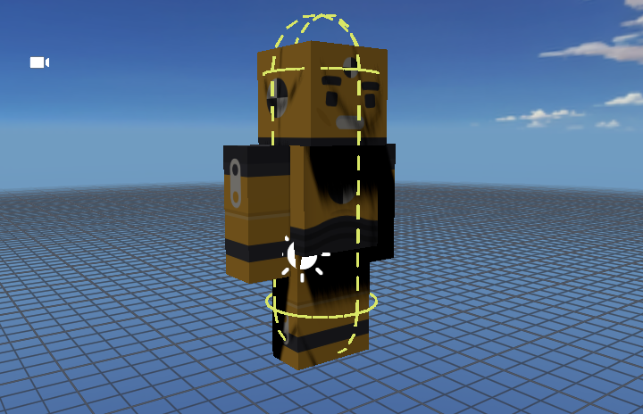
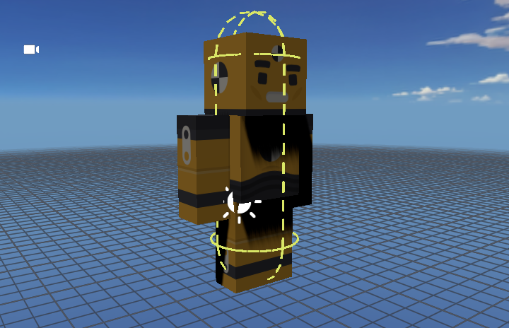
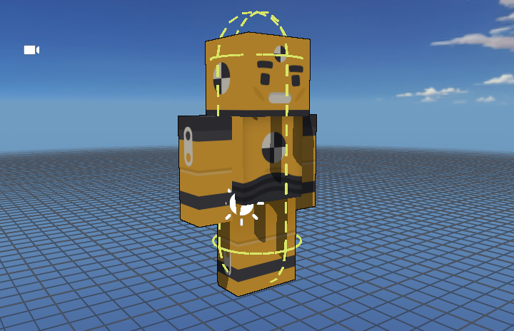
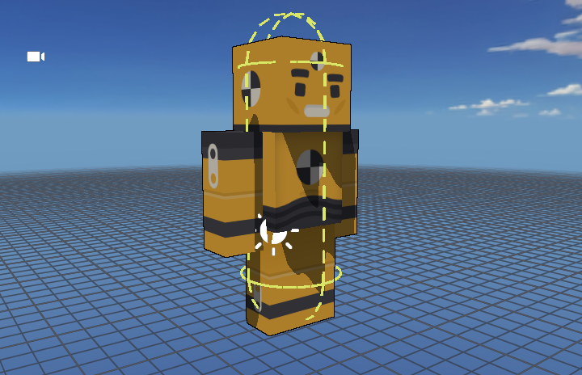
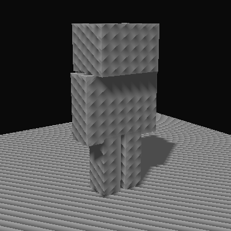
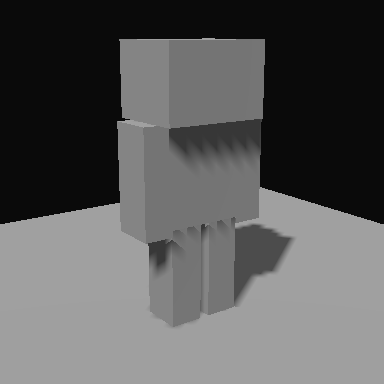

# Renderer qualification

## Editor viewport frame retention and transform edits

The viewport now holds its previous visible image when an admitted draw becomes
unready, including after private-buffer resize or sibling-view activity. Pose-only
scene edits retain prepared rendering resources and skip unchanged asset
collection. Diagnostics distinguish attempts, successful draws and actual copies.

At `cf345961`, all 175 cases in `create-engine.play.test.ts`,
`scene-render-coordinator.test.ts` and `framegraph-forward-scene.test.ts` pass.
The three new late-light-admission/render-callback cases fail against the original
`225d55b8` renderer. Earlier passing registered-view, viewport asset-refresh and
RTT-copy checks remain applicable to their unchanged code.

At `6061fb2b`, four selected browser cases pass: cached/fresh shadow parity after
caster/light movement, resize and reload; intermediate-frame retention on desktop
and Chromium iPad touch emulation; and the light-edit measurement. The frame
monitor observed 88 copies/196 samples on desktop and 260 copies/543 samples in
touch emulation, with zero black, transparent or missing-receiver samples. These
are separate from the timing runs. Native-GPU measurement also passes at
`2c0866f6`; see the [matched performance comparison](perf-budget.md#viewport-light-edit-comparison)
and [measurement record](../assets/renderer-qualification/2026-09-24-viewport-stability/measurements.json).

Physical iPad qualification remains pending. No Safari/PWA flash-elimination or
iPad performance claim follows from the local checks.
Device acceptance must record model/iPadOS, PWA revision, effective backend, frame
cap and quality, then exercise continuous light drag/release, Details scrubbing,
idle selection, sibling views, resize/orientation and background/resume. Collect
pixel correctness separately from timing and compare the same scene/settings.

## Basic 3D mannequin: 24 September 2026

This continuation uses a freshly created **Basic 3D** project and its actual
bundled Kenney mannequin, imported through the production asset/hierarchy/material
path. It is not the earlier synthetic box fixture or the unavailable
TestProject222. The captured model is 2.7 world units tall; no meter convention
is assumed. Its imported source SHA-256 and revision-scoped effective states are
in the [evidence record](../assets/renderer-qualification/2026-09-24-mannequin-shadows/effective-settings.json).

Two separate causes were reproduced:

| Path | Isolation and defect | Correction |
| --- | --- | --- |
| Default Medium, editor | Shadow-off removed the triangular marks. Retaining all six mannequin casters while excluding nonmodel casters removed them too. Collider roots were marked as helpers, but renderable dash children were not; the shadow policy also omitted the collider marker. | Mark each dash and exclude marked meshes from shadow participation. Authored model children beneath a collider remain eligible. |
| Low directional automatic PCF | With guides already excluded, known lit pixels passed but valid contacts failed. The one bilinear comparison used a conservative reference for four texels at different receiver depths. Independent triangle rays found blockers at all four texel centers while the shared reference rejected some of them. | Compare each texel against its own receiver-plane depth, then apply the original bilinear weights. Preserve map size, distance, caster bias, material and hard CEL bands. |

The collider regression failed at `45770150`: 87 sampled head pixels changed
when helper casting was isolated, including 58 incorrectly dark lit-face samples.
At `2ca6c04d` all sampled helper differences were zero and all 123 visible
contact samples remained shadowed. These matched Medium captures retain the same
camera, materials, light, two 2048 maps and authored settings:




The independent oracle samples actual imported triangles at native pixel centers,
checks camera visibility, and retains shadow-boundary samples in the paired
helper comparison. Low classification uses its actual four texel centers rather
than sparse world offsets. Foreground guides and authored dark texture pixels
without useful lighting signal are excluded only from lit/contact classification.
The shadow-difference comparison still includes them. No global image-difference
percentage, substituted character, disabled shadows, or relaxed darkness threshold
is used as an acceptance result.

The final Low assertion failed on both APIs at `10afa5ac`, even with helpers
excluded: the WebGL2 CEL case retained 7/20 left-leg and 0/7 torso contacts.
At `0bc933c7` the identical population retains 20/20 and 7/7, with zero false-dark
lit samples and no changes caused by helper participation. The maps remain
1024 square, one cascade, distance 80, normal bias 0.005:




### Scoped verification record

- `8bcbaabd`: 30 unit cases across `shadow-controller.test.ts`,
  `collider-visual.test.ts` and `shadow-diagnostics.test.ts` pass. The collider
  membership regression fails before the fix (`2f630056`).
- `8b2c21aa`: `framegraph-managed-shadows.test.ts` passes, including guide
  movement/visibility, unchanged local cache/allocation and real-caster refresh.
- `10afa5ac`: three selected Medium editor cases pass: WebGL2 PBR, WebGPU CEL,
  and a reversed light/view angle. The Low failures above are not counted as passes.
- `c6237b11`: the real-model Play/packed-player case passes in PBR and CEL;
  `slomo 0` freezes animation for pixel pairs, then `slomo 1` verifies it resumes.
  The saved camera exposes the model while preserving the template clipping,
  light and imported asset. [Play](../assets/renderer-qualification/2026-09-24-mannequin-shadows/play-pbr.png)
  and [packed player](../assets/renderer-qualification/2026-09-24-mannequin-shadows/packed-player-cel.png)
  use the existing production hosts.
- `0bc933c7`: both Low real-model cases pass (WebGL2 CEL / WebGPU PBR).
  Four selected existing synthetic cases also pass: WebGL2 cascade fallback PBR,
  WebGPU cascaded CEL, and transformed/instanced fixtures on both APIs.
- `87374e9e`: all **71 cases** in the six explicit unit files pass:
  shadow bias, controller, managed FrameGraph shadows, collider visuals,
  diagnostics and viewport shading. Changed-file ESLint has no errors (one
  existing `viewport-panel.tsx` hook warning); the render package typecheck passes.
  The earlier admitted editor/player builds include their TypeScript checks.
- `a94676b1`: Play/player and the four default-light editor cases pass. The
  alternate view exposed a capture race: scene render IDs advanced during shadow
  preparation while diagnostics still held the previous view matrix. At
  `e8f83217`, two consecutive alternate-view runs pass after waiting for presented
  viewport frames and verifying camera/view consistency. This is a fixture repair,
  not a changed darkness threshold or an additional renderer workaround.
- `215db04d`: all four remaining editor matrix cases pass with the corrected
  capture wait. Together with the repeated alternate view, real Play/player and
  four selected synthetic cases, all **10 distinct browser cases** are covered.
  Documentation-only updates preserve these results; no exhaustive local suite ran.
- `a5e4f649`: the two existing `shadow-self-shadowing-hosts.spec.ts` cases pass
  for PBR and CEL, exercising Low in the editor, Play and an independently served
  exported player, including authored settings round-trip. This brings the selected
  browser coverage to **12 distinct cases**. Command: the same admitted browser
  entry point with that explicit spec and
  `--grep 'synthetic self-shadowing retains authored Low'`.

All runs use `BL_TEST_PROFILE=shared` and `pnpm --silent agent:wait local --script
test` with explicit unit paths, or `--script test:e2e` with explicit specs and
`--project=desktop-chrome`. The new specs are
`e2e/basic-3d-mannequin-shadows.spec.ts` and
`e2e/basic-3d-mannequin-shadow-hosts.spec.ts`. Existing shader coverage selects
`e2e/shadow-self-shadowing.spec.ts` with
`--grep 'synthetic.*(webgl2 cascade-fallback pbr|webgpu cascades cel|webgl2 transformed pbr|webgpu transformed cel)'`.
Windows WARP/SwiftShader are functional browser results, not native A16 proof.

### Outstanding qualification

**BLOCKED — physical A16:** no device was available. Low now performs four depth
comparisons instead of one; this cost is explicit, not a claimed free correction.
No map, cascade, sampler, render-pass or production-readback budget increased.
Matched warmed device timings, GPU timing where supported, attachment estimates,
allocation churn, motion and repeated open/play/close qualification remain required.
A repeatable frame-time regression over 5% remains a failure/review gate.

**BLOCKED — original TestProject222:** that project and its producing build remain
unavailable. The actual Basic 3D reproduction closes only the bundled-mannequin
browser checks above. No claim is made about every patch in the original image.
Local point/spot automatic adaptation remains explicitly unsupported; this change
does not alter their authored bias or native perspective/cube comparison paths.
Current-head CI, review and merge remain delivery gates.

## Current continuation status — 23 September 2026

Implementation and the Windows desktop browser routes below are qualified. The
Linux software-renderer export transition has a verified local repair awaiting
fresh CI after the failures described below. At this
evidence checkpoint PR #651 is unmerged; current-head Verify, required
checks/reviews and guarded merge remain delivery gates. The
[PR delivery record](https://github.com/hideoutgames/BabylonSlate/pull/651)
is authoritative for the subsequent merge result. Physical A16 qualification
remains **DEFERRED**.

Main subsequently advanced to `d42ba4d9` (#666). Its normal integration retains
the projection-aware shadow correction, renderer-owned texture sampling and
current shadow bindings before readiness, alongside this branch's typed runtime
overrides and outline owner. The merged Play/player qualification hooks expose
both Scalability and shadow diagnostics. The fresh checks below cover the
affected settings, ownership, presentation and native browser paths; earlier
captures continue to identify their original builds.

### Integration acceptance after main #666

At merge `5896d5c7`, the five selected settings/managed-shadow/runtime/texture/
player unit files pass **30 cases**; lint of the five conflict-resolution files
passes with one existing React hook warning. The editor/player build typechecks
pass. [Eleven native browser cases](../assets/renderer-qualification/2026-09-23-shadow-integration/native-outlines-area.json)
pass: shared-outline ownership, geometry and cost on both APIs; area receivers
and independently served packed/loose area exports on both APIs; and the WebGPU
clustered-light oracle (36 captures with zero maximum channel difference).

At `30f7fb01`, [eight further cases](../assets/renderer-qualification/2026-09-23-shadow-integration/native-settings-shadows.json)
pass: saved Scalability graphs in Play, packed/loose settings exports, three
selected managed-shadow pixel/ownership cases, and a **separate injected
WebGPU-initialization failure**. The successful native cases use NVIDIA WebGL2
or WebGPU. The injected fallback is not native WebGPU qualification. All three
partition contracts pass after the timing-only scheduling update. Three selected
Windows SwiftShader cases also pass: WebGL2 area export lifecycle, CEL local/
large shadow maps and native-glTF sRGB mode cycling. None is a Linux pass.

Computer Use Chrome 153 reopens the saved seven-actor project on `30f7fb01`,
artifact `711adeac5f0ab4c37b9516ef8ebaabec7bd8c73064cdf94cacaa01ffba90338f`.
The integrity-checked server identity and the presented module URL agree with
that artifact. Normal Inspector edits remove Neighbor's outline while preserving
the other consumers on [WebGL2](../assets/renderer-qualification/2026-09-23-shadow-integration/removed-webgl2.png)
and [WebGPU](../assets/renderer-qualification/2026-09-23-shadow-integration/removed-webgpu.png).
Disabling Render Through Meshes hides the fully occluded box on
[WebGL2](../assets/renderer-qualification/2026-09-23-shadow-integration/strict-webgl2.png)
and [WebGPU](../assets/renderer-qualification/2026-09-23-shadow-integration/strict-webgpu.png);
Undo restores each contribution. The saved graph presents a real 240×135 internal
render buffer in [WebGL2 Play](../assets/renderer-qualification/2026-09-23-shadow-integration/play-webgl2.png)
and [WebGPU Play](../assets/renderer-qualification/2026-09-23-shadow-integration/play-webgpu.png),
copied to the 480×270 display canvas. Editor selection is absent. Stop restores
427×217 at scale 1, zero pending retirement and Save All disabled. The
[ten-step record](../assets/renderer-qualification/2026-09-23-shadow-integration/computer-use.json)
distinguishes paused editor diagnostics from actual Play canvas/Stats inspection.
Full earlier texture/model authoring and independent-output routes remain
revision-scoped evidence for unchanged behavior; they are not retagged.

The fresh cost record retains fixed 640×360, scale 1, disabled dynamic resolution,
all individual consumers and 12/192 instances. Combined work remains four drawing
passes, seven records, five total draws and 5,530,752/5,543,552 accounted outline
bytes. All eight retirement cycles reach zero outline bytes/passes. Direct WebGL
whole-engine median GPU samples are 0.051/0.716 ms (off/all, 12) and 0.065/0.799 ms
(192), higher than the preceding run. These separate runs are not a controlled
before/after comparison; no speedup or A16 headroom is claimed. WebGPU direct GPU
timings remain unavailable. The report retains CPU, cadence, tails and geometry
upper bounds rather than treating capped cadence as a GPU measurement.

Two bounded WebGL2 repeats at `5fafa7b4` retain the same artifact, content and
quality. Combined median GPU samples vary between 0.279–0.448 ms (12 instances)
and 0.418–0.496 ms (192); all pass/retirement invariants pass. The
[repeat record](../assets/renderer-qualification/2026-09-23-shadow-integration/native-cost-repeat.json)
includes 107 read-only host telemetry samples, with graphics clocks ranging
435–1365 MHz and no power-policy override. Host telemetry is not per-scene GPU
attribution. These unchanged-code samples demonstrate variability; they do not
prove a before/after gain or regression, and do not replace the higher sample.

Verify `35887663686` at `5fafa7b4` passes static and unit, but again fails WebGL2
area export on Linux. All three attempts now identify the exact boundary:
ready=true, draws=1, rendered=true, copied=true, GPU pending=true when the old
four-second deadline expires. The
[sanitized failure record](../assets/renderer-qualification/2026-09-23-shadow-integration/linux-first-frame-failure.json)
preserves this failure separately from Windows passes. Two focused regressions
fail at `a22e4355` because a still-pending GPU submission is rejected too early.
The repair preserves the initial readiness deadline and starts a separate bounded
15-second completion budget only after an actual valid draw. It still waits for
the owner's GPU completion and copy, cancels a stalled submission, and retains
replacement/disposal/error handling. The new Linux result remains required;
this deadline repair is not itself evidence that the export case passes.

At `bbfe7578`, eleven selected presentation cases pass, including delayed GPU
completion, a permanently stalled submission, owned canvas copies, replacement,
hidden/sibling views and render errors. Two-file lint and the render package
typecheck pass. At `4476e578`, the Windows software WebGL2 area-export lifecycle
and both imported shadow-host cases pass. The shadow fixture now exports its
actual rendering settings and pins scale 1 with dynamic resolution disabled;
the prior Linux run omitted those export settings and compared changing Play
buffers (one captured frame was entirely black). Output size is now asserted
before comparison, without changing the false-shadow or contact thresholds.
These Windows results do not establish Linux success.

The same CI run completed 66 cases on shard 5 before its 25-minute job timeout.
Its unfinished cases remain unqualified. Scheduling weights are refreshed from
426 successful first-attempt records across the seven shards; failed, retried,
skipped and unfinished cases retain their prior weights. This changes grouping
only, retaining every test, seven standard runners, one browser worker and the
25-minute deadline. The flaky launcher reveal route now waits for the same COI
bootstrap boundary as the other launcher helpers before observing its animation.

The follow-up evidence separates [initial SwiftShader shadow / WARP export
checks](../assets/renderer-qualification/2026-09-23-shadow-integration/completion-software-initial.json)
at `4476e578`, [explicit WARP shadow checks and the launcher case](../assets/renderer-qualification/2026-09-23-shadow-integration/completion-warp.json)
at `520aab68`, [native WebGL2/WebGPU area exports](../assets/renderer-qualification/2026-09-23-shadow-integration/completion-native-export.json)
at `520aab68`, and [native WebGL2 shadow-host checks](../assets/renderer-qualification/2026-09-23-shadow-integration/completion-native-shadows.json)
at `96a40632`. Respectively **3, 3, 2 and 2 cases pass**, without retries or
skips. All six PBR/CEL shadow host comparisons on each qualified adapter retain
scale 1 and zero false-dark samples, with the original contact assertions intact.
The native export run initially selected only its two cases; the GPU config's
file filter was then extended and the two native shadow-host cases ran separately.
Two-file fixture lint, the GPU config lint and all three partition contracts pass.
Discovery preserves all **438 browser cases exactly once**; refreshed estimates
are 20.2 minutes per shard, not measurements of the next run's elapsed time.

Computer Use Chrome 153 also passes a [six-step reopen/Play/Stop route](../assets/renderer-qualification/2026-09-23-shadow-integration/completion-computer-use.json)
on `96a40632`, artifact `b97e3ef1b290bd9789034d5b79bc5d0a68636afad57a163b74082877ec34b0c3`.
Normal settings controls select effective native NVIDIA WebGPU and WebGL2.
Both present the saved CEL scene, authored outlines and area illumination; Play
excludes editor selection and reaches the graph's actual 240×135 buffer. Stop
restores 427×217 at scale 1, zero pending retirement and Save All disabled.
Screenshots are retained in that record. HUD samples from this short route are
not performance measurements. Earlier full authoring/export acceptance and fixed
output cost evidence remain applicable to unchanged behavior. The imported
historical shadow appendix's original-image investigation remains separate;
physical A16 work is **DEFERRED**, not a merge gate for this delivery.

Verify `35893469618` at `be84fe27` passes static, unit and five browser shards.
Both Linux shadow-host cases now pass without retries. The area-light WebGL2
trace advances through seven successful loads and expires during load eight at
the test's aggregate 120-second limit, without a scene-presentation error. Its
three timed-out attempts cause shard 5 to exceed the unchanged 25-minute job
deadline. The fixture now permits 180 seconds for its ten presentations,
retaining all three retirement cycles, per-load deadlines, pixel comparisons,
attribution and resource/external-request assertions. Software timing remains
functional evidence only. A separate P6 scene-editing fixture expires while
Save All is progressing through project/journal persistence; it now uses the
existing 30-second transaction wait and explicitly requires a successful save
with zero remaining dirty documents before continuing. The earlier 15-second
failures remain recorded; these fixture edits still require fresh CI.
The [sanitized trace summary](../assets/renderer-qualification/2026-09-23-shadow-integration/linux-lifecycle-progress.json)
retains the observed loading/save boundaries without treating incomplete work as
passed. At `4c8e5826`, the two explicitly selected Windows browser cases and their
two-file lint pass. The command selects only `build, save, reopen` from
`p6-scene-editing.spec.ts` and `scene lifecycle on webgl2` from
`area-light-export.spec.ts`, with `desktop-chrome`, shared mode and the unchanged
2 GiB reserve. Production sources are unchanged, so prior native, presentation
unit and Computer Use evidence remains applicable at its recorded revisions.

The native command selects `shared-outline`, `shared-outline-geometry`,
`shared-outline-cost`, `area-rect-light`, `area-light-export` and
`clustered-lights-webgpu` under `test:e2e`, `playwright.perf.config.ts`, `perf-gpu`
and `BL_RENDER_NATIVE_GPU=1`. The second group selects `render-settings-export`,
`scalability-play` and only the WebGL2-backbuffer, WebGPU-texture and Clustered
promotion/demotion cases of `framegraph-shadows`. The software group selects
only the three named cases in `area-light-export` and `cel-render-mode`, with
`desktop-chrome`. All use the foreground `agent:wait` runner, shared mode, one
worker and the unchanged 2 GiB host reserve. Required exact-head Verify remains
a separate delivery gate.

Main advanced to `931d6ee1` after readiness admission. The normal integration
merge retains its immutable texture/model sources and staged visual ownership,
plus this branch's emission and outline state. Single-model and multipart
publication notify the shared outline host only after adoption. At integrated
revision `94a1e73b736161c02d6c3ff14ab9b487eb49f7c2`, five selected Play/scene-owner
unit cases, six-file lint and the render package typecheck pass. Three serialized
browser groups also pass: six outline ownership/geometry/cost cases,
[five settings/compiled-graph cases](../assets/renderer-qualification/2026-09-23-integration/settings.json)
and [four area-light receiver/export cases](../assets/renderer-qualification/2026-09-23-integration/area.json).
The settings group includes a separate injected adapter failure; it does not
count as native WebGPU evidence. The other cases confirm native WebGL2 or WebGPU.
The fresh presented model route below also passes for this integration; earlier
captures retain their SHA.

The [integrated outline report](../assets/renderer-qualification/2026-09-23-integration/outlines.json)
retains both APIs, fixed 640×360 output and all individual/combined consumers.
With 12/192 instances, combined work remains four drawing passes, seven records,
five total draws and 5,530,752/5,543,552 outline bytes. WebGL whole-engine median
GPU times are 0.035/0.438 ms (off/all, 12 instances) and 0.045/0.489 ms (192).
These are direct desktop queries; WebGPU direct timings remain unavailable.
All eight lifecycle cycles retire to zero outline bytes/passes. Run-to-run timing
differences do not establish an optimization gain or physical A16 headroom.

The complete pre-integration hands-on authoring route uses application revision
`5d0f9a916e07dc97674efa2346cb99fee60eb40b`, artifact SHA-256
`0a47744c69aa4bfc59bd96778c23af078af9cc0c4a9abd2f60b6e993f6f0e993`.
The server checked artifact integrity and identified the source build. The
integration rerun uses `94a1e73b` and artifact
`c2c0f9f0070c7cade11d0ce0580ea4fd9f2574892c35d8912d9966531d8bc997`.
Earlier captures are not retagged as current-head tests. Later documentation and
evidence changes do not alter application behavior.

| Requirement | Implementation and acceptance evidence | Status / limits |
| --- | --- | --- |
| Coordinated editor/component/CEL outlines | Native survivor, overlap, ordering, high-ID and strict-occlusion pixels on both APIs at `f39b1803`; Chrome Route A and later T3 removal/undo observations | **PASS** within the documented material/capacity contract |
| Geometry and ownership | Native regular/thin groups, LOD, skeletal/morph, transforms, cutouts, opacity and Material Graph cases; UI-authored grouped-model duplication, animation, removal, reopen and independent exports at `5d0f9a91` | **PASS**; no new per-thin-index authoring API; unknown custom shaders remain unsupported |
| Authored/runtime state | Existing normalization, Class inheritance, compiler, lifecycle and export/hydration regressions; normal UI history/save/reopen and runtime-only settings checks | **PASS**; editor selection remains view-local and absent from players |
| Area lights/emission | Native PBR/CEL/graph receivers and unlit control; Chrome/T3 add/edit/gizmo/parent/prepare/cancel/replace/clear/duplicate routes; independently served packed/loose outputs with attribution | **PASS**; intentionally unshadowed/through-walls |
| Scalability/output | Saved UI graph with preset, scale, changed event, effective readback and reset; actual 384×216 / 240×135 / 480×270 output; native compiled-graph cases and Play Stop restoration at `5d0f9a91` | **PASS**; unavailable-adapter injection is separate fallback evidence |
| Cost/lifetime | Fixed-output native off/individual/all modes, 12/192 instances, direct WebGL GPU queries and eight retirement cycles; manual selection/gizmo-tool activity, resize, transitions and repeated Play Stop | **PASS** for the recorded desktop scope; WebGPU direct timings unavailable |
| Computer Use | Chrome 153 on Windows for both APIs; authorized T3 Chromium 150 fallback for texture/model file setup and subsequent normal UI authoring | **PASS** for recorded routes; Chrome native file selection **BLOCKED** (`Not allowed`), not counted as a picker pass |
| Physical/other hosts | No physical iPad A16, thermal/input-latency/headroom, Safari/WebKit or native mobile-host measurement | **DEFERRED / unavailable**, not a desktop-derived pass |
| Delivery | Same branch and PR retained; selected local checks pass with revision-scoped reuse | **PENDING** exact-head CI/reviews/merge |

### Integration acceptance after main #663

The first integrated Verify run at `2afbeaa2` failed static checking and 30 unit
cases. The selected repair updates the CEL fixture's complete typed input,
scene-loading checks to allow the preceding Scalability transaction, and engine
type lookups to tolerate the added registry entries. Editor collection tests now
exercise dynamic culling, camera movement, grid visibility and adopted models
without requiring the retired frozen queue. NullEngine fixtures supply its absent
depth allocator while retaining real texture/RTT ownership; post-process tests
wait for coordinator preparation before asserting native fallback lifetime.
The full 1024-square offline emission test retains all output-byte assertions
with a bounded 30-second deadline for coverage instrumentation. Production code
and the earlier browser evidence are unchanged by these test repairs. At
`74c2de1f`, the three selected render files passed 148 cases and failed two RTT
preparation cases; both repaired cases pass at `b7875bae`. That revision also
passes all 16 cases in `cel-shading`, `scene-teardown`, `engine-types` and
`area-emission`, eight-file lint, and scoped core/assets/scripting/runtime/render
typechecks. These are revision-scoped results, not a full local suite.

The same run exposed a frozen Material Graph receiver retaining an older WebGPU
light UBO after camera movement (94-channel maximum difference in the existing
clustered pixel oracle, also reproduced locally). The draw-context adapter now
refreshes missing **or stale** light-buffer bindings while preserving the shadow
invalidation optimization. It does not dirty materials, rebuild shaders or
allocate buffers; native camera/light/resize pixel parity remains the acceptance
check for this repair. Five binding cases and eleven managed-shadow cases pass
at `df3d261a`; the five binding cases pass again after bounding the scan to
Babylon's admitted light prefix at `2c59d65e`. The native
[clustered oracle](../assets/renderer-qualification/2026-09-23-repair/native-clustered.json)
passes at `5135e650`: 36 captures have zero maximum channel difference, all eight
tie cases pass, and sibling pixels survive disposal. This is effective NVIDIA
WebGPU, not adapter-failure injection. The retained report includes pixel hashes,
dimensions, source/build identities and adapter details.

CEL's previous single authoring case is split into five independent color/Play,
light-mixing, per-light, shadow-map and specular/mode cases. All pixel assertions,
real saves and default global outlines are retained. The separate mannequin
workflow has a bounded two-minute deadline; the prior one-minute deadline expired
even after its save reported a clean completed document. This scopes deadlines
to progressing workflows without changing production quality or CI gates.
All five cases, the mannequin case and the WebGL2 area-export lifecycle case
pass together at `ad6f398e` on Windows SwiftShader WebGL; scoped lint/render
typechecking also pass. An earlier identical test invocation passed its browser
assertions but failed the runner's report-path check; only the corrected complete
invocation is counted. The previous Linux export transition's first-frame
deadline failure remains subject to the next exact-head Verify result; Windows
passes do not certify Linux.

At `a72e7ba6`, [eight native outline/area cases](../assets/renderer-qualification/2026-09-23-repair/native-outlines-area.json)
pass on NVIDIA WebGL2 and WebGPU: ownership, geometry, fixed-output cost and native
PBR/Material Graph area receivers. The editor/player build includes their scoped
TypeScript checks. The first headless-shell attempt passed four WebGL2 cases but
could not obtain a WebGPU adapter; it is not native WebGPU qualification. The
successful run uses `playwright.perf.config.ts` / `perf-gpu`, one worker and shared
admission. `5135e650` only adds the clustered case to that configuration's explicit
selector; its focused lint and native case pass. CI retains its software adapter
and unchanged acceptance assertions.

The repeat cost fixture retains 640×360, scale 1 and disabled dynamic resolution.
Combined work remains four drawing passes, seven records and 5,530,752/5,543,552
outline bytes for 12/192 instances. WebGL whole-engine median GPU queries are
0.041/0.237 ms (off/all, 12) and 0.041/0.292 ms (192); the report retains CPU,
cadence and tail measurements. WebGPU direct GPU timings remain unavailable.
All eight lifecycle cycles retire to zero. These desktop samples do not prove
a performance improvement or A16 headroom.

Computer Use Chrome 153 rechecks the saved seven-actor project on the verified
`5135e650` artifact. Normal Inspector enable/disable, Undo/Redo and selection
operations preserve [independent consumers](../assets/renderer-qualification/2026-09-23-repair/removed-webgpu.png).
Strict visibility hides the fully occluded magenta box on
[WebGPU](../assets/renderer-qualification/2026-09-23-repair/strict-webgpu.png) and
[WebGL2](../assets/renderer-qualification/2026-09-23-repair/strict-webgl2.png).
The saved graph presents actual 240×135 [WebGPU Play](../assets/renderer-qualification/2026-09-23-repair/play-webgpu.png)
and [WebGL2 Play](../assets/renderer-qualification/2026-09-23-repair/play-webgl2.png)
without editor selection. Stop restores 427×217 at scale 1, zero pending retirement
and a clean project. [Ready-frame diagnostics and steps](../assets/renderer-qualification/2026-09-23-repair/computer-use.json)
record the effective APIs, NVIDIA adapters, 1280×565 viewport and DPR 1.
Earlier full texture/model authoring and independent packed/loose export routes
remain applicable to their unchanged code. Exact-head CI and merge remain gates.

The `8f03f99f` Verify run passes static checking and package unit/coverage work,
then exposes seven editor catalog expectations that predate the added Scalability
event and built-in types. The focused repair includes Scalability Changed for
the supported class hosts and asserts render-mode/preset choices and typed
requested/effective snapshots alongside authored type overrides. Authored entries
must still occur exactly once. This test-only correction retains the application
build and Computer Use evidence above; the full unit job remains failed until a
new exact-head Verify succeeds. At `36f58100`, all 75 cases in the three affected
files (`class-events`, `graph-inspector`, `logic-graph-document`) and their scoped
lint pass; documentation links and evidence JSON also validate.

That Verify run passes five browser shards, including the repaired clustered
WebGPU pixel oracle, but shards 3 and 6 reach the unchanged 25-minute job limit.
WebGL2 area export fails all three attempts at the uniform-scene first frame;
WebGPU area export passes. The CEL shadow case reaches its 15-second save limit
while the current invocation is progressing through project/journal writes, and
the sRGB case exhausts its 60-second total workflow. Preview Build's texture
import reports a missing file during the registry refresh and passes on retry;
the separate bake/reopen case also passes on retry. Neither is recorded as a
clean first-attempt pass, and cancelled shards do not satisfy Verify.

The four selected Windows SwiftShader cases at `b55fc7dc` reproduce an area
first-frame failure on a later empty-scene transition; both CEL cases and the
textured Preview Build pass. At `43adf890`, the two CEL workflows pass with a
bounded 30-second save / 120-second mode-cycle budget and unchanged pixel/save
assertions. The area lifecycle passes once alongside them and in three further
bounded repeats. These passes do not resolve the prior Linux failure. First-frame
errors now retain readiness, attempted draws, GPU completion and canvas-copy
state; the export fixture attaches that diagnostic on failure. Five selected
presentation ownership/copy/error unit cases and three-file lint pass, as do the
editor/player build typechecks. Earlier native output and Computer Use evidence
remain applicable: this batch changes test budgets/catalog expectations and
failure reporting, not rendering behavior. Fresh exact-head Verify remains
required.

The shard timing inventory now includes 24 first-attempt successful rendering
cases measured in Verify run `35878942140`. Previously each missing case received
the 30-second default, including a 270-second renderer baseline and several
84–132-second CEL workflows. These measured weights rebalance the existing seven
shards without changing their coverage, workers, assertions or job deadline.
Failed, retried and skipped attempts do not supply these timing updates; weights
are scheduling data, not a claim that the failed run passed.

The saved nine-actor model project reopens with independent model outlines and
prepared emission on the integrated build. Normal pointer/keyboard operations
delete the blue model duplicate while the box remains selected: the orange model,
green component, magenta through-mesh component, CEL result and editor selection
survive on [WebGL2](../assets/renderer-qualification/2026-09-23-integration/survivors-webgl2.png)
and [WebGPU](../assets/renderer-qualification/2026-09-23-integration/survivors-webgpu.png).
Undo restores the duplicate. The additional WebGL2
[strict-visibility edit](../assets/renderer-qualification/2026-09-23-integration/strict-webgl2.png)
hides the magenta outline behind the occluder without changing the other styles;
Undo restores its authored through-mesh setting. Both APIs' native pixel cases
also recheck strict visibility, same-instance overlap and independent removal.

The saved Scalability graph and animation run in
[WebGL2 Play](../assets/renderer-qualification/2026-09-23-integration/play-webgl2.png)
and [WebGPU Play](../assets/renderer-qualification/2026-09-23-integration/play-webgpu.png).
Presented output is 240×135 at scale 0.5. Stop restores the 427×295 editor at scale
1, 8,681,868 accounted bytes and zero pending retirement; runtime changes leave
Save All disabled. The [reopened project](../assets/renderer-qualification/2026-09-23-integration/reopened-webgl2.png)
retains the saved models, styles and emission. These are T3 Chromium 150 normal
UI operations on Windows; [diagnostics and scope](../assets/renderer-qualification/2026-09-23-integration/computer-use.json)
identify the effective NVIDIA APIs and DPR 1. The earlier complete authoring
routes remain applicable to unchanged UI and serialization behavior.

Fresh UI Export Game archives extracted successfully with Windows Expand-Archive
and ran on separate origins in Computer Use Chrome 153:
[packed WebGL2](../assets/renderer-qualification/2026-09-23-integration/packed-webgl2.png)
and [loose WebGPU](../assets/renderer-qualification/2026-09-23-integration/loose-webgpu.png).
Both present model/component/CEL outlines and asymmetric emission without editor
guides or selection. DOM diagnostics confirm each effective API, no fallback,
ready scene and 240×135 output in a 1280×565 viewport. The saved graph resets both
players to 480×270 ([WebGL2](../assets/renderer-qualification/2026-09-23-integration/packed-reset.json),
[WebGPU](../assets/renderer-qualification/2026-09-23-integration/loose-reset.json));
[WebGPU reload](../assets/renderer-qualification/2026-09-23-integration/loose-reload.json)
starts a fresh session and reruns the startup graph.
[Archive identities](../assets/renderer-qualification/2026-09-23-integration/exports.json)
retain checksums and file counts, not player distributions. Background Chrome
cadence is functional evidence only. The native export cases separately verify
resource transitions and external-request isolation. No new physical-device
qualification is claimed.

### Final model, lifecycle and interaction route

After deterministic file-input setup imported the repository's existing Kenney
Mannequin model and texture, normal UI placed two actors sharing that asset and
authored independent orange width-3
and blue width-2 OutlineComponents. An `OutlineWalk` Animation Graph uses the
existing `mannequin_walk` clip on the duplicate. This is hierarchy animation;
the native geometry fixture separately covers skeletal and morph deformation.
[Two actual poses](../assets/renderer-qualification/2026-09-23-computer-use/animated-play-webgl2-pose1.png)
([second](../assets/renderer-qualification/2026-09-23-computer-use/animated-play-webgl2-pose2.png))
and the [actual screen recording](../assets/renderer-qualification/2026-09-23-computer-use/animated-play-webgl2.mp4)
retain the WebGL2 observation. Deleting the duplicate preserved
[the orange model and other consumers](../assets/renderer-qualification/2026-09-23-computer-use/model-delete-survivors.png);
undo restored it. Save, Close Project and Open Project retained the assets,
components and graph. Native WebGPU presented the
[animated duplicate](../assets/renderer-qualification/2026-09-23-computer-use/animated-play-webgpu.png)
and [returned editor](../assets/renderer-qualification/2026-09-23-computer-use/model-reopened-webgpu.png).

The [portable source backup](../assets/renderer-qualification/2026-09-23-computer-use/animated-project.zip)
extends the earlier textured fixture. Import it through Projects, open Main Scene,
then Play: the saved graph selects Low and scale 0.5, retains artistic CEL values,
and resets to project defaults after 60 seconds. The backup requests WebGL2;
Project Settings → Rendering → GPU Backend selects native WebGPU at the Engine
restart boundary. No generated artwork was used.

Actual UI Export Game produced fresh packed WebGL2 and loose WebGPU archives,
both extracted normally on Windows and served on independent origins. Chrome
confirmed the requested **effective** API, no fallback, 1280×565 CSS viewport,
DPR 1 and 240×135 output, with both model styles, animation, prepared asymmetric
emission and no editor guides/selection:
[packed WebGL2](../assets/renderer-qualification/2026-09-23-computer-use/animated-packed-webgl2.png),
[loose WebGPU](../assets/renderer-qualification/2026-09-23-computer-use/animated-loose-webgpu.png).
[Archive identities](../assets/renderer-qualification/2026-09-23-computer-use/final-exports.json)
and adjacent DOM diagnostics identify these captures. Build ZIPs remain local;
the source fixture is the portable reproduction. Earlier Chrome packed/loose
reset/reload captures and native automated external-request/transition assertions
remain valid for unchanged player behavior.

At `5d0f9a91`, two selected `create-engine.play.test.ts` cases, three-file lint,
and both native `scalability-play.spec.ts` cases passed; the admitted build also
passed editor/player TypeScript checks. Hands-on WebGL2 Stop twice restored
427×295 at scale 1 from 240×135 Play, retaining 11 editor meshes, 12 materials,
18 cached textures and 8,681,868 accounted bytes with zero pending bytes.
Resize to 1440×800 and back restored that same allocation and output boundary.
The expanded WebGPU scene also restored 427×295 after stopping at scale 0.5;
Save All remained disabled. The [diagnostics](../assets/renderer-qualification/2026-09-23-computer-use/final-model-lifecycle-interaction.json)
include these states and the earlier editor interaction samples.

Two 15-second native WebGL2 observations held 427×295, scale 1, dynamic resolution
off and 8,681,868 accounted bytes. Idle / selection-and-gizmo-tool activity had
render CPU median 1.075 / 1.120 ms and p95 3.325 / 4.695 ms. rAF cadence median
was 16.720 / 16.720 ms, p99 17.010 / 17.025 ms and maximum 17.155 / 33.255 ms;
neither interval recorded a Long Task. Percentiles select the sorted sample at
`floor(sampleCount × quantile)`. Actions selected box/emitter/neighbor,
activated Move/Rotate, changed Position X and undid it.
These are sampled CPU and presentation observations, not direct GPU timings,
pointer-drag latency or A16 headroom. The isolated native cost reports below
provide the controlled off/consumer comparisons. Three manual scene reloads
retained settled owner/resource counts; the graph's delayed reset explains the
later return from the initial frame-cap override to project defaults.

### Retained 23 September authoring and export checkpoints

The initial graph/texture route used the verified `f61ff565` artifact
(`506efc43871906d4c7a08acab673959cc77ce5f656907cfe94df93dfbcc3203f`),
unchanged in application behavior through `9a2e4fd2`.

**Computer Use C, Chrome:** the saved Class was extended through the graph UI
with Scalability Changed → Print, Get Effective Scalability Ready → Print Value,
and a delayed Reset to Project Defaults after Low → Set Render Scale.
Save/reopen retained the graph. With authored 480×270, scale 1, dynamic resolution
off and Black Bars on, Play presented
[384×216 at 0.8](../assets/renderer-qualification/2026-09-23-computer-use/play-scale-08-ready.png),
[240×135 at 0.5](../assets/renderer-qualification/2026-09-23-computer-use/play-scale-05-ready.png)
and [480×270 after reset](../assets/renderer-qualification/2026-09-23-computer-use/play-reset-ready.png).
The changed-event readback printed true; CEL bands and outlines survived Low.
Stopping left Save All disabled. Matching canvas/HUD JSON accompanies each
capture. The [UI-authored project](../assets/renderer-qualification/2026-09-23-computer-use/authored-project.zip)
retains the 0.5 version with a 60-second delay for reproducible observation.
An initial capture taken during loading was excluded; dimensions alone did not
establish a presented frame.

**Authorized T3 browser fallback B/C:** Chrome file selection again failed at
`fileChooser.setFiles` with `Not allowed`. The fallback imported that exact
project backup and the existing numeric asymmetric PNG fixtures through their
normal file-input change pipeline using deterministic file injection. This is
setup evidence, not a manual native-file-picker pass. All subsequent Texture,
inspector, outliner, history, graph and export actions used pointer/keyboard UI.
T3 Chromium 150 on Windows confirmed effective WebGPU / NVIDIA / turing, DPR 1,
1280×720 browser viewport and 427×295 editor drawing buffer, scale 1.

- Prepare Emission reached [Ready](../assets/renderer-qualification/2026-09-23-computer-use/t3-texture-ready.png).
  A first cancel attempt was too late and is not counted; a second Texture
  [cancelled to Not Prepared](../assets/renderer-qualification/2026-09-23-computer-use/t3-emission-cancelled.png),
  then prepared successfully on retry.
- The parented, scaled emitter showed
  [asymmetric CEL illumination](../assets/renderer-qualification/2026-09-23-computer-use/t3-textured-cel.png).
  Local Z rotation by 180 degrees
  [reversed the pattern](../assets/renderer-qualification/2026-09-23-computer-use/t3-textured-rotated.png);
  undo restored it. [Replacement](../assets/renderer-qualification/2026-09-23-computer-use/t3-emission-replaced.png)
  changed the presented pattern. [Clear](../assets/renderer-qualification/2026-09-23-computer-use/t3-texture-cleared.png)
  returned uniform illumination and 65,536 area-light bytes; undo restored the
  prepared assignment. Duplicate/delete/undo/redo preserved the survivor and
  one shared 5,657,940-byte area-light allocation.
- [All three outline consumers](../assets/renderer-qualification/2026-09-23-computer-use/t3-all-consumers.png)
  coexist with prepared illumination. Preview Build retained component/global
  outlines and emission, excluded cyan editor selection and guides, executed
  [0.5 scale](../assets/renderer-qualification/2026-09-23-computer-use/t3-preview-scale-05.png)
  and [reset](../assets/renderer-qualification/2026-09-23-computer-use/t3-preview-reset.png).
  [Diagnostics](../assets/renderer-qualification/2026-09-23-computer-use/t3-diagnostics.json)
  are functional observations, not controlled timing measurements.

The [textured source project](../assets/renderer-qualification/2026-09-23-computer-use/textured-project.zip)
is portable; exported player builds stay local. Actual UI Export Game produced
packed and loose ZIPs. Windows extraction of the loose ZIP **failed** because
namespaced emission/audio IDs became filenames containing colons. The exporter
now preserves IDs in the manifest and assigns portable ordinal filenames.
At `a4439e5c`, all 31 exporter tests, the two changed-file lint checks, exporter
typecheck, and both selected native-WebGPU loose export cases passed. A fresh UI
loose export from that build extracted successfully with Windows Expand-Archive.
Computer Use Chrome confirmed effective WebGPU in both independently served
packed and loose players, with authored outlines/emission, no editor selection,
240×135 graph output and 480×270 reset. The loose player also reloaded successfully.
The original loose archive remains a historical failure.

The subsequent WebGL2 Play lifecycle route exposed a separate failure: stopping
at scale 0.5 left the editor at 213×147 instead of its prior 427×295 even though
its saved scale remained 1. Play now restores its borrowed Engine scale before
readmitting editor views. Focused two-cycle coverage also exercises synchronous
resize notifications; the compiled graph browser cases check actual editor
buffer restoration. The `5d0f9a91` checks and hands-on rerun above supersede
that failure; its original capture remains retained. Physical A16 remains deferred.

## Earlier continuation checkpoints — 22 September 2026

Computer Use on build `6cc7cce3` reached OutlineComponent authoring in Chrome
153 on the NVIDIA RTX 2060 (effective WebGL2, DPR 1.5, 720×272 drawing buffer).
The magenta width-4 component was visible, but changing Project Settings to CEL
failed scene loading: the mask renderer rejected `engineDefaultMaterial:CEL`.
This is a **FAIL**, not completed Route A acceptance. The repair admits the
engine's native CEL adapter with its original hooks and retains StandardMaterial
coverage semantics. The two-API geometry fixture now includes default CEL and
CEL alpha-cutout silhouettes. At `1e64c251`, the three changed TypeScript files
passed scoped lint and the editor typecheck passed. Browser verification and a
hands-on rerun were pending at that checkpoint; the later results below supersede
that pending status. [Actual failed scene](../assets/renderer-qualification/2026-09-22-computer-use-cel/native-cel-load-failure.png).

At `0dc42902`, both geometry API cases (including native CEL coverage) and both
compiled Scalability Play cases passed. The eight selected area-light/export
cases produced seven passes and one failure: loose WebGPU settings export did
not present its first frame. The isolated `cfe71bbe` rerun reproduced that failure;
browser error messages were empty and the player had already stopped. Export
qualification now captures the existing session shutdown diagnostics through
the test-build handle, including failures that stop before boot completion.
The seven passes cover area-light authoring/history/reopen, both prepared-emission
exports, both native/graph receiver cases, packed WebGL2 settings export and the
separate injected WebGPU-failure fallback. They do not certify loose WebGPU output.

The isolated export call stack located a first-frame ordering defect: applying
resolution quality in `Scene.onBeforeRenderObservable` resized WebGPU attachments,
which synchronously emitted `beginFrame` and re-entered registered-view admission
while the scene's FrameGraph was installed. Quality application now precedes
shader/graph preparation and the host draw boundary. A focused host regression
models the native resize notification and requires actual 384×216 output before
presentation; the loose WebGPU export remains the integration acceptance case.

At `6688d680`, the four selected loading/output unit cases passed, followed by
all five selected browser cases: three standalone settings variants and both
Scalability Play APIs. Five changed files passed scoped lint; the scoped editor
typecheck passed. The initial unit attempt used NullEngine's fixed scale-1 getter;
its driver boundary was corrected to model native scale storage before this pass.
The browser cases verify 384×216 and 240×135 output, actual component pixels,
preserved effects after resizing, scene transitions, compiled settings/reset and
reload. These are effective WARP WebGL2/SwiftShader WebGPU functional results:
[WebGL2 output](../assets/renderer-qualification/2026-09-22-settings-repair/webgl2-standalone-final-diagnostics.json),
[WebGPU output](../assets/renderer-qualification/2026-09-22-settings-repair/webgpu-standalone-final-diagnostics.json),
[injected fallback](../assets/renderer-qualification/2026-09-22-settings-repair/fallback-standalone-final-diagnostics.json),
[WebGL2 graph](../assets/renderer-qualification/2026-09-22-settings-repair/webgl2-play-compiled-scalability.json),
[WebGPU graph](../assets/renderer-qualification/2026-09-22-settings-repair/webgpu-play-compiled-scalability.json),
[WebGPU CEL pixels](../assets/renderer-qualification/2026-09-22-settings-repair/webgpu-authored-cel.png).
The earlier loose-export failures remain historical failures, superseded for this
path by the repaired five-case run. Manual acceptance and hardware cost remain open.

### Computer Use Route A checkpoint on `6688d680`

The actual editor build loaded in Chrome 153 on Windows with effective WebGL2
through ANGLE/D3D11 on NVIDIA RTX 2060. DPR was 1.5; the viewport and drawing
buffer were both 720×272, scale 1, with dynamic resolution disabled. The served
artifact SHA-256 was `188d13502d7beb9d718b62665d62ea4cb4fb486fc1303565f9fb600ba15d1de1`.
This is hardware functional evidence, not a timing or physical-A16 result.

Normal inspector, outliner, history and pointer interactions produced these
**PASS** observations after presented frames:

- Native CEL reopened successfully after the earlier scene-load repair. Disabling
  the magenta width-4 component revealed the global dark outline after deselection
  ([global default](../assets/renderer-qualification/2026-09-22-computer-use-cel/global-revealed.png)).
- A duplicated actor retained independent green width-2 settings. An opaque box
  hid the strict magenta outline while editor selection survived
  ([fully hidden](../assets/renderer-qualification/2026-09-22-computer-use-cel/strict-hidden-selection.png)).
  Enabling Render Through Meshes exposed only the authored contribution
  ([through-mesh](../assets/renderer-qualification/2026-09-22-computer-use-cel/through-mesh-selection.png)).
- Removing that component preserved the other consumers
  ([survivors](../assets/renderer-qualification/2026-09-22-computer-use-cel/component-removed-survivors.png));
  undo/redo/undo restored its color, width and visibility setting. Separate actor
  deletion followed by undo/redo/undo restored the neighboring actor.
- Saving and reopening retained magenta width 4 and green width 2 with strict
  visibility. Moving the occluder to X=1.4 exposed only the visible magenta edge
  ([partial occlusion](../assets/renderer-qualification/2026-09-22-computer-use-cel/partial-occlusion.png)).
  Pointer orbit changed the visible outlines around the opaque blocker
  ([orbit](../assets/renderer-qualification/2026-09-22-computer-use-cel/orbit-occlusion.png)).

Selecting WebGPU in Project Settings recreated the engine. The renderer confirmed
native **WebGPU / NVIDIA / turing**, forward, at the same dimensions and scale
([diagnostics](../assets/renderer-qualification/2026-09-22-computer-use-cel/webgpu-diagnostics.json)).
The same pointer/inspector route passed
[adjoining silhouettes](../assets/renderer-qualification/2026-09-22-computer-use-cel/webgpu-adjoining.png),
[strict hidden geometry with selection](../assets/renderer-qualification/2026-09-22-computer-use-cel/webgpu-strict-hidden.png),
[intentional through-mesh](../assets/renderer-qualification/2026-09-22-computer-use-cel/webgpu-through-mesh.png)
and [survivors after component removal](../assets/renderer-qualification/2026-09-22-computer-use-cel/webgpu-survivors.png).
Disabling both components, deselecting, then disabling global outlines removed
the visible silhouettes. The settled ledger contained only the existing 65,536
area-light bytes; depth and postprocess were zero, with zero pending bytes
([disabled pixels](../assets/renderer-qualification/2026-09-22-computer-use-cel/webgpu-disabled.png),
[retirement diagnostics](../assets/renderer-qualification/2026-09-22-computer-use-cel/webgpu-disabled-diagnostics.json)).
Direct GPU timing was unsupported on this WebGPU adapter. Individual diagnostic
CPU samples are not a controlled performance comparison.

This compact primitive route does not replace the automated shared-instance,
animation/material/LOD matrix. The remaining texture-preparation and Class Graph
routes, independent output acceptance and hardware cost remain open. Retrying
normal Texture import in Chrome still failed at `fileChooser.setFiles` with
`Not allowed`; no Texture preparation pass is claimed. The PR is unmerged.

The normal Class editor was used to add and wire Begin Play → Set Scalability
Preset (Low) → Set Render Scale (0.8), compile without diagnostics, save, and
place the Class through Add Actor → Project. Play on native WebGPU changed the
actual buffer from 1280×527 to 1024×421; stopping left Save All disabled. This
qualifies this authored chain, not the still-pending manual changed-event,
effective-readback and reset chain:
[saved graph](../assets/renderer-qualification/2026-09-22-computer-use-cel/scalability-authored-chain.png),
[presented output](../assets/renderer-qualification/2026-09-22-computer-use-cel/scalability-authored-play.png).

The authorized T3 fallback uses Chromium 150 on the same RTX 2060 through
ANGLE/D3D11. Its first hardware cost run failed with Scene rendering preparation
timed out; no complete timing report was returned. The fixture now retains
phase, completed samples and failure diagnostics in a DOM progress record so
the failure can be reproduced without losing its location. This remains a FAIL,
not desktop performance qualification.

The local `perf-gpu` project also admits the explicit shared-outline cost file.
Its full Chromium/D3D11 launch options are preserved locally; CI still selects
software WebGPU. Reproduce with `BL_TEST_PROFILE=shared` and
`pnpm --silent agent:wait local --script test:e2e -- e2e/shared-outline-cost.spec.ts --config playwright.perf.config.ts --project perf-gpu`.
The first T3 failure does not certify this separate host. After selection cleanup,
`afff8b31` passed the shared-host and overlay-transform files (35 tests), six-file
lint, the render-package typecheck and the admitted editor/player build.

At `f59c85ad`, native-GPU cost qualification produced **one PASS, one FAIL**.
[WebGPU](../assets/renderer-qualification/2026-09-22-hardware-cost/webgpu.json)
confirmed NVIDIA/turing, fixed 640×360 scale 1, all 12 consumer/count comparisons
and eight retirement cycles. At 192 instances the CPU median/p95 was 1.095/1.370 ms
off, 2.310/2.880 ms all, and 0.790/1.020 ms off-restored. This run shows ordering
and warmup variance; it is not a causal speedup claim. All consumers used four
drawing passes/seven records, 5,543,552 accounted bytes, and returned to zero
after deactivation. WebGPU direct GPU timings were unavailable. Cadence near
16.9 ms does not establish headroom. The primitive fixture excludes editor gizmo
cost and cannot establish A16 behavior.

[WebGL2](../assets/renderer-qualification/2026-09-22-hardware-cost/webgl2-failure.json)
confirmed RTX 2060/D3D11 but timed out preparing the first global contribution
at 12 instances, before mask submission. Its off-only sample is not an outline
cost comparison. The next diagnostic revision records native shader compilation
state and console errors to distinguish compiler failure from pending readiness.

The diagnostic rerun at `83765fee` reproduced the WebGL2 deadline with no shader
console error; the surviving native world and mask Effects were ready. Composition
now samples explicit mip level zero, matching WGSL and the unmipped mask/style/depth
targets. This removes implicit texture derivatives from the bounded branch/loop
sampling without changing filtering or identity/depth precision. The native
WebGL2 cost case and survivor-pixel cases must pass before this is accepted as
the driver-path repair; the original readiness deadline is unchanged.
The `b3956b34` native WebGL2 rerun still timed out at the same step, so explicit
LOD alone is not a demonstrated repair. A preparation-only diagnostic probe now
retains each pending task and outline subpass readiness before retirement removes
the failed graph. It does not draw or run inside measured steady-state samples.
At `36532517` this narrowed the failure to the strict geometry mask: composition
and all preceding FrameGraph tasks were ready. Per-submesh diagnostic records
are retained by the next probe; no composition repair is claimed from this result.
The next probe located the first regular instance's repeatedly unready mask
program. Its submesh belongs to the instance while its rendering mesh is the
shared source. Pruning incorrectly tested membership in the source's submesh
array, retiring a live pending program on every readiness probe. Cleanup now
checks the owning mesh's membership and both mesh lifetimes. A focused regression
holds native shader readiness pending across pruning, then releases the program
with its instance. The temporary task probe and ineffective composition LOD
experiment were removed before verifying the ownership repair.
The focused instance-program lifetime regression passed at `b2d84a51`.
For native survivor/geometry qualification, set `BL_RENDER_NATIVE_GPU=1` and
select the explicit `shared-outline.spec.ts` and `shared-outline-geometry.spec.ts`
files with the local `perf-gpu` configuration. Default runs and CI retain their
software adapter configuration; native results must still record effective APIs.
At `cf363d82`, all six native GPU assertions passed (cost/lifecycle, geometry,
ownership on both APIs), but the admitted command failed report validation:
the older performance configuration wrote `perf-route.json` without the current
invocation nonce while the runner requires `timings.json` and that nonce. This
is not a successful runner result. The configuration now follows the existing
report contract without bypassing validation. At `f39b1803`, the same six cases
passed with successful admitted-runner validation on effective NVIDIA RTX 2060
D3D11 WebGL2 and NVIDIA Turing WebGPU. Reports:
[ownership WebGL2](../assets/renderer-qualification/2026-09-22-native-outline/ownership-webgl2.json),
[ownership WebGPU](../assets/renderer-qualification/2026-09-22-native-outline/ownership-webgpu.json),
[geometry WebGL2](../assets/renderer-qualification/2026-09-22-native-outline/geometry-webgl2.json),
[geometry WebGPU](../assets/renderer-qualification/2026-09-22-native-outline/geometry-webgpu.json).
This supersedes the software-only ownership/geometry qualification below;
Computer Use and export acceptance remain separate requirements.

Hardware cost reports retain every mode, cadence distribution, geometry estimate,
allocation count and eight retirement cycles:
[WebGL2](../assets/renderer-qualification/2026-09-22-native-outline/cost-webgl2.json),
[WebGPU](../assets/renderer-qualification/2026-09-22-native-outline/cost-webgpu.json).
Fixed output was 640 by 360, scale 1, dynamic resolution off, 15 warmup and 60
measured frames per mode. At 12/192 regular instances, all consumers used four
additional drawing passes (seven graph records), five total draw calls and
5,530,752/5,543,552 accounted bytes. Disabling all consumers retired these bytes,
instance buffers and outline passes to zero in every recorded cycle. Unchanged
samples did not upload style or instance buffers. Submitted triangle upper bounds
for all consumers were 626/9,266; these are conservative estimates, not GPU counters.

| API / instances | Off CPU median / p95 ms | All CPU median / p95 ms | Off / all direct GPU median ms |
| --- | --- | --- | --- |
| WebGL2 / 12 | 0.935 / 2.340 | 1.530 / 2.620 | 0.024 / 0.704 |
| WebGL2 / 192 | 1.910 / 2.940 | 1.550 / 5.010 | 0.063 / 0.797 |
| WebGPU / 12 | 0.810 / 1.530 | 1.310 / 3.590 | Unsupported |
| WebGPU / 192 | 1.135 / 1.335 | 1.660 / 1.955 | Unsupported |

Single-run CPU distributions include host noise and do not establish a CPU gain;
WebGL2 whole-engine asynchronous GPU queries demonstrate a real added GPU cost.
Near-60-Hz cadence is not headroom. These compact instanced scenes do not qualify
ordinary editor gizmo stalls or Play/scene-transition lifetime by themselves.
Physical A16 timing, thermal behavior and input latency remain deferred.

The local native-GPU route now also admits explicit settings, Scalability,
area-light export/receiver and shadow fixture files. Their default and CI paths
continue using the software-adapter arguments; native results are pending.

At `cb5fba6e`, nine selected native-GPU cases passed: both prepared-emission
exports, both PBR/CEL native/graph receiver cases, packed WebGL2 settings, loose
WebGPU settings, injected adapter-failure fallback, and both compiled Scalability
Play cases. Two separately selected shadow cases also passed: WebGL2 backbuffer
and WebGPU texture output. The build passed editor/player TypeScript checks.
[Export WebGL2](../assets/renderer-qualification/2026-09-22-native-settings/webgl2-standalone-final-diagnostics.json),
[export WebGPU](../assets/renderer-qualification/2026-09-22-native-settings/webgpu-standalone-final-diagnostics.json),
[fallback](../assets/renderer-qualification/2026-09-22-native-settings/fallback-standalone-final-diagnostics.json),
[Play WebGL2](../assets/renderer-qualification/2026-09-22-native-settings/webgl2-play-compiled-scalability.json),
[Play WebGPU](../assets/renderer-qualification/2026-09-22-native-settings/webgpu-play-compiled-scalability.json),
[emission WebGL2](../assets/renderer-qualification/2026-09-22-native-settings/webgl2-standalone-area-evidence.json),
[emission WebGPU](../assets/renderer-qualification/2026-09-22-native-settings/webgpu-standalone-area-evidence.json),
[shadow WebGL2](../assets/renderer-qualification/2026-09-22-native-settings/webgl2-shadows.json),
[shadow WebGPU](../assets/renderer-qualification/2026-09-22-native-settings/webgpu-shadows.json).
The receiver fixture now records its own adapter and effective backend; the export
fixture now checks independently served attribution/license assets. Only those
four changed cases require a repeat. The settings/graph/shadow results remain
valid for their unchanged production code and fixtures. Computer Use B/C and
ordinary editor interaction cost remain outstanding.

At `f61ff565`, all four changed area-light cases passed, including independently
served attribution/license assets in packed and loose exports, effective backend
assertions and receiver adapter metadata. Seven changed files passed scoped lint.
The build passed editor/player TypeScript checks.

**Evidence correction:** the common report helper through `f61ff565` incorrectly
printed software launch arguments for native runs. The actual native project
used `--use-angle=d3d11 --ignore-gpu-blocklist --enable-gpu-rasterization
--disable-background-timer-throttling --disable-renderer-backgrounding`.
Effective API/adapter fields came from the running engines and remain valid.
Retained JSON is left unchanged; its `graphicsArguments` field is superseded by
this correction for `f39b1803`, `cb5fba6e` and `f61ff565` native runs. The
successful cost reports already overrode that field correctly. The helper now
uses the selected native project's flags; cost failure reports also use the
actual flags. A single native receiver case will check the corrected report;
unchanged production pixel/ownership/settings results are reused. The native
WebGPU receiver case passed at `171d3636`, with effective NVIDIA/turing and
[correct launch flags](../assets/renderer-qualification/2026-09-22-native-settings/171-webgpu-area-light-qualification.json).
The two reporting files passed scoped lint. Retained shadow reports summarize
numeric pixel buffers by byte length and SHA-256; all observed diagnostics and
comparisons remain, without embedding tens of megabytes of repeated buffers.

Latest integration checkpoint: normal merge `106abcaf` incorporates main
`93638dde`, retaining both catalog search aliases and Scalability descriptions
through the shared result row. At `3bc0146b`, the scoped editor typecheck passed
and the two explicit files `packages/graph-ui/src/node-palette.test.tsx` and
`packages/render/src/shared-outline-material.test.ts` passed 23 tests. Eight
selected catalog/cost-fixture files passed lint at `106abcaf`; the subsequent
cost-fixture instrumentation import repair was included in the passing editor
typecheck. Earlier rendering results below remain scoped to their revisions.

Build/browser admission initially required 4 GiB including the retained 2 GiB
reserve while free memory ranged from roughly 3.2 to 3.9 GiB. Queued attempts
were withdrawn when they blocked smaller work; no other agent's processes were
stopped. Capacity later admitted the `6cc7cce3` editor/player build and four
browser cases: **three passed, one failed**. Both geometry APIs passed; the
WebGL2 cost/lifecycle case passed on default SwiftShader; the default WebGPU
cost case could not obtain an adapter. The import repair also passed scoped lint
at this revision. Hands-on acceptance, real-GPU cost, export/settings acceptance
and required current-head CI remain pending. PR #651 remains draft and unmerged.

The following table records the earlier 22 September checkpoint. Its pending
items are superseded by the current inventory and dated results above.

At that checkpoint, the shared renderer, editor selection host, authored
OutlineComponent, default CEL outlines, typed settings/Graph controls and
runtime/export wiring were implemented on PR #651 but **not accepted**.
Earlier tables below describe their recorded
revisions, not the current implementation. Following the two-API ownership and
geometry fixtures and the native WebGL2/WebGPU manual survivor checks, the old
selection renderer and its implementation-specific tests are retired. The shared
host retains a triangle-versus-line/wireframe regression; editor overlay styling
remains unchanged. This does not complete the outstanding delivery routes.

| Requirement | Latest evidence | Remaining |
| --- | --- | --- |
| Shared ownership and pixels | `f39b1803`: ownership cases pass on NVIDIA WebGL2/WebGPU; Chrome manual survivors/strict occlusion pass at `6688d680` | Current-build manual critical recheck and independent output route |
| Materials, animation, LOD | `f39b1803`: both native geometry cases pass; includes cutouts, transparent coverage, animation, thin actor groups, LOD and custom graph deformation | Grouped-model hands-on authoring and export acceptance |
| Authored/UI/settings | `531e7039`: five explicit UI files, 93 passes; `5308c759`: 75 passes across 11 unchanged core/runtime/render files | Hands-on authoring/history/reopen and new standalone export pixels |
| Owner/runtime/Class regressions | `eea6009e`: four shared-owner cases and one Class inheritance case passed; failed parent/child lifecycle repaired and passed at `531e7039` | Browser authoring and runtime lifecycle acceptance |
| Main integration | Normal merge retains snapshot membership/pose separation and rendering bindings; `ec1926c1`: two snapshot files, 67 passes; `bf2dc011`: eight selected outline/area-light cases passed | Current affected browser and CI gates |
| Static checks | `f61ff565`: seven-file lint and admitted editor/player TypeScript build pass; render typecheck passed `cf363d82` | Reporting-only helper lint and required current-head CI |
| Computer Use | Chrome native WebGL2/WebGPU Route A substeps pass at `6688d680`; parented/scaled light authoring retained; saved Low ? Scale graph runs in Play | Remainder of B/C, current-build critical checks; Chrome texture-import permission blocked, authorized T3 fallback available |
| Cost/device | `f39b1803`: fixed-output native API reports, individual/all consumers, 12/192 instances, eight retirement cycles | Ordinary editor/gizmo interaction and Play/transition lifetime; physical A16 deferred |
| Delivery | Existing branch and draft PR #651 remain unmerged | Complete acceptance, review and exact-head required CI before guarded merge |

The `b205b472` browser run used WARP WebGL2 and SwiftShader WebGPU, both software
renderers. Its evidence is retained as failures, not hardware timing or release
acceptance: [WebGL ownership](../assets/renderer-qualification/2026-09-22-generalized-outline-failures/ownership-webgl2.json),
[WebGPU ownership](../assets/renderer-qualification/2026-09-22-generalized-outline-failures/ownership-webgpu.json),
[WebGL geometry](../assets/renderer-qualification/2026-09-22-generalized-outline-failures/geometry-webgl2.json),
[WebGPU geometry](../assets/renderer-qualification/2026-09-22-generalized-outline-failures/geometry-webgpu.json).
The [native reference](../assets/renderer-qualification/2026-09-22-generalized-outline-failures/geometry-webgl2-position-and-color-morph-native.png)
and [outlined frame](../assets/renderer-qualification/2026-09-22-generalized-outline-failures/geometry-webgl2-position-and-color-morph-outlined.png)
show why direct fixture edits must revalidate readiness before capture.

The later `b05d4467` production ownership run passed on effective WARP WebGL2
and SwiftShader WebGPU: independently removable consumers, membership order,
same-instance overlap, strict occlusion, high identities, 48 styles, resizing,
unchanged requests and all-disabled retirement. These are automated functional
results, not Computer Use acceptance or representative hardware cost:
[WebGL2 diagnostics](../assets/renderer-qualification/2026-09-22-shared-ownership/ownership-webgl2.json),
[WebGPU diagnostics](../assets/renderer-qualification/2026-09-22-shared-ownership/ownership-webgpu.json),
[WebGL2 presented instances](../assets/renderer-qualification/2026-09-22-shared-ownership/ownership-webgl2-three-disjoint-instances.png),
[WebGPU presented instances](../assets/renderer-qualification/2026-09-22-shared-ownership/ownership-webgpu-three-disjoint-instances.png).
Its two geometry failures remain failures. The subsequent readiness repair
synchronizes Babylon's lazy texture matrices and active morph influences before
strict readiness probes. The later `6cc7cce3` rerun passed both geometry cases:
[WebGL2 geometry](../assets/renderer-qualification/2026-09-22-geometry-and-cost/webgl2-shared-outline-geometry-qualification.json),
[WebGPU geometry](../assets/renderer-qualification/2026-09-22-geometry-and-cost/webgpu-shared-outline-geometry-qualification.json).
The actual [native morph frame](../assets/renderer-qualification/2026-09-22-geometry-and-cost/webgl2-position-and-color-morph-native.png)
and [outlined morph frame](../assets/renderer-qualification/2026-09-22-geometry-and-cost/webgl2-position-and-color-morph-outlined.png)
were visually compared: both now show the moved receiver with a matching outline.

At `19fea64c`, `packages/render/src/scene-perf.test.ts` passed all 18 cases,
including PBR/Standard lazy morph activation and requested hot-swap behavior.
The earlier four-case selection is a subset, not four additional tests.
The two geometry browser cases queued without admission for almost six minutes
and were cancelled without execution. Available memory remained below the
4 GiB build/browser-plus-reserve requirement; smaller checks were admitted.

The host reserve remains **2 GiB**, explicitly confirmed by the user. All runs
use shared admission and one worker. One browser attempt was cancelled during
the transition from queue to build; its verified owned process tree was stopped
and its retained ticket removed only after confirming no descendants remained.
That attempt and the following blocked invocation are not passes.

## Production outline qualification gate

The focused `e2e/shared-outline-cost.spec.ts` fixture records a fixed 640×360
output at scale 1, 12/192 shared-source actors, each consumer separately and all
consumers together, then repeated membership/resize retirement. It uses the
available local adapter without forcing software and records its actual identity;
hosted CI forces the existing software adapters for functional lifetime checks only.
It separates synchronous CPU work, optional whole-engine WebGL GPU queries,
presentation cadence and an explicitly estimated geometry upper bound. Stable
uploads and zero retired outline allocations are asserted; no frame-rate budget
or hardware performance pass is inferred. At `6cc7cce3`, its WebGL2 case passed
on SwiftShader (no GPU timer samples); default WebGPU failed adapter acquisition.
The [functional cost/lifecycle report](../assets/renderer-qualification/2026-09-22-geometry-and-cost/webgl2-shared-outline-cost.json)
records 1→5 total draw calls and 0→4 outline drawing passes for off→all consumers,
about 5.53–5.54 MB accounted allocations when active and zero after retirement.
Software cadence slowed from roughly 16.7 ms to 50 ms with all consumers; this
is not a real-GPU or A16 cost claim. Hands-on gizmo, scene-transition and Play
lifecycle acceptance remain separate.

### Runtime ownership repair — 22 September 2026

The targeted run at `eea6009e` passed the four shared-owner cases and the
compiled Class inheritance case, but failed the runtime parent/child lifecycle
case. Foreign actor subtrees are now excluded before identifying hidden model
placeholders, so attaching a child actor cannot remove the parent's own outline.
The runtime lifecycle case and scoped render typecheck passed at `531e7039`.
Five selected UI files passed 93 cases at the same revision. The editor/player
build passed at `b205b472`; its four selected browser cases produced one pass
(WebGPU ownership) and three failures (WebGL2 instance pixels; both LOD fixture
references). Generalized browser and manual acceptance remain pending. The machine-wide host reserve stays at the user-confirmed 2 GiB.

The September 2026 rendering handoff starts from `ce1162f25cbac930be4789789de6269856e1eb58` (reviewed baseline `bc110765198020d6d9a14a0a67ee357a18148080` plus the WebGPU optional vertex-stream fix). Babylon remains pinned to 9.20.0 with the existing repository patch. The production mesh-outline selection implementation remains in place while the native replacement is qualified.

### Continuation checkpoint — 22 September 2026

Ownership resumed on the existing `zeron/babylonslate-rendering-handoff` branch
and [draft PR #651](https://github.com/hideoutgames/BabylonSlate/pull/651), with
clean inspected head `31fdadcf08399661be1bbcb5e290eb38441e226b`. Existing commits,
implementation and revision-scoped evidence are retained.

The continuation now authorizes a bounded-pass shared-outline extension if the
pinned failure is reproduced and no smaller native-compatible correction meets
the full contract. This is a new, narrow implementation authorization, not a
retroactive approval or acceptance of the previous design. It retains Babylon
9.20.0, existing FrameGraph/view ownership and the shared resource ledger. The
production selection replacement, OutlineComponent and default CEL outlines
remain unimplemented at this checkpoint; the authorization does not qualify them.

| Requirement | Retained evidence / implementation | Remaining requirement |
| --- | --- | --- |
| Coordinated outlines | Existing selection renderer retained; stock failure reproduced again below | Production shared owner, independent styles/membership, strict CEL occlusion, all three consumers, authoring/export/hydration and lifecycle qualification |
| Rectangular lights | Native/graph PBR/CEL receiver and transform cases; authored component, guides and shared resources | Hands-on dimension/color/intensity/gizmo route; asymmetric textured orientation and remaining supported receiver cases |
| Prepared emission and exports | Version 3 cancellable, validated processor; cached uploads; real packed/loose player lifecycle cases | Hands-on replace/clear/cancel/source-invalidation route; independent output acceptance with the completed outline system |
| Light authoring and inheritance | Automated discovery, preparation, history, duplicate/remove/reopen at `a523e5ee`; real compiler inheritance and independent spawn/despawn at `66f6291f` | Computer Use routes and additional parented/scaled textured authoring |
| Settings and Scalability | Saved Class compilation/Play events at `686dc574`; standalone retained setters at `562fe445`; requested/effective separation and session reset | Manual graph authoring and visible application; new outline fields; remaining per-field rendered checks (the settings fixture disables shadow casting) |
| Output size and effects | Actual 384×216 / 240×135 locked-output scaling and prepared FXAA resize regression at `96b2331a` | Preserve these checks through the new integration and manual routes |
| Performance and ownership | Shadow invalidation repair; equal-output RTX 2060 CPU comparison below | Equal-quality outline baseline/individual/all-consumer cost, bounded lifecycle and allocation retirement; no demonstrated GPU/A16 headroom |
| Hosts and release | Historical desktop software-API functional coverage | Computer Use acceptance, current-head required CI/reviews and merge; physical A16 qualification remains **DEFERRED** |

The selected immediate verification scope was only
`e2e/native-outline-qualification.spec.ts`, through the admitted shared runner
with one worker. Both harness cases passed at the clean inspected head in
7.5 seconds, reproducing the limitation at 128×96: WARP WebGL2 retained
204 → 204 → 204 CEL red pixels, while effective SwiftShader WebGPU produced
204 → 204 → 0. Clearing the component removed the shared instance-selection
buffer on both APIs. These are two successful **stock-limitation reproductions**,
not production outline acceptance or hardware timing results.

The fresh stock attachments are retained in the repository:
[WebGL2 diagnostics](../assets/renderer-qualification/2026-09-22-stock/webgl2.json),
[WebGPU diagnostics](../assets/renderer-qualification/2026-09-22-stock/webgpu.json),
and the presented states for each API:
[WebGL2 initial](../assets/renderer-qualification/2026-09-22-stock/webgl2-1.png),
[all consumers](../assets/renderer-qualification/2026-09-22-stock/webgl2-2.png),
[component cleared](../assets/renderer-qualification/2026-09-22-stock/webgl2-3.png);
[WebGPU initial](../assets/renderer-qualification/2026-09-22-stock/webgpu-1.png),
[all consumers](../assets/renderer-qualification/2026-09-22-stock/webgpu-2.png),
[component cleared](../assets/renderer-qualification/2026-09-22-stock/webgpu-3.png).
The latter two WebGPU captures were visually compared: the component removal
also loses the unchanged global CEL red outline, while the independent green
selection remains. The images are actual fixture attachments, not regenerated
illustrations or production acceptance.

Retained artifacts are available under the OS temporary
`BabylonSlate-rendering-handoff-evidence` directory: native/settings PNG and JSON
captures, `area-2c788764`, and `perf-before-1f2768d2` / `perf-after-a909bff9`.
Their images and profiles were enumerated but not inspected during this
checkpoint. Machine-local availability alone is not durable handoff evidence;
portable fixtures remain in `e2e/`, and this document records their provenance.

Computer Use was attempted immediately. `cua.getState()` returned no enabled
surfaces, and `cua.createBrowserTab` for both `iab` and `chrome` returned
`Browser is not available`. The user-authorized T3 browser was then opened
to a blank tab; no acceptance was performed there. After the user opened Chrome,
a repeated `cua.getState()` found the Chrome extension and
`cua.createBrowserTab` succeeded. A working Chrome Computer Use session is now
established. Build/API qualification and all hands-on routes remain **PENDING**
at this checkpoint. Automated fixtures do not establish a Computer Use pass.

Initial Computer Use authoring used the retained application inputs validated at
`31fdadcf` (artifact key `9543eab34dc8365e1c59ee0b5d7eee9abed340f468d75c575e8c153caeb4c5b9`,
original build metadata `a909bff9`; the intervening changes were documentation).
Chrome's native page log confirms Babylon 9.20.0 / WebGL2. The presented viewport
was 720×272 CSS and drawing-buffer pixels at browser DPR 1.5; adapter identity
has not yet been collected for this manual session. The test project was created
through Homepage. Ground, a box and an emitter were added through Place Actors;
Add Component exposed the explicit unshadowed/through-walls limitation. Inspector
edits retained width 3, height 2, orange `#ff8040`, and intensity 12. Pointer drags
changed emitter X from 0 to 1.85 and its stored rotation from (35,0,0) to
(63.34,180,180), with visible illumination and guides. Duplication retained those
light properties; Remove Component followed by Undo restored them; Save All
finished disabled with a clean scene tab. These individual steps passed.
[Actual gizmo capture](../assets/renderer-qualification/2026-09-22-computer-use/area-light-gizmo.png)
and [saved duplicate capture](../assets/renderer-qualification/2026-09-22-computer-use/area-light-duplicate-saved.png)
are retained. Route B as a whole remains **PENDING**: texture preparation,
asymmetric orientation, parenting, Play and reopen are not established by these
initial steps. Routes A/C and native WebGPU manual qualification also remain pending.

The next Computer Use segment ran the integrity-checked production artifact for
`90267c2bd41846e6924d54cf367fff51dd4b0057` (key
`5ed00cf36afd408b3c33a38fec982e640be153b44b47b75f8e3e85f8f9277875`).
It reopened the same project, parented Emitter Copy under Emitter using an
Outliner pointer drag, reset the child transform to position (0,1,0), rotation
(0,0,0), scale (1,1,1), and changed parent scale to (1.5,0.75,1). The parent light
component was disabled while its child remained enabled. Width 3, height 2,
orange color and intensity 12 persisted. Play presented illuminated floor/box
pixels without editor guides. Stop followed by application reload and normal
project reopen retained the parent/child hierarchy and child properties; Save All
remained disabled. These steps **PASS**, but do not qualify textured orientation.
Actual captures: [parented editor](../assets/renderer-qualification/2026-09-22-computer-use/area-light-parented-scaled.png),
[Play](../assets/renderer-qualification/2026-09-22-computer-use/area-light-parented-play.png),
[reopened child](../assets/renderer-qualification/2026-09-22-computer-use/area-light-parented-reopened.png).

Normal Content Browser Import opened a multiple-file chooser, but Computer Use
`setFiles` failed with Chrome's `Not allowed` error. The extension's **Allow
access to file URLs** permission was requested from the user. The ordinary
Texture/Prepare Emission, asymmetric orientation, replace/clear and cancellation
subroute is **BLOCKED** at this point; no automated substitute is counted as a
manual pass. Numeric source fixtures are retained in
`e2e/fixtures/area-emission-asymmetric.png` and `area-emission-swapped.png` for
reproduction once import is available. The manual session has not yet collected
the owning Engine adapter identity, so it establishes no hardware cost or native
WebGPU coverage. A pre-existing DockView context-menu enterprise-module console
error was observed; no rendering error was shown in this Play segment.

The user approved a machine-wide 1 GiB host reserve while retaining shared mode,
one heavy phase, bounded queue fairness and all source/artifact checks. Old-policy
queued jobs have cleared. Checks remain serialized and explicitly selected; this
resource adjustment does not convert queued, cancelled or stale work into passes.
The user subsequently retained a 2 GiB machine-wide reserve; the 1 GiB setting
above records the earlier run only. Subsequent verification will use the updated
host policy from `main` after normal integration.

Security scanning classified the historical evidence's `buildKey` SHA-256 values
as generic credentials. They identify public build artifacts, not access tokens.
The exception requires both one of the four exact stock/shared-outline JSON paths
and one of those two exact hashes. Future captures name the field `artifactSha256`;
other content and credential values remain scanned, including commit history.

The bounded candidate is now opt-in through the production Scene render
coordinator; its [design and limits](../architecture/render.md#shared-outline-candidate-22-september-2026)
describe ownership, formats and the four-draw/seven-record maximum. It has not
replaced editor selection or gained authored component/global controls. At
`ccf3c585`, four selected admission/coordinator unit cases and the render package
typecheck passed. These tests establish atomic rejection and explicit graph
ownership, not rendered acceptance. The candidate browser cases and changed-file
lint were queued, then cancelled before execution because shared memory
admission had not admitted them and review found repairs to make.

The next candidate revision fixes default-material masking, transfers every
per-pass DrawWrapper before retiring effects, preserves WebGPU buffer bindings
when invalidating cached draw bundles, and removes an unsafe fixed depth
tolerance. Its two-API pixel fixture now covers close partial occlusion,
default-material geometry, actual ObjectRenderer identities and disposal after
preparation before the first draw. These additions remain unverified until their
recorded run; successful stock-bug reproduction remains separate evidence.

### Shared production slice — 22 September 2026

At `90267c2bd41846e6924d54cf367fff51dd4b0057`, both selected cases in
`e2e/shared-outline.spec.ts` passed through the admitted shared runner with one
worker (12.5 seconds). Each case captured 43 presented states using the actual
Scene render coordinator. Windows 10.0.19045 / Chromium used WARP WebGL2 and
effective SwiftShader WebGPU, at 240×120 pixels, scale 1 and DPR 1 (three resize
cycles also used 320×160). These are software-adapter functional results; they
do not establish hardware cost, Computer Use acceptance or A16 headroom.

The production assertions require surviving pixels after removal of each
consumer, reversed membership/consumer order, overlapping consumers on one
instance, component/selection precedence, strict full/partial/close occlusion,
intentional through-mesh visibility, default-material meshes and exact IDs
2048/2049/65535. Identical requests and color/width edits retain ObjectRenderers,
textures and instance-upload counts. Forty-eight styles retain the same bounded
pass count. All disabled states return accounted targets/buffers to zero after
retirement, including a separate prepared-but-never-drawn scene. No page errors,
console errors or GPU/shader validation diagnostics were recorded.

Portable diagnostics include every measured state:
[WebGL2](../assets/renderer-qualification/2026-09-22-shared-outline/webgl2.json)
and [WebGPU](../assets/renderer-qualification/2026-09-22-shared-outline/webgpu.json).
The initial three-consumer captures
([WebGL2](../assets/renderer-qualification/2026-09-22-shared-outline/webgl2-three-disjoint-instances.png),
[WebGPU](../assets/renderer-qualification/2026-09-22-shared-outline/webgpu-three-disjoint-instances.png))
and strict/through overlap captures
([WebGL2](../assets/renderer-qualification/2026-09-22-shared-outline/webgl2-through-component-keeps-global-strict.png),
[WebGPU](../assets/renderer-qualification/2026-09-22-shared-outline/webgpu-through-component-keeps-global-strict.png))
were visually inspected and agree across APIs. Additional removal, overlap,
close-occluder, high-ID and disabled captures are retained beside those files.

Four selected ownership/coordinator unit cases passed at `c512b76d`; the render
package typecheck passed at `49c45f10`; the twelve changed TypeScript files passed
lint at `96fc594c`. The later package-export repair changed no production logic;
the successful browser build checked the editor/player consumers. An earlier
build failed on that missing export, and an earlier lint run failed on an unused
image binding; neither is counted as passing. The user authorized reducing the
machine-wide host reserve to 1 GiB while retaining shared mode, one heavy phase,
fair admission and source/environment/toolchain validation. Checks were serialized.

This satisfies the initial regular-mesh/instance vertical-slice gate only.
Generalized submaterial/animation/alpha coverage, authored products, runtime
and export integration, hands-on routes and measured desktop cost remain open.

`e2e/native-outline-qualification.spec.ts` runs the stock `FrameGraphSelectionOutlineLayerTask` with disjoint CEL/component instances sharing one source and a third selection consumer. It captures the native output before and after clearing the component consumer, plus the surviving selection-buffer state. The fixture deliberately isolates ownership with depth occlusion disabled; it does **not** qualify global CEL visibility. A passing harness means the evidence was captured and the pinned limitation reproduced, **not** that outlines satisfy release acceptance. Run just this file with the shared browser runner; the JSON attachment lists blockers and actual API, mask type, dimensions and browser. Screenshots come from the actual presented canvas.

Physical iPad A16 testing is **deferred by the user for this delivery (21 September 2026)**. No physical-device baseline, equal-quality before/after timings, sustained thermal behavior or device mask-format qualification has been measured. Desktop WebGL/WebGPU captures are functional evidence only. Do not enable a costly default based on these runs or substitute an alternate outline renderer without the requested product approval.

### Recorded desktop evidence — 21 September 2026

Build `48314f7f090ef8fd404dca5dc62344337c54e77c`, Babylon 9.20.0, Windows 10.0.19045 x64, Intel i5-9400F, Chromium 151.0.7922.34, DPR 1. WebGL2 used ANGLE D3D11 WARP (Microsoft Basic Render Driver); WebGPU used Google SwiftShader. The JSON attachments include the build fingerprint, fixture source hash, requested/effective API, adapter, dimensions and settings. These are software-adapter functional runs, not timing benchmarks.

| Native fixture observation | WebGL2 | WebGPU |
| --- | --- | --- |
| CEL red pixels with editor selection active | 204 | 204 |
| CEL red pixels after adding a disjoint component consumer | 204 | 204 |
| CEL red pixels after clearing only the component consumer | 204 | **0** |
| Shared instance-selection buffer after that clear | **Removed** | **Removed** |

The fixture uses 128×96 pixels, scale 1, a float32 native mask (`mainTextureType = 1`), and three warm-up draws after readiness per membership state. WebGL2 retaining its previous pixels does not establish safe buffer ownership. WebGPU visibly loses the unchanged CEL outline. At that revision, this failure supported the pending request for a shared bounded-pass extension; it did not establish approval. The later authorization is recorded in the continuation checkpoint above. Depth occlusion, per-thin-instance ownership, mask-ID precision at scale, deformation and transparency remain unqualified.

The same build passed three standalone settings cases: packed WebGL2, loose WebGPU, and packed requested-WebGPU with an injected adapter failure and effective WebGL2. Each boots authored CEL with five bands, specular off, environment disabled, shadows disabled, FXAA, a 480×270 output, scale 0.8 and cap 30. Presented pixels change under a live PBR request and return exactly when CEL is restored. Scale 0.5 and cap 20 survive a transition whose second-scene geometry is verified; reload restores 0.8/30. The stored manifest retains project defaults. The rejected adapter's diagnostic contains `qualification adapter failure`. This verifies the tested fields, not every rendering setting or every host.

Reproduce only these fixtures with the admitted runner:

```powershell
$env:BL_TEST_PROFILE='shared'
pnpm --silent agent:wait local --script test:e2e -- e2e/native-outline-qualification.spec.ts e2e/render-settings-export.spec.ts --project desktop-chrome
```

The player fixture generates and serves actual packed/loose exports with two primitive scenes from `e2e/preview-scene-fixture.ts`; it does not use editor caches or an editor iframe. Five harness tests passed. Two of those deliberately document the native outline failure. PNG and JSON attachments live in the Playwright result, including authored-CEL/runtime-PBR images and the three native membership states.

Targeted local verification (no full suite or coverage sweep):

| Scope | Recorded result |
| --- | --- |
| `packages/core/src/project.test.ts`, `packages/exporter/src/export-game.test.ts` | 64 passed at `48314f7f`; includes malformed frame caps, minimum dimensions, normalized export/boot defaults and editor-field exclusion |
| Editor `export-game.test.ts`, `export-baked-lighting.test.ts`; player `artifact.test.ts`, `hydrate.test.ts`, `boot.test.ts`, `player-backend.test.ts` | 55 passed at `82e9aff3`; reused for the unchanged option rename and caller contracts; later normalization is covered by the row above and standalone cases |
| `packages/core/src/render-quality.test.ts`, `packages/runtime/src/execute-console.test.ts` | 46 passed at `d0e684a7`; unchanged since, including 80 repeated quality requests producing four renderer updates |
| Typechecks | Core/exporter/editor at `48314f7f`; player at `02e08c9f`; runtime at `335a1d8c`; no workspace-wide typecheck |
| Lint and diff | Changed-file lint plus scoped reruns for repaired files passed; `git diff --check` passed |

Earlier fixture failures (material-name assumptions, reading the cleared canvas, including the live HUD in screenshots, and assuming a console test-hook member) were corrected before the recorded browser pass. They are not evidence of passing player behavior. Required CI has not certified this incomplete handoff.

### Historical 21 September handoff gates

This table preserves the state before the authorized extension and later browser
acceptance. It is not the current requirement inventory; use the 23 September
status above. Historical stock failures remain evidence for the extension.

The stricter output-size regression at `96b2331a` passed all three standalone
settings cases above. Earlier readback established the requested scaling level
but missed that a locked output stayed at 480×270. The repaired view now renders
384×216 at scale 0.8 and 240×135 at 0.5. A related effects-only graph resize bug
was reproduced (old color target versus resized depth) and repaired; each case
now requires the prepared FXAA task after scaling and scene transitions. These
are correctness results, not equal-quality performance savings. Targeted graph
resize/effect/transaction cases, the render package typecheck and six changed
TypeScript files' lint passed at that revision. Eight framebuffer/admission
cases passed at `502cb4ea`; the later repair changes effect graph invalidation,
not that per-view sizing contract.

| Priority / work | Status and next requirement |
| --- | --- |
| P0 physical A16 baseline and budgets | **Deferred by user; not a current delivery gate.** No A16 CPU/GPU/p50/p95/p99, input latency, sustained memory or remaining-headroom claims. Agree the representative scene and explicit 60 fps (16.7 ms) or 30 fps (33.3 ms) target, then measure equal content/quality before and after. CPU and GPU headroom must be reported separately. |
| P0 settings contract | Shared authored/export/boot normalization, actual output scaling, saved Class Play and standalone retained-setter cases are implemented; see the later dated evidence below. Complete per-field rendered application and hands-on host/backend acceptance remain. See the [application inventory](../architecture/render.md#rendering-handoff-application-contract). |
| P1 editor/component/global CEL outlines | **Native ownership gate failed; narrow shared-extension implementation authorized on 22 September.** Production selection remains the existing mesh-outline implementation. No OutlineComponent/global outline schema or default-on switch is advertised. Implementation, lifecycle, strict occlusion, compositing, style grouping, coverage and zero-work-disabled acceptance remain. |
| P1 Class Graph scalability | Shared typed session transactions, safe-boundary renderer application, acknowledgements, coalescing, events and the Scalability node category are implemented. Compiled Class graphs exercise all presets and retained setters in both Play backends and standalone exports. Outline controls await the outline implementation. |
| P1 measured headroom | A desktop before/after CPU profile identified and removed redundant shadow-flag material invalidation at identical content, output and quality. Capped frame cadence stayed unchanged. Absolute CPU/GPU frame headroom, pass/memory savings and A16 comparisons remain **unmeasured**. |
| P2 rectangular area light | Authored component, transforms, debug visualization, explicit unshadowed policy, cancellable cached emission processing, export/boot assets and shared GPU ownership are implemented. Later evidence below records automated receiver/transform, authoring/history/reopen, compiler inheritance and standalone lifecycle passes. Hands-on acceptance, asymmetric textured orientation and remaining supported material cases are still required. |
| P0 release | **Not accepted.** The requested production feature set is incomplete. A16 hardware testing is deferred by user; browser acceptance remains required. |

Future A16 qualification should cover empty, representative authored, many objects/instances, many lights, dense overlap, animated characters, and repeated selection/inspector/gizmo interaction runs in editor and standalone player. Existing performance-room tooling below covers only part of that matrix. Direct GPU timer values must be distinguished from estimates; unavailable measurements stay unavailable. Do not derive universal actor/light counts or treat reduced resolution as equal-quality savings.

**Existing sustained route: tooling landed, runs pending.** The route (`e2e/play-sustained-route.spec.ts`, `BL_PERF_SUSTAINED=1`) enumerates on CI and skips without the env flag; no machine with enough free memory has completed a full session yet. Nothing on this page is A16/iOS PWA qualification — desktop Chromium observations only. Budgets live in [perf-budget.md](perf-budget.md); the engine-level design is in [render.md](../architecture/render.md).
## Model and generated-text lifetime follow-up

The physical A16 run is waived for this follow-up at the user's request. Acceptance still requires the local native and browser checks below; unexecuted fixtures are not evidence and no device-performance result is claimed.

At `ea3c9667`, the targeted `visual-lifecycle.test.ts` and `text2d-bitmap.test.ts` baseline ran against Babylon 9.20: 5 failed, 6 passed. Two valid same-length GLBs aliased the old vertex value. Model and generated-text material counts each grew from 2 to 202 over 200 cycles. Oversized text was accepted under an injected 64-pixel cap, and 64 small cells produced an unnecessarily tall 256-pixel atlas.

At `e36439b1`, the same two explicit files passed all 18 cases. Added cases cover 200 source-generation replacements with native resource/observer counts, failed preparation/retry, late rejection after newer success, retained text after allocation rejection, and changing canvas measurements. The native patch removes retired AssetContainer scene observers; this head's patch identity is `b3f3611b5c6f5cd75f3e70a5df4809d1378275c980a582d7e7e1951ed9731b10` (before integration of the physics patch). The later shared-texture-animation fixture and rich-text markup extension have not yet run.

`e2e/visual-generations.spec.ts` is a test-build-only WebGL2/WebGPU pixel and lifetime fixture with 100 model and rich-text replacements, MSDF plus bitmap fallback, borrowed material survival and rejected-text preservation. Its browser run, affected-consumer checks and scoped static checks are still pending. Its timing samples include the fixture's preparation and draw work; they are not isolated GPU or A16 measurements.

## Engine follow-up: deferred local verification

### Latest repair checkpoint (2026-09-22)

This checkpoint supersedes pending statuses below only for the named checks. PR #663 remains open; required CI is not yet passing. The physical A16 run is waived, and unaffordable local selections are deferred with the user's authorization.

- Hosted run `35736297166` at `d7c84c77` passed static checks, all 5,708 package assertions, 1,250 editor assertions and the first 360 DOM assertions. Its final DOM phase failed the particle-preview recovery mock (434 passed, one failed); the unit job therefore failed. The mock now uses the lease-era installation exports, and its targeted recovery case passed at `3d76aedb`.
- `95aada49`: `material-library.test.ts` and `material-parameters.test.ts` passed **33/33**, including the regression that failed at `dfbf726e`: an initial sampler override must not cancel the compiler's still-pending texture preparation. The saved duplicate post-process override browser case passed at `3f2a23d4` in a mixed batch whose GPU particle case failed.
- `5998d689`: all **four** `particle-lifecycle.spec.ts` cases passed: CPU/GPU simulation on effective WebGL2/WebGPU, native resources returning to baseline, 100 lifecycle cycles, scene-local textures, stop/drain/restart, and no captured GPU validation errors. The adapter prepares the native WGSL vertex shader, instanced draw context and gradient-dependent vertex layout before first binding. Controlled GPU readback is fixture-only.
- `3d76aedb`: `mesh-assets.test.ts` and `particle-preview-recovery.test.tsx` passed **14/14**. Immutable texture installation now retains the existing legacy UASTC upload normalization; stored assets remain unchanged. The subsequent four-case browser batch passed CEL Mannequin illumination, H16 animation and encoded tilemap Preview/Play pixels. P7 physics timing failed because the 3D project scaffold carried an unsupported capsule into the selected 2D world; that mixed batch is not a pass. `c8dfe021` changes P7 to the existing minimal project, retaining its authored 2D body and timing assertion, and adds explicit cross-world shape rejection coverage.
- The two-file native selection at `c8dfe021` (`physics.test.ts`, `node-material-particles.test.ts`) was cancelled after over five minutes in admission behind another owner's acceptance server; no tests executed. Only its exact queued process and ticket were removed after confirming no descendants. The corrected P7 case and current-head scoped static checks remain deferred under the user's resource-budget instruction. Earlier results apply only to unchanged paths; required fresh hosted CI remains the merge gate.

Current repair pickup commands (shared host configuration unchanged):

```powershell
pnpm --silent agent:wait local --script test -- packages/physics/src/physics.test.ts packages/render/src/node-material-particles.test.ts
pnpm --silent agent:wait local --script test:e2e -- e2e/p7-physics.spec.ts --project=desktop-chrome
```

- Hosted run `35732503977` at `111aa332` passed all **5,707 package assertions in 618 files**, without the previous unhandled NullEngine skybox readback. Its editor phase passed 1,248 assertions and failed one inspector fixture on unfinished collider geometry. `4c88dfbc`/`a58b8216` preserve editable authoring descriptors while keeping native validation strict. The static job found a diagnostic-only unsupported texture field, corrected in `3ccea4ce`. Neither job is recorded as passing.
- At `ec3f2f3b`, the scoped render and runtime typechecks passed, and the selected cache/upload/environment files passed **59/59**. Subsequent scoped lint repairs passed for the particle factory/cache test and cache/skybox files. `skybox.test.ts` passed **7/7** at `3809c797`; the corrected editor material-byte fixture passed **12/12** at `5cf24e55`.
- The two desktop KTX2/environment and Play material-assignment cases passed at `3809c797`. At `2a4c9d88`, both WebGL2 CPU/GPU particle cases and both Spawn Actor Play/Preview Build cases passed; the two WebGPU particle cases failed. At `1937a582`, CPU WebGPU particles and WebGPU model/rich-text generation cycles passed, while GPU WebGPU particles and the encoded tilemap case still failed. Failed mixed batches are not passes.
- Native WGSL particle effect replacement was missing its shader-language argument. The isolated Babylon patch now preserves that argument (`0819c853`), with lockfile identity `913716e697793c49a4704b38c11d2351196b74f0bb0787340c24a2d3cb9082aa` at `876614a4`. The admitted installation succeeded; Babylon remains 9.20.0 and Havok 1.3.14. The Havok and earlier WebGPU attribute patch hunks remain unchanged.
- Main through `20720743` is integrated at `99860d6d`, retaining late baked-light exclusions without restoring historical texture pinning. The changed native particle shader still requires browser verification. Existing physics evidence remains applicable because these native patch changes only affect NodeMaterial particle shaders.

The GPU WebGPU retry at `876614a4` timed out after ten minutes **in admission**, before executing. A later four-case browser selection was cancelled while still queued; only its owned process tree was stopped and verified absent. The two-file inspector/physics selection at `a58b8216` timed out after two minutes in admission. Another owner's acceptance server held the shared root slot throughout; no other owner's processes, reservations or host configuration were changed. The initial attempt to pass a file filter to `test:editor-unit` was rejected by the runner; the corrected selection uses `test`.

Pickup selections (keep `BL_TEST_PROFILE=shared` and the shared host configuration):

```powershell
pnpm --silent agent:wait local --script test -- apps/editor/src/lib/component-property-rows.test.ts packages/physics/src/physics.test.ts
pnpm --silent agent:wait local --script test:e2e -- e2e/particle-lifecycle.spec.ts e2e/tileset-preview.spec.ts e2e/post-process-owner-overrides.spec.ts e2e/cel-render-mode.spec.ts --project=desktop-chrome -g 'webgpu with GPU|encoded Tilemap|saved duplicate|Mannequin illumination'
```

Current-head scoped editor/render typechecking and changed-file lint remain pending after the latest diagnostic and inspector edits. Hosted verification remains mandatory before merge; later CI results must be recorded separately from these unexecuted local selections. Isolated before/after physics timing and sustained representative Play measurements remain follow-up items, not performance claims.

### CI integration repairs (2026-09-22)

The first hosted run exposed preview bounds visiting transform nodes, software queries dropping body rotation, and the shared authored box needing its existing SceneLayer 2D projection. These are corrected with the existing failing consumer regressions. Fixture updates await transactional publication/retirement, use nondegenerate authored scales, and control only absent NullEngine cube/raw upload boundaries. NullEngine deliberately retains released internal-cache slots; its lifetime assertions count nonzero native references, while browser fixtures still count actual GPU resources. The Make Transform node's unauthored scale now defaults to unit scale; explicit degenerate scale remains rejected by physics.

### Targeted repair evidence (2026-09-22)

PR #663 is ready, not merged. Its first hosted Verify run (`35724383243`, source `ed5ecd01`) failed static/unit checks and all browser shards reached their time limit after repeated scene-readiness failures. Those results are not passes. Traces identified invalid escaped KTX2 Blob URL fragments and environment replacement readiness reporting the prior generation; `36a9e6a4` and `4374343a` correct these paths without changing CI gates.

Shared-profile local repair results:

- `918040a3`: `packages/assets/src/simple-collision.test.ts`, `packages/runtime/src/physics-sync-invalidation.test.ts`, and `packages/physics/src/physics.test.ts` passed **43/43**. Collider factories now give each caller independent default transform arrays; software queries compose body and local poses.
- `b41f6617`: `packages/render/src/editor-scene-sync.chunks.test.ts`, `visual-texture-replacement.test.ts`, and `create-engine.play.test.ts` passed **150/150**, with no unhandled errors. This supersedes the chunk-publication and NullEngine texture errors in the earlier eight-file repair batch.
- In that earlier batch at `918040a3`, `model-material-preparation.test.ts`, `resource-cache-texture.test.ts`, `resource-cache-upload.test.ts`, `preview-environment.test.ts`, `tilemap-rendering.test.ts`, and `model-preview.test.ts` passed. The entire batch was **111 passed / 2 failed**, not a passing batch. The resource-cache result requires a fresh selected run after the later KTX2 URL correction.
- At `f6e1c999`, `physics-sync-preparation.test.ts`, `scene-layer-runtime.test.ts`, and `script-host.test.ts` passed within a four-file batch whose four invalidation failures were subsequently repaired and covered by the 43-case run. Preparation fixtures independently vary geometry size and actor/body population and assert no unchanged-content resolve, bake, serialization or native topology work. No before/after physics timing distribution is claimed; the isolated baseline comparison remains a pickup item.

The two-package render/runtime typecheck and changed-file ESLint checks are queued behind another admitted workload. The KTX2/environment unit and browser repair selections remain pending local resource availability; the user's permission to defer unaffordable checks applies. Keep their results separate from required hosted verification. No shared reservation or another owner's process was changed.

### Current verification checkpoint (2026-09-22)

At `85b4d4c`, the shared runner admitted both native batches with the installed combined patch: the five-case trigger/teleport/constraint/controller/contact selector passed, then `packages/physics/src/havok-transactions.test.ts packages/physics/src/havok-lifecycle.test.ts` passed all 18 cases. This supersedes the native failures recorded below. The persistent fixture covers 300 compound edits, final detachment and reattachment, asymmetric local poses, bounded owned native/helper resources, rollback, immediate teleport queries and velocity policy. Subsequent changes through `5e86f522` do not alter that physics implementation or dependency patch, so this evidence is retained.

The scoped render typecheck ran and failed on new fixture promise helpers, two fixture command arguments, and an overly narrow model-animation lookup type. `e9dd782d` and `27c59cb4` correct those findings. The next explicit five-file visual batch (`visual-lifecycle`, `visual-model-parts`, `model-material-preparation`, `visual-texture-replacement`, `text2d-bitmap`, all under `packages/render/src` with `.test.ts`) timed out after 120 seconds **in admission**, before any test executed. Its four recorded descendants were confirmed absent. Local memory had fallen below the next workload plus the unchanged 2 GiB host reserve, with older workloads ahead. No other workload or reservation was changed.

Per the user's instruction to defer unaffordable local checks, remaining local selections and the corrected typecheck stay pending with the pickup commands below. Required hosted CI remains mandatory; a skipped local check is not a pass. Merge `5e86f522` incorporates main `93638dde`, including its independent browser CI and material compiler changes; affected material and editor consumer checks therefore require current-head results. Physical A16 verification remains waived. PR #663 will proceed through available hosted verification and may merge only after its required checks succeed.


The user subsequently requested finishing the source work and opening a PR, retaining the earlier permission to defer unaffordable local checks. The combined source was initially opened as draft [PR #663](https://github.com/hideoutgames/BabylonSlate/pull/663), with source cleanup at `6a3ad892`. Opening the PR does not certify native, browser or scoped static checks. Temporary native-step diagnostics were removed after locating the defect, without removing regression assertions. Required CI and merge gates remain in force; the draft is not ready for merge.

Verification resumed at `c3519d27` on 2026-09-22 with the shared 2 GiB reserve unchanged. Frozen-lockfile installation of the combined patched dependencies succeeded through admission. The isolated `havok-transactions.test.ts -t 'ends retired trigger' --disableConsoleIntercept` probe timed out at 60 seconds on the second physics step, after compound child removal (`agent-wait-jkcekE`). Its owned process tree was terminated and confirmed absent before removing only its stale admission ticket. Native-step boundary diagnostics were added for the next bounded reproduction; that probe failed; the later passing checkpoint above supersedes it.

At `29ec4552`, the same bounded probe confirmed the hang inside `HP_World_Step` (`agent-wait-12vR8x`); its owned descendants and stale ticket were cleared after verification. Adapter correction `82361386` removed native world membership before changing attachments. The probe then completed in 81 ms of test execution but failed its final teleport-trigger exit assertion (`agent-wait-l7MmMc`); it was not a pass. Correction `6158defc` explicitly retires actor overlap generations after membership refresh and successful rollback. Its five-case trigger/teleport/constraint/controller/contact selector waited behind an older workload and timed out before execution (`agent-wait-TjXKWc`). No reservation or recorded descendant from these runs remained after cleanup. The trigger fixture now also exercises failed attachment/teleport rollback while overlapping; this extension and the latest corrections still require the bounded native probe. Other agents' queue entries were left intact.

On 2026-09-22 the user requested skipping checks that cannot fit the machine's available memory and recording them for later. The team's queued particle check was cancelled before execution; no running check or unrelated process was stopped. `BL_TEST_PROFILE=shared` remains required. The shared `local-resources.json` had a 3 GiB reserve at deferral and changed externally to 2 GiB during source integration; this team left it unchanged. Read the current shared configuration when resuming. Do not bypass admission or repeatedly queue these checks while they cannot fit.

Resume through the current runner from `main`'s `42596fb9`: its default low-memory policy admits one root workload and one worker, with no light-job bypass and at least 2 GiB headroom while preserving any higher configured reserve. Inspect the read-only `pnpm test:resources` report before resuming; do not change host configuration to fit a pending check.

Physical A16 verification is waived for this follow-up. Local browser/native verification is deferred where listed below, not counted as passed. No desktop or software-WebGPU result establishes device performance. Required CI and merge gates remain unchanged.

| Delivery | Historical source/evidence | Pickup |
| --- | --- | --- |
| A: snapshot synchronization | `3d0031bd`, `t3code/engine-ownership-performance`. Four explicit unit files passed 192 cases at `ba76a60f`; scoped render typecheck/lint passed. Two desktop Play/Preview pixel cases passed at `2c1f29ae`. Snapshot-attributable global dirty/cleanup counts fell from 120 per 120 samples to zero. | [PR #657](https://github.com/hideoutgames/BabylonSlate/pull/657) merged as `556c4e349d6c32d37bb70fcfbef7fa27954a0fa0` on 2026-09-22. Verify run `35716813370` passed all nine jobs at `ccd0a446`, with public-hygiene passing. This certifies A's delivered scope, not the later B–F integration. |
| B: native physics lifecycle | Latest B checkpoint `94314580`, `agent/engine-physics-lifecycle-b`. Earlier real-Havok removal/resource cases passed, but the immediate teleport ray failed and a compound trigger case hung before the latest corrections. Those corrections are unverified. | Resume the isolated native trigger and teleport/constraint/controller cases first, then the explicit lifecycle/transaction files, affected Rapier/runtime callers and scoped static checks on the combined source. Native detachment, compound lifetime, local pose and immediate teleport/query release gates remain open. |
| C: dirty physics preparation | Frozen baseline fixture `de96b6d3`, `agent/engine-physics-dirty-c`; latest implementation `cf81fff2` is integrated into the combined branch. Neither the five-case baseline nor the implementation preparation/invalidation fixtures have run. | Run `packages/runtime/src/physics-sync-preparation.test.ts` at the frozen baseline, then compare the combined implementation. Validate native B before treating C as deliverable. |
| D: texture leases and stable sprites | Historical D branch `67538a89` follows source `b8a11880` and notes `5fe391b3`. Earlier batch: 68 passed, 7 failed. Fixture repairs, native cube/environment changes and later admission/cancellation fixes are unverified; the earlier typecheck at `0e675860` does not certify them. | [Current unit, editor, static and browser commands](../architecture/render.md#texture-ownership-verification-pickup), plus the recent correction selectors below. Includes the unrun 10,000-selection WebGL2/WebGPU fixture. |
| E: model/text visual lifetimes | Historical source `64599304`, notes `233b75ba`, browser correction `b32b9a8f`. Baseline: 5 failures/6 passes; implementation at `e36439b1`: 18/18 in the same two files. Later editor staging, multipart budgets and additional ownership changes are unverified. | [Current segmented native/consumer/browser commands](../architecture/render.md#visual-ownership-verification-pickup), plus scoped static checks and the staged material gate below. The combined patch now contains both AssetContainer and physics changes; its installation and verification remain pending. |
| F: particles | `79a00663`, `agent/engine-particles-f`. 49 cases passed across earlier checkpoints. Two follow-up cases at `150ee60a` were cancelled while queued, with no execution. Later clock-ordering, D integration and browser changes are unverified. | [Particle pickup commands and evidence](https://github.com/hideoutgames/BabylonSlate/blob/79a006630853b990d971a5e805ac70e1382771ed/docs/architecture/particles.md). Resume the two selected lifecycle cases, scoped render/editor checks and four CPU/GPU × WebGL2/WebGPU browser cases. Particle-specific exported-player lifecycle verification remains open. |

The first native-physics probes, from the current combined worktree after its admitted frozen-lockfile installation, are deliberately bounded and sequential:

```powershell
$env:BL_TEST_PROFILE = 'shared'
pnpm --silent agent:wait local --script test --timeout-seconds 60 '--' packages/physics/src/havok-transactions.test.ts -t 'ends retired trigger' --disableConsoleIntercept
pnpm --silent agent:wait local --script test --timeout-seconds 60 '--' packages/physics/src/havok-transactions.test.ts -t 'teleports falling|keeps constraints|retains controller|defers contact' --disableConsoleIntercept
```

Before resuming, compare the working head with the recorded checkpoint and select checks affected by intervening source, dependency or configuration changes. Keep failed, cancelled and unexecuted results separate from passes. Record exact source, command, backend and resource/operation counts for each resumed batch. B–F share draft PR #663; the work remains unmerged and is not verified complete.

### Combined source checkpoint

At `4fbb2e8a`, `agent/engine-followup-integration` combined rendering ownership with native lifecycle B `94314580`, physics preparation C `cf81fff2`, material admission `bef1b987`, bounded texture preparation `ae6b86ee`, texture hierarchy staging `f5aa8549`, model material preparation `e07e7e9d`, exact private material release `96018dba` and multipart publication `885e53b8`. At that checkpoint no installation, typecheck, build or test had run; subsequent installation, native probes and corrections are recorded above. Source integration does not close any deferred gate.

Merge `01d342ac` includes `main` through `556c4e34`: A's confirmed merge, the shared execution policy from `42596fb9`, and `f48a4adc`'s loading-stall diagnostics, WebGPU/clustered-material fixes and graph conversion behavior. Source review is not execution evidence. Include `snapshot-steady-state.test.ts`, the loading/dedup cases in `create-engine.play.test.ts`, and `scene-perf.test.ts` when resuming the combined snapshot/readiness segment. The already listed material-library and particle ownership cases cover the directly affected publication consumers; these checks remain unrun on the combined head.

The combined Babylon patch retains the merged WebGPU fixes, E's AssetContainer observer retirement and B's Havok null-handle/native-result fixes. Its LF-normalized SHA-256 and all lockfile patch references are `78c5e57ba857e093f52f241f213c75b265124a78d44a7190f7250cd202f209e1`. Dependency versions were unchanged during conflict resolution; validate the combined patch through the normal admitted frozen-lockfile installation before native/browser checks. Do not reuse either track's installed Babylon package as proof of the combined dependency.

Resume [physics preparation and native lifecycle checks](../architecture/physics.md#change-driven-preparation-and-verification-pickup), [texture ownership checks](../architecture/render.md#texture-ownership-verification-pickup), [visual ownership checks](../architecture/render.md#visual-ownership-verification-pickup), and [particle checks](../architecture/particles.md) in their recorded segments. Run production checks on the current combined branch, including later integration repairs, rather than treating an earlier delivery branch as current evidence. The frozen C baseline remains separate at `de96b6d3`; compare it before measuring the implementation. Render integration also adds unrun authored-sprite material restoration/upload-race cases in `mesh-assets.test.ts` and the directly affected `scene-lighting.test.ts` consumer.

Source integration found that native texture readiness can precede completion of the lease's allocation checks. Environment replacement now retains the prior view until the full successor lease preparation succeeds. `environment-lighting.test.ts` adds an unexecuted native-ready/deferred-admission rejection-and-success regression, including no automatic retry churn after rejection. Include it in the recorded environment batch; no runtime or compilation result is claimed for this correction.

Recent correction checks are all **deferred**. Run these explicit groups sequentially on the final combined source, using the current shared resource configuration:

```powershell
$env:BL_TEST_PROFILE = 'shared'
pnpm --silent agent:wait local --script test '--' packages/render/src/material-library.test.ts -t 'native-ready|resetting its default|cancelled material preparation'
pnpm --silent agent:wait local --script test '--' packages/render/src/resource-cache-texture.test.ts -t 'bounded texture preparation ownership'
pnpm --silent agent:wait local --script test '--' packages/render/src/environment-lighting.test.ts -t 'waits for successor admission'
pnpm --silent agent:wait local --script test '--' packages/render/src/visual-texture-replacement.test.ts packages/render/src/skybox.test.ts
pnpm --silent agent:wait local --script test '--' packages/render/src/model-material-preparation.test.ts
pnpm --silent agent:wait local --script test '--' packages/render/src/visual-model-parts.test.ts
```

The first three selectors cover `bef1b987`'s five material-admission cases, `ae6b86ee`'s four preparation-lifetime cases and `07ecf628`'s environment admission case. At `f5aa8549`, eleven hierarchy cases use real Babylon meshes/materials/cache leases with controlled preparation outcomes; cube IO is mocked. They cover Play/editor rejection, stale completion, owner disposal and first-skybox cleanup, not browser decode or pixels. `e07e7e9d` adds seven valid-GLB model material admission, shader preparation and cancellation cases. `96018dba` adds exact asset-filtered private material release; include `material-library.test.ts` in full in the selected material batch to cover it. None of these authored cases supplies a passing native resource count yet.

`885e53b8` adds eight unexecuted valid animated-GLB multipart cases: initial/replacement publication, failure/retry with retained ownership, supersession/removal and material commands during preparation, including A-to-B, A-to-B-to-C and A-to-B-to-A private-owner transitions. The combined source retains the old hierarchy until every prepared part can publish its visual and animation ownership together. This pending-visual correction does not implement a separate transaction for standalone material-GUID assignment; that pre-existing mutation path remains a separate source follow-up, not a tested ownership guarantee.

After those corrections pass, resume only their affected consumers from the architecture notes, including `material-parameters.test.ts`, `resource-cache-upload.test.ts`, `snapshot-apply.test.ts`, `editor-scene-sync.chunks.test.ts` and `scene-loader.test.ts`, then scoped static and browser segments. Browser runs must report requested/effective backend and driver. Software WebGPU is a local correctness result; fallback does not pass a WebGPU gate. Real packaged Havok is required for collider/teleport acceptance, and browser emission/readback remains required for GPU particle behavior.

Sustained-route status: **tooling landed, runs pending.** The sustained route (`e2e/play-sustained-route.spec.ts`, `BL_PERF_SUSTAINED=1`) enumerates on CI and skips without the env flag; no machine with enough free memory has completed a full session yet. Its browser observations are desktop Chromium only; nothing on this page establishes A16/iOS PWA qualification. Budgets live in [perf-budget.md](perf-budget.md); the engine-level design is in [render.md](../architecture/render.md).

### Historical rendering integration checkpoint

The earlier `agent/engine-render-ownership-integration` checkpoint combined A `129f1f4b`, D `5fe391b3`, E `233b75ba` and F `79a00663`, plus browser backend-reporting corrections D `67538a89` and E `b32b9a8f`. At that historical checkpoint B/C and the physics native patch were separate; they are included in the current combined source above. The textual conflict on this page retained both the model/text evidence and the deferred-check index.

Manual integration review retained the separate snapshot membership/pose passes, snapshot identity and seen-slot guards, transactional model/text publication, exact texture leases, particle generation cancellation, and all three test-mode browser hooks. Particle systems now retire before the material library during handle disposal, so native users release their per-emitter materials first. The merged Babylon patch and lockfile match E's observer-ownership patch and retain the existing vertex-stream fix.

No tests, static checks, build, dependency installation or browser runs were performed for this integration checkpoint. Earlier delivery results apply only to their recorded sources. Resume the scoped pickup commands above and in the linked architecture notes after dependencies are installed with the final combined patch. This integration branch has no PR and remains unmerged.

## Coverage matrix

"CI" means the standard e2e suite (Chromium, SwiftShader/software WebGPU via `SOFTWARE_WEBGPU_ARGS`). "Local-only (env gate)" specs enumerate but skip without their flag. "Unit" means Vitest coverage with no browser run.

### Backend

| Backend | Coverage |
| --- | --- |
| WebGL2 | Default for the whole suite; explicit packed/proof runs in `color-pipeline.spec.ts`, `framegraph-forward.spec.ts`, `framegraph-post-process.spec.ts`, `framegraph-post-process-lifetime.spec.ts`, `player-backend.spec.ts`, `webgpu-backend.spec.ts` (transitions include WebGL2 legs) |
| WebGPU | `color-pipeline.spec.ts`, `framegraph-forward.spec.ts`, `framegraph-post-process.spec.ts`, `framegraph-post-process-lifetime.spec.ts`, `framegraph-shadows.spec.ts`, `scene-post-process-coordinator.spec.ts`, `player-backend.spec.ts`, `webgpu-backend.spec.ts`, `webgpu-previews.spec.ts`, `environment-lighting-webgpu.spec.ts`, `baked-parity.spec.ts` — all through software WebGPU on CI |

### Render path

| Path | Coverage |
| --- | --- |
| `forward` | `framegraph-forward.spec.ts` (opt-in graph preserves surface pixels and ownership, both backends); `clustered-path-selection.spec.ts` (explicit forward request) |
| `clusteredForward` | `clustered-lights.spec.ts` (native and graph PBR/CEL pixels, WebGL2); `clustered-lights-webgpu.spec.ts` (same parity under WebGPU storage-buffer masks); `clustered-path-selection.spec.ts` (editor selection, Play, packed player Auto→clustered) |
| `auto` | `clustered-path-selection.spec.ts` (auto resolves `clusteredForward` in editor, Play and packed player; session `renderpath` request is global and non-persistent); `render-path-settings.spec.ts` (project-wide pipeline settings retained through reopen) |

### Style

| Style | Coverage |
| --- | --- |
| PBR | Default everywhere |
| CEL | `cel-render-mode.spec.ts`, `cel-hard-steps.spec.ts` (both backends), `cel-shadow-lifecycle.spec.ts`, `clustered-lights.spec.ts`, `clustered-lights-webgpu.spec.ts` (clustered CEL tie sequence under WGSL), `framegraph-forward.spec.ts` (pbr and cel captures), `baked-parity.spec.ts`, `webgpu-backend.spec.ts` (WebGPU CEL proof) |

### Features

| Feature | Coverage |
| --- | --- |
| Shadows | `shadow-refresh.spec.ts`, `cel-shadow-lifecycle.spec.ts`, `framegraph-shadows.spec.ts`, `webgpu-backend.spec.ts` (WebGPU shadow proof), `rendering-baseline.spec.ts` (shadow passes/bytes) |
| Project post-processing effects | `color-pipeline.spec.ts` (bloom/effects chain in packed WebGL2 + WebGPU player and editor viewport) |
| Authored post-process stack | `framegraph-post-process.spec.ts`, `framegraph-post-process-lifetime.spec.ts`, `scene-post-process-coordinator.spec.ts`, `scene-post-process-host.spec.ts`, `post-process-owner-overrides.spec.ts` |
| Baked lighting | `baked-parity.spec.ts` (synthetic-atlas PBR/CEL parity, dielectric + metallic environment specular/diffuse cells on both backends), `baked-player.spec.ts` (Preview Build), `baked-play.spec.ts` (Editor Play + served export, zero realtime light defines on applied receivers), `baked-runtime.spec.ts`; authoring side `scene-bake.spec.ts`, `scene-bake-job.spec.ts`, `bake-provider.spec.ts`, `bake-uv.spec.ts` — the quality-tier bake variants are local-only (`BL_BAKE_QUALITY_E2E=1`) |
| SceneLayers | `scene-layer-rendering.spec.ts` (viewport + Play); `runtime-owner-continuity.spec.ts` (moving global layer retained across loading, Play + Preview Build) |
| Particles | `p17-particles.spec.ts` (authored emitter/system, Play billboards, teardown, save/reopen) |

### Hosts

| Host | Coverage |
| --- | --- |
| Editor viewport | `viewport-shading.spec.ts`, `cel-render-mode.spec.ts`, `rendering-baseline.spec.ts`, `color-pipeline.spec.ts` (bloom), `webgpu-backend.spec.ts`, `viewport-guides.spec.ts` |
| Play | `p4-play.spec.ts`, `qa-animation-overlap.spec.ts`, `tilemap-rendering.spec.ts`, `qa-play-controls.spec.ts`, `play-debug-console.spec.ts`, `runtime-owner-continuity.spec.ts`, `scene-layer-rendering.spec.ts`, `clustered-path-selection.spec.ts` |
| Preview Build | `p14-preview-build.spec.ts`, `baked-player.spec.ts`, `tilemap-rendering.spec.ts`, `runtime-owner-continuity.spec.ts`, `clustered-path-selection.spec.ts` (packed player) |
| Exported player | `p14-export.spec.ts` (unzip-serve-boot-tick), `player-backend.spec.ts` (packed `apps/player` over HTTP, both backends) |

### Recovery

| Event | Coverage |
| --- | --- |
| Context loss | Unit only (`create-engine.play.test.ts`, `rgbd-texture-lifetime.test.ts` — `noteRestore`, texture release, material invalidation). **Not covered** in e2e: no spec forces a real `WEBGL_lose_context` on a live session |
| Backend switch | `webgpu-backend.spec.ts` (WebGPU→WebGL2→WebGPU through Project Settings, one Engine, undo/redo and Play after) |
| Backend fallback | `webgl2-fallback.spec.ts` (WebGPU requested while `requestAdapter` returns null, rejects, or `navigator.gpu` is absent → one WebGL2 Engine, presented viewport, explicit reason in Project Settings, Play afterwards, no loading-deadline failures), `player-backend.spec.ts` (packed WebGPU player without an adapter presents WebGL2 with `data-backend-fallback`) |
| Scene reload | `runtime-scene-loading.spec.ts` (repeated transitions + Stop, Play + Preview Build), `runtime-owner-continuity.spec.ts` (`changescene` under held paint, both hosts), `rendering-transitions.spec.ts` (viewport blocking reloads) |
| WebContent termination | Unit only (`session-liveness.test.ts` — liveness record, exit detection, pruning). Capacitor's native handler reloads the WebView; OS delivery on a real device is untested |

## Sustained route

`e2e/play-sustained-route.spec.ts` reuses the performance-room fixture (`e2e/play-performance-fixture.ts`): a deterministic room — floor, three walls, 96 static casters, 16 physics-driven spheres, sun plus six shadow-casting points and two spots — in the minimal test project at the selected quality.

Sequence per run: overlay Play on the editor's shared Engine, 60 s warm-up, then `ceil(minutes / sample)` windows of `BL_PERF_SAMPLE_MS` (default 30 s each, default total 20 min); the same again through a Preview Build (the packed player host on its own Engine). Each window records:

- rAF cadence: fps, interval median/p95/p99, longest, stalls over 33/50/100 ms;
- `longtask` entries (count, total ms);
- canvas CSS/backbuffer dimensions and `devicePixelRatio`;
- `renderDiagnostics()` on the host's test hook: draw calls, `cpuMs`, `gpuMs` (with `gpuAttribution`), the last pressure `FramePressureSample`, `scalingLevel`, scene resource counts (meshes/materials/textures/cachedTextures), accounted `gpuReservations`, shadow passes/bytes, pipeline status and quality limits;
- worker tick rate; `document.visibilityState`.

Artifacts: one JSON attachment per window, a `play-sustained-route` JSON report (env, quality profile, render mode, requested backend, boot timings, per-host engine adapter strings, browser version, headless flag, viewport, page errors) and a `play-sustained-summary` text digest (one line per window). The spec asserts only that the route ran — windows produced samples, the page stayed visible, zero page errors — **it never asserts a frame rate**.

### Running it

```text
BL_PERF_SUSTAINED=1 BL_PERF_QUALITY=low pnpm run test:e2e e2e/play-sustained-route.spec.ts --config playwright.perf.config.ts --project perf-gpu
```

`perf-gpu` is full headless Chromium on the machine's real adapter through ANGLE D3D11; `perf-software` is the ordinary SwiftShader project. Knobs:

| Env | Default | Effect |
| --- | --- | --- |
| `BL_PERF_SUSTAINED` | off | `1` opts in; otherwise the spec skips (CI no-op) |
| `BL_PERF_SUSTAINED_MINUTES` | `20` | Sampled duration **per host** after warm-up |
| `BL_PERF_SUSTAINED_WARMUP_MS` | `60000` | Warm-up per host before sampling |
| `BL_PERF_SAMPLE_MS` | `30000` | Window length |
| `BL_PERF_QUALITY` | `low` | `low`/`medium`/`high`/`ultra` profile written into the project |
| `BL_PERF_RENDER_MODE` | `pbr` | `cel` selects the CEL project |
| `BL_PERF_BACKEND` | project default | `webgl2`/`webgpu` via the project GPU-backend setting |
| `BL_PERF_LABEL` | — | Free-form run label copied into the report |

## Environment and adapter caveats

- **Not device qualification.** `perf-gpu` measures desktop Chromium on ANGLE D3D11; CI and `perf-software` measure SwiftShader (CPU rasterization, GPU-bound). Neither is the A16/WKWebView/iOS-PWA target; iPad WebGPU symptoms could not be reproduced on Chromium/D3D12. The report embeds `engine.getInfo()`/`getGlInfo()` adapter strings, the probe adapter, browser version and headless flag so no run can be mistaken for device evidence.
- **rAF cadence is a presentation proxy.** `pressure.presentationMs` is the interval between the view's own presented frames — only `playMode` handles report it; editor/prefab viewports feed `cpuMs` only. `gpuMs` is attributed to the view only while it is the Engine's sole rendering view (`gpuAttribution` says which); `cpuMs` is `scene.render()` CPU, not total presentation cost.
- **SwiftShader skews the mix.** CPU-rasterized frames hide CPU-side regressions and exaggerate fill cost; the dynamic-resolution valve will step down on long software runs — that is the valve working, and `scalingLevel` in each window records it.
- **Memory admission.** A full session needs sustained memory headroom; that is why runs are pending on this machine rather than failing.
- **No state between hosts.** The Play and Preview Build windows measure the same scene on two different Engines sequentially; they are not concurrent-load data.

## Acceptance thresholds

From [perf-budget.md](perf-budget.md); read each sustained window against them — the route reports, the reader judges.

| Signal | Budget | Where it lands in the report |
| --- | --- | --- |
| Frame pacing | project `playFrameCap` (default 60 → 16.7 ms interval) | `intervals.medianMs`/`p95Ms`/`p99Ms` per window; a real-adapter run should sit near the cap after warm-up |
| Stalls | counted, not budgeted; the #633 recovery reference showed ~0–7 per 30 s at 60 fps | `stallsOver33Ms`/`50`/`100` |
| Long tasks | zero on a healthy run | `longTasks.count`/`totalMs` |
| Tick | < 8 ms combined, ~5 Hz stats cadence | `tickHz` (~60 while uncapped) plus the diagnostics snapshot |
| Draw calls | low hundreds; `DRAW_CALL_WARN_CEILING` 400 | `drawCalls` in `diagnostics` |
| Memory | accounted textures under `TEXTURE_BYTE_CEILING` (2 GB); geometry warn at `GEOMETRY_BYTE_CEILING` (512 MB) | `gpuReservations.reservedBytes`, `resources.cachedTextures` |
| Leak signal | no growth across windows | `resources.*`, `gpuReservations`, `shadowMapBytes` stable window-over-window |
| Resolution | valve may step down under pressure and must not wedge | `scalingLevel`, `width`×`height`, `pressure` per window |

A window that misses the pacing budget is a measurement to explain, not a spec failure — the assertion set stays at "the route ran clean" so the run always produces evidence instead of a red build.
# Rectangular light browser fixture

`e2e/area-rect-light.spec.ts` exercises the production `SceneRenderCoordinator`
with native PBR and authored Material Graph receivers in PBR/CEL modes. It
requests Forward and Clustered Forward, retains actual effective-path readback,
compares enabled/disabled and 180-degree rotation pixels, checks an unlit control,
and blocks external network requests. The fixture and its PNG/JSON attachments
are functional evidence only. On `61c33a05`, both explicit browser cases passed
on Windows 10.0.19045 / Chromium with D3D11 WARP (WebGL2) and SwiftShader
(WebGPU), at 240 by 160 and scale 1 after three draws per capture. Captures use
the presented bitmap, preserving WebGPU channel/row order. WebGL2 PBR and CEL
both retained Clustered Forward with the rectangular light as a conventional
contribution (4 draws versus 3 for Forward). WebGPU explicitly fell back to
Forward for a Clustered Forward request, as required by the existing backend
policy. CEL diffuse retained discrete levels; the unlit control stayed unchanged.
Disabled and 180-degree turned-away lighting matched, and restoring orientation
restored identical pixels. No external asset request occurred. These checks do
not establish physical-device budgets, textured emission or every lifecycle case.

Textured qualification separately compares worker-prepared pixels to the native
processor and compares rendered uploads using identical input pixels. The latter
requires identical presented images, avoiding a loose brightness tolerance that
could mask wrong sampler bindings. The separation matters for CEL: a one-byte
preprocessing quantization difference can move a pixel across a hard band edge.
WebGL draw-time evidence identifies each receiver's bound emission texture.

At `5c57f21a`, both textured browser cases passed on the same software-backed
Windows/Chromium environment. The 32×16 numeric source differed from Babylon's
prepared base pixels by at most one channel value (WebGL2 mean 0.3113/255,
WebGPU mean 0.0016/255). Matched-input uploads produced identical presented
images on each backend. The sampler qualification exposed and fixed repeated
LTC sampler registration and missing dynamic emission bindings in graph materials.
This is correctness evidence, not a measured performance improvement. Five
targeted unit files passed 72 tests at that revision; the two lighting/shadow
files passed 39 tests at `29b57983` after shared sampler admission was added.

Processor v3 supersedes that initial source-sampling policy. An odd-sized
1537×769 stripe fixture at `b471eff2` exposed backend-dependent native mip
generation: the v2/native comparison failed on WebGL2 (mean 17.4680/255,
maximum 127), while WebGPU passed. This is recorded as a failure, not folded into
the successful small-image qualification. The repair defines deterministic
768-square import filtering (area averaging down, mirrored linear sampling up),
then applies the pinned mirrored padding and progressive blur.

At `2c788764`, the native encoding/blur matched **exactly** on both backends for
32×16, 2048×512 and 1537×769 inputs after that canonical source filtering.
The source filter itself has separate average-preservation and cancellation
regressions. The two receiver browser cases and two actual standalone export
cases passed; matched-input lighting still produced identical presented images.
The four emission unit cases, 18 compositor lifecycle cases (`6961e532`), and
live spawned-light asset arrival/removal regression (`a975d574`) passed. Assets
and render typechecks passed at `2c788764`; changed-file lint had zero errors and
four existing Fast Refresh warnings in Play context. This does not qualify
Computer Use interaction, every receiver type or the full handoff.

`e2e/area-light-export.spec.ts` uses the editor's real export collector, served
packed WebGL2 and loose WebGPU players, a uniform numeric prepared texture and
four scenes. It checks texture/uniform/disabled pixels, repeated scene disposal,
GPU reservation recovery, reload and absence of external resource requests.
Its results must be recorded separately from the in-editor GPU fixture.

Both standalone cases passed at `06bc0b0a`. Prepared lighting accounted for
5,657,940 managed GPU bytes (two LTC tables and one RGBA8 emission mip chain),
uniform lighting for 65,536 bytes, and a scene without rectangular lights for
zero area-light bytes. Three unload/reload cycles and page reload restored
identical pixels. No external request occurred and the player contained no
emission-processing worker. Captures await the actual scene-load transaction's
first presented frame; an absent loading dialog is not a readiness signal.
These are accounted resource sizes, not measurements of total device memory.

At `156735af`, both receiver browser cases also passed equivalent-pixel checks
for scaled dimensions, mirrored X, and a 90-degree rotated non-uniform parent
with a counter-rotated emitter. Mirroring the forward axis matched the
turned-away result. Shear and degenerate scale disabled the emitter with the
expected diagnostic; restoring the transform restored identical pixels without
replacing its native owner. This does not yet qualify animated textured mirror
orientation or arbitrary custom receiver shaders.

At `a523e5ee`, `e2e/area-light-authoring.spec.ts` passed in desktop Chromium:
component discovery, width undo/redo, actual Prepare Emission worker processing,
Texture assignment, duplicate/resource sharing, component removal/undo and
project reopen. Two duplicated emitters retained one emission upload (5,657,940
accounted area-light bytes); removing one did not destroy the survivor's texture.
Captured inspector and Texture editor images were inspected. Earlier harness
failures used an unsupported right-click menu entry and compared optional
identity transforms before/after normalization; neither is recorded as a pass.

At `66f6291f`, the selected component-only Class compiler/runtime case passed:
an empty child inherits the parent's rectangular emitter and attachment,
two spawned instances receive distinct component identities, and despawning
one preserves the other. A manually assembled runtime-only fixture initially
omitted the compiler's effective component templates; the final regression
uses the actual Class compiler. The existing native-variable width setter case
also passed during that targeted investigation.

## Saved Class scalability qualification

At `562fe445`, the three explicit cases in `e2e/render-settings-export.spec.ts`
passed: packed WebGL2, loose WebGPU, and deliberately failed WebGPU startup
falling back to WebGL2. The normal backend cases execute all four presets and
retained setters for shadows, lighting, texture sampling/budget, resolution,
frame cap, post-processing, effects, CEL appearance and environment. Assertions
cover physical buffer size, active FXAA tasks, requested/effective render path,
invalid atomic requests, clamping and reset. Artistic CEL settings survive Low.
The fixture disables light shadow casting so this settings test does not claim
image qualification of every shadow mode.

At `686dc574`, both cases in `e2e/scalability-play.spec.ts` passed on Windows
10.0.19045 / Chromium, using D3D11 WARP WebGL2 and SwiftShader WebGPU. These
load saved Class assets through the editor compiler and execute their commands
in Play. An actor Class receives Settings Changed and reads Get Effective
Scalability; both outputs report the same presented revision. The fixture checks
all presets and retained individual setters, 300-by-180 output for the custom
transaction, reset, and a new Play session after stopping with a clustered
request active. Save All stays disabled: scripted settings did not dirty the
project. Play now owns a reference-counted render-path session, restores the
editor preference on final release, and unsubscribes disposed view listeners.

Focused local validation: six `packages/runtime/src/scalability.test.ts` cases
passed at `74766aa0`; three selected render-path/construction-rollback cases in
`packages/render/src/create-engine.play.test.ts` passed at `686dc574` (118 other
cases were not selected). Render, editor and runtime package typechecks passed,
and eight changed TypeScript files passed ESLint with one existing Play-overlay
hook-dependency warning. At that revision, outline settings were not implemented
and Computer Use had no connected browser; these were automated tests only.
The later implementation and hands-on records above supersede those omissions,
without turning this historical run into outline or physical-device evidence.

## Desktop CPU profiling: redundant shadow invalidation

A same-content comparison used `e2e/play-performance-route.spec.ts` and the
unchanged `playPerformanceRoom` fixture (96 static casters, 16 settling physics
spheres, sun, six points and two spots). The before build was `1f2768d2`; after
was `a909bff9`. Both ran on Windows 10.0.19045, Intel i5-9400F, Chromium
151.0.7922.34, ANGLE D3D11 / NVIDIA RTX 2060, requested WebGL2, CEL, Medium,
DPR 1, 1280-by-720 CSS and drawing buffer. Medium's dynamic-resolution policy
remained enabled; both measured windows retained the same full dimensions.
The workload warmed for 10 seconds after ticking began, then recorded a
250-microsecond-interval V8 CPU profile and two 30-second cadence windows.

| Observation | Before | After |
| --- | --- | --- |
| Profile wall duration | 10,636.00 ms | 10,637.08 ms |
| `_markSubMeshesAsDirty` sampled self time | 508.34 ms | 0 sampled ms |
| Profile idle samples, weighted by elapsed interval | 5,435.98 ms | 6,054.64 ms |
| Browser cadence p50, both windows | 16.72 ms | 16.72 ms |
| Browser cadence p95, windows 1 / 2 | 16.905 / 16.895 ms | 16.900 / 16.900 ms |
| Browser cadence p99, windows 1 / 2 | 16.960 / 16.945 ms | 16.950 / 16.965 ms |
| Average browser cadence, both windows | 59.81 fps | 59.81 fps |
| Long tasks / intervals over 33.4 ms | 0 / 0 | 0 / 0 |
| End-of-window JS heap, windows 1 / 2 | 114.26 / 96.02 MB | 164.58 / 197.21 MB |
| Direct GPU time, draw/pass counts, GPU bytes in this route | Not collected | Not collected |

The profiles trace the removed work through native `shadowEnabled` setters
around the graph object pass. Lights without an admitted map now preserve that
flag, while lights with maps keep the native pass-isolation behavior. The final
Play canvas PNGs were byte-identical (SHA-256
`1f712e2aa8c9f131824ba4f6364154dfc36aba955eb2e80b51f9a9f5e5b97524`).
This is one before/after profiling pair, not a statistical frame-time win.
Sampled self time is not total render CPU time; browser cadence is a presentation
proxy. Heap readings depend on garbage-collection timing and show no demonstrated
memory reduction. No separate CPU/GPU millisecond headroom or A16 budget is
established by this route. Input latency and the full requested scene matrix
still need qualification.

The focused regression first failed at `2973fd66` with four receiver-dirty calls
across two settled renders. All 11 managed-shadow unit cases passed at
`0118786d`. A subsequent build type error in the new membership Set was fixed
with an explicit `Light` type; the eight selected cases in
`e2e/framegraph-shadows.spec.ts` and `e2e/area-rect-light.spec.ts` passed at
`a909bff9`, including WebGL2/WebGPU, backbuffer/texture output, clustered promotion
and demotion, and shared memory admission. The same build passed the after
profiling route. Changed-file ESLint passed; the browser build's player/editor
TypeScript checks passed. No broader local suite was run.

Reproduce the profiling route with the shared runner (one run at a time):

```powershell
$env:BL_TEST_PROFILE='shared'
$env:BL_PERF_ROUTE='1'
$env:BL_PERF_QUALITY='medium'
$env:BL_PERF_RENDER_MODE='cel'
$env:BL_PERF_BACKEND='webgl2'
$env:BL_PERF_PROFILE='1'
pnpm --silent agent:wait local --script test:e2e '--' e2e/play-performance-route.spec.ts --config playwright.perf.config.ts --project perf-gpu
```

Raw JSON, CPU profiles and canvas captures are retained locally under the OS
temporary `BabylonSlate-rendering-handoff-evidence/perf-before-1f2768d2` and
`perf-after-a909bff9` directories. This report records desktop evidence only;
physical A16 qualification remains deferred by user.


## Engine ownership follow-up baseline

The device waiver below applies only to the engine-ownership follow-up, not to
the separate triangular-shadow qualification recorded at the end of this page.

- Implementation starts at `bf109267b4adf42fe118847f29af1888a8ad1f5e`, after reviewed `ce1162f25cbac930be4789789de6269856e1eb58`. The intervening test-mode and WebGL2-fallback PRs do not change snapshot/physics ownership. Retain the merged #648 vertex-stream patch and existing renderer selection.
- Installed dependencies: Babylon `9.20.0`, Havok `1.3.14`. Packaged and vendored Havok WASM SHA-256: `026917766f534c156286f07975850978dabf17c42e742bbfaaebbcb2215e4e11`. Babylon patch file SHA-256: `2b1f1007a95b4543415a9f67ae023c662b1852b4140a34e710ff68a947bb06f9`; lockfile patch identity: `613782859a2d2336c9cc03314b9e992b211e6607c435e03848d9aa127f314375`.
- Deliveries: A snapshot preparation; B native physics ownership and explicit transforms; C change-driven physics preparation; D installed asset identity, texture leases and stable sprites; E transactional models/text; F particle preparation/playback. Each delivery records targeted evidence separately. No batching, second renderer or general resource framework.
- `snapshot-steady-state.test.ts` measures direct synchronizer preparation for 256 warmed actors with 120 identical, 120 new-frame/unchanged, and 120 moving samples. Native dirty/cleanup calls are counted only inside synchronization; normal render queue resets are excluded. Timing distributions are evidence, not noisy pass/fail thresholds.
- Local browser validation is the requested platform scope; physical A16 verification was explicitly waived. NullEngine evidence does not establish browser output or device performance. Browser/backend results remain unexecuted until recorded for the relevant delivery.

### Delivery A local evidence

Baseline fixture commit `2974e67327a6d486a940f3b40e25d74b75bd2d52`; implementation `ba76a60fa58a1e550ede1f510870a02130b3cd1b`. Windows x64, Node 24.19.0, Babylon NullEngine 9.20.0, texture-free native materials, fixed camera, 256 actors, three warmup renders. Each phase directly applies 120 samples; rendering and fixture mutation are outside the timer.

| Phase | Before median / p95 / p99 (ms) | After median / p95 / p99 (ms) | Global dirty / active cleanup / group cleanup, before → after |
| --- | --- | --- | --- |
| Identical | 0.174 / 0.809 / 1.650 | 0.117 / 0.389 / 0.664 | 120 / 120 / 120 → 0 / 0 / 0 |
| New frame, unchanged values | 0.125 / 0.157 / 0.206 | 0.084 / 0.173 / 0.290 | 120 / 120 / 120 → 0 / 0 / 0 |
| Position and rotation changes | 0.340 / 0.709 / 1.446 | 0.282 / 1.256 / 2.451 | 120 / 120 / 120 → 0 / 0 / 0 |

These single-run timing distributions were collected while other development processes were active. Medians improved but some tails increased; this is not an isolated browser/device speedup claim. The acceptance result is elimination of the named native operations, stable mesh/material identities, and preserved transforms. The existing coordinator already cached strict readiness in the baseline; this change preserves that behavior rather than claiming a readiness redesign.

- Baseline: the new file had five expected failures for dirty/cleanup calls and flag writes; its coordinator readiness case passed. An earlier fixture using the editor checker texture timed out on NullEngine upload readiness and was corrected before the recorded comparison.
- Passed at the implementation commit: `pnpm --silent agent:wait local --script test -- packages/render/src/snapshot-steady-state.test.ts packages/render/src/snapshot-apply.test.ts packages/render/src/create-engine.play.test.ts packages/render/src/bone-attachment.test.ts` — four files, 192 tests. This covers caller deduplication/command invalidation, stale snapshots, SceneLayers, camera possession, bone attachments, structural failure and transform/readiness behavior.
- Render-package `tsc --noEmit` and ESLint for the two changed TypeScript files passed through shared resource admission. Documentation-only evidence updates reuse those unchanged-source results.
- The warmed measurement case was rerun with `--disableConsoleIntercept` to retain successful timing output; six unrelated cases in that measurement-only invocation were filtered out, not counted as new passes.
- Browser: `pnpm --silent agent:wait local --script test:e2e -- e2e/scene-layer-rendering.spec.ts --project=desktop-chrome` passed both Play and exported Preview Build pixel cases at `2c1f29ae28c795acffe40cf4a78dbee94d3f5879`, with one browser worker. The earlier queued attempt was cancelled and is not counted. This fixture uses project-default rendering settings and does not independently qualify WebGPU or capture an adapter identity; dedicated WebGPU and sustained-device performance are not claimed.

## Triangular-shadow qualification — 23 September 2026

**Original-image acceptance and native A16 qualification are BLOCKED.** The
original project/model, screenshot-producing build and physical device were
unavailable. The results below establish specific code defects and synthetic
regressions; they do not establish the cause or resolution of the original image.
The device waiver for the separate engine-ownership work above does not apply
to this shadow qualification.

Implementation started from `93638dde6993a8307254d70e96dbad9be42a9432` and includes
main through `931d6ee17237ae7a97bc0f3e8c80625c60d8b953`. Babylon remains pinned to
`9.20.0`. Rendering [PR #651](https://github.com/hideoutgames/BabylonSlate/pull/651)
was rechecked at `2afbeaa230d190f22e69ef9fe186356e4b87fc0b`; its owner was notified
of the controller overlap. Its sampler-budget work was not duplicated.

### Confirmed defects and isolation

| Defect | Controlled evidence | Change |
| --- | --- | --- |
| Automatic bias covered cascades only | Low and capability fallback retain the original authored constant; restoring that policy fails the same synthetic pixel assertion | Derive directional bias after native projection/layer preparation from actual admitted dimensions and effective filter |
| Constant PCF bias cannot account for receiver slope | Shadow contribution off removes the synthetic pattern; independent depth/normal sweeps fail either lit faces or contacts; matched native Babylon also reproduces acne | A quarter-texel caster correction plus a receiver-plane comparison at each existing native bilinear tap; normal offset stays authored |
| Texture quality broadens native PCF sampling | Repeated settings updates change the shadow RTT's anisotropy from 1 to 4 and expose a grazing head-row failure | Exclude renderer-owned targets during settings updates, constructor notifications and graph-texture binding |
| WGSL Low CSM blend call omits its array texture | Actual software WebGPU reports a shader parse failure at the native double comma | Checked adaptation supplies the missing Babylon 9.20 argument |
| Reused FrameGraph warms the previous shadow layout | Live mirrored/instanced variants draw with `SHADOW0` while the light's shadows are disabled; WebGL reports unlike samplers on unit 0 | Refresh borrowed receiver bindings before readiness, preserving maps and graph ownership |

The final bias contract and opt-in diagnostic API are documented in
[render architecture](../architecture/render.md#camera-relative-shadow-settings).
Point/spot automatic adjustment remains explicitly unsupported; authored local
bias and change-driven refresh remain intact. No geometry, normals, projection
fitting, shadow distance, map size or cascade preset was changed to hide acne.

### Pixel evidence

Verified implementation: `9f3304ef89d55ae3fdc287595928f2f160101e35`.
Negative-control commit: `843565fea02bef5a9dd65e5328d7ede6ce1cde16` (local experiment).
The negative control restores the original CSM helper/callback and the original
single-map authored-bias behavior, and disables the new receiver correction.
It retains the anisotropy and readiness repairs to isolate bias policy. It is
not an untouched historical app build. Fixture, cameras and assertions are
identical to the verified implementation. The original policy fails the known-lit
head assertion (93.56% false-dark; limit below 5%). The identical assertion passes
with the corrected policy.

Windows Chromium, 384×384 render pixels, DPR 1, Low, distance 80 world units,
one 1024² directional PCF map, fixed neutral material and oblique light:

| Policy | Effective native depth / world normal bias | False-dark head / torso | Valid torso contacts |
| --- | --- | --- | --- |
| Restored original automatic policy | 0.0001 / 0.005 | 276/295 and 56/64 | 32/32 |
| Corrected automatic policy | 0.00048828125 / 0.005 | 0/295 and 0/64 | 32/32 |

The corrected thin-contact edge retains 10/10 distinct pixels at each of two
light angles. An independent analytic control rejects a 0.4-world-unit caster
lift. Lit samples must retain at least 97% of their shadow-off intensity;
contacts require a separate 85% threshold and more than 80% retained coverage.
Ray/box/ground intersections classify native filter footprints, separating
penumbra from lit interiors. Medium/High use their expanded tent weights and
denser unique-pixel sampling where the interiors become smaller.

Rejected experiments remain failed evidence: larger constant offsets detach
contacts; a common correction across an entire wide PCF kernel removes valid
occlusion. The final correction preserves native tap positions, weights and
fetch counts. Coarse legitimate shadow edges remain visible at Low's large
coverage distance; their existence is not proof of original-image correctness.

WebGL2 executed on ANGLE / Microsoft Basic Render Driver (D3D11 software).
WebGPU executed through WebGPUEngine on SwiftShader, with actual backend checks;
it was not a WebGL fallback. Reverse depth was disabled in these browser runs.
The native comparison uses a fresh Babylon engine and matched camera/light
matrices. No native A16, thermal or frame-time result is inferred from this data.

Matched real captures and bounded state dumps:

| Restored original policy | Corrected policy |
| --- | --- |
|  |  |
| [Effective settings](./evidence/shadow-self-shadowing/original-policy.json) | [Effective settings and thin contacts](./evidence/shadow-self-shadowing/corrected.json) |

The [negative-control patch](https://github.com/hideoutgames/BabylonSlate/blob/9efbd2781207eafe57c3e64a55e698ce6765ce7f/docs/design/evidence/shadow-self-shadowing/original-policy.patch)
applies to verified commit `9f3304ef` and reproduces the isolated old policy.
The experiment's first attempt (`58d1b2a7`) stopped at a diagnostics type error
before browser execution; it is not counted as pixel evidence.

### Targeted verification

All local checks used the admitted runner, `BL_TEST_PROFILE=shared`, one worker
and the per-user low-memory policy. Heavy stages ran sequentially; no full local
suite, coverage sweep, broad preflight or paid runner was used.

| Scope | Revision | Result |
| --- | --- | --- |
| `shadow-bias`, `shadow-controller`, `framegraph-managed-shadows`, `shadow-diagnostics`, `render-settings`, `texture-quality` unit files | `9f3304ef` | 56 passed |
| `e2e/shadow-self-shadowing.spec.ts`, desktop Chrome | `9f3304ef` | 20 passed: Low, forced fallback, cascades/split motion, PBR/CEL, WebGL2/actual WebGPU, static and live mirrored/non-uniform/instanced cases, and selected wider PCF kernels |
| `e2e/shadow-self-shadowing-hosts.spec.ts`, desktop Chrome | `9f3304ef` | 2 passed: editor, Play and locally exported player pixels, authored-settings round trip and runtime updates |
| Selected `e2e/framegraph-shadows.spec.ts` cases | `9f3304ef` | 3 passed: WebGL2 backbuffer, WebGPU texture output, shared lighting reservations; point/spot/directional refresh, motion, reload and ownership |
| Original-policy `webgl2 low pbr` negative control | `843565fe` | Failed as intended on false-dark head samples; no shader/backend error |
| ESLint for all 30 changed TypeScript files; render/player/editor typechecks | `b0d18594`, repaired at `74eb74f8` | Passed; two existing React hook warnings remain |

Unit command: `pnpm --silent agent:wait local --script test --` followed by the
six explicit `packages/render/src/*.test.ts` paths above. Browser command:
`pnpm --silent agent:wait local --script test:e2e -- e2e/shadow-self-shadowing.spec.ts e2e/shadow-self-shadowing-hosts.spec.ts e2e/framegraph-shadows.spec.ts --project=desktop-chrome --grep 'synthetic|on webgl2 backbuffer|on webgpu texture|Shared managed lighting'`.
The negative control selects only `e2e/shadow-self-shadowing.spec.ts` with
`--grep 'webgl2 low pbr'`. The admitted static helper runs ESLint on the explicit
changed-file list and `pnpm --filter <package> typecheck` sequentially for
`@babylonslate/render`, `player` and `editor`. Initial lint found two unused
destructured evidence fields; `74eb74f8` keeps exactly the same serialized fields
without the unused bindings, and the affected file's lint passed. The other
29 files are unchanged. Both hook warnings also exist on main.
Documentation and this equivalent serialization cleanup retain the verified
runtime and pixel results. Required GitHub Verify remains a separate gate.

Playwright attaches real PNGs, regional assertions and effective-state JSON to
each selected case. Local evidence is retained under the ignored
`.cache/shadow-fix/evidence/9f3304ef-verified` and
`.cache/shadow-fix/evidence/843565fe-original-policy` directories, with the exact
experiment patch/manifest alongside them. These artifacts record build SHA,
backend/adapter, camera, transforms, requested/admitted settings, projections,
per-layer bias and stable allocation identity. Existing FrameGraph proof data
also records actual shadow draws/faces, zero readiness draws and ownership.

### Remaining acceptance gates

- **BLOCKED — original image:** obtain the original asset/project and producing
  build, preserve its pose/settings, and repeat the shadow/material/geometry
  isolation. Synthetic success cannot close that acceptance check.
- **BLOCKED — physical A16:** capture matched before/after stills and motion on
  the actual backend, then measure warmed CPU/GPU timing where supported,
  attachment estimates, allocation churn and repeated open/play/close behavior
  under matched thermal and resolution conditions. No performance measurement
  or exact GPU-memory claim is made here. A repeatable regression above 5%
  remains a review gate.

Map/pass/sampler budgets and native PCF fetch counts are unchanged. No production
readback or full-scene pass was added. These structural constraints protect the
budget but do not waive physical-device timing and memory qualification.
