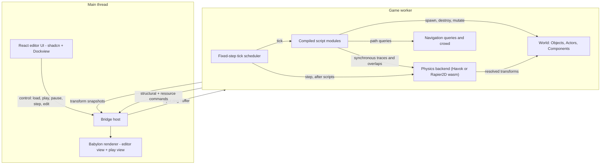
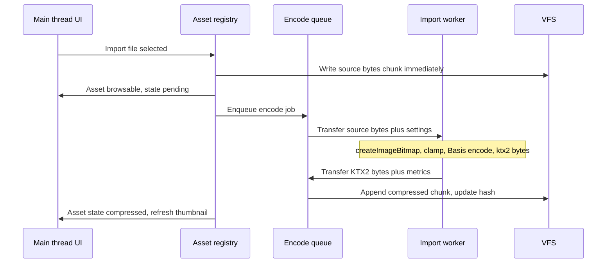
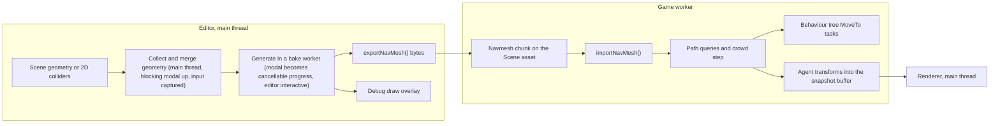

# BabylonSlate Engine Plan

> **Status:** Living document — authoritative architecture and delivery plan for BabylonSlate.
> **Audience:** Contributors and autonomous agents implementing the engine.
> **Baseline device:** 11-inch A16 iPad (6 GB RAM, WebGL2, WKWebView).
> **Related docs:** [CODING_STANDARDS.md](CODING_STANDARDS.md) (planned), [design/perf-budget.md](design/perf-budget.md) (planned), [architecture/](architecture/) (planned), [agents/issue-tracker.md](agents/issue-tracker.md) (planned).

## Overview

A full architecture and delivery plan to grow the current BabylonSlate scaffold into a touch-first Babylon.js game engine targeting an 11-inch A16 iPad, with a worker-based runtime that keeps physics beside game logic so raycasts answer on the calling execution pin, self-contained .babasset/.babproject formats, a compressed KTX2 texture pipeline and a render-on-demand, byte-accounted renderer sized around the iPad memory and thermal ceiling, Unreal-style visual scripting compiled to JavaScript with continuous in-editor validation and a post-Preview error report that navigates back to the offending node, a homepage and project browser, per-document undo, a touch and gamepad input system with anchored UI widgets, 3D and 2D both as flagship authoring modes with a shared viewport toggle, tilemaps and a dedicated 2D physics backend, Unreal-style behaviour trees authored in React Flow over a Recast navmesh shared by 2D and 3D, Git LFS file locking for collaboration while sync stays in Working Copy or a desktop git client, and web-only game export, sequenced into vertical slices that autonomous agents can build in parallel behind TDD and automated review gates.

---

## 1. Where the project stands today

The repo is a thin but healthy scaffold, about 3,400 lines across source, styles and tests, with seven test files. The editor shell and CI harness are worth keeping; nearly everything engine-side is a demo stub.

**Keep and build on:**
- The two-tier tab model: a **two-row editor chrome** in [apps/editor/src/components/editor-chrome-bar.tsx](apps/editor/src/components/editor-chrome-bar.tsx) — a title/tab bar (truncated project name plus global document tabs with a pinned Content Browser) and a **global toolbar** below it (Undo, Redo, Save, Save All, Close, Search, Settings) — plus a per-document Dockview workspace in [apps/editor/src/shell/dockview-shell.tsx](apps/editor/src/shell/dockview-shell.tsx). This is exactly the Unreal-style shell the engine needs.
- Per-document layout capture and restore in [apps/editor/src/services/document-service.ts](apps/editor/src/services/document-service.ts) and [apps/editor/src/services/project-service.ts](apps/editor/src/services/project-service.ts).
- The storage port/adapter split in [packages/shared/src/storage-port.ts](packages/shared/src/storage-port.ts). The interface is right; the web implementation is not.
- CI shape: `verify.yml` (typecheck, lint, Vitest, Playwright) plus `preview.yml` (GitHub Pages build for on-device iPad testing) and the `VITE_TEST_MODE` hatch in [packages/storage/src/test-mode.ts](packages/storage/src/test-mode.ts). A deployed URL is the only practical iPad loop without a Mac, so this stays central.
- The 44pt touch-target CSS in [apps/editor/src/shell/editor-chrome.css](apps/editor/src/shell/editor-chrome.css) and the rules in [.cursor/rules/touch-editor.md](.cursor/rules/touch-editor.md).

**Rework:**
- [packages/storage/src/web-adapter.ts](packages/storage/src/web-adapter.ts) keeps a flat string map in `localStorage`. It cannot hold textures or audio. It must become OPFS-backed with binary support.
- [packages/engine/src/scene-loader.ts](packages/engine/src/scene-loader.ts) only understands box meshes, and [create-engine.ts](packages/engine/src/create-engine.ts) rotates every mesh in the render loop as a demo.
- [packages/graph](packages/graph) has one node type (`logMessage`), read-only edges, and an `executeGraph` that ignores edges entirely.
- `SerializedScene` and `SerializedGraph` in [packages/shared/src/project.ts](packages/shared/src/project.ts) are placeholders that the real asset model replaces.
- [apps/editor/src/services/project-service.ts](apps/editor/src/services/project-service.ts) currently treats "a project" as whatever is in storage, with Open and Save as toolbar buttons. It grows into a real project lifecycle (create, open, save, close, folder binding, recents) owned by the Homepage in section 7.1, with the editor shell only ever running against an already-open project.

**Delete:** `apps/editor/src/App.css`, `apps/editor/src/index.css`, `apps/editor/src/assets/*` (unused Vite template leftovers), `apps/editor/src/context/project-context.tsx` (pass-through shim), and `panels/placeholder-panel.tsx` once real panels exist.

`node_modules` is not installed in this environment, so `pnpm install` is the first step of any work.

### 1.1 Non-goals

Stating these keeps agents from inventing scope:
- **No multiplayer or networking** of any kind.
- **Games export to web only.** The Capacitor and Electron shells exist to run the *editor*, not to ship games.
- **No native code plugins.** Plugins are content and classes (section 10).
- **No additive or streamed multi-scene loading.** One scene at a time, as the spec states.
- **No live property editing while the game is playing** in v1. Stop, edit, play.
- **No asset marketplace or remote asset fetching.**
- **The engine is not a git client.** It implements Git LFS locking only; clone, commit, pull and push happen in Working Copy on iPad or any desktop git client (section 12).
- **Undo does not cover asset file creation or deletion**, which are guarded by confirmation instead. Everything inside an open document, including adding and removing scene actors, is undoable (section 7.3).

### 1.2 Baseline device and performance budget

The target is an **11-inch A16 iPad**: 6GB RAM, WebGL2, WKWebView. Every budget below is set against that device rather than a desktop, and the desktop and web builds get the headroom for free. Section 2.4 covers the architecture that hits these numbers; this section is only the numbers themselves.

- **60fps at native refresh** while playing or interacting, with dynamic resolution scaling as the relief valve before frame drops. The stats HUD thresholds in section 9.4 are derived from this budget rather than picked arbitrarily. An **idle editor targets zero rendered frames**, not 60: section 2.4 makes the viewport dirty-driven, which is the largest thermal saving available on a fanless device.
- **A game tick under 8ms**, split roughly 5ms of script and 3ms of physics now that section 2.1 runs both in the same worker. The two halves are measured separately even though they share a thread. Exceeding the tick does not tear the render — the main thread keeps interpolating the last two snapshots — but it does mean logic is running behind, so the HUD flags it.
- **Draw calls in the low hundreds.** The renderer prefers instancing and merged static geometry, and the stats HUD surfaces the count so a content author sees the cost.
- **Texture memory under roughly 512MB for the editor with a project open**, tracked by the resource cache and surfaced as warnings in the asset registry. This is the budget that most directly justifies the compressed-texture pipeline in section 3.5: WKWebView kills the tab rather than swapping, so exceeding memory is a crash rather than a slowdown, and an uncompressed 2048-square RGBA texture is 16MB before mipmaps.
- **WebGL2 is the default path.** WebGPU is available on recent iPadOS but stays behind a flag pending a spike, because Babylon's WebGPU backend on Safari is the least-proven combination in this stack.
- **A CI perf smoke** runs the deterministic harness over a fixed scene and asserts tick cost stays inside budget, so regressions fail a build instead of being noticed as "feels slow" three phases later.

## 2. Target architecture

### 2.1 Threading model

The renderer and editor own the main thread. Game logic **and physics** run together in one game worker. The runtime is also runnable in-process so tests can drive it deterministically without workers.



Key decisions:
- **Two transport classes.** Hot-path transform state uses a double-buffered `Float32Array`: `SharedArrayBuffer` with an `Atomics` seq-lock when `crossOriginIsolated` is true, otherwise transferable ping-pong buffers. Structural changes (spawn, despawn, mesh and material assignment, audio, UI) travel over a reliable ordered message channel, never through the snapshot buffer.
- **Cross-origin isolation is not guaranteed.** GitHub Pages cannot set the COOP and COEP headers, so ship `coi-serviceworker` in `public/` (separate file, own origin, reloads once on first visit). Both transports must be tested; SAB is an optimisation, never a requirement.
- **Physics lives inside the game worker, not a worker of its own.** The deciding factor is not throughput, it is that **a raycast has to return an answer on the same execution pin that asked for it**. `LineTrace`, sphere overlap and shape sweep are among the most-used nodes in any gameplay graph — ground checks, aim, interaction probes, AI perception — and across a worker boundary every one of them becomes a latent node that resumes a tick later. That would reshape how every user writes gameplay logic, in exchange for parallelism that is largely illusory because the tick usually needs the physics result before it can continue anyway. Co-locating also deletes the entire game-to-physics message channel, which is where reports of worker-physics backlog and input-event stalls come from. Havok in a worker still needs `HavokPhysics({ locateFile: () => wasmUrl })`, since the default fetch resolves to the HTML page and fails with a wasm magic-word error.
- **The physics backend interface stays transport-agnostic** so a future split into a separate worker remains possible for a project that genuinely needs it. What is deliberately not done is paying the async-everywhere cost up front for a case that may never arrive.
- **The tick budget is now shared, and that is the trade being accepted.** Logic and physics no longer overlap, so on the baseline A16 iPad the combined game tick has to fit the budget in section 1.2 by itself. The stats HUD therefore still reports physics step time separately from script time even though both run in one worker, because "the tick is slow" is useless without knowing which half.
- **Fixed-step logic, interpolated render.** Game ticks at fixed dt (default 60Hz, configurable) with catch-up capped at 4 steps to avoid the spiral of death. The renderer interpolates between the two most recent snapshots.
- **Play-in-editor** is a fullscreen React overlay with an X in the top-right, hosting its own game worker and its own Babylon `Scene`. The editor render loop pauses while playing, which matters for iPad battery and thermals.
- **One `Engine`, many `Scene`s — never an `Engine` per Play session.** Each Babylon `Engine` owns a WebGL context, browsers cap the number of live contexts at somewhere around eight to sixteen, and a user will press Play hundreds of times in a session. Any leak, or even slow reclamation, turns into "the editor stopped rendering" after twenty plays, which is a miserable bug to diagnose. So the editor creates one `Engine` for the app lifetime and Play adds a second `Scene` on it, with `engine.registerView` binding the overlay's canvas when the overlay opens and `unRegisterView` releasing it on close. Stopping Play disposes exactly one `Scene`, which is a bounded and testable operation.
- **Disposal is explicit and refcounted, because Babylon does not garbage-collect GPU resources.** Meshes, materials and textures leak until something calls `dispose()`, and a snapshot-driven renderer creates and destroys them constantly as actors spawn and die. The resource cache therefore refcounts by asset guid and disposes on the last release, actor despawn disposes the nodes it created, and a debug assertion compares live Babylon object counts before and after a Play session so a leak fails a test instead of surfacing as a crash on device three phases later.

### 2.2 Monorepo layout

```
apps/
  editor/        Vite + React + Capacitor host: editor UI + renderer (main thread)
  player/        Standalone runtime host: play-in-editor iframe + exported game shell
  desktop/       Electron wrapper for Windows/macOS (Capacitor has no desktop target)
engine-plugins/  First-party plugins bundled with the engine (see section 10)
packages/
  core/            GUIDs, Result, math types, zod schemas, typed event bus   [was shared]
  vfs/             file system port + adapters: opfs, capacitor-scoped, node, memory  [was storage]
                   plus the app settings store (engine settings, recents) outside any project
  assets/          .babasset + .babproject codecs, asset registry, import pipeline, encode queue and import worker host
  edit/            document transaction layer: reversible commands, per-document undo stacks
  source-control/  Git LFS locking client behind a LockProvider port (no git, see section 12)
  object-model/    Object / Actor / ActorComponent / GameInstance, class registry, tick
  scripting/       graph IR, pin type system, validator with plugin hook, JS code generator with source anchors
  scripting-nodes/ data-driven node catalog (one module per category, each with codegen + tests)
  input/           action and axis mappings, device normalisation, deterministic input stream
  runtime/         worker entry, module loader, world driver, snapshot writer, input
  physics/         body and shape protocol hosted inside the game worker, with a Havok 3D backend
                   and a Rapier 2D backend behind the same interface (see section 13.4)
  bridge/          transport (SAB + transferable), channel protocols, typed RPC
  render/          Babylon view: snapshot apply, resource cache, gizmos, picking  [was engine]
  ui/              shadcn primitives + touch tokens
  editor-kit/      reusable editor components (property grid, tree view, asset picker, sheets)
  graph-ui/        React Flow shell reused by script, shader, animation and behaviour tree graphs  [was graph]
  ui-runtime/      UserInterface widget model, anchoring and layout, widget library
                   (incl. touch joystick), Babylon GUI runtime, designer surface
  anim-graph/      animation state machine model + evaluator
  behaviour-tree/  tree model, blackboard, deterministic evaluator with an explicit stack
  navigation/      navmesh bake and query behind a port, recast backend, axis remap for 2D
  shader-graph/    shader node graph to NodeMaterial and post-process
  debugger/        command registry, console, stats HUD, log buffer, trace recorder
  exporter/        itch.io-style zip export
  test-kit/        harnesses, fixtures, fake adapters, golden-file helpers
```

Boundary rules, enforced by an ESLint import-restriction config extending [.cursor/rules/agent-workflow.md](.cursor/rules/agent-workflow.md):
- `core`, `assets`, `edit`, `object-model`, `scripting`, `scripting-nodes`, `input`, `behaviour-tree` must not import React or Babylon. `navigation` may load the recast wasm but must not import Babylon, so it runs in the game worker. They are pure, fast to test, and hold the bulk of the engine's logic.
- `render` must not import React. `runtime` must not import Babylon or the DOM. `@babylonslate/physics` hosts Babylon Physics V2 on a worker-local `NullEngine` Scene so the runtime stays Babylon-free.
- The texture pipeline splits across that line deliberately: `assets` owns **encoding** (Basis encoder wasm, no Babylon) while `render` owns **decoding** (`KhronosTextureContainer2` and the transcoder), so the compression work in 3.5 does not drag Babylon into the asset layer.
- Only `vfs` adapters may touch Capacitor plugins.

### 2.3 Babylon integration constraints

A worker-based runtime and a touch-first editor both pull against assumptions Babylon makes. These are the places where Babylon's design and this plan's design meet, collected here because each one is cheap to honour up front and expensive to discover late.

- **Babylon is left-handed** (X right, Y up, Z forward into the screen), unlike Unity, Three.js and most 2D tutorials. `scene.useRightHandedSystem` stays `false`, and section 13.1 derives the 2D camera convention from that rather than from habit.
- **3D physics uses Babylon Physics V2 on a worker-local `NullEngine` Scene, not the editor Scene.** `HavokPlugin`, `PhysicsAggregate`, and `scene.enablePhysics` run inside `@babylonslate/physics` beside scripts so raycasts still return on the calling execution pin. That Scene is never rendered — the worker steps with `scene.getPhysicsEngine()!._step(dt)` instead of `scene.render()`. `@babylonslate/runtime` still must not import Babylon; it talks to physics only through `PhysicsBackend`. Bodies never cross a thread boundary: they are created and stepped in the same worker that runs the scripts mutating them, and only their resulting transforms reach the main thread, in the shared snapshot buffer along with everything else. 2D worlds keep a dedicated Rapier2D backend (Babylon has no Rapier plugin).
- **Animation is a main-thread Babylon subsystem, but gameplay owns time.** Letting `AnimationGroup`s advance themselves on `scene.render()` would put animation on a different clock from the fixed-step simulation and break replay. So the AnimationGraph evaluator runs in the game worker and sends state, normalised time and blend weights through the snapshot; the main thread applies them with explicit frame seeks and weights and never lets Babylon auto-advance a gameplay-relevant animation.
- **Game UI is Babylon GUI; editor and debug overlays are DOM.** `AdvancedDynamicTexture` re-renders into a texture when anything inside it changes, so a per-frame stats HUD or a keyed Print overlay built in Babylon GUI would re-upload a texture every frame to draw text the DOM renders for free and more sharply. Game-facing UserInterface widgets still use Babylon GUI, because they must composite in-scene and support world-space 2D prefabs via `CreateForMesh`.
- **Our anchoring model does not map one-to-one onto Babylon GUI.** Babylon controls offer alignment plus percentage sizing plus padding; the Unity-style anchor-min/anchor-max model in 11.2 additionally expresses "stretch between two anchors", which has to compile down to a container with computed padding. That compilation is a real layer with real edge cases, not a property rename, and it is why 11.2 specifies layout resolution as a pure golden-tested function.
- **The shader graph emits Node Material, rather than generating shader source.** Node Material already compiles to both WebGL and WebGPU, serialises to a documented JSON format, and supports a post-process mode, so targeting it gets portability for free. The constraint accepted in exchange is that our node catalog is largely a curated view over Node Material blocks, with `CustomBlock` as the escape hatch. Shader compilation stalls are the thing to watch on iPad: materials are pre-warmed at load rather than compiled on first draw.
- **glTF import keeps the bytes.** Reimplementing glTF parsing to flatten a model into our own format would be a large, high-risk surface for no clear gain, so a `.glb` import stores the original bytes as a chunk and extracts only metadata for the editor (node names, material and animation clip names, bounds, triangle counts). The runtime loads it through Babylon's loader. This does mean the model importer is not a pure function like the others, which is an acknowledged exception rather than an oversight.
- **Compressed textures are a first-class part of the asset pipeline, not an export flag.** Babylon's `KhronosTextureContainer2` transcodes KTX2 to whatever the device supports, which is ASTC on Apple GPUs, and the transcoder is self-hosted via `KhronosTextureContainer2.URLConfig` so the editor works offline. Section 3.5 has the full decision and policy; the constraint to note here is that the transcoder wasm has to be present in the editor, the player and every export.
- **WebGL context loss is a normal event on iPad**, not an edge case: WKWebView drops the context under memory pressure and sometimes on backgrounding. `onContextLostObservable` and `onContextRestoredObservable` are wired from the first renderer commit, with the resource cache able to rebuild GPU state from asset data, because an editor that shows a black screen after a phone call and needs a restart is not shippable.
- **iOS blocks audio until a user gesture.** Both the Play overlay and the exported player must unlock audio on the first touch rather than at load, or sound silently never starts.
- **`NullEngine` is the test seam.** It needs no canvas and runs in Node and in workers, which is what makes the Babylon-touching parts of `render` unit-testable at all.

### 2.4 iPad memory and thermal architecture

Section 1.2 states the budget. This section is how the architecture actually hits it, because on a fanless tablet the two scarce resources behave differently and need different answers. **Memory is a cliff**: WKWebView does not swap, it kills the tab, so exceeding the ceiling is a crash rather than a slowdown. **Sustained power is a slope**: exceeding it throttles the SoC, and everything is slower for the rest of the session, including the parts that were previously comfortable. Several decisions below buy one; a few buy both.

**Render on demand, because an idle editor should cost nothing.** This is the single largest thermal win available and it is architectural rather than an optimisation to add later. An editor that renders 60 frames a second of a scene nobody is changing spends the entire GPU budget redrawing a still image; on an iPad that is heat and battery for nothing, and it means the device is already warm and throttling by the time the user presses Play. So the editor viewport is dirty-driven: the render loop stays installed but the callback returns early unless something invalidated the frame. Invalidation comes from snapshot arrival, camera movement, gizmo drag, selection change, material or asset reload, an animation preview, and Play. Continuous rendering is entered explicitly for the duration of an interaction and then released, refcounted because two things can want it at once. The failure mode is a *missed* invalidation, which presents as "the viewport did not update", so there is a dev-only Always Render toggle for bisecting it and the stats HUD shows rendered frames per second next to invalidations per second — which catches both a missed invalidation and a runaway one that has quietly restored continuous rendering. 2D benefits even more than 3D here, since a tilemap being painted is a still image between strokes.

**Resolution is the cheapest lever, and retina is a trap.** An iPad reports `devicePixelRatio` 2, so rendering at native device resolution costs four times the fragments of CSS resolution — on a viewport where frame rate is far more noticeable than pixel density. The `Engine` is therefore constructed with `adaptToDeviceRatio: false` and resolution is owned explicitly through `engine.setHardwareScalingLevel()`, where level N renders at 1/N and is the same knob for all of: the editor viewport default (CSS pixels, level 1), the Play default (from the render quality tier), the user's own quality preference, and the dynamic relief valve. That valve is a rolling median of frame time stepping the scaling level between bounds with hysteresis and a cooldown so it cannot visibly oscillate. Babylon's `SceneOptimizer` with `HardwareScalingOptimization` can drive it, wrapped so the current tier stays observable and scriptable rather than magic, and so the `renderquality` console command from section 9 maps onto the same mechanism. MSAA stays off on the iPad baseline; at reduced hardware scaling it is not worth the bandwidth.

**One GPU texture per asset, even with two `Scene`s open.** This is the specific detail that decides whether pressing Play doubles texture memory, which on a project near the ceiling is exactly the crash we are trying to avoid. Babylon caches `InternalTexture` at the **`Engine`** level rather than per `Scene`: a `Texture` calls `_getFromCache(url, noMipmap, samplingMode, invertY, useSRGBBuffer, isCube)` and on a hit calls `incrementReferences()` instead of uploading a second copy. Because 2.1 keeps one `Engine` for the app lifetime, the editor `Scene` and the Play `Scene` can share every texture's VRAM for free — *provided we do not defeat the cache*. The key includes the sampling flags, not just the URL, so the same asset requested once with mipmaps and once without becomes two independent GPU uploads. The resource cache therefore owns a **stable blob URL per asset guid for the app lifetime** plus one canonical set of sampling options per asset, and both scenes resolve textures through it; constructing a `Texture` outside the cache is an import-lint prohibition rather than a convention. It is asserted rather than assumed: a test compares `engine.getLoadedTexturesCache().length` across a Play open-and-close cycle and fails if it grew, which extends the live-object-count assertion 2.1 already requires to the resource that actually costs megabytes.

**The resource cache is an LRU with a byte ceiling, not only a refcount.** Refcounting releases what nothing references, which is necessary but does not help the real case: a user who has touched two hundred textures in a long session, every one of them still referenced by a scene they have not closed. So the cache tracks accounted bytes per resource and evicts least-recently-used *unreferenced* entries once over the section 1.2 ceiling, logging each eviction so cache thrash is visible rather than mysterious. `engine.clearInternalTexturesCache()` exists but is a blunt instrument; eviction is per-resource and driven by our own accounting.

**The asset registry indexes headers, never payloads, and this is the most consequential memory decision in the editor.** The container format in 3.1 exists precisely so this is possible: a `.babasset` is a JSON header plus a chunk table plus binary chunks, and the registry needs only the header and the table to answer everything the Content Browser, the dependency graph, Show References and the asset pickers ask. Payload chunks load on demand, through the resource cache, and are evictable. The alternative — a registry that opens each asset fully to index it — would make simply *scanning* a five-hundred-asset project on launch allocate every texture, mesh and audio buffer it contains, which on the baseline iPad is a crash before the editor has drawn a single frame. Because this constraint is invisible until a project gets large, it is stated as an invariant with a test: opening a synthetic project of several hundred assets must leave accounted payload bytes near zero until something is actually opened.

**Content Browser thumbnails are small images with their own budget, never the source textures.** Thumbnails generate at import in the same worker as the encode, are stored in derived data as small compressed images, and are decoded lazily for visible grid cells only, since the grid is virtualised anyway. A browser folder of three hundred textures decodes what fits on screen plus a margin, not three hundred full-resolution images. Their decoded cache is LRU-capped separately from the scene resource cache, because the two have very different lifetimes and one should not be able to evict the other.

**Undo history is capped in bytes as well as in entries.** Section 7.3 caps the history at a configurable entry count defaulting to 50 and prefers delta commands over snapshots, which is the right design, but fifty subtree-snapshot fallbacks in a large scene is still a real number on a 6GB device. The stack therefore carries a byte budget too and drops its oldest entries when either limit is reached, and the snapshot fallback records the bytes it captured so an expensive command type shows up in profiling rather than hiding inside a count.

**On iPad we cannot measure memory, only account for it, and that shapes the design.** Safari does not implement `performance.memory`, the web platform has no memory-pressure event, and the first signal iOS actually gives us is usually a lost WebGL context or a dead tab. So the ceiling is computed by us: width times height times bytes-per-texel *for the format actually uploaded* (RGBA8 is four, ASTC 4x4 is one), plus a third for mipmaps, plus vertex and index buffer sizes. That accounting is unit-tested per format, because it is the only number we will ever have and a wrong constant silently invalidates every budget decision downstream. It also means the HUD labels this readout as accounted bytes rather than implying it is the process footprint.

**Context loss is a memory-pressure signal, not merely an error to recover from.** Section 2.3 already requires wiring `onContextLostObservable` and rebuilding GPU state. The addition here is that rebuilding *identically* is a mistake: restoring precisely the state that just got the context killed invites an immediate second loss and a recovery loop. On restore, drop one quality tier, flush the LRU down to its unreferenced floor, and tell the user once. Coming back degraded is a better outcome than coming back and dying again.

**Touch has no hover, which is free performance we should actually take.** `scene.skipPointerMovePicking = true` in every scene, editor included. Hover picking runs a raycast per pointer move to maintain a state that does not exist on a touch device, and selection here happens on an explicit tap-driven pick. It is one of the larger CPU wins Babylon offers and, for this product, it costs nothing.

**Editor and Play scenes get deliberately different scene-level settings.** Play scenes run at `ScenePerformancePriority.Intermediate`, which freezes materials, sets `doNotSyncBoundingInfo` and skips pointer-move picking. The editor scene stays at `BackwardCompatible`, because gizmos, selection bounds and framing all need live bounding info, and `Aggressive` additionally disables frustum clipping — which on a large scene makes things slower, not faster. The editor instead takes targeted versions of the same wins: `freezeActiveMeshes()` while the scene is idle with an unfreeze on any structural change, `freezeWorldMatrix()` on static actors, and `material.freeze()` on materials not currently open for editing. Both scenes are constructed with `useGeometryUniqueIdsMap`, `useMaterialMeshMap` and `useClonedMeshMap`, trading a little memory for much better large-scene lookups, and bulk snapshot application and bulk despawn are wrapped in `scene.blockMaterialDirtyMechanism` and `scene.blockfreeActiveMeshesAndRenderingGroups`.

**Shaders compile at load, not at first draw.** A shader compilation stall on a mobile GPU is a visible hitch at the worst possible moment, which is the first time something becomes visible. Materials are pre-warmed with `forceCompilationAsync` during scene load, behind the loading indicator that is already on screen. The same concern applies while authoring: the shader graph recompiles a Node Material on edit, so its live preview is throttled rather than recompiling per keystroke.

**Defaults are set for the baseline device rather than for a demo.** Shadow maps default to 1024 with one shadow-casting light, with 2048 and beyond available but warned about. Post-processing is off by default, because a full-screen pass at retina is the classic mobile killer, and the shader graph flags the cost when a post-process material is added to a project on the iPad baseline. The `shadowquality` and `renderquality` commands from section 9 step these tiers at runtime, which is also how the dynamic relief valve expresses itself.

**Allocation discipline in the per-frame path.** GC pauses read as jank and are avoidable. Snapshot application reuses scratch `Vector3`, `Quaternion` and `Matrix` instances and writes into existing objects rather than allocating per actor per frame. This lands in `CODING_STANDARDS.md` with review enforcement, because it is easy to write innocently and unpleasant to track down afterwards.

**Nothing invisible does work.** `visibilitychange` and Capacitor's app-state events stop the render loop, pause the game worker tick and pause the encode queue. An iPad that is backgrounded while three wasm modules keep running is an iPad that comes back to a killed tab. Closed document tabs release their Babylon resources instead of staying warm, and only one `Scene` renders at a time, since the editor loop is already paused during Play.

**One item is deliberately left as a measurement rather than a decision.** Apple GPUs are tile-based deferred renderers with hidden-surface removal, and a `discard` in an alpha-tested shader defeats that optimisation for the draw that uses it. Section 13 chose alpha testing as the sprite default to sidestep transparency sorting, which is right for correctness and simplicity. Whether it is also right for fill rate on a dense 2D scene is a device measurement rather than something to reason out from first principles, so P10 profiles a large tilemap both ways on an A16 before that default is locked in.

## 3. Asset system

### 3.1 The .babasset container

One self-contained binary file per asset:

```
magic "BABA" (4) | version u32 | headerLen u32 | header JSON (utf8) | chunk bytes...
```

The header holds the asset guid, type, name, engine version, optional parent class, a dependency guid list, a structured `payload`, and a chunk table where each entry has id, kind, mime, offset, length and sha256. `payload` carries structured data (graphs, properties, component trees); chunks carry binaries (texture pixels, audio, mesh buffers). Header keys serialise in sorted order so files are byte-stable, which is what makes content hashing, dedup, and golden-file tests work.

**The header and chunk table are readable without touching a single chunk**, and that is a load-bearing property rather than an incidental one. It is what lets the asset registry index an entire project — names, types, dependencies, thumbnail keys, chunk sizes — while allocating none of the binary payload, which section 2.4 identifies as the difference between an editor that opens a large project on an iPad and one that dies during startup. The codec therefore exposes header-only reads as a first-class operation, not as a side effect of reading everything and ignoring most of it.

Two container modes satisfy "baked in" without duplicating every texture inside a project:
- **thin** for assets inside a project, with dependencies referenced by guid.
- **bundled** for sharing or single-asset export, with dependency assets embedded as nested asset chunks. Importing a bundled asset unpacks its dependencies into the project and dedupes by content hash.

**Chunk locators, so large binaries are not rewritten on every save.** A chunk table entry either points at a byte range inside the file (the self-contained case, always used by bundled mode) or names a content-addressed file in the project's blob store at `assets/.blobs/<sha256>`. Inside a project, chunks above a size threshold externalise by default. Without this, editing a graph rewrites the whole file and every megabyte of texture beside it, which wastes file-provider write bandwidth on iPad and makes git history grow by the size of the project on every save. Because blobs are immutable and content-addressed, they are written exactly once, dedupe for free, and are the natural thing for a user to `git lfs track`. Externalising is a locator variation, not a format change, so `.babasset` stays a single self-contained file whenever it leaves the project.

### 3.2 The .babproject container

One logical layout, two physical backends behind a single codec:
- **Directory backend** (iPad with a linked folder, desktop): a `MyGame.babproject/` directory written incrementally as you work.
- **Zip backend** (web, and the Export Project button everywhere): a single-file `MyGame.babproject` zip containing the same tree.

```
MyGame.babproject/
  project.json     startup scene, GameInstance class, registered editor objects, input, export settings,
                   and per-plugin enable overrides keyed by plugin guid
  layout.json      editor dock layout + open tabs (reuses today's ProjectLayouts)
  assets/          folder tree of .babasset files - this tree IS the Content Browser tree
    .blobs/        content-addressed immutable chunk store, sha256-named (see 3.1)
  plugins/         one folder per project plugin, each its own content root (see section 10)
```

Web has no linked folder, so it persists into OPFS behind the same directory API and offers Export Project as a download. Export Project sits in Project Settings on every platform.

**Derived data lives outside the project folder**, in app-private storage keyed by project guid: compiled scripts, thumbnails, the import cache and the recovery journal. Putting them inside the project would push every compile through the iOS file provider that section 12 relies on, and would make correct source control depend on a `.gitignore` being right. Export Project ignores them by construction rather than by rule.

The codec is parameterised by a **manifest kind** from the start rather than hardcoding "project", because `.babplugin` in section 10 is the same container with a different manifest and no other differences. Getting that parameter in during P1 costs nothing; adding it in P13 would mean reworking the codec and its goldens.

### 3.3 Import pipeline

Import opens the platform document picker (Capacitor on iPad, a file input on web, an Electron dialog on desktop) and runs a registry of importers keyed by extension: images to Texture; glb, gltf, obj and stl to Model plus Material, Texture and Animation; audio to Audio; woff2, woff, ttf and otf to Font, with facetype JSON and msdf atlas pairs attaching as extra representations of an existing Font asset rather than creating new ones; .babasset to a bundled-asset unpack. Each importer is a pure function from bytes and options to a list of assets, so every one is independently unit-testable.

Guids are unique **within a project and its plugins**, not globally. Instantiating a project from a template therefore keeps its guids as-is (cheap, and a template is never mixed with another project). Importing assets that came from a different project remaps any colliding guid and rewrites the references in the incoming set, which is the only place collisions can arise.

### 3.4 Schema versioning and migration

Asset payload shapes will change across the whole build, and the alternative to planning for it is telling users their projects broke. Every asset header already carries `version`, so:
- Each asset type owns an ordered list of migration functions from version N to N+1, applied on load. The loader never reads an old shape directly.
- Loading is strict about unknown *future* versions: refuse with a clear "made with a newer engine version" message rather than silently dropping fields.
- Migrations are tested with golden fixtures: one committed `.babasset` per historical version per type, asserted to load into the current shape. This is cheap while there is one version and impossible to retrofit once there are ten.
- Opening a project whose assets need migration prompts once, migrates on save, and never rewrites files the user did not touch without saying so.

### 3.5 Compressed textures: decision and pipeline

**Decision: yes, and it is a P2 pipeline feature rather than an export option.** Texture memory is the single most likely cause of a crash on the baseline iPad, and the gap is not marginal. A PNG is compressed on disk and completely uncompressed in VRAM: a 2048-square RGBA texture occupies 16MB, 21MB with mipmaps, no matter how small the file was. The same texture as ASTC 4x4 occupies 4MB. Ten such textures is the difference between 210MB and 53MB, and WKWebView responds to memory pressure by killing the tab rather than by getting slower, so this converts directly into whether a mid-sized project can be opened on an iPad at all. Decoding is also cheaper: a compressed texture uploads to the GPU without a full-size RGBA intermediate, which is the allocation spike that actually kills tabs during scene load.

The reason this has to sit in the import pipeline and not in the exporter is that **the editor is the memory-constrained environment we most care about**. An export-time-only optimisation would leave the editor — the thing that has to run all day on the iPad, holding the open scene plus browser thumbnails plus whatever the user just imported — running entirely uncompressed. It would also mean the format is never exercised until the last phase, which is exactly the kind of thing that turns out to be broken.

**Format: KTX2 with Basis Universal supercompression, transcoded at load.** Babylon reads KTX2 through `KhronosTextureContainer2` and picks a GPU format from the device's capabilities, so one asset serves every target: ASTC on Apple GPUs, BC7 on desktop, and a plain RGBA transcode as the universal fallback on anything else. Self-host the transcoder and point `KhronosTextureContainer2.URLConfig` at it rather than letting Babylon reach for a CDN, since the editor must work offline and an itch.io build must be self-contained. The transcoder is a small fixed set of files (the js decoder, the UASTC-to-ASTC and UASTC-to-BC7 wasm modules, and the Zstd decoder) that stay separate in packed exports the same way the physics wasm does.

**UASTC is the default over ETC1S**, which is worth being explicit about because ETC1S produces dramatically smaller files. Both transcode to the same ASTC block size and therefore occupy identical VRAM — the difference is purely quality versus download size, and since memory is the constraint we are solving and quality loss is the thing users will complain about, UASTC with Zstd supercompression is the better default. ETC1S remains a per-texture option labelled for download size, which matters for a web-distributed game more than it does for the editor.

**Not everything gets compressed, and the exceptions are not edge cases.** Block compression works on 4x4 blocks and is lossy in exactly the way that destroys hard-edged two-colour transitions, so applying it to pixel art would visibly wreck a flagship 2D feature. The default policy by usage:

- 3D material textures — albedo, emissive, ORM — compress to UASTC.
- Normal maps compress to UASTC and never to ETC1S, which handles them badly.
- Sprites and tilesets flagged as pixel art stay uncompressed. They are usually small enough that it does not matter, and correctness beats the saving.
- UI textures and fonts stay uncompressed by default, for the same crisp-edge reason.
- Anything with a nonzero-alpha cutout mask is checked, since alpha in block formats is where artifacts concentrate.

Every one of these is a per-texture override in the asset's details panel, with the policy default shown so a user can see what was chosen for them and why.

**Encoding runs asynchronously in a dedicated Web Worker.** This is both feasible on iPadOS and the right design, and since it is the mechanism the whole pipeline's usability rests on, the rest of this subsection specifies it precisely: what kind of worker, what the platform actually guarantees, and how the memory and thermal edges are handled.

What "background worker" means here is a **persistent dedicated `Worker`**, not a Service Worker and not `requestIdleCallback` on the main thread. Service Workers are for network interception and are the wrong lifecycle for a minutes-long encode queue. Idle callbacks only run when the main thread is quiet, which is exactly when the user is editing — so encoding would stall whenever the viewport is active. A dedicated worker runs on its own thread, keeps the UI responsive, and matches how we already host the game worker and the navmesh bake worker.

**The platform supports this, with one version constraint worth stating precisely.** WKWebView in a Capacitor app is WebKit, and it gives us dedicated Workers, wasm in Workers, and `createImageBitmap` in Workers well below our baseline. The one API with a real floor is `OffscreenCanvas`, which Safari shipped in **16.4 and, importantly, 2D context only** — WebGL inside `OffscreenCanvas` came later and we must not depend on it. We only need the 2D context, to draw a clamped `ImageBitmap` and read back pixels for the encoder, so 16.4 is the floor and the iOS deployment target is pinned at or above it. Since the baseline device is an A16 iPad that ships with a much later iPadOS, this constrains nothing in practice, but it is the kind of assumption that should be written down rather than discovered. The Basis encoder is single-threaded wasm and needs neither `SharedArrayBuffer` nor COOP/COEP — those matter for the game-worker snapshot transport, not for texture encoding.

The iPad-specific constraints are about **memory peaks and thermal budget**, not about whether Workers exist:

- **Peak memory during encode.** The worker briefly holds source bytes, a decoded RGBA buffer and encoder scratch at once, and WKWebView answers that by killing the tab rather than swapping. Source bytes go in as **transferable `ArrayBuffer`s** so the main thread drops its copy immediately, the **clamp is applied inside the worker before decode** so a 4096 source never allocates a 4096 RGBA on device unless the user explicitly overrode the limit, and exactly **one encode runs at a time** rather than several workers competing for the same 6GB.
- **Wasm heap growth over a long session.** Emscripten heaps grow and do not shrink, and older Safari had outright memory-growth bugs, so a long-lived encoder worker can retain its high-water mark for the rest of the session. The import worker is therefore **recycled** after a configurable number of completed jobs (five is the starting value, tuned by the benchmark below) and whenever the queue drains. The queue lives in the main-thread scheduler, so recycling costs a worker spawn and nothing else.
- **Sustained CPU is a thermal problem before it is a speed problem.** Encodes are serialized with visible queue depth, the queue **pauses while Preview is running** so the encoder and the game worker are not both saturating wasm, and it **pauses on app background** and resumes on foreground with the queue intact.
- **Decode path fragility.** The worker path is `createImageBitmap` with resize options for the clamp. On failure it falls back to a main-thread `Image` plus `decode()`, then **transfers** the resulting `ImageBitmap` into the worker — one frame of main-thread work, with the encode itself still off the main thread.
- **Worker startup cost.** One long-lived import worker per session, recycled as above, never one worker per file.

The end-to-end flow:



The asset is **usable from source bytes the moment import finishes**, before encoding completes. Thumbnails and the viewport load the uncompressed representation until the KTX2 chunk lands, then hot-swap without user action. A user importing forty textures gets a usable project immediately and a compressed one as the queue drains — not a forty-item modal and not a frozen editor.

**Risk 1 — encode time is unknown until measured.** This is real scope, not a footnote. P2 opens with an **A16 encode benchmark** before the pipeline is considered done:

- Fixture textures at 512, 1024, 2048 and 4096 square, PNG and JPEG, UASTC default quality.
- Record per size: wall time, worker heap high-water mark, and whether the main thread stayed under one millisecond median during the encode (it should).
- Derive **hard policy from the numbers**, not guesses: if 2048 exceeds ten seconds on A16, lower the default encode quality preset; if 4096 exceeds thirty seconds or spikes worker memory past a safe ceiling (to be set from the benchmark, likely around 256MB worker heap), **reject import at native resolution** unless the user explicitly confirms, and always clamp first.
- The benchmark is a committed fixture in `test-kit` runnable on any machine but **asserted against checked-in A16 numbers** so regressions in encoder settings fail CI.
- If encoding is still too slow after clamping, the escape hatch is **desktop-first encode on project open** (re-encode missing KTX2 chunks in the background on faster hardware) — not abandoning compression, just accepting that the iPad may finish what a Mac started. This is opt-in behaviour triggered when the queue backlog exceeds a threshold on device.

**Risk 2 — the transcoder fallback path must be proven, not assumed.** Falling back to source bytes is correct, but silent fallback is how "it works on my Mac" exports break on one Safari version. The mitigation is explicit **runtime compression state** on every texture asset:

- `pending` — imported and usable, not yet queued. Should be brief.
- `encoding` — a queue job is in flight.
- `compressed` — KTX2 chunk present and loaded successfully. The steady state.
- `fallback_uncompressed` — the transcoder was unavailable or the transcode failed, so the asset renders from its source bytes. Correct output, no memory saving.
- `encode_failed` — the worker encode failed. Source bytes still render; the error is surfaced on the asset and in the Output Log, not in Compiler Results, which belongs to script graph diagnostics.

The Content Browser badges `fallback_uncompressed` and `encode_failed` assets. Project Settings reports how many assets are uncompressed and offers **Retry encoding** for the whole queue. When the transcoder loads successfully in a later session, assets sitting in `fallback_uncompressed` with no KTX2 chunk are **re-queued once** automatically.

Tests, not hope:

- Unit: loader selects KTX2 chunk when present, source chunk when transcoder mock throws, source chunk when `getSupportedFormats()` returns empty.
- Integration: project with mixed compressed and uncompressed textures renders identically enough for a golden screenshot threshold test.
- Export smoke: boot exported player with transcoder files **present** and with transcoder files **deliberately omitted** — the game must still boot and render, using RGBA fallback in the second case.
- Playwright on iPad: import a texture, assert `pending` then `compressed` states transition within a timeout derived from the A16 benchmark plus margin.

**Both representations are stored, and the compressed one is committed.** The original source bytes stay as a chunk — they are the source of truth, they allow re-encoding at different settings, and they are the fallback when a device cannot transcode. The KTX2 variant is a second chunk, keyed by a hash of the encode settings so changing a setting invalidates it and nothing else. Storing the compressed variant in the asset rather than in app-private derived data is deliberate: derived data does not travel through git, and re-encoding an entire project's textures on every machine and every fresh clone would be a miserable first-open experience, particularly on the iPad that can least afford it. The exporter ships only the KTX2 variant when present, falling back to source bytes only when no KTX2 chunk exists, so the doubled authoring size never reaches the player.

**A resolution clamp is the other half of the win and is much cheaper.** Project Settings carries a maximum texture dimension, defaulting to 2048 for the iPad baseline, applied inside the import worker before decode with the original preserved and a registry warning naming any asset that exceeded it. Halving a dimension quarters the memory, so a clamp frequently beats compression outright on a project full of 4096-square source art. Mipmaps stay on for 3D — the extra third of memory buys sampling coherence that matters more — and stay off for pixel art, as section 13 already requires.

## 4. Asset type catalog

The spec's list, plus one addition flagged below:
- **Scene** for levels. Singleton: opening a scene replaces the current Scene tab.
- **Object** with variables, functions, interfaces and an event graph. Lives in memory.
- **Actor** with everything Object has, plus a Prefab tab and components. Lives in the scene world.
- **ActorComponent** *(addition)* for user-authored components. "Actors can have components" plus "user created classes should be selectable" implies authorable component classes; without this only engine components could exist.
- **Shader** as a visual graph with a type selector (material, post-process, decal).
- **Enum** and **Structure**, usable as pin types in visual scripting.
- **AnimationGraph**, a state machine driving 3D animation.
- **Sprite**, a single sprite or 2D animation built from Texture assets, holding atlas frames, a pivot, per-frame durations and named clips. See 13.2.
- **Tileset** and **Tilemap** for 2D grid content: the tileset defines tiles and their per-tile collision and metadata, the tilemap holds chunked layer data. See 13.3.
- **BehaviourTree** and **Blackboard** for AI: the tree holds composites, tasks, decorators and services, the blackboard declares typed keys using the pin type system. See 14.1.
- **UserInterface** with 2D design and logic tabs (UMG-like). Composable: it may contain other UserInterface assets but not itself, with a cycle check at edit time. Added to the global viewport layer or placed as a 2D prefab in the world.
- **ScriptInterface**, function and event signatures with no implementation.
- **EditorUtilityInterface** and **EditorUtilityObject**, editor-only and stripped from exports. The interface can dock as a Scene viewport tab with its position persisted in `layout.json`. The object gets `OnEditorStartup`, `OnSceneOpen`, `OnSceneSaved` and `OnEditorShutdown`, and only runs when registered in Project Settings.
- **PluginSettings**, exactly one per plugin folder, defining the plugin's identity, maturity flags, startup behaviour and export defaults. Covered in section 10.
- **FunctionLibrary**, a base class rather than a distinct file type, producing static global nodes usable anywhere.
- **BDebugCommand**, a base class for console commands. Covered in section 9.2.
- **Font**, carrying the font file itself plus a family name, weight and style, an ordered fallback chain, and any baked representations needed for 3D text. Covered in 11.4, because how Babylon renders text dictates the design.
- **Engine data assets**: Texture, Model, Animation, Audio, Material, plus Camera, Light and Sound placeable actor classes.

Every creatable class asset picks a parent class at creation from a picker listing engine bases and user classes. Re-parenting is supported, with cycle detection and a diff of which inherited members break.

## 5. Object model

Inheritance-based objects with components:
- `BObject` with guid, class ref, variables, and `OnCreation`, `OnTick`, `OnDestroyed`.
- `Actor` extends `BObject` with a transform, component tree, world membership, spawn and destroy, and the same three events.
- `ActorComponent` extends `BObject`, attached to an Actor with its own tick.
- `GameInstance` extends `BObject`, one per session, selected in Project Settings, alive from start to end, with `OnGameStart`, `OnTick`, `OnGameEnd` and `OnSceneLoaded(sceneName)`.
- Engine components: `MeshComponent`, `SpriteComponent`, `TilemapComponent`, `CameraComponent`, `LightComponent`, `AudioComponent`, `RigidBodyComponent`, `ColliderComponent`, `WidgetComponent`, `BehaviourTreeComponent`, `NavAgentComponent`. Colliders cover both 3D and 2D shapes; the scene's physics world decides which apply (13.4).
- Additional authorable base classes for AI: `BTTask`, `BTDecorator`, `BTService` and `BTComposite` are `BObject` subclasses users inherit from and implement with visual scripting (14.1).
- **Interfaces**: a class declares which ScriptInterface guids it implements. An interface call node compiles to a dispatch that no-ops and returns pin defaults when the target has not implemented it, so interface functions are callable on every Object and Actor as specified.
- Tick order is deterministic: GameInstance, then Actors in spawn order, then their components, then the physics step, then post-physics fixups. No dependence on Map iteration order across engines. The physics phase is a named slot in the scheduler from P3 onward even though it stays empty until P7, because retrofitting a phase into a tick that other systems already order themselves against is how ordering bugs get baked in.

## 6. Visual scripting

**Pin types:** exec, bool, int, float, string, vec2, vec3, vec4, rotator, transform, color, object reference parameterised by class, actor reference parameterised by class, struct reference by guid, enum reference by guid, array of T, map of K to V, delegate signatures, and wildcard. Assignability rules (int to float widening, subclass to superclass references) live in one `packages/scripting/src/types.ts` with exhaustive tests. This is the most bug-prone surface in the project and the best candidate for property-based testing.

**Wildcard is two different things and the type system keeps them apart.** Conflating them is the classic way this feature goes wrong, so they get separate representations:
- A **resolving wildcard** is a compile-time generic. The pin adopts the concrete type of whatever connects to it first and every other wildcard pin in the same resolution group follows, which is how container nodes like Get, Append and Map Find stay generic. It has no runtime representation and costs nothing.
- A **boxed wildcard** is a genuine runtime any: a value carried with its type tag. Print needs this, and so do user-authored functions that declare a wildcard parameter. Anything is implicitly assignable to a boxed wildcard, but a boxed wildcard is never implicitly assignable back to a concrete type; you convert explicitly.

The conversion family (`WildcardToString`, `WildcardToObject`, `WildcardToFloat`, `WildcardToInt`, `WildcardToBool`, `WildcardToVector` and so on, plus `WildcardTypeOf` returning an enum and a `WildcardIs` predicate) is generated from the type table rather than hand-written, with a test asserting every registered type has a converter. Conversions that can fail expose a success output and a fallback value rather than throwing. `WildcardToString` never fails; it delegates to a single deterministic `formatValue` in `packages/core` that also backs Log and Print, covering structs, enums, arrays, maps and object references by class name plus guid, and is golden-tested so on-screen output does not drift.

**Graph IR:** typed nodes with exec pins and data pins, stored in the owning asset's payload. Validation emits structured diagnostics; see section 6.2 for the full rule set and how they surface in the editor.

**Compiler:** IR to **plain JavaScript ES modules**, not TypeScript. This deliberately avoids shipping a transpiler into the browser and the iPad app; TypeScript emission becomes a later opt-in for readable export and debugging only.
- Exec flow becomes straight-line statements; Branch, Sequence and loop nodes become native `if`, `for` and `while`.
- Pure data nodes inline as expressions with common-subexpression elimination.
- Latent nodes (v1: Delay and Timeline) compile into async generator state machines.
- FunctionLibrary classes emit a module of static functions.
- Output is deterministic text, so compiler golden tests are the primary correctness gate.
- Compiled modules load through a blob-URL dynamic import inside the worker. That needs a CSP allowing blob URLs plus a spike to confirm behaviour in WKWebView under Capacitor.

**Node catalog** in `packages/scripting-nodes` is data-driven: each node is an id, title, category, pin list and codegen function. This is the most parallelisable work in the project, one agent per category (flow control, math, vector, string, array and map, actor, component, transform, physics, input, audio, UI, scene, debug, interface, variables, casting, timers, and AI and navigation once section 14 lands), each with its own test file.

### 6.1 Nodes that need special compilation

Most nodes are a pin list plus a one-line codegen template. These four are not, and each needs its own design before the catalog work starts.

**ExecuteJavaScript.** An escape hatch node whose Details panel holds two editable pin lists, inputs and outputs, where each row is a name and a type. The name is both the graph pin label and the identifier the body sees, so it is validated as a legal JavaScript identifier that is unique within its list and not a reserved word or a generated-prefix collision. Exec in and exec out exist by default and cannot be added to or removed. The body is a JavaScript function body, not a full function.

It compiles to a named function hoisted to module scope rather than an inlined block, which keeps stack traces readable, prevents the body from colliding with the compiler's generated temporaries, and keeps golden output stable:

```js
function execJs_setHealth(damage, armour) {
  let newHealth = 0;        // declared outputs, initialised to pin-type defaults
  let died = false;
  // --- user body, emitted verbatim ---
  newHealth = Math.max(0, 100 - damage * (1 - armour));
  died = newHealth <= 0;
  // --- end user body ---
  return { newHealth, died };
}
```

The call site destructures the result into the downstream data pins, so the node composes with the rest of the compiled graph exactly like any other. Outputs are pre-declared and assigned rather than returned by the user, which means a body that never touches an output still yields a well-typed default, and an early `return` works as plain control flow. An `async` toggle on the node makes the body awaitable and turns the node latent, reusing the same machinery as Delay and Timeline. We cannot type-check the body, but the editor syntax-checks it on edit and reports the parse error with line and column into the Compiler Results panel, so a broken body is a compile diagnostic rather than a runtime surprise.

The body editor is CodeMirror 6, chosen because it was rewritten specifically for touch and is the only mainstream option that is genuinely usable on iPad. It gets an accessory key bar above the on-screen keyboard for the characters iOS buries (braces, brackets, parentheses, semicolon, quotes, comparison operators, tab), autocorrect, autocapitalise and spellcheck all disabled, and it is one of the deliberate exceptions to the app-wide selection ban described in section 8.

**Log.** Writes to the engine log with a severity and optional category. In the editor it lands in the Output Log panel; in a running game it goes to the debug console and to a capped ring buffer that survives even when the console UI is not bundled, so `dumplog` can flush it. It compiles to a single call on the runtime context and crosses to the main thread over the existing commands channel.

**Print.** Draws a message on screen for a duration in a colour, and takes a **wildcard** value so it can print essentially anything through the shared `formatValue`. The optional `key` input is what makes it more than a debug echo: prints are held in a keyed registry, so a Print with a key that is already on screen replaces that entry's text, colour and duration in place and keeps its existing slot instead of pushing a new line, which is what makes per-frame prints of a changing value readable. Prints without a key get a synthetic unique one and behave as append-only. The registry lives in the debug HUD on the main thread; the worker only sends the print command. In an export without the debugger bundled, Print degrades to a log-buffer write, and an export setting controls whether Print nodes are stripped entirely.

**ExecuteConsoleCommand.** Runs a console command string through the same registry and parser the debug console uses, and returns success plus an output string. It works in every build, including exports with no debugger, which is the whole point: section 9 covers how commands are tiered so that `changescene` still works when `showfps` has been stripped.

### 6.2 Graph validation

Mistakes in visual scripting should be caught **before Preview**, not discovered by staring at a blank screen. Every **logic graph** gets the same validator and the same diagnostic surface, whether it lives on an Object, an Actor, a FunctionLibrary, an EditorUtilityObject, a UserInterface logic tab, or inside a behaviour-tree node class. Shader and AnimationGraph assets get their own validators later, but they follow the same diagnostic model.

**One validator in `packages/scripting`**, with behaviour-tree structural rules added by `packages/behaviour-tree` through a small rule-registration hook rather than a second linter. The validator is pure: graph IR plus project type context in, structured diagnostics out. Being pure is what lets the identical code run from unit tests, from the debounced edit-time pass, from save, from the pre-Preview gate and from CI, so a diagnostic can never differ between the editor and the build.

**Diagnostic shape** is stable and navigation-friendly: severity (`error`, `warning`, `info`), a message, `assetGuid`, `graphId`, `nodeId`, optional `pinId`, optional `relatedNodeId` for mismatched pair errors, and a `code` string (`type.mismatch`, `exec.unreachable`, `ref.missing_asset`, `bt.composite_empty`, and so on). The Compiler Results panel, inline node badges, and the post-Preview report all consume the same list.

**Rules, grouped by when they can run:**

- **Structural** (no full compile needed): disconnected exec entry, unreachable node, exec cycle, pure-data cycle, latent node inside a synchronous-only context.
- **Pin typing** (no full compile needed): type mismatch, missing required input, incompatible wildcard resolution group, delegate signature mismatch.
- **References** (needs registry index): broken asset, enum, struct or interface guid; class reference outside inheritance chain; interface function not implemented.
- **Signatures** (needs class graph): override pin list does not match parent; ScriptInterface implementation arity or types differ.
- **Semantic** (mixed): `ExecuteConsoleCommand` references a debug-tier command that the selected export preset would strip; async node in a BT task that must finish synchronously.
- **ExecuteJavaScript** (on body edit): parse error with line and column mapped back to the body editor, not to a graph node pin.
- **Behaviour tree** (via the BT rule set): composite with no children; decorator or service parented under a task; parallel composite with fewer than two children; blackboard key reference to a missing key.

A note on scope: rules that only make sense against a specific export preset, such as a Print node surviving into a build configured to strip Print, are **export-time diagnostics** rather than edit-time ones. Raising them while someone is authoring would be noise about a decision they have not made yet, so they run in the export pipeline and report there.

**When validation runs:**
- **Continuously on edit**, debounced to about 300ms per open graph, updating Compiler Results and node chrome without blocking typing.
- **On save** for the saved document and any dependents whose reference diagnostics might have changed.
- **Before Preview**, across the startup map, the GameInstance class, every class referenced by actors in the open scene, and every enabled plugin EditorUtilityObject. This sweep is what catches the broken graph in an asset nobody currently has open.
- **On export**, as a hard gate, plus the export-only rules above.
- **In CI**, over golden fixture projects, so a change to a node definition that invalidates existing graphs fails the build instead of shipping.

Warnings never block anything. Errors block Preview, but the block is a dialog listing the errors with tap-to-navigate and a **Play Anyway** button, not a refusal — someone mid-refactor who knows a subsystem is broken should not have to fix it to test something unrelated. Engine Settings has a "don't ask again" preference for people who want that permanently. The Scene viewport Play button carries an error-count badge whenever blocking diagnostics exist, so the state is visible before it is inconvenient.

**How it surfaces in the editor:**
- The **Compiler Results** panel lists all diagnostics for the active document, grouped by graph, with tap-to-focus: select the node, pan the canvas, and flash the pin.
- **Inline markers**: nodes with errors get a red badge and a one-line summary on hover or long-press; pins with type errors tint the handle.
- **My Class** and the outliner show a warning icon on functions or events whose graphs fail validation.
- The **Content Browser** shows a compile-error overlay on assets with blocking diagnostics, using the same iconography as a missing reference.

The compiler and the validator share the type context builder so a graph that validates also compiles, and compile failures that slip through, usually from ExecuteJavaScript bodies, still produce diagnostics in the same shape.

## 7. Homepage, settings, undo and editor windows

### 7.1 Homepage and project lifecycle

The app boots to a **Homepage**, not into a project. It is a top-level route beside the editor shell rather than a Dockview document, because no project is open yet and none of the docking machinery applies.

- **Project browser**: cards for known projects showing name, thumbnail, engine version and last-opened time, with Open, Reveal, Duplicate and Remove-from-list.
- **Where projects live, in two tiers**, because the easy path must not be taxed by the powerful one:
  - **Default on iPad: the app's own Documents directory**, made browsable in the Files app under "On My iPad" with `UIFileSharingEnabled` and `LSSupportsOpeningDocumentsInPlace`. No document picker, no security-scoped bookmarks, no file provider in the loop, and the fastest I/O available to us. This is what a user who just wants to make a game gets, and it is the default for Create Project. Desktop's equivalent default is a projects directory under the user's documents.
  - **Opt-in: any external folder**, chosen through the document picker. That covers iCloud Drive, another provider, or a **Working Copy repository** for the source control story in section 12. This tier is where security-scoped bookmarks and coordinated I/O apply, and only people who choose it pay for it.
  - **Web** has no folder at all, so projects live in OPFS under a stable id and are enumerated from there, with Export Project as the way to get one out.
- **Create Project modal**: name, location (folder picker everywhere except web), and a template chooser showing an **Empty** card plus one card per template discovered. Creating from a template copies the `.babproject` into the new location and rewrites only its name and identity.
- **Templates folder**: a folder the user nominates in Engine Settings that simply contains `.babproject` files, directory- or zip-backed. Users drop projects in as they please and they show up as cards. Not available on web, where the chooser shows Empty only.
- **Engine Settings** opens from the Homepage (and from the editor), separate from Project Settings. See 7.2.
- **Save and Close**: the editor **global toolbar** gets Save, Save All, and Close Project, which flushes pending writes, releases the folder handle and returns to the Homepage. A dirty-document check runs first, listing exactly which documents are unsaved rather than asking a vague question.
- **Autosave and crash recovery**: WKWebView kills backgrounded tabs without warning, so this is not optional on iPad. The undo layer in 7.3 already produces a stream of reversible commands, so the same stream is appended to a per-document journal in the project's derived-data directory (app-private, keyed by project guid, outside the project folder as described in 3.2). Reopening a project with a non-empty journal offers recovery, and a clean Close Project truncates it. Recovery reuses the command layer instead of being a second, separately-buggy serialisation path.

### 7.2 Engine Settings versus Project Settings

Two distinct stores, and the split is enforced by where they live:

- **Engine Settings** are global to the install and stored *outside* any project, through an app-settings port in `vfs` with platform adapters (Capacitor Preferences on iPad, localStorage or OPFS on web, Electron userData on desktop). Contents: templates folder, default project location, recent project list and bookmarks, appearance (theme, coarse-pointer target scale), **undo history length (default 50)**, editor viewport frame cap (which bounds continuous rendering during interaction — the idle case renders nothing at all, per 2.4) and editor hardware scaling level, thumbnail generation on or off, and debugger defaults for new projects.
- **Project Settings** are per project and live in `project.json`: startup scene, GameInstance class, registered EditorUtilityObjects, input mappings, rendering (including the section 3.5 texture policy — maximum import dimension defaulting to 2048, default compression mode, and the per-usage policy defaults that keep pixel art uncompressed), physics, plugin enable overrides, source control repository and branch, and export presets. The source control *token* is the exception and lives in the platform secret store, never in the file.

The rule for agents: if changing a setting should change the exported game, it belongs in Project Settings. If it only changes how the editor feels on this machine, it belongs in Engine Settings.

### 7.3 Undo, redo and destructive actions

Undo is **per document, not global**. Each open document owns its own stack, so undoing inside a graph can never rewind an unrelated scene edit, and closing a document drops its history. `packages/edit` holds the transaction layer: every reversible mutation is a command object with `apply`, `invert` and a merge key, and no editing surface is allowed to mutate a document model directly.

Scope, drawing the line at the file boundary:
- **Undoable**: everything inside a document. Property and detail-panel edits, transform and gizmo drags, rename, reorder and reparent, graph node moves, pin connections and disconnections, and **adding or removing actors in a scene**, nodes in a graph, components on an actor, variables, functions and widgets. These live in the document's in-memory model until save, so inverting them is cheap and safe, and deleting an actor is one of the edits users undo most.
- **Not undoable, confirmed instead**: only operations that create or destroy an **asset file** in the project. Asset create, asset and folder delete, plugin delete, and project delete. Deletion shows a confirmation naming exactly what will be removed and listing inbound references from the dependency graph, so a user is never told "are you sure" without being told what breaks. Creation needs no dialog, since deleting the new asset is the remedy.

Mechanics:
- History length comes from Engine Settings, default 50 entries per document, oldest dropped. Commands store deltas rather than document snapshots; a command that genuinely cannot express a compact inverse may snapshot the subtree it touched, and nothing else. The stack also carries a **byte budget** alongside the entry count and drops from the oldest end when either is exceeded, because fifty snapshot fallbacks in a large scene is a meaningful amount of memory on the baseline device (2.4). Snapshot fallbacks record how many bytes they captured, so an expensive command type is visible in profiling rather than hidden behind an entry count.
- Continuous gestures coalesce: a gizmo drag or a slider scrub is one entry via the merge key, not one per pointer event.
- Undo and redo are **visible buttons in the global toolbar**, acting on the active document and disabled when empty. Keyboard shortcuts still bind for desktop, but a tablet user has no shortcut reflex, so the buttons are the primary affordance.
- Tests: every command type gets an apply-then-invert round-trip property test asserting the document model returns to a structurally identical state, which is the only way a layer this pervasive stays trustworthy.

### 7.4 Editor windows

The document-tab plus Dockview model stays. Document kinds expand from content-browser, scene and graph to one per asset type. Filling in the spec's TODO:

**Scene document:**
- *Viewport*: Babylon view, move/rotate/scale gizmos with touch-sized screen-space handles, selection outline, grid and snap toggles, camera speed, view mode (lit, unlit, wireframe). Play lives on the **global chrome toolbar** only (not duplicated on the viewport).
- *Scene Outliner*: actor hierarchy with search, drag-to-reparent, visibility and lock toggles, long-press context menu.
- *Mini Asset Browser*: compact palette with type filter chips; drag an asset into the viewport to spawn an actor or assign a material.
- *Details*: scene settings when nothing is selected (environment and skybox, fog, gravity, fixed timestep, post-process stack, default camera, GameInstance override); otherwise the selection, with transform, a components list supporting add, remove and reorder, per-component properties, exposed script variables, and per-property reset-to-default.
- Optional docked tabs: Output Log and any registered EditorUtilityInterface widgets.

**Class document (Object, Actor, ActorComponent, EditorUtilityObject, BDebugCommand):**
- *Graph*: event graph and per-function graphs, with a centered **Add Node** catalog modal (categories + search).
- *My Class*: variables (type, default, category, expose-on-spawn, instance-editable), functions with local variables and input/output pins, event dispatchers, implemented interfaces, and for Actors the component tree. Inherited members are shown but marked.
- *Prefab* (Actor only): 3D preview of the component hierarchy with default values.
- *Details*: properties of the selected node, variable or component.
- *Compiler Results*: diagnostics with tap-to-navigate to the offending node.

**Content Browser** (pinned, non-closable): folder tree, shadcn Card asset grid with thumbnails, type filter chips, search, sort; Import via document picker and New Asset via type picker then parent-class picker; New Folder (git-visible marker file); long-press multi-select; move, rename, duplicate, copy, and delete; Show References from the dependency graph; drag source for viewport, graph and details drops. **Opening scene and graph documents** happens by tapping an asset in the Content Browser (no tab-bar Add control).

**Other windows:** Output Log; Play overlay (fullscreen, X top-right) with the debug console bottom sheet, stats HUD layered over it, and a **Preview session report** bottom sheet on close when runtime errors occurred (section 9.7); Debug Trace playback tab; Sprite Editor (frame timeline, pivot, texture picker); UI Designer (canvas, widget hierarchy, details, logic graph tab); AnimationGraph editor; Shader graph with live preview; Enum and Structure row editors; ScriptInterface signature editor; Project / Engine **Settings** as a fullscreen catalog modal (categories + search; Close Project lives in Project Settings); a Locks panel when source control is enabled; plus a dev-only Component Gallery route for on-device visual checks of `editor-kit`.

### 7.5 Global Search

A **Search** icon button sits immediately left of Settings on the global toolbar and opens a **centered dialog** (not a `SearchSheet`) for project-wide discovery. The query is a case-insensitive substring over indexed labels and keywords. An empty query shows a type-to-search empty state rather than dumping the whole project. Desktop `Ctrl/Cmd+K` toggles the same dialog.

The index is a **separate layer** from the P2 asset registry:

- The registry stays **header-only** (section 2.4). Global search may load Scene and Graph **document** JSON chunks, never texture/mesh/audio payloads.
- Indexed kinds: asset headers (name, type, path, guid, parent class); scene actors and components; graph nodes and their string properties (variable names on Get/Set Variable); Class asset names; engine base/component class ids passed in as a catalog. ExecuteJavaScript bodies and binary chunks are out of scope.
- Rebuild on project open and registry remount; upsert one asset after a document save or in-memory scene/graph apply; drop entries on asset delete; clear on Close Project. In-memory, per open project — not a derived-data file.
- Choosing a hit **opens the asset that contains it**: Scene/Graph tabs via the existing open-or-focus path; actors select in the outliner; graph nodes reuse Compiler Results focus (`setFocusDiagnostic`); other asset types reveal in the Content Browser.

P8 console autocomplete and P13 plugin roots can reuse the same entry model later. Detail: [architecture/global-search.md](architecture/global-search.md).

## 8. Touch-first design system

Tablet-friendliness is the top requirement, so it gets enforcement rather than guidance.

- **Canonical shadcn theme:** [Minimal Neutral (tweakcn)](https://tweakcn.com/themes/cmho4nr9l000h04l1gu419ckw) exported as Tailwind v4 OKLCH into [`packages/ui/src/styles/globals.css`](../../packages/ui/src/styles/globals.css), with BabylonSlate extension tokens (`--vector`, `--success`, `--chrome-tab-*`, `--touch-target`) documented in [architecture/theming.md](architecture/theming.md). Geist remains the UI font; primary and sidebar-primary are ink, not brand accent.
- **UI composition:** all editor chrome and panels compose from `@babylonslate/ui` + `@babylonslate/editor-kit` — no raw styled `<input>`, `<select>`, or `<button>` in `apps/editor/src`. Settings sheets use `Field` + shadcn inputs; overlays use `AlertDialog` / `Sheet` / `DropdownMenu`. A dev-only **Component Gallery** at `/?test=1&gallery=1` renders every primitive for on-device checks; new panels must pass gallery + touch-target audits before shipping.
- **The Dockview upgrade is the single biggest win.** The repo pins `dockview@^4.4.0`; touch drag-and-drop landed in 6.4 and current is 8.0, with the `dockview-react` package split. Dockview 8 ships a pointer-events DnD backend with long-press-to-drag (about 250ms to arm, about 500ms for a context menu), native tab-strip scrolling, enlarged sash and float-overlay hit areas on coarse pointers, and edge groups for collapsible IDE side panels. Use `dndStrategy: 'auto'` on desktop and `'pointer'` inside the Capacitor WKWebView, where HTML5 drag is unreliable.
- **Docking targets are sized well past the 44pt floor.** Dockview 8 grows some hit areas on coarse pointers automatically, but the theme pushes further: tab strips at 52px tall on coarse pointers, a dedicated grip zone on the leading edge of each tab that is at least 44px wide, sashes widened to roughly 12px visual and 24px hit area via an invisible pseudo-element, and drop overlays with an enlarged edge band so docking to a panel side does not demand precision. All of it comes from CSS variables in one Dockview theme file, and the touch-target audit test covers tabs, grips, sashes, and drop zones as first-class interactive elements rather than treating them as chrome.
- **Rounded visual language throughout.** A radius scale in `packages/ui` tokens drives everything: controls at the base radius, panels and dock groups one step larger, floating groups and sheets larger still, tabs rounded on their top corners with the active tab visually merging into its panel body. Dockview's default square chrome is overridden in the same theme file that owns the hit areas, so radius and target size stay in one place. `docs/CODING_STANDARDS.md` gets a rule that no surface ships square 90-degree corners and no component hardcodes a radius value outside the token scale.
- **Text is not selectable by default.** The app root sets `user-select: none` plus `-webkit-touch-callout: none`, which also stops iOS from raising its own callout and text magnifier during a long press and fighting our context menus. Selection is re-enabled only through an explicit `SelectableText` component in `packages/ui` (and natively for `input` and `textarea`), used for log output, compiler diagnostics, file paths, guids, and other read-only values worth copying. A Playwright audit asserts the app root computes to `user-select: none` while a `SelectableText` sample computes to `text`, so the default cannot silently regress.
- **Long-press is the primary context-menu gesture, with right-click wired as a secondary path.** A `useContextMenu` hook in `editor-kit` opens the menu from either a 500ms stationary hold with a movement tolerance, or a `contextmenu` event from a mouse or trackpad; both anchor the menu at the pointer position and the native browser menu is suppressed app-wide. The 500ms threshold deliberately matches Dockview's own long-press context-menu timing so holds over dock chrome do not double-fire, and the hook cancels on scroll or on a drag arming so a long press that turns into a drag never opens a menu. Building the mouse path now costs almost nothing and keeps the desktop builds usable without a second pass later.
- **Gesture contract** documented once in `docs/design/gestures.md` and tested: one finger manipulates content; two fingers orbit and pan the camera; pinch zooms; long-press opens context menus with right-click as the secondary trigger; graph connections support tapping one pin then another as well as dragging.
- **Touch targets**: a single `--touch-target` token drives sizing, and a Playwright audit walks every interactive element in each panel asserting a rendered box of at least 44 by 44 CSS px. That turns "tablet friendly is a must" into a failing build rather than a review comment.
- **Layout**: safe-area insets, no hover-only affordances, bottom sheets instead of nested menus, numeric fields that scrub by dragging, and virtual-keyboard avoidance for text entry.
- **React Flow** at 12.11.2 picks up fixes for dangling connection lines during multi-touch and pinch, plus imperative viewport transforms that matter on iPad.

## 9. Debugging and console

A `packages/debugger` holds the runtime side (command registry, parser, stat collectors, log ring buffer, trace recorder) and the HUD and console UI ship as components that both the editor Play overlay and the exported player can mount. The organising idea is that **the command system is always present and only the debugger UI and the debug-only commands are optional**, so a shipped game still has a way to change scenes or drop render quality even with no console on screen.

### 9.1 Command tiers

Every registered command carries a tier, and the non-debug build tree-shakes the debug tier out entirely.
- **Core commands ship in every build**: `changescene`, `renderquality`, `shadowquality`, `resolutionscale`, `framecap`, `volume`, `quit`, and every user-authored command. These mutate real engine settings, so they have to exist in a release build.
- **Debugger commands ship only when the debugger is bundled**: `showfps`, `stat unit`, `stat memory`, `stat draws`, `stat threads`, `showcollision`, `showbounds`, `wireframe`, `pause`, `step`, `slomo`, `dumplog`, `snapshot start` and `snapshot stop`.

`ExecuteConsoleCommand` targeting a stripped command returns failure with a clear message rather than throwing, and the editor flags at compile time when a graph references a debug-tier command so the failure is visible before shipping rather than after.

### 9.2 BDebugCommand

User commands are authored as classes inheriting `BDebugCommand`, an Object subclass that appears in the normal parent-class picker. Its class settings define the command name, description, category, and a parameter list where each row is a name, type, optional flag, default value and, for enum parameters, the allowed values. The single overridable function `OnCommandRun` has its input pins generated from that parameter list and returns a success flag plus an output string for the console.

The parameter list editor is the same component as the ExecuteJavaScript pin-list editor. Both are "a typed, named, reorderable row list feeding generated pins", and building it once in `editor-kit` is the sort of reuse this project is meant to be organised around; the function-signature editor in My Class and the ScriptInterface signature editor are the third and fourth users of it.

User commands are discovered by the asset registry (any class whose parent chain reaches `BDebugCommand`), compiled into the build, and registered at runtime startup. They ship in **every** export regardless of the debugger setting, because `ExecuteConsoleCommand` must keep working.

### 9.3 The console

A command line with history, argument hints and autocomplete driven by the registry: prefix match on command names, inline parameter names and types as you type, and value completion for enum-typed parameters. It is always available in editor preview, and in an exported build only when the debugger is bundled. On iPad the console is a bottom sheet with the same accessory key bar as the code editor, and its transcript is `SelectableText` so output can be copied.

### 9.4 On-screen stats and overlays

"The game is slow" resolves very differently depending on whether it is the render loop, the script phase or the physics step, which is what makes a stats HUD worth building. Script and physics now share one worker (section 2.1), so separating them in the HUD is more important rather than less: they compete for the same budget, and a merged number would hide which half is eating it. The HUD renders on the main thread and is fed by a stats channel at a low fixed rate, around 5Hz, so that measuring does not perturb what is being measured:
- frame time and FPS with a rolling graph, split into main-thread render, the script phase of the game tick and the physics phase of the game tick, using the frame ids already in the snapshot protocol, with the combined tick flagged when it exceeds the section 1.2 budget;
- **rendered frames per second next to invalidations per second**, plus the current hardware scaling level, which is how the render-on-demand loop and the dynamic resolution valve in 2.4 are made debuggable — a missed invalidation and a runaway one look completely different here and identical in a plain FPS counter;
- memory as **accounted bytes** from the resource cache, labelled honestly as our own accounting because Safari does not expose `performance.memory`, broken into texture and geometry, with texture bytes reported alongside how much of that is compressed so the effect of section 3.5 is visible on device, and LRU evictions per minute so cache thrash is not silent;
- draw calls, active actors and objects, and tick counts;
- bridge traffic per channel in messages and bytes per second, which is the first thing to look at when the worker architecture misbehaves.

### 9.5 Debug snapshot recorder

An optional editor tool armed before or during preview. While recording it captures a time series of the stats, a ring of log and print events, and world snapshots at a reduced rate, into a capped in-memory buffer with a configurable budget that spills to a `.babtrace` file in the project's derived-data directory. The trace reuses the container format from section 3 (sorted-key JSON header plus binary chunks) rather than inventing a second binary format.

When preview ends the trace opens as its own document tab with a scrubbable timeline: graphs on top, the log filtered to the current time window, and world state at the selected frame.

The part worth building deliberately: if the trace also records the input stream and the RNG seed, then because the runtime is already deterministic and already runs headless, a recorded session can be replayed through the test harness. That turns the snapshot tool into a bug-reproduction mechanism and a test-fixture generator rather than just a viewer, and it costs almost nothing extra given the determinism work in P3.

### 9.6 Export settings

Project Settings gains a "bundle debugger" toggle, off for a release export and on for a development preset, plus a "strip Print nodes" toggle that defaults to following it. Bundling the debugger adds one chunk to the player bundle, which in packed mode is still one file, so it does not interact badly with the file-count work below.

### 9.7 Preview session report

When Preview ends, whether the user taps X or the session crashes, the editor shows a **session report** if anything went wrong during that run. This is separate from the trace recorder in 9.5, which is opt-in forensics; the session report is always on in the editor and costs almost nothing because it only aggregates what the worker already reported.

**What gets captured during Preview:**
- Uncaught exceptions and unhandled promise rejections in the game worker, with stack traces.
- `Log` calls at Error severity.
- Runtime assertions the engine emits deliberately, such as calling a method on a destroyed actor or reading a null component, tagged with the same diagnostic codes as edit-time validation where possible.
- Behaviour-tree nodes that **throw**, which is distinct from a task returning Failure. Failure is ordinary control flow that Selectors depend on, so it is never reported as an error.

Each event is **deduplicated by `(code, assetGuid, nodeId)`**, keeping the first message and a count rather than keying on the message text, since messages routinely embed varying values and would otherwise defeat dedup. An error thrown every tick is one row with a count of 3600, not 3600 rows. The reporter also caps distinct entries per session, dropping the tail with a "and N more" note, so a runaway failure cannot exhaust worker memory. Each entry carries first and last timestamp and frame id, so the trace recorder can jump to the moment if one was armed.

**Mapping runtime stacks back to graphs** is the part that makes this useful, and it is a first-class output of the compiler rather than something reverse-engineered afterwards. As the code generator emits each statement it records an entry in an **anchor table** for that module: generated line and column, to `assetGuid`, `graphId` and `nodeId`. The table is emitted beside the module and kept in derived data, so it survives whatever happens to the generated text. A matching `/* @babylonSlate node=<nodeId> */` comment is also emitted, but purely so generated output is readable when someone opens it in devtools; nothing parses it at runtime.

Each compiled module also gets a `//# sourceURL=babylonslate:///<assetGuid>.js`, because a module imported from a blob URL otherwise produces opaque and unstable frame names that cannot be matched to anything.

The worker's error reporter parses `Error.stack`, finds the innermost frame belonging to a compiled module, looks the line and column up in that module's anchor table by binary search for the nearest preceding entry, and sends a structured `RuntimeDiagnostic` carrying the section 6.2 fields plus `stack` and `frameId`. Stack formats differ between engines — WebKit uses `func@url:line:col` and V8 uses `at func (url:line:col)` — so the parser handles both and is unit-tested against captured samples from each, with iOS Safari as the case that actually matters.

Two refinements on top of the base mechanism: ExecuteJavaScript anchors carry a `bodyLine` offset so the CodeMirror editor scrolls to the exact line inside the user's body rather than to the node, and behaviour-tree evaluator frames carry `btNodeId` alongside the class-graph anchor, since the useful location is usually "this node in this tree" rather than "this line in the task class".

**The report UI** is a bottom sheet on iPad, modal on desktop, shown automatically when Preview closes if the error list is non-empty. Warnings can be collapsed; errors are expanded by default. Each row shows severity, message, asset name, and a human-readable location (`MyActor > Event Graph > Print String`, or `PatrolTree > Sequence > MoveTo`). Tap a row: close the sheet, open the owning asset if needed, focus the graph, select and centre the node, and flash the pin. A **Copy report** action dumps plain text for bug reports. If Preview ended cleanly with no errors, nothing appears; users are not nagged on success.

**Relationship to other surfaces:** Compiler Results is edit-time; the Output Log is a live stream during Preview; the session report is the post-mortem summary. An error that was already an edit-time diagnostic does not duplicate in the report unless it also fired at runtime. The Scene Play button can show a small red dot after a failed session until the user opens the report or starts a new Preview.

## 10. Plugins

A plugin is a folder with its own content root and exactly one `PluginSettings` asset. Crucially, **a plugin extends the engine only through things a project can already author** — classes, graphs, editor utilities, interfaces, content — so there is no native extension surface, no dynamic code loading beyond the compiled-script pipeline that already exists, and therefore none of the sandboxing, ABI or versioning problems that a code-plugin system would drag in. That constraint is what makes this affordable.

### 10.1 Where plugins live

- **Project plugins** sit in `plugins/` inside the `.babproject`, one folder each, editable in place.
- **Engine plugins** sit in `engine-plugins/` at the repo root, ship with the editor build, and mount read-only. They exist so that first-party content built during development (starter content, a debug command set, a UI widget library) rides the same code path everything else does, which keeps the plugin system honest rather than letting it rot as an untested feature.

Both mount identically, and each plugin folder looks like a miniature project: a `PluginSettings` asset at its root and an `assets/` tree beneath it.

### 10.2 Content roots, not a merged tree

The asset registry gains the notion of **content roots**: the project root plus one per enabled plugin. Guids stay globally unique, so a reference from project content into plugin content is an ordinary guid reference and the existing dependency graph handles it, which means Show References works across roots with no extra machinery.

This has to be designed into the registry in P2 rather than retrofitted. Bolting multi-root onto a single-root registry later is precisely the shotgun-surgery pattern the coding standards call out, and it touches every path that resolves, watches or saves an asset.

Two consequences to handle explicitly:
- **Disabling a plugin that project content depends on** is caught before it happens. Project Settings lists the dependent references and warns rather than silently breaking the project.
- **A plugin missing at load** resolves its assets to unresolved-reference placeholders that keep the guid, so opening a project without one of its plugins degrades to visible holes instead of data loss, and reinstalling the plugin restores every reference.

### 10.3 The PluginSettings asset

Opened in the editor as its own document tab. It defines:
- **Identity**: display name, stable plugin guid, semver version, description, author, category, icon. The guid rather than the folder name is the identity, so renaming a folder never loses project state.
- **Maturity**: experimental and beta flags, surfaced as a badge in the plugin list and a confirmation when enabling.
- **Editor startup**: the EditorUtilityObjects this plugin runs on editor launch. Plugin-provided editor objects register through the plugin rather than through the project's own registered-objects list, so enabling the plugin is the single switch.
- **Export defaults**: whether the plugin is enabled by default in an exported build.
- **Dependencies**: a required engine version range and other plugin guids with version ranges. The loader topologically sorts by dependency and reports cycles and unsatisfiable ranges as diagnostics.

### 10.4 Enabling and precedence

Three layers, resolved in this order, with the later winning:
1. the plugin's own default from `PluginSettings`,
2. the project override from the Project Settings plugin list,
3. a per-export-preset override.

Project Settings gets a plugin list showing every discovered plugin from both roots, with its version, maturity badge, source (engine or project), enable toggle, and dependency status. Overrides are stored in `project.json` keyed by plugin guid.

### 10.5 The .babplugin file

Exporting a plugin produces a self-contained `.babplugin`. This is the **same codec as `.babproject`** with a different manifest kind, not a third format: sorted-key JSON header, binary chunks, a zip backend and a directory backend. One codec, three file types, which also means the round-trip golden tests are shared.

Importing a `.babplugin` unpacks it into `plugins/` and dedupes by plugin guid and version, prompting on a version conflict. The `.babplugin` archive is a build artifact and never appears in the Content Browser as an asset.

Plugin *content* is browsable, but under its own root behind a "Show Plugin Content" toggle that is off by default, the way Unreal handles it. Engine plugin content is read-only; project plugin content is editable in place.

### 10.6 Export interaction

Disabled plugins contribute nothing to a build. Enabled plugins' content joins the same tree-shaking pass as project content, with editor-only asset types stripped as usual, and in packed mode plugin assets go into the same packs rather than getting their own, so plugins do not inflate the file count.

## 11. Input and user interface

### 11.1 Input

One normalised stream, four source families, no multiplayer to complicate it.

- **Sources**: touch and pointer, gamepad, keyboard, mouse. Gamepad uses the Gamepad API, which has no events for axes, so it is polled once per frame on the main thread and folded into the same input ring buffer as everything else. The game worker only ever sees normalised actions and axes and never learns which device produced them.
- **Mappings** live in Project Settings, in `packages/input` as a pure model: an **action** binds to any number of bindings across devices with optional modifiers; an **axis** binds to keys, gamepad sticks and triggers, or touch controls, each with scale, dead zone, inversion and sensitivity. A gamepad stick and an on-screen joystick can drive the same `Move` axis, which is the whole point.
- **Script nodes**: `OnAction` pressed and released events, `IsActionHeld`, `GetAxis`, `GetAxis2D`, plus gamepad connected and disconnected events and a rumble node where supported.
- **Determinism**: every input event enters the ring buffer stamped with the tick it applies to, which is what makes the debug trace replay in section 9.5 reproducible. Input is therefore tested through the deterministic harness by feeding synthetic streams, not by driving a browser.
- **iPad specifics**: pointer capture and `touch-action: none` on the game canvas, palm and accidental-touch rejection on virtual controls, and Apple's game controller support treated as an ordinary gamepad because Safari exposes it that way.

### 11.2 The widget library

`ui-runtime` ships the widgets rather than expecting users to build a button from primitives:

- **Containers with layout**: Canvas (anchored, the default), HorizontalBox, VerticalBox, Grid, ScrollBox, Overlay, SizeBox, Border.
- **Controls**: Button, Text, TextInput, Slider, CheckBox, Image, ProgressBar, Spacer.
- **Touch controls**: **TouchJoystick** (fixed or floating origin, dead zone, radius, recentre behaviour, optional auto-hide), **TouchButton**, **TouchDPad**. These are input *sources*, not just visuals: each one names the action or axis it drives, so binding `Move` to a joystick works identically to binding it to a gamepad stick.
- **Styling and editability**: every widget exposes style properties (colours, radius from the token scale, padding, fonts, images, and states for hover, pressed and disabled), so the stock set can be restyled to fit a game without any custom authoring. Where full custom art matters most, TouchJoystick, TouchButton and Button additionally accept a **UserInterface asset as a visual override**, which gets the "ideally editable" outcome without forcing every widget to be user-authored.

### 11.3 Anchoring and layout

- **Anchors are normalised min and max points plus offsets**, the Unity and UMG model: min equal to max pins a widget to a point, min unequal to max stretches it with its parent. Offsets are in design pixels.
- **Alignment (pivot) is separate from anchor**, so rotation and scaling behave sensibly and centring does not require arithmetic in the offsets.
- **Safe-area anchoring is first class.** A widget can anchor to the safe area rather than the raw viewport, which matters for the iPad home indicator and for phones playing an exported game.
- **A design resolution plus a scale rule** (fit width, fit height, or shortest side, with a DPI curve) so a UI authored once holds up from phone to desktop. The designer shows a device-preset selector driven by the same rule the runtime uses.
- The designer edits **the same widget model the runtime consumes**, so WYSIWYG is structural rather than an approximation maintained in two places. Layout resolution is a pure function in `ui-runtime` with golden tests over anchor and container combinations, tested without a browser.

### 11.4 Text and fonts

Babylon has three unrelated text paths and the Font asset has to serve all of them, so it is worth being precise about what each one actually consumes:

- **GUI text is a CSS font drawn with Canvas2D.** `TextBlock` renders through `fillText` on an `AdvancedDynamicTexture` and takes `fontFamily`, `fontSize`, `fontStyle` and `fontWeight`, defaulting to Arial. It never sees a font file. This is the path every UserInterface uses.
- **Extruded 3D text** uses `MeshBuilder.CreateText(name, text, fontData, options, scene, earcut)`, where `fontData` is facetype.js JSON, a converted representation rather than the original font, and `earcut` must be injected for the triangulation.
- **MSDF text** uses the `TextRenderer` added to `babylonjs-addons`, built from a `FontAsset(jsonDefinition, atlasPng)` generated by an msdf-bmfont tool. It is instanced, stays crisp at any scale, and supports billboarding and strokes, which makes it the right choice for in-world labels and for UI text that scales a long way.

**The Font asset therefore stores representations, not just a file.** A chunk holds the original `woff2`, `ttf` or `otf` bytes, which is all the GUI path needs; optional chunks hold a facetype JSON and an MSDF atlas pair for the other two. Baking those two conversions requires native tooling that does not exist in a browser, so v1 imports them as pre-generated files, the asset editor shows which representations exist and states plainly what each one unlocks, and generating them in-engine is a later, possibly desktop-only addition. The GUI path, which is what UserInterface needs, works from a plain font file with no conversion step at all.

**Custom fonts silently fall back to Arial unless they are explicitly loaded**, and this is the single most common way Babylon text goes wrong. The browser does not fetch a font until something uses it, and Canvas2D draws whatever is available at that instant. So `ui-runtime` owns a font registry that registers each Font asset with `new FontFace(family, bytes)` plus `document.fonts.add`, awaits `document.fonts.load("Npx 'Family'")` before the first UI draw, and calls `markAsDirty()` on the affected texture if a font resolves late. A font that fails to load is a visible warning in the editor, never a silent substitution.

**Fallback for missing characters comes almost free, because a CSS font list already does per-glyph fallback.** Canvas2D honours a comma-separated family list and the browser substitutes per character, so a Font asset's ordered fallback chain compiles to a quoted font stack, and the chain terminates in a generic family so iOS's own broad system coverage catches whatever is left. Two levels exist: per-asset chains for deliberate pairings, such as a decorative Latin display face backed by a full Unicode face, and a **project-level default font and global fallback chain** in Project Settings appended to every stack, which is what makes CJK, symbols and emoji resolve consistently across a whole game without per-widget work. The Font asset editor previews arbitrary sample text and flags characters that fall through to the fallback, so a missing glyph is something you see at author time rather than in a screenshot from a player.

**Text measurement stays on the main thread.** Font metrics live with the renderer, `document.fonts` is not available to our game worker, and UI layout needs measurement, so `ui-runtime` measures and lays out beside the renderer while the worker drives UI by setting properties. Worker code never asks how wide a string is without a round trip, which keeps the layout function deterministic and testable.

## 12. Source control and file locking

**The engine is not a git client.** It implements exactly one thing: the Git LFS file-locking API. Cloning, committing, pulling, pushing and merging stay in a real git client the user already has, which is Working Copy on iPad and anything at all on desktop. Web gets no source control.

**All of this is optional and off by default.** Source control is a per-project opt-in. With it disabled, which is how every project starts, there is no lock decoration, no polling, no token, no network traffic and no behavioural difference anywhere in the editor. A solo user on an iPad never encounters it, never installs Working Copy, and keeps their project in the app's own Documents folder per 7.1 without a document picker or a file provider in the path. Nothing in the engine is built on the assumption that a project is a git repository.

This is a large scope reduction rather than a compromise. It removes isomorphic-git, the CORS proxy that GitHub's missing CORS headers would otherwise force us to host, transport credentials, a merge and conflict UI, and packfile maintenance that a pure-JS git has no garbage collection for. What remains is a four-endpoint REST client and a poll timer.

Three findings make it work:
- **Working Copy documents this exact workflow.** Its manual states that all repositories are accessible to third-party apps through the document picker, that other applications are allowed to read and make changes in place, and that you return to Working Copy to review and commit. Textastic, iA Writer and Ulysses are all built on this, so we are on a well-trodden path rather than an exotic one.
- **LFS locks apply to any path in the repository whether or not LFS tracks it**, confirmed by the git-lfs maintainers: locking is a separate concept from LFS storage. So we get locking without adopting LFS for asset storage, and without running any server of our own.
- **GitHub, GitLab and Gitea all implement the locking endpoints**, which is an acceptable host requirement.

### 12.1 What the engine implements

`packages/source-control` holds a `LockProvider` port with one real implementation and an in-memory fake, so no editor code talks HTTP directly and every lock behaviour is testable without a network.

- Four endpoints against `<repo>.git/info/lfs/locks`: create with `POST /locks`, list with `GET /locks`, verify with `POST /locks/verify`, and release with `POST /locks/:id/unlock`. Content type `application/vnd.git-lfs+json`, Basic auth with a personal access token.
- Configuration is **explicit in Project Settings under a Source Control page**: enable toggle, repository URL and branch. It is not discovered by parsing `.git`, because Working Copy's file provider exposes the working tree and we should not assume the git directory is readable through it. Where `.git/config` happens to be readable, typically desktop, we prefill the fields from it and never depend on them.
- The token lives in the platform secret store, iOS Keychain or Electron `safeStorage`, never in `project.json` and never committed. Lock holder names come back from the server, so no identity configuration is needed.
- SSH remotes are fine: the LFS endpoint is derived from the HTTPS form of the host, since a token is required regardless.

### 12.2 Lock lifecycle

- **Auto-lock on first edit**, default on. The first mutating command against a document requests the lock, and the create call *is* the check, since the server answers 409 with the existing lock. Asking first and then locking would be a race; asking to lock is atomic.
- **Failure never blocks work.** Offline, or a rejected lock, leaves the document editable with a persistent unlocked warning. This is a warning system, not a gate.
- **Locks are advisory.** Opening a locked asset always succeeds, read-only by default with an explicit Edit Anyway, behind a banner naming the holder and the lock's age. We deliberately do **not** add `lockable` to `.gitattributes`: git-lfs marks such files read-only on checkout, read-only files would break engine writes across three platforms, and per the git-lfs issue tracker the behaviour only functions when at least one file is genuinely LFS-tracked.
- **Release is one button, with a confirmation.** There is no automatic release. The engine has no git, so it cannot see when you have pushed, and releasing a lock on work that is committed but not yet pushed is exactly how two people end up editing the same asset and losing an afternoon. So the Locks panel has a single **Release All My Locks** button whose confirmation says plainly that anything not yet pushed becomes editable by others, plus a per-asset Release for the same call on one path. That is the whole model; nothing releases on a timer, on close, or on any heuristic.
- **Moves and renames** are path-keyed like the API. Moving your own locked asset releases the old path and locks the new one atomically enough for practical purposes; moving an asset locked by someone else is refused with the holder named.

### 12.3 Polling and decoration

- `GET /locks` is polled on project open, on app foreground, on Content Browser focus, on manual refresh, and on a timer defaulting to 60 seconds and configurable, paused while the app is backgrounded so it costs nothing on battery.
- The Content Browser decoration slot introduced in P2 renders lock state per asset: held by me, held by someone else with their name, or unlocked. A Locks panel lists every lock in the repository with holder, path and age, offers force-unlock for stale ones, and shows how many locks you currently hold beside the Release All button so the count is visible without nagging.
- Git status such as modified or untracked is deliberately **not** shown, because we never read git state. If it is ever wanted, a read-only local status pass is purely additive and needs no network.

### 12.4 What this model forces us to get right

Two consequences are easy to miss and expensive to retrofit:

- **The iOS file layer has to be file-provider grade for the opt-in tier.** The fragile part of iOS is not the picker, it is sustained reading and writing inside another app's provider. Bookmarks go stale when a folder is renamed or the provider updates, `startAccessingSecurityScopedResource` can fail, bookmark resolution can hang, and Apple requires `NSFileCoordinator` for external documents precisely because another process is touching the same files. The adapter therefore needs coordinated reads and writes, the security scope held for the process lifetime, and staleness surfaced as a **"Reconnect project folder"** flow on the Homepage instead of a silent write failure. The 0.0.3 community plugin is unlikely to do all of this, which moves writing our own Swift plugin from a contingency to the expected path. None of this is git-specific: iCloud Drive has the same characteristics, so any external folder needs it, while the default Documents tier from 7.1 bypasses it entirely and keeps the common case simple and fast.
- **External change is now normal rather than exceptional.** Working Copy will pull, switch branches and discard changes underneath a running editor. On foreground the asset registry rescans mtimes, offers to reload changed assets, and warns loudly when a file backing an open document with unsaved edits has changed on disk. Without this, the first branch switch quietly destroys someone's session.

Two layout decisions follow from it, both improvements in their own right:
- **`.cache/` moves out of the project folder** into app-private storage keyed by project guid. Pushing compiled scripts, thumbnails and the recovery journal through a file provider on every compile is slow, and keeping them outside the repository removes any dependence on `.gitignore` being right.
- **Large binary chunks are externalised into a content-addressed blob store** at `assets/.blobs/<sha256>`, with `.babasset` remaining self-contained as the interchange format for import, export and sharing. The chunk table already carries a sha256 per chunk, so this is a chunk-locator variation rather than a format change. It matters twice over here: immutable blobs are written exactly once, which is cheap across a file provider, and they are ideal for `git lfs track` while re-saving a graph no longer rewrites every texture embedded beside it.

## 13. 2D support

**3D and 2D are both flagship features.** 3D is the primary target and the one the architecture is shaped around: the renderer, the object model, the physics interface and the asset pipeline are all designed 3D-first, and where the two make conflicting demands, 3D wins. 2D is not a supported extra either, though; it is a first-class authoring mode that a user can build a complete game in without hitting a wall.

In practice that ordering shows up as **sequencing, not as a difference in quality bar**. Both viewport modes land together in P6 because retrofitting an orthographic mode into a perspective-only camera and gizmo set touches every interaction path. The 2D physics backend lands in P7 beside Havok because the backend interface is being designed there anyway. Tilemaps, which are the only genuinely 2D-only subsystem, become P10 immediately after content systems. Everything else in this section reuses 3D machinery rather than paralleling it.

2D is not a separate engine bolted on beside the 3D one. It is the same scene graph, the same actors and components, the same scripting and the same physics slot in the game worker, viewed through an orthographic camera with a handful of 2D-specific assets and components on top. That framing is what keeps 2D from doubling the surface area of everything else.

**One convention, stated once and enforced everywhere: 2D lives on the XY plane with +Y up and +X right on screen, and the camera sits at negative Z looking toward +Z.** Depth ordering is a sorting concern, not a Z-position concern. Every gizmo, grid, importer and default in the 2D path assumes this, and disagreement about it later would be a pervasive, miserable bug class.

**The camera direction here is dictated by Babylon, not chosen.** Babylon is **left-handed** — X right, Y up, Z forward *into* the screen — which is the opposite of the Unity, Three.js and OpenGL convention most 2D tutorials are written against. In a left-handed system a camera placed at +Z looking back along −Z sees the XY plane **mirrored**, with world +X appearing on the left. So the camera goes at −Z looking along +Z, and larger Z means further away. Setting `scene.useRightHandedSystem = true` to get the familiar convention is deliberately rejected: it changes glTF import handling, physics and navmesh axis conventions, and puts every Babylon doc example and community answer subtly out of step with our codebase. We take Babylon's handedness as given and write the 2D layer against it. A golden test asserts that a sprite at world +X renders right of one at the origin, because this is exactly the kind of mistake that is invisible in a symmetric test scene.

### 13.1 The viewport 2D/3D toggle

A toggle in the Scene viewport switches the editor camera to orthographic and, with it, everything that should follow:
- **Navigation** becomes pan and zoom only: one finger to marquee-select, two fingers to pan, pinch to zoom, no orbit. Orbiting an orthographic 2D scene is how you get lost.
- **Gizmos constrain** to XY translate, Z rotate and XY scale, with the unused axes hidden rather than merely ignored.
- **The grid** switches to 2D units, showing the pixel and tile grid with snapping options, and the camera bounds are drawn so you can see what the game camera will frame.
- **Sorting becomes visible**: the outliner can group by sorting layer, and a sprite's layer and order are shown on selection.

Each Scene asset carries a `viewportMode` default so a 2D game's scenes open in 2D, but the toggle stays available at all times because 2.5D is a legitimate and popular choice, and a 2D game frequently wants a 3D look at its own scene.

All of this lands in **P6** with the viewport itself rather than as a later mode bolted onto a perspective-only controller. Building one controller and one gizmo system with a mode parameter is cheaper than building a perspective-only pair and adding orthographic later, and it means the first playable milestone can be either a 2D or a 3D game.

### 13.2 Sprites are meshes, not Babylon Sprites

Babylon offers `SpriteManager`, `SpritePackedManager` and `SpriteMap`, and the right decision is to use none of them as the backbone. Babylon's `Sprite` is not a `Mesh`: it cannot parent other nodes, take a custom material or shader, receive a physics shape, or participate in the normal picking and rendering pipeline, so making it the basis of a `SpriteComponent` would fork the object model, the gizmos, the physics attachment and the selection logic into 2D and 3D variants. `SpritePackedManager` also has a documented rough edge where `playAnimation` treats every frame in a packed atlas as one sequence, which makes per-sprite animations in a shared atlas awkward.

So **`SpriteComponent` is a quad mesh with UV offset and scale taken from an atlas frame.** It inherits everything a mesh already has: transform hierarchy, physics shapes, picking, custom shaders and gizmos. We drive frames from our own Sprite asset data, which sidesteps the packed-atlas animation limitation entirely. Babylon's sprite managers remain available for decorative particle-like effects where a non-mesh billboard is genuinely what you want.

**Batching is staged rather than assumed.** It is tempting to say "and thin instances make it fast", but thin instances give up exactly the things an editor needs: there is no per-instance frustum culling, all instances share one bounding box, visibility is all-or-nothing, and there is no per-instance material. Atlas frames would additionally need a custom instanced UV attribute and a matching shader, since UVs normally live in geometry. So the default is **one quad mesh per sprite with the frame baked into its UV buffer**, which keeps picking, selection, per-sprite visibility and shared materials working, and which is entirely adequate for the tens-to-low-hundreds of sprites a typical scene holds. Two escape hatches exist for scale, added only when a profile on the A16 iPad demands them: static decoration merges into batched geometry the same way tilemap chunks do, and a genuinely large uniform crowd can opt into thin instances with a custom UV attribute, accepting the editor limitations for that specific component. Choosing per-sprite meshes first and measuring is far cheaper than building an instancing path that the editor then has to work around.

Two Babylon details the sprite path depends on. **Alpha handling defaults to alpha *testing*, not blending**: a cut-out sprite stays in the opaque pass with depth writes, which sidesteps transparency sort order entirely, and only sprites that need genuine translucency opt into blending and therefore into the sort key described in 13.5. And **pixel-art sampling** means `NEAREST` sampling with mipmaps disabled and anisotropic filtering at 1, set at texture creation rather than patched afterwards.

The **Sprite asset** grows accordingly: frames referencing atlas regions, a pivot, per-frame duration, and **named clips** within a single asset such as idle, run and jump, because one asset per animation would make a character an unmanageable pile of assets. Clips are drivable from the AnimationGraph state machine, so the 2D animation story reuses the 3D one rather than duplicating it. Atlases are either imported pre-packed with their JSON, or packed at import from a folder of frames by a small deterministic rectangle packer that is a pure function and therefore golden-testable, with padding and edge extrusion so nothing bleeds at fractional zoom.

### 13.3 Tilemaps

Two new assets, following the pattern that a reusable thing is an asset and a placement is a component:
- **Tileset**: source textures, tile size, margin and spacing, and per-tile metadata covering collision shape, animation frames and user flags or enums. Autotile and terrain rules are a deliberate later addition.
- **Tilemap**: ordered layers, each holding chunked tile data, plus tile size, per-layer sorting and parallax factor, and which layers generate collision. Edited in its own document tab and placed in a scene by a `TilemapComponent`.

**Rendering is chunked generated geometry, not `SpriteMap`.** Babylon's `SpriteMap` is genuinely built for grids of thousands of tiles and was the obvious candidate, but it binds us to a second atlas JSON format distinct from the one `SpritePackedManager` uses, gives us no path to collision geometry, and hides its behaviour inside a shader we cannot golden-test. Instead a pure function turns a chunk of tile data plus a Tileset into `VertexData` with baked UVs, producing one draw call per chunk per atlas, rebuilt on edit. That function is trivially unit-testable, which matters for something that will be edited constantly. Animated tiles are handled by a small separately-drawn set rather than by making every tile dynamic.

**Painting is where iPad earns its place.** Brush, eraser, rectangle fill, bucket, stamp and tile-picker tools, with the tile palette as a bottom sheet, one finger painting while two fingers pan, and — importantly — **one undo entry per stroke rather than per tile**, which the merge-key mechanism in `packages/edit` from 7.3 already provides. A touch-first tilemap editor is a genuinely better experience than a mouse-driven one, and it is the most compelling demo this engine can have.

### 13.4 2D physics

Havok is a 3D engine, and constraining it to a plane is possible but worse than it first appears. There is **no linear equivalent of the inertia-tensor trick** for locking an axis; the Havok developers' own recommendation is a 6DOF constraint with the Z axis locked, and because a constraint requires two bodies, every dynamic 2D body needs a companion static anchor body alongside it. Locking rotation by zeroing inertia additionally distorts impulse scaling, with users reporting a need for roughly 100 times the impulse for equivalent motion. Paying for an extra body and a constraint per sprite, plus a distorted force model, is not a good foundation for a 2D game on an A16 iPad.

So the recommendation is a **dedicated 2D backend behind the existing physics protocol**. Section 2.1 already puts physics behind a body and shape protocol inside the game worker, so a second backend is an additional implementation of an interface rather than an architectural change. A 2D game also pays a smaller share of the shared tick budget than a 3D one, which is a quiet advantage of Rapier2D on the baseline iPad. `@dimforge/rapier2d` is the proposed choice: a maintained wasm engine with proper 2D semantics, sensors, joints, continuous collision detection, chain and edge colliders that suit tilemap collision precisely, a built-in kinematic character controller that platformers otherwise have to reinvent, and a determinism story our test harness benefits from. Loading wasm in a worker is already proven by the Havok path. `planck.js` is the fallback if wasm in a worker proves troublesome, being pure JavaScript at the cost of speed.

A scene declares which physics world it uses, 2D or 3D, and never both. Collider components gain 2D shapes — box, circle, capsule, polygon and chain — and tilemap collision generates merged chain colliders per chunk rather than one box per tile, which is both faster and free of the internal-edge snagging that per-tile boxes cause.

This is the one part of 2D support that adds a dependency, and it is the part worth flagging for a decision. Constrained Havok remains implementable as the same interface if avoiding a second engine matters more than 2D fidelity.

### 13.5 Units, pixels and sorting

- **`pixelsPerUnit`** in Project Settings, defaulting to 100, is the single conversion between texture pixels and world units. A sprite's world size is its pixel size divided by this, so 3D-authored content and 2D-authored content share one coordinate space.
- **Pixel-perfect mode** derives orthographic bounds from canvas size so one texture pixel maps to a whole number of device pixels, uses nearest-neighbour sampling with mipmaps off, snaps the camera to the pixel grid to stop shimmer while scrolling, and offers integer-only zoom steps. Getting these wrong is what makes pixel art look subtly wrong in a way users cannot articulate.
- **Sorting is explicit, not positional.** A named, ordered sorting-layer list lives in Project Settings, and each 2D component has a layer plus an order within it. That pair compiles to a single sort key applied through Babylon's `alphaIndex`, because Babylon offers only a handful of rendering groups and a real game wants more layers than that. Rendering groups are reserved for coarse separation such as background, world, foreground and UI. Depth-buffer sorting via Z stays available for deliberate 2.5D work.

## 14. AI: behaviour trees and navigation

### 14.1 Behaviour trees

A **BehaviourTree** asset is a new document type. It is a **tree edited in React Flow**, the same `graph-ui` canvas as script graphs, not a separate editor toolkit. What differs is the edge model, the node components, and the layout pass, not the underlying library.

**Node kinds** follow Unreal closely because that model is well understood and battle-tested:

- **Composites** control flow: Selector (first child that succeeds), Sequence (all children in order), and Parallel. These are the only nodes that own child branches.
- **Tasks** are leaves that do something and return Success, Failure or Running.
- **Decorators** attach to a node as conditions that gate entry and can abort a running branch.
- **Services** attach to composites and tick on an interval while that branch is active, typically to refresh blackboard values.

**Every node kind is a `BObject` subclass**, so users author them exactly the way they author everything else: create a class inheriting `BTTask`, `BTDecorator`, `BTService` or `BTComposite`, then implement its events with visual scripting on that class's own logic graphs. Tasks get `OnActivate`, `OnTick` and `OnAbort` and finish by returning a result; decorators implement `OnEvaluate` returning a bool plus an abort mode; services implement `OnTick` with an interval and random deviation. A generous built-in set ships alongside: Wait, MoveTo, RotateToFace, PlayAnimation, PlaySound, SetBlackboardValue and Loop, Cooldown, TimeLimit, BlackboardIsSet and CompareBlackboardValue.

A **Blackboard** asset defines the typed key/value store a tree reasons over, with keys declared using the existing pin type system so bools, floats, vectors, enums, structs, object references and actor references all work without a parallel type system. Trees and blackboards are separate assets so one blackboard can serve several trees.

**A `BehaviourTreeComponent` attaches to any Actor**, referencing a tree and a blackboard, instantiating the node objects and ticking them. It is an ordinary component, so an Actor can be given AI in the editor with no special actor class and no AI controller concept to learn.

The split between data and code mirrors the AnimationGraph: **the tree structure is data interpreted by a small deterministic evaluator in the game worker, while node logic is compiled JavaScript** like any other class. The evaluator keeps an explicit execution stack rather than recursing, so a tree can be stepped, paused and inspected. Tick order is fixed and seeded, which is what lets a behaviour tree run inside the deterministic harness and be replayed from a trace.

**Abort semantics are the part that goes wrong**, and they get explicit attention. A decorator observes blackboard keys and may abort Self, Lower Priority, or Both, which is what makes a tree react to the world instead of merely polling it at leaf level. This is inherently order-sensitive, so it gets a dedicated table-driven test suite over tree shapes and abort modes rather than incidental coverage.

#### React Flow authoring model

Behaviour trees **are** React Flow graphs with a constrained schema. Same library, same canvas component, same touch gestures as the script graph; what changes is the edge semantics, the node components and the fact that positions are computed.

- **Parent-child edges, not exec wires.** A composite exposes one `children` source handle and each child connects through a `parent` target handle, so the edge set is exactly the tree structure. Sibling order is an edge `sortIndex` surfaced as a priority badge on each child, because left-to-right order is what Selectors and Sequences actually mean. Reordering is a drag among siblings that snaps to an index, not free placement.
- **Composites and tasks are React Flow nodes. Decorators and services are not.** They render as compact attached rows inside their owner's custom node component, which matches how Unreal presents them and, more importantly, keeps the edge set purely structural and the layout pass simple. They are still individually selectable, reorderable and separately highlightable during debugging; they just have no independent position, because there is no meaningful position for them to have. The cost of the alternative — decorators as real nodes — is that every layout, hit-test and edge-routing path grows a special case for a node that is conceptually part of its parent.
- **Layout is computed, not hand-placed.** A `d3-hierarchy` tree pass assigns positions top-down on every structural change. `d3-hierarchy` rather than `elkjs` because this is a strict tree, which is the one case where the tiny library is exactly as good as the large one. `nodesDraggable` stays false except for the sibling-reorder affordance, while pinch, pan and two-finger scroll come through the shared graph-ui viewport unchanged. A **Re-layout** button exists for the rare imported-tree edge case.
- **Opening a task or decorator** navigates to its `BObject` class document, showing that class's logic graphs in the same Graph tab pattern Actors use. Those graphs are ordinary exec and data pins, validated by section 6.2 like any other logic graph.
- **The node palette** is the same shared Add Node catalog modal, filtered to child types legal for the current selection. Tap a composite, pick Sequence, and the child appears connected in the next slot — no wire dragging required, which matters on a tablet.
- **Touch interactions** reuse graph-ui wholesale: long-press context menu (delete, duplicate, wrap in Sequence, add decorator), tap to select, two-finger pan.

During Play the debugger highlights the currently running branch on this same React Flow view, shows each node's last result, and watches live blackboard values; behaviour tree transitions are recorded into the debug trace from section 9.5, so an AI bug can be replayed rather than reproduced by hand. Runtime failures surface in the Preview session report from section 9.7 with `btNodeId` navigation back to the tree canvas.

### 14.2 Navigation and pathfinding

**The ecosystem already solves this, and better than expected.** Babylon ships `RecastJSPlugin` in `@babylonjs/core`, a Recast and Detour binding covering navmesh generation, crowd agents with local avoidance, path queries and dynamic obstacles; `recast-navigation-js` wraps the same Recast and Detour core in a framework-agnostic library with its own generators, tile cache and serialisation. Both prove the capability is available and mature. Two capabilities decide the design:

- **Serialising a built navmesh to bytes and restoring it.** Babylon exposes this as `getNavmeshData()` and `buildFromNavmeshData()`, `recast-navigation-js` as `exportNavMesh` and `importNavMesh`. Babylon's docs are explicit that building is CPU and network heavy and that baking is the answer, which suits us exactly: **bake in the editor, store the bytes as a chunk on the Scene asset, and load instantly at runtime.** An A16 iPad should never generate a navmesh at game start.
- **Generation can run off the main thread**, so baking does not freeze the editor — with the caveat about geometry merging below.

**We use `recast-navigation-js` on both sides rather than Babylon's plugin on one and a second library on the other.** The plugin is coupled to a Babylon `Scene` and attaches crowd agents to `TransformNode`s, which makes it main-thread-only, while our game logic lives in a worker — so it cannot serve the runtime. The tempting split was to bake with the plugin and query with `recast-navigation`, but that quietly bets on two independently-maintained wrappers agreeing on a serialised Detour byte format. They share ancestry — `recast-navigation-js`'s wasm build derives from the Babylon Recast extension — and would probably interoperate, but "probably" is a poor foundation for the format every AI actor in every project depends on. Using one library for generation (`@recast-navigation/generators`) and for query (`@recast-navigation/core`) makes the question disappear: `exportNavMesh` and `importNavMesh` are the same library's own round trip, which its documented main-thread-to-worker example does exactly. `@recast-navigation/babylon` supplies the editor-side helpers for turning Babylon meshes into navmesh input and for the debug draw.

**Editor bakes, worker queries, and the bytes travel between them.** The editor generates the navmesh in a dedicated worker and stores the exported bytes as a chunk on the Scene asset; the game worker imports those bytes and runs queries and crowd stepping in tick order with no Babylon dependency at all. Agent transforms flow into the snapshot buffer like any other actor, so the renderer needs no knowledge of navigation. One consequence to handle: Recast's crowd does not maintain agent orientation, so facing is derived from velocity with a minimum-length guard to avoid jitter.

**Baking is not fully off the main thread, whichever library is used.** Babylon's own documentation is explicit that merging source geometry before handing positions and indices to Recast "cannot be done in a worker because of dependencies, copies, memory footprint". Collecting and merging geometry is therefore a main-thread cost proportional to scene size even when voxelisation runs elsewhere, which is one more reason baking is an explicit editor action rather than something that quietly happens on save by default.

**The main-thread phase blocks input behind a modal, deliberately and visibly.** A synchronous pass over every mesh in a large scene will stall an A16 iPad for a noticeable stretch, and an unresponsive editor with no explanation reads as a crash — especially on a tablet, where there is no cursor to turn into a spinner and a user's instinct after two seconds of dead touches is to tap harder or kill the app. So pressing Bake opens a modal that owns the whole interaction:

- The modal appears **before** geometry collection begins, on a frame that is allowed to paint, so it is on screen rather than queued behind the work that is about to block.
- It is non-dismissable during the merge phase and captures pointer events for the entire window, so no gesture reaches a viewport or panel whose state the bake is reading.
- It reports the phase it is in — collecting geometry, then generating in the worker, then writing the chunk — because "collecting geometry (main thread, may pause briefly)" turns an unresponsive app into an expected wait.
- Only the merge phase blocks. Once the positions and indices are handed to the bake worker, the modal switches to a cancellable progress state and the editor becomes interactive again, since nothing further touches the scene until the bytes come back.
- Geometry collection is chunked across frames wherever a scene is large enough for that to help, so the truly blocking window is as short as we can make it; the modal exists because that window cannot be reduced to zero, not as a substitute for shortening it.

The same modal is what auto-bake-on-save would have to open, which is a large part of why auto-bake stays opt-in and off by default: a save that silently freezes the editor for a second is a worse experience than a Bake button the user chose to press.



**A NavMesh actor placed in a scene owns the settings**, exposed in its instance details panel and mapping directly onto Recast's parameters: cell size and cell height, walkable slope angle, walkable height, walkable climb and walkable radius, max edge length, max simplification error, min region area, merge region area, max verts per polygon, and detail sample distance and error. It also owns the bake bounds, a solo-versus-tiled choice, a **support dynamic obstacles** toggle that switches generation to a tile cache because obstacles need one, a Bake button, an auto-bake-on-save option, and a debug overlay toggle.

**NavMeshBlockerActor comes in two flavours** because they solve different problems. A **static blocker** participates in the bake and carves the navmesh, costing nothing at runtime but needing a re-bake to change. A **dynamic obstacle** is a runtime cylinder or box through the tile cache, which is what tile caches exist for and which is how a closing door or a destructible crate works. A blocker also carries an area mode, so it can mark a region unwalkable or merely more expensive, which covers the NavModifierVolume use case without a second actor type.

**One navmesh system serves both 2D and 3D.** Recast is voxel-based and assumes Y-up walkable surfaces, while our 2D convention from section 13 is the XY plane. The bridge is an **axis remap at bake and query time**: 2D world coordinates feed Recast as a flat plane on its XZ, obstacle geometry becomes prisms extruded along its Y, and paths map back to XY on the way out. A 2D scene's navmesh source geometry is its tilemap collision chains and 2D colliders rather than render meshes. This gives genuinely one navigation system, one set of assets, one set of components and one set of behaviour tree tasks across both modes, which is what makes AI authoring transferable between a 2D and a 3D project. The honest caveat is that voxel cell size bounds precision, so paths on a tilemap are near-grid rather than exactly grid-aligned; if that becomes a problem for tile-based games, a grid A* backend behind the same navigation port is an additive change rather than a rework.

Scripting gets the expected nodes: FindPathTo, MoveTo, StopMovement, IsPathValid, GetClosestNavigablePoint, GetRandomPointInRadius, and obstacle add and remove, all usable from ordinary graphs as well as from behaviour tree tasks.

## 15. Export and distribution

Games export to **web only**; the Capacitor and Electron shells exist to run the editor.

- **Web and itch.io**: `packages/exporter` produces a zip with `index.html` at the root, as itch requires, plus the player bundle, compiled scripts, a packed asset bundle and `coi-serviceworker.js`. Editor-only asset types are stripped and the asset set is tree-shaken from the startup scene plus GameInstance references. An E2E test unzips the artifact, serves it, and asserts the game boots and ticks; the export path is otherwise the easiest thing to break silently.
- **iPad (editor host)**: Capacitor 8, up from 7. The scoped-storage plugin in use is `@daniele-rolli/capacitor-scoped-storage@0.0.3` with a Capacitor 7-or-later peer range; verify it against Capacitor 8 and be ready to write a thin Swift plugin, since document-folder access is load-bearing for the entire file format story.
- **Windows and macOS (editor host)**: Electron in `apps/desktop`, sharing the web build with a Node-backed vfs adapter. Capacitor has no desktop target.

### 15.1 Keeping the exported file count low

itch.io caps a playable HTML upload at 1000 files, and a naive export blows through that fast: one file per asset plus Babylon's tree-shaken chunks already produces 60 files today in the committed `apps/editor/ios/App/App/public/assets` directory, before a single game asset exists. Packing is cheap to implement, so `packed` is the default export mode with `loose` available for hosts that prefer many small cacheable files.

What packed mode does:
- **One player bundle.** Turn off code splitting for the player build (`inlineDynamicImports`, no `manualChunks`) so Babylon, the runtime and the player shell emit a single JavaScript file. Workers are the deliberate exception, since a worker entry has to be its own file; that is two or three more.
- **Asset packs instead of loose assets.** Assets are concatenated into `.babpack` files with a JSON index of guid, offset, length and hash. The default grouping is one pack for boot-critical assets and one per scene, which keeps the count in single digits while still avoiding a single monolithic download for a multi-level game. The player reads a pack either by fetching it whole for small packs or by HTTP range request per asset, both behind one loader interface so tests can drive either.
- **Concatenated scripts.** All compiled class modules emit into one script bundle with a class registry, rather than one module per class.
- **Inlining the small stuff.** CSS and loader glue inline into `index.html`. Wasm and the service worker must stay as separate real files: the physics wasm (Havok or Rapier2D, whichever the project uses), the KTX2 transcoder set from section 3.5, and `coi-serviceworker.js`, which in particular cannot be bundled or served from elsewhere. The transcoder is the newest addition to that list and adds a handful of files, which the count budget below absorbs comfortably; only the transcode targets the project actually needs are shipped.
- **Only the compressed texture variant ships.** Section 3.5 stores both the source bytes and the KTX2 variant in the project so re-encoding is always possible, but the exporter packs only the variant the runtime loads, so the doubled authoring size never becomes a doubled download.
- **Fonts travel inside the packs** like any other asset, with the runtime registering them through `FontFace` from bytes rather than needing a URL or a `@font-face` rule, so a font costs no extra files and cannot be missing at boot.

A typical packed export then lands around a dozen to twenty files regardless of project size, most of that being wasm and the transcoder set rather than anything that scales with content. The exporter reports the final file count, and both a warning threshold and a hard failure threshold are configurable in Export settings, defaulting to warn at 800 and fail at 1000. The export smoke test asserts the count as well as the boot, so a change that reintroduces per-asset files fails CI rather than surfacing as a rejected itch upload.

The trade-off to watch: packing hurts incremental cache reuse between builds, since touching one texture invalidates a whole pack. Per-scene grouping limits the blast radius, and `loose` mode remains the escape hatch.

## 16. Testing and automated review

- **Vitest 4 workspace** with three projects: node for pure logic, jsdom for React, and a Babylon project using NullEngine. Per-package v8 coverage thresholds enforced in CI, starting at 60% and ratcheted up as slices land.
- **Golden files** for the two byte-exact surfaces, compiler output and container encoding, with an update flag to refresh them. These catch regressions behavioural tests miss.
- **Property-based tests** with fast-check for codec round-trips, pin-type assignability, validator diagnostic stability (same broken graph always yields the same codes), and math.
- **Validator fixture suite**: one committed broken graph per diagnostic code in `packages/scripting/fixtures/`, asserted by a single parametrized test; behaviour-tree rules get a parallel folder in `packages/behaviour-tree/fixtures/`.
- **Stack-mapping tests**: compiled module plus thrown error produces the expected `assetGuid`/`nodeId` without a browser.
- **Deterministic runtime harness** in `test-kit`: seeded RNG, fixed dt, N ticks in-process with no workers, snapshot world state. The same scenario also runs through the worker transport to prove both paths agree.
- **Playwright projects**: ipad-landscape and ipad-portrait with `hasTouch` and a device scale factor of 2, plus desktop-chrome; the touch-target audit; and a small set of visual-regression screenshots.
- **CI jobs**: lint and typecheck, unit and coverage, golden, an e2e matrix, build, export smoke, and the existing Pages preview.
- **Automated code review** is blocked on two missing files: `docs/CODING_STANDARDS.md`, since the Standards axis of [.cursor/skills/code-review/SKILL.md](.cursor/skills/code-review/SKILL.md) reads repo standards, and `docs/agents/issue-tracker.md`, which that skill explicitly requires and which is absent. With those in place, every agent runs the code-review skill against the merge-base before marking a PR ready, Bugbot runs on PRs, and a CI check requires that a package's tests changed whenever its `src` changed.
- TDD is already mandated by [.cursor/skills/test-driven-development/SKILL.md](.cursor/skills/test-driven-development/SKILL.md), and the layering above is designed so every layer is unit-testable without a browser.

### 16.1 Agent operating model

The project is built by autonomous agents working in parallel, which is a failure mode the architecture has to account for, not just a staffing note.

- **One slice, one PR, one owner.** Each roadmap slice names the packages it may touch. Two agents never hold the same package at once, which is the main reason the package boundaries above are drawn as narrowly as they are.
- **API before implementation.** A slice that others depend on lands its types and a failing test suite first, so downstream agents can start against a stable signature instead of guessing.
- **Every PR runs the code-review skill** against the merge-base and reports both axes before being marked ready. Findings are recorded in `docs/agents/issue-tracker.md` rather than lost in a PR thread.
- **Shared surfaces need a design note before code**: the bridge protocol, the pin type table, the container formats and the command layer. A note in `docs/architecture/` is cheaper than two agents inventing incompatible halves of the same protocol.
- **Determinism is the contract that makes review possible.** Golden files and the deterministic harness mean a reviewer can tell whether a change was intended, which matters far more when the author is an agent.

## 17. Dependency upgrades

- `dockview@^4.4.0` to `dockview-react@^8` plus `dockview@^8`. Four majors, and the reason touch docking works at all.
- `@babylonjs/core@^8` to `^9.20`, adding `@babylonjs/gui`, `@babylonjs/loaders`, `@babylonjs/materials`, `@babylonjs/addons` for the MSDF `TextRenderer`, and `@babylonjs/havok@1.3.14`. Plus `earcut`, required by `MeshBuilder.CreateText` and the extrude features, which Babylon expects to be injected rather than bundling itself. The BabylonJS skill documents v8, so treat v9 as a short spike with v8 as the fallback.
- `@capacitor/core@^7` to `^8`, verifying the scoped-storage plugin.
- `@xyflow/react@^12.6` to `^12.11.2`.
- `vitest@^3` to `^4`, and `@playwright/test@^1.51` to `^1.62`.
- Add `zod@^4` for schemas, `fflate` for zip, `fast-check`, `@vitest/coverage-v8` and `coi-serviceworker`.
- Add the Basis Universal encoder wasm for import-time KTX2 encoding, plus `ktx-parse` for reading and rewriting KTX2 headers without a full decode. The matching transcoder files Babylon needs at load (`basis_transcoder` js and wasm, the UASTC-to-ASTC and UASTC-to-BC7 modules, the Zstd decoder) are vendored into `public/` rather than fetched from a CDN, since both the editor and an itch.io export must be self-contained. Section 3.5 has the rationale.
- Add `@dimforge/rapier2d` for the 2D physics backend, loaded only when a scene uses a 2D world so a 3D-only game never downloads it. `planck.js` is the pure-JavaScript fallback if wasm in a worker proves troublesome.
- Add `recast-navigation` (`@recast-navigation/core`, `@recast-navigation/generators`, and `@recast-navigation/babylon` for editor-side mesh input and debug draw) as the single navigation library for both editor baking and worker queries. Babylon's built-in `RecastJSPlugin` is deliberately unused: it is `Scene`-coupled and therefore main-thread-only, and mixing it with a second wrapper would stake the navmesh format on two libraries agreeing byte-for-byte. Loaded only for scenes that have a navmesh.
- Add `d3-hierarchy` for behaviour tree auto-layout. It is a few kilobytes and a strict tree is precisely what its `tree()` layout is for; `elkjs` is the wrong trade at roughly two orders of magnitude more weight for generality this case does not need.
- Add CodeMirror 6 (`@codemirror/state`, `@codemirror/view`, `@codemirror/lang-javascript`) for the ExecuteJavaScript body editor and the console input. It was rewritten specifically for touch and leans on native `contenteditable`, which is why it works on iPad where Monaco explicitly does not, and it is 50 to 200kB against Monaco's several megabytes. It loads lazily so it never lands in the editor's initial bundle.
- Deliberately not adding Comlink to the hot path: `bridge` gets a hand-rolled typed RPC so per-frame traffic avoids proxy overhead.

## 18. Roadmap

Each phase is a vertical slice with its own acceptance test, landed as its own PR.

- **P0 Foundation reset**: upgrade deps; rename packages; delete dead files; Vitest workspace and coverage gates; import-boundary lint; the shell UX baseline (radius scale, enlarged dock targets, selection disabled by default, long-press and right-click context menus); write `docs/architecture/*`, `docs/CODING_STANDARDS.md`, `docs/agents/issue-tracker.md` and `docs/design/gestures.md`. *Accepts when* `pnpm verify` is green on the new toolchain and, on the Pages preview from an iPad, dock panels drag by long-press, a long press on a panel opens our context menu rather than the iOS callout, and stray text cannot be selected.
- **P1 VFS, containers and project lifecycle**: OPFS web adapter with binary support; both iPad storage tiers, the Files-visible app Documents default and the opt-in external folder, the latter spiked against a real Working Copy repository since section 12 depends on it while the default path deliberately does not; directory and zip project backends; the .babasset and .babproject codecs with the migration harness, chunk locators and the blob store; the app-settings store; the **Homepage** with project browser, Create Project from Empty or a template card, templates folder selection, Engine Settings, and Save and Close Project; Export Project. *Accepts when* a project created from a template on iPad reopens from the Homepage after a cold app launch with no prompt at all on the default tier and without re-prompting for its folder on the external tier, the same project round-trips byte-identically through both backends against golden files, and the web build does all of it out of OPFS.
- **P2 Asset registry, Content Browser, texture pipeline and the edit layer**: guid index, dependency graph, thumbnails, import pipeline with guid remapping, folder tree, drag sources; the **compressed texture pipeline from section 3.5**, landing here rather than at export because the editor is the memory-constrained environment and the asset container has to carry the compressed chunk; plus `packages/edit` with per-document undo stacks, the Engine Settings history limit, the destructive-action confirmation dialog backed by Show References, and the journal used for crash recovery. The registry is **root-aware from the first commit** even though only the project root exists yet, because retrofitting multiple content roots later would touch every resolve, watch and save path. Undo lands here so every later editing surface wires into an existing layer rather than inventing its own. *Accepts when* importing a PNG and a GLB on iPad yields browsable assets that survive a reload, an imported texture is usable immediately and compressed shortly after without blocking the UI, a pixel-art sprite is left uncompressed by policy, the project loads correctly with the transcoder forced unavailable, deleting a referenced asset warns and names its referrers, a killed tab recovers unsaved edits on reopen, and a second synthetic root mounts in tests.
- **P3 Object model, headless**: classes, inheritance, components, world, spawn and destroy, deterministic tick, GameInstance, interfaces. *Accepts when* the deterministic harness reproduces a 120-tick snapshot exactly.
- **P4 Bridge, workers and Play**: both transports; game worker; snapshot protocol; renderer applying snapshots; fullscreen Play overlay with X; raw input capture into the tick-stamped ring buffer including gamepad polling; the log ring buffer, Output Log panel and an FPS readout; worker error reporter and the **Preview session report** that maps runtime stacks back to graph nodes via compiler source anchors. The **memory and thermal machinery from section 2.4 lands here rather than as a later optimisation pass**: render-on-demand, hardware-scaling control, the LRU resource cache with self-computed byte accounting, and the shared-texture guarantee across editor and Play scenes — all four are cheap to build into a renderer being written from scratch and invasive to retrofit into one that assumes a continuous loop and unbounded caches. *Accepts when* the same scenario is identical in-process, over SAB, and over transferables, Play holds 60fps on the baseline A16 iPad, **an idle editor renders no frames and a Play open-and-close cycle leaves `getLoadedTexturesCache()` no larger than it started**, and a deliberate `throw` in a scripted node opens the session report on close with a tap that focuses the offending node.
- **P5 Visual scripting**: IR, type system including both wildcard forms, **continuous graph validation** with Compiler Results and inline markers blocking Preview on errors, validator, compiler with source anchors, core node catalog, the four special nodes from section 6.1, touch graph UI, My Class panel, interfaces, function libraries, enums, structs. *Accepts when* an actor scripted in the editor compiles and runs in the worker, a type mismatch is flagged before Preview and tap-to-navigate focuses the pin, an ExecuteJavaScript node round-trips values through the graph, and compiler golden tests cover all of it.
- **P6 Scene editing, 3D and 2D - first playable**: outliner, property grid, gizmos, touch camera, placement, Actor prefabs, components, undo wired into all of them, plus the input mapping model and the Project Settings input page so a scripted actor responds to a gamepad and to keys. Because both modes are flagship, the **viewport 3D/2D toggle ships here rather than being deferred to a seam**: orthographic camera, constrained gizmos, the 2D grid, `pixelsPerUnit` and sorting layers all land with the viewport they belong to, which is far cheaper than adding a mode to a perspective-only controller later. This is the milestone where BabylonSlate becomes a usable engine rather than a set of subsystems, and everything after it is breadth. *Accepts when* an iPad-only session can build, save, reopen and play a small scene in **both** 2D and 3D mode, drive a character with a connected controller, and undo a botched gizmo drag.
- **Post-P6 editor: Global Search**: toolbar Search + centered project search dialog, backed by `ProjectSearchIndex` over asset headers and Scene/Graph document chunks (section 7.5). Editor infrastructure; does not block physics. *Accepts when* searching an actor or graph-node string from a new project opens the containing document and focuses the hit, without loading texture payloads into the registry account.
- **P7 Physics in the game worker, both dimensions**: Babylon Physics V2 (`HavokPlugin` + `PhysicsAggregate` on a worker-local `NullEngine` Scene, wasm loaded with `locateFile`) inside the game worker, body and collider components, stepped by the existing fixed-step scheduler, behind a transport-agnostic backend interface — and the Rapier 2D backend alongside it, since the interface is being designed here anyway and 2D is a flagship mode rather than an afterthought. Havok is the primary backend and the one the interface is shaped around. Synchronous trace, sweep and overlap nodes are part of this phase, since same-tick answers are the reason physics is co-located at all. 2D collider shapes included; tilemap chain collider generation waits for tilemaps in P10. *Accepts when* the same deterministic scenario runs on each backend, a raycast node returns on the execution pin that called it, a scene declares its world and never mixes them, physics step time is reported separately in the stats HUD, and neither backend is downloaded by a game that does not use it.
- **P8 Debugger and console**: command registry with tiers, core and debug command sets, `BDebugCommand` with the shared parameter-list editor, the console with autocomplete, the Print keyed overlay, the stats HUD, the trace recorder with its playback tab, and validation warnings when a graph references a stripped debug-tier command. *Accepts when* a user-authored command runs from both the console and an `ExecuteConsoleCommand` node, a build exported without the debugger still honours `changescene` while reporting `showfps` as unavailable, a recorded trace replays through the headless harness, and a runtime error during Preview appears in both the live Output Log and the post-close session report.
- **P9 Content systems**: UserInterface designer and runtime with the anchoring and layout model, the widget library including TouchJoystick, TouchButton and TouchDPad wired to the input mappings from P6, the font registry with fallback chains and the project default font, the Sprite asset and editor with atlas frames, pivots and named clips plus `SpriteComponent` as a quad mesh per 13.2, AnimationGraph driving both 3D animation and sprite clips, Shader graph. *Accepts when* a UI authored once anchors correctly across iPad landscape, iPad portrait and a desktop aspect ratio with the safe area respected, an on-screen joystick drives the same axis a gamepad stick does with no change to the game's script, and a custom font renders on the very first frame on a cold load with a fallback face visibly covering characters it lacks.
- **P10 Tilemaps**: Tileset and Tilemap assets, chunked `VertexData` generation as a pure function with only affected chunks rebuilt, the touch-first painting tools with one undo entry per stroke, merged chain colliders generated per tilemap chunk on the P7 Rapier backend, pixel-perfect polish, and a 2D project template on the Create Project cards. *Accepts when* an iPad-only session paints a tilemap, drops in an animated sprite actor, and plays a scene where the sprite collides with the painted tiles at 60fps, with pixel art crisp and free of shimmer while the camera scrolls.
- **P11 AI: behaviour trees and navigation**: `packages/behaviour-tree` with the tree model, Blackboard asset, deterministic explicit-stack evaluator and the abort-mode test matrix; `BTTask`, `BTDecorator`, `BTService` and `BTComposite` base classes plus the built-in node set; the **React Flow** tree editor with parent-child edges, auto-layout and custom node types; `BehaviourTreeComponent`; `packages/navigation` with editor-side baking into a Scene asset chunk and worker-side query and crowd, both through `recast-navigation-js` so the serialised format is one library's own round trip, the NavMesh actor and its Recast settings, the blocking bake modal covering the main-thread geometry merge, static and dynamic NavMeshBlocker actors, and the 2D axis remap so one navmesh serves both modes; the live behaviour tree debug view on the same React Flow canvas. *Accepts when* an AI actor authored entirely with visual scripting patrols a baked navmesh, reacts to a dynamic obstacle closing its route, aborts a running branch when a blackboard key changes, behaves identically in a 2D and a 3D scene, and a task `throw` during Preview opens the session report with navigation to the tree node; and when a recorded trace replays the same AI decisions in the headless harness.
- **P12 Editor extensions**: EditorUtilityObject and EditorUtilityInterface, Project Settings registration, dockable persistence, stripped from exports.
- **P13 Plugins**: PluginSettings asset, plugin discovery and mounting across both roots, dependency resolution with cycle detection, the Project Settings plugin list with three-layer precedence, Show Plugin Content, `.babplugin` export and import, and the first engine plugin in `engine-plugins/` as the dogfood case. *Accepts when* a bundled engine plugin enables and disables from Project Settings with its content appearing and vanishing, a project plugin exports to `.babplugin` and re-imports into a different project with every reference intact, and opening a project whose plugin is absent yields placeholders rather than data loss.
- **P14 Distribution**: itch.io zip export defaulting to packed mode with a boot smoke test and a file-count assertion, Electron desktop editor, Capacitor iOS polish, and the CI perf smoke against the section 1.2 budget.
- **P15 Source control locking**: the `LockProvider` port with the Git LFS locking implementation and a fake, the Source Control settings page with token storage in Keychain and `safeStorage`, auto-lock on first edit, lock decoration in the Content Browser, the Locks panel with Release All and force-unlock, poll scheduling, and the foreground rescan that reacts to another app pulling or switching branches under the editor. Self-contained: it depends only on the Content Browser and command layer from P2, so it can move earlier whenever collaboration is wanted. *Accepts when* two devices pointed at the same GitHub repository see each other's locks, editing an asset locked elsewhere warns before opening, a lock survives an app restart, and a branch switch performed in Working Copy while the editor is backgrounded is detected and offered as a reload on foreground.

## 19. Risks and spikes

- **SharedArrayBuffer is unavailable on the primary test host.** Mitigated by `coi-serviceworker` plus a mandatory transferable fallback that CI exercises. Playwright needs the SharedArrayBuffer feature flag to test the SAB path.
- **Blob-URL dynamic import of compiled scripts inside WKWebView**: spike early in P4 or P5; the fallback is `new Function` with a module-shim wrapper.
- **Havok licensing**: review runtime licence terms before shipping exports.
- **iPad memory and thermals**: the full set of mitigations lives in section 2.4 — render-on-demand, hardware scaling, the LRU byte-ceilinged resource cache, engine-level texture sharing between the editor and Play scenes, pausing everything invisible — plus compressed textures and the resolution clamp from 3.5, WebGL2 by default with WebGPU opt-in, and texture budget warnings in the asset registry.
- **Render-on-demand's failure mode is a missed invalidation**, which users experience as "the editor is broken" rather than as a performance issue, and it is the predictable cost of the largest thermal win in the plan. Mitigations are all in 2.4 and all cheap: mutations route through the render-sync layer that marks dirty, continuous-render leases are refcounted rather than boolean, a dev-only Always Render toggle isolates whether a bug is invalidation or state, and the HUD graphs invalidations per second so a runaway lease is as visible as a missing one. Expect to find several of these during P6 when gizmos and panels start invalidating; that is the phase to watch, not P4.
- **Our memory accounting is the only memory signal we get on iPad**, since Safari exposes no `performance.memory` and the platform has no pressure event. A wrong bytes-per-texel constant therefore does not read as a bug, it reads as budgets that never trigger followed by a tab that dies. The accounting is unit-tested per format, and the P14 perf smoke asserts accounted bytes against a fixed scene so drift fails a build.
- **Physics and scripts share one tick budget** now that section 2.1 co-locates them, so a heavy physics scene eats directly into the time available for gameplay logic, and on the A16 iPad that headroom is thin. This is an accepted trade, made because same-tick raycasts are worth more than parallelism that a dependent tick could rarely use anyway. It is managed rather than assumed away: the two phases are timed separately, the P14 perf smoke asserts each against the section 1.2 budget, and the physics backend interface is kept transport-agnostic so a project that genuinely saturates the tick could be moved to a separate physics worker without reshaping the object model. The signal to watch for during dogfooding is a scene where physics alone exceeds its share, since that is the case the current design serves worst.
- **Scoped-storage plugin maturity** at 0.0.3 is a single point of failure for the file format on iPad, and section 12.4 raises the bar further: sustained coordinated I/O inside Working Copy's file provider needs `NSFileCoordinator`, a process-lifetime security scope, and bookmark staleness handling. Assume we write our own Swift plugin rather than hoping the community one suffices, and spike this in P1 with a real Working Copy repository, because the answer determines whether the collaboration story exists at all.
- **Source control requires a host that implements LFS locking** (GitHub, GitLab, Gitea). A plain git remote gets no locking. The `LockProvider` port keeps a host-agnostic implementation possible later, pushing lock records as git refs, but that is deliberately not built now.
- **The engine cannot observe a push**, so lock release cannot be automatic without reintroducing git. Resolved by making it a single explicit button with a warning, per 12.2. The failure mode to watch in real use is people holding locks for days; if that happens, the answer is a more visible held-lock count or a reminder, never a silent release.
- **Many small file writes are slow across the Capacitor bridge.** A project with hundreds of `.babasset` files saved individually could make saving feel broken on iPad, since every write crosses a JS-to-native boundary with base64 encoding. Benchmark this in P1 with a synthetic 500-asset project, and benchmark it again through a file provider, which is slower still. The mitigations, in order, are writing only dirty assets, the blob store from 3.1 keeping large immutable chunks out of every re-save, batching writes behind a debounce, and if that is still not enough, a pack format for the project's asset tree that keeps `.babasset` as the interchange unit while storing many per file. Deciding this in P1 is far cheaper than after the Content Browser and registry depend on one-file-per-asset. **Decided in P1:** dirty-only saves plus the blob store, debounce with the P2 command layer, and **no pack format** — one file per asset stays the unit on disk, so the registry and Content Browser need no pack indirection. The cost model and its regression tests live in [docs/architecture/vfs.md](architecture/vfs.md); device timings remain open under `p1-device-spikes`.
- **The undo boundary is exactly the asset-file boundary.** Confirmed: only asset create and delete sit outside undo. Everything within an open document, including adding and removing scene actors, is undoable. The enforcement mechanism is that the command layer owns document mutation while the asset registry owns file creation and deletion, so the two cannot be confused by an agent implementing a later panel.
- **Babylon 9 versus the v8-era skill docs**: short compatibility spike with a documented fallback.
- **Fonts fail silently rather than loudly.** Babylon GUI draws with whatever the browser has loaded at that instant, so an unloaded custom font renders as Arial and looks like a styling bug rather than a loading bug. The font registry in 11.4 must be the only way text reaches a texture, and a Playwright check should assert that a custom font actually rendered on a cold load rather than trusting that the code path ran.
- **A second physics engine is a real cost**, and 13.4 argues it is still cheaper than constraining Havok to a plane. The risk to watch is drift between the two backends behind one interface, so the deterministic harness runs the same scenario shapes against both where they overlap, and a scene is never allowed to mix worlds.
- **Tilemap chunk regeneration on every paint stroke** is the performance trap in 2D authoring. Painting must rebuild only the affected chunks, and the chunk size needs measuring on an A16 iPad before the painting tools are built on top of it; 32 by 32 tiles is the starting guess, not a conclusion.
- **Baking facetype JSON and MSDF atlases needs native tooling** that has no browser equivalent, so 3D and MSDF text depend on pre-generated files in v1. If in-engine generation becomes important, the realistic options are a wasm port of msdfgen or a desktop-only conversion step; neither should be promised for iPad.
- **Packed exports and range requests**: not every static host honours HTTP range requests, so the pack loader must fall back to fetching a whole pack when a range response comes back as a full body. Covered by the export smoke test running against both a range-capable and a range-blind static server.
- **ExecuteJavaScript is unsandboxed by design.** The body is emitted straight into the compiled module and runs with full worker privileges. That is the same trust level as the rest of the project's own compiled graph, so no sandbox is warranted, but it does mean importing someone else's `.babasset` can execute their code. The mitigation is disclosure rather than isolation: flag on import when an incoming asset contains ExecuteJavaScript bodies, and show the body before the user accepts.
- **Plugin versioning is the usual trap.** Two plugins depending on incompatible versions of a third has no good automatic answer, and neither does a plugin built against an older engine version. The scope-limiting decision is that plugins are content and classes rather than code, so the failure mode is an unresolved reference rather than a crash; the loader reports unsatisfiable ranges as diagnostics and the user resolves them manually. Anything cleverer than that is out of scope until real plugins exist to justify it.
- **Cross-root asset moves** (dragging an asset from project content into a plugin, or between plugins) change which root owns a guid and need an explicit fix-up pass rather than a naive file move. Worth a design note in P13 before the Content Browser grows the affordance.
- **Navmesh baking is CPU-heavy and must never happen at game start.** Babylon's own documentation says as much, which is why 14.2 bakes in the editor and ships bytes. The risk is a large scene making the editor bake slow enough to feel broken on an iPad, so generation runs in a bake worker from the first commit. It cannot be moved off the main thread entirely, though: Babylon's documentation states that merging source geometry before handing it to Recast "cannot be done in a worker because of dependencies, copies, memory footprint", so a large scene pays a main-thread collection cost regardless. That window is covered by the blocking modal in 14.2 rather than left to look like a hang, and it is timed on an A16 before auto-bake-on-save is ever offered as a default.
- **Recast's crowd is not deterministic across builds by construction**, and our replay guarantees assume it is. Verify early that stepping the crowd with a fixed dt from a fixed navmesh binary reproduces byte-identical agent positions in the harness; if it does not, agent state gets recorded into the trace rather than recomputed, which costs trace size but preserves replay.
- **The 2D axis remap is a correctness trap** rather than a design risk: coordinates cross the boundary in both directions, at bake time and per query, and a sign error produces AI that works in 3D and mirrors in 2D. It gets a single pure conversion pair with property tests asserting round-trip identity, and no other code is allowed to touch Recast coordinates directly.
- **Behaviour tree abort semantics** are where a tree implementation usually gets subtly wrong, because Lower Priority aborts depend on execution order and on which branch is running. They get a table-driven matrix over tree shapes rather than incidental coverage, and the live debug view exists partly so a user can see why a branch aborted rather than guessing.
- **Anchor tables are position-based, so anything that rewrites generated code invalidates them.** Concatenating modules for a packed export shifts every line, and minification would destroy the mapping entirely. The rule is that the anchor table is generated by the compiler and rewritten by any pass that moves code, with the packed-export concatenation step updating offsets as it goes; compiled game scripts are never minified, which costs little since they are generated and already compact. Spike stack parsing inside WKWebView during P4, because the whole feature rests on `Error.stack` being parseable on the target device.
- **Blocking Preview on validation errors is a UX risk as much as a correctness feature.** Get it wrong and it becomes the dialog everyone dismisses reflexively, at which point it protects nobody. The Play Anyway path exists for that reason, and if telemetry-free observation during dogfooding shows the block is routinely bypassed, the answer is to demote the offending rules to warnings rather than to make the dialog harder to dismiss.
- **Texture encode time is unknown until the A16 benchmark in 3.5 runs**, and the device we most need compression on is the slowest one that will produce it. The worker architecture is not the risk — dedicated Workers with queued single-job encoding, transferable buffers, worker recycling, and pausing the queue during Preview are the mitigation. The risk is picking encode settings before measuring. P2 gates the pipeline on fixture benchmarks at 512 through 4096 with checked-in A16 expected values; derived policy caps default quality and blocks native 4096 import without explicit confirmation if the numbers demand it. If the queue backlog on device exceeds a threshold, desktop peers may finish encoding on project sync rather than abandoning compression.
- **The transcoder fallback must be visible, not silent.** Section 3.5 defines explicit per-asset compression states (`compressed`, `encoding`, `pending`, `fallback_uncompressed`, `encode_failed`), Content Browser badges, a Retry encoding action, and automatic re-queue when the transcoder becomes available. Tests cover loader selection with a throwing transcoder mock, export boot with transcoder files omitted, and an iPad Playwright import state transition. Silent RGBA fallback is how an itch.io build renders on one Safari version and nobody can reproduce the report.
- **Compression is lossy, and pixel art is the case where that shows.** The policy defaults in 3.5 keep block compression away from pixel art, sprites, UI and fonts, but a policy default is only as good as the user's ability to see what it chose. The details panel shows the chosen mode per texture, and a visual regression test covers a compressed and an uncompressed sprite so a future policy change cannot quietly start compressing pixel art.
- **Behaviour tree React Flow layout on large trees** (hundreds of nodes) needs profiling on iPad. Mitigations in order: collapse inactive subtrees, virtualise off-screen nodes, and cap the auto-layout pass to visible depth with expand-on-demand.
- **Measuring perturbs the measurement.** The stats channel is capped at roughly 5Hz and the trace recorder is capped by a memory budget, but both need a benchmark showing the HUD costs under a millisecond per frame; if it does not, the collectors move behind an explicit opt-in per stat rather than being on whenever the debugger is bundled.
- **Re-parenting classes** is the trickiest editor operation because of inherited member invalidation; design for it in P5 rather than retrofitting it later.

---

## Appendix A: Delivery checklist

Granular tasks tracked against the roadmap in section 18. Update checkboxes as slices land.

### P0

- [x] **p0-foundation** — P0: Upgrade deps (dockview-react 8, Babylon 9, Capacitor 8, React Flow 12.11, Vitest 4, Playwright 1.62), rename packages (shared to core, storage to vfs, engine to render, graph to graph-ui), delete dead template files and the project-context shim
- [x] **p0-testing-infra** — P0: Vitest 4 workspace with node, jsdom and babylon projects, v8 coverage thresholds in CI, golden-file helpers, fast-check, import-boundary ESLint rules, touch-target Playwright audit, iPad Playwright projects
- [x] **p0-docs** — P0: Write docs/architecture/*, docs/CODING_STANDARDS.md, docs/agents/issue-tracker.md (required by the code-review skill and currently missing), docs/design/gestures.md, docs/design/perf-budget.md covering the A16 iPad baseline and the section 2.4 rules agents must follow (no per-frame allocation in the render sync path, no Texture construction outside the resource cache, every scene mutation marks the viewport dirty, no square corners, no hardcoded radii), and the agent operating model (one slice one PR one owner, API before implementation, design notes for shared surfaces); update .cursor/rules for the new package boundaries
- [x] **p0-shell-ux** — P0: Shell UX baseline - radius token scale with rounded panels, dock groups, sheets and tabs; Dockview theme with 52px coarse-pointer tab strips, 44px grips, widened sash hit areas and enlarged drop overlays; global user-select none plus -webkit-touch-callout none with a SelectableText component as the only opt-in; Playwright audits for radius-free hardcoding, selection defaults and enlarged dock targets
- [x] **p0-context-menu** — P0: useContextMenu hook in editor-kit - 500ms stationary long-press matching Dockview timing, contextmenu event as the secondary mouse path, native menu suppressed app-wide, cancels on scroll or drag arming; unit tests plus touch and mouse e2e coverage

### P1

- [x] **p1-vfs** — Binary-capable VFS port; OPFS web adapter; node and memory adapters; durable iPad Documents tier via `@capacitor/filesystem` (no picker). Opt-in external tier with bookmark reopen via `openKnownFolder` and Reconnect-on-staleness, unit-tested against mocked Capacitor plugins
- [x] **p1-babasset** — .babasset binary codec with sorted-key headers, chunk table + sha256, header-only read, thin and bundled modes, blob locators to `assets/.blobs/<sha256>`; editor scenes and graphs stored as .babasset with a content-addressed blob store; derived data outside the project folder; golden and property-based round-trip tests
- [x] **p1-babproject** — .babproject codec with directory and zip backends behind one API, parameterised by manifest kind, Export Project in Project Settings, committed directory↔zip golden carrying a real .babasset
- [x] **p1-schema-migration** — Per-type ordered migration chains on load, refuse future versions, committed historical Graph and Scene goldens, migrate-on-save prompt gated by explicit approval (never silent rewrite)
- [x] **p1-app-settings** — App settings store outside projects (Preferences / localStorage / Electron userData bridge, desktop settings only until the P14 host) with Engine Settings fields including recents
- [x] **p1-homepage** — Homepage route with project browser, Documents/OPFS default + external opt-in, Create Empty plus template cards discovered from the Engine Settings templates folder (Empty-only on web), Engine Settings, Save / Save All / Close with dirty check; journal recovery stub (full replay in P2)
- [ ] **p1-device-spikes** — Open on-device work that CI cannot prove: Working Copy / `NSFileCoordinator` custom Swift plugin, iPad Documents and external cold-launch reopen on hardware, and Capacitor write timings for the §19 bench. Port, adapters and the write-strategy decision are in place; only device confirmation is outstanding

### P2

- [x] **p2-registry** — P2: Asset registry (guid index, dependency graph, Show References) indexing headers and chunk tables only and never payloads, with payload chunks loaded on demand through the resource cache and a test asserting a several-hundred-asset synthetic project opens with near-zero accounted payload bytes (section 2.4); thumbnail generation at import into derived data as small compressed images, decoded lazily for visible virtualised grid cells with their own LRU budget separate from the scene resource cache; import pipeline with per-format importers as pure functions covering images, glb/gltf/obj/stl, audio and fonts (woff2, woff, ttf, otf, with facetype JSON and msdf atlases attaching to an existing Font asset rather than creating one); registry is content-root-aware from the first commit with a second synthetic root exercised in tests, so plugin roots are not a retrofit
- [x] **p2-texture-compression** — P2: compressed texture pipeline (section 3.5) - asynchronous encode in a single dedicated import Worker with a main-thread job queue (one job at a time, pause queue during Preview and app background, recycle worker after N completed jobs to release wasm heap on iOS); transferable source bytes, clamp inside worker before decode, createImageBitmap decode with main-thread Image+decode fallback on failure; asset browsable from source bytes immediately with explicit compression states (compressed, encoding, pending, fallback_uncompressed, encode_failed), Content Browser badges and Retry encoding; UASTC with Zstd default; policy defaults keeping pixel art, sprites, UI and fonts uncompressed; source and KTX2 chunks both committed; self-hosted transcoder via KhronosTextureContainer2.URLConfig; max-dimension clamp default 2048; A16 encode benchmark gating the pipeline with checked-in fixture expected values at 512-4096; loader and export smoke tests with transcoder present and deliberately omitted; automatic re-queue when transcoder becomes available
- [x] **p2-content-browser** — P2: Content Browser rework: folder tree, asset grid, type filter chips, search, Import via document picker, New Asset with parent-class picker, long-press multi-select, drag sources
- [x] **p2-edit-undo** — P2: edit package - per-document undo stacks (never global), reversible command objects with apply, invert and a merge key so gesture drags coalesce, history capped by both the Engine Settings entry limit and a byte budget since fifty subtree-snapshot fallbacks is a real number on a 6GB device (section 2.4), snapshot fallbacks recording captured bytes so expensive command types surface in profiling, delta-based commands with subtree snapshots only as a fallback, chrome-bar undo and redo buttons as the primary touch affordance, and apply-then-invert property tests per command type
- [x] **p2-destructive-guard** — P2: Destructive-action confirmation for asset, folder and plugin deletion naming exactly what is removed and listing inbound references from the dependency graph, since asset-file create and delete are the only operations deliberately outside undo (in-document edits including scene actor add and remove are undoable); plus the journal append in app-private derived data and the recovery path reusing the same command stream

**P2 deferrals (not acceptance blockers; each has a later owner):** scene document commands on the edit layer → **closed by P6** (`p6-scene-editing`); plugin-deletion confirm → P13 (no plugin UI yet); full itch/export packaging → P14 (P2 proves loader/`selectTextureChunk` with transcoder URLs omitted). Physical A16 device re-measure of encode wall bands remains a note when CI fixture envelopes drift.

### P3

- [x] **p3-object-model** — P3: object-model package with BObject, Actor, ActorComponent and GameInstance, class registry with inheritance and re-parenting, engine components, ScriptInterface dispatch, deterministic tick scheduler with a named physics phase slot reserved from the start even though P7 fills it, since retrofitting a phase other systems already order against is how ordering bugs get baked in
- [x] **p3-harness** — P3: test-kit deterministic runtime harness (seeded RNG, fixed dt, N-tick world snapshots) plus fake VFS and asset fixtures

### P4

- [x] **p4-bridge** — P4: bridge package with SAB seq-lock and transferable ping-pong transports, snapshot buffer layout, reliable control and command channels, typed RPC; coi-serviceworker wired into the Pages build
- [x] **p4-runtime-worker** — P4: runtime package as game worker, also runnable in-process, with scene instantiation, fixed-step loop with catch-up cap, and input ring buffer; the tick scheduler reserves a physics phase slot from the start since P7 hosts physics in this same worker rather than a separate one, and reports script and physics time separately because they share one budget
- [x] **p4-input-capture** — P4: Raw input capture into a tick-stamped ring buffer - pointer and touch on the game canvas with touch-action none, keyboard, mouse, and Gamepad API polling once per frame since axes have no events; synthetic streams replayable through the deterministic harness
- [x] **p4-render-sync** — P4: render package rework: replace the demo rotation and box-only loader with snapshot-driven scene sync, resource cache, interpolation and picking; scratch Vector3/Quaternion/Matrix reuse with no per-actor per-frame allocation in the sync path; bulk apply and bulk despawn wrapped in blockMaterialDirtyMechanism and blockfreeActiveMeshesAndRenderingGroups
- [x] **p4-render-on-demand** — P4: render-on-demand loop (section 2.4) - dirty-driven editor viewport with refcounted continuous-render leases for interactions, invalidation from snapshot arrival, camera, gizmo, selection, asset reload and Play; dev-only Always Render toggle and rendered-fps versus invalidations-per-second in the HUD to catch both missed and runaway invalidation; Engine constructed with adaptToDeviceRatio false and resolution owned via setHardwareScalingLevel; dynamic resolution valve with hysteresis and cooldown wired to the renderquality tier; MSAA off on the iPad baseline; skipPointerMovePicking true in every scene since touch has no hover; visibilitychange and Capacitor app-state pausing render loop, game worker tick and encode queue
- [x] **p4-resource-cache** — P4: resource cache as LRU with a byte ceiling, not only refcounts (section 2.4) - stable blob URL per asset guid for the app lifetime plus one canonical sampling-option set per asset so Babylon engine-level InternalTexture dedupe actually hits and Play does not double VRAM (cache key includes noMipmap, samplingMode, invertY, useSRGBBuffer, isCube, not just url); import-lint ban on constructing Texture outside the cache; self-computed byte accounting per format unit-tested (RGBA8 4 bytes per texel, ASTC 4x4 one, plus a third for mipmaps) since Safari has no performance.memory; LRU eviction of unreferenced entries over the 1.2 ceiling with evictions logged; test asserting engine.getLoadedTexturesCache() length does not grow across a Play open and close cycle; context-loss restore drops one quality tier and flushes the LRU rather than restoring identically
- [x] **p4-play-overlay** — P4: Fullscreen Play overlay with top-right X, its own game worker and its own Scene on the single app-lifetime Engine via registerView and unRegisterView (never a second Engine, since WebGL contexts are capped and Play is pressed hundreds of times a session), editor render loop paused while playing, refcounted resource disposal with a live-object-count assertion across a Play cycle; log ring buffer, Output Log panel and an FPS readout so the worker architecture is debuggable while it is being built; worker error reporter forwarding structured RuntimeDiagnostics to the main thread
- [x] **p4-preview-report** — P4: Preview session report - bottom sheet on close when errors occurred, runtime exceptions and Log errors deduplicated by (code, assetGuid, nodeId) with counts and a per-session entry cap so a per-tick throw is one row not thousands, stack-to-node mapping via the compiler anchor table and sourceURL with a WebKit and V8 stack parser, tap-to-navigate to the offending graph node or ExecuteJavaScript body line, Copy report action; no UI on a clean session

### P5

- [x] **p5-scripting-core** — P5: scripting package with graph IR, pin type system and assignability tests, pure validator with structured diagnostics and a rule-registration hook for behaviour-tree rules, and a deterministic JS code generator that emits a line-and-column anchor table plus sourceURL for runtime stack mapping, with golden tests
- [x] **p5-graph-validation** — P5: graph validation surfaced in-editor - debounced edit-time pass, save and pre-Preview project sweep, Compiler Results panel with tap-to-navigate, inline node and pin error markers, Content Browser compile-error overlay, Play button error badge; errors raise a blocking dialog with tap-to-navigate and a Play Anyway button rather than refusing; export-preset-specific rules deferred to the export gate; same pure validator runs headless in CI over golden fixture projects
- [x] **p5-wildcard** — P5: Wildcard support - resolving wildcard as a compile-time generic for container nodes, boxed wildcard as a runtime tagged any, implicit boxing with no implicit unboxing, a generated WildcardTo* conversion family with a test asserting every registered type has a converter, WildcardTypeOf and WildcardIs, and a golden-tested formatValue in core shared by Log and Print
- [x] **p5-node-catalog** — P5: scripting-nodes catalog by category (flow, math, vector, string, array and map, actor, component, transform, physics, input, audio, UI, scene, debug, interface, variables, casting, timers), one test file per category
- [x] **p5-execute-js** — P5: ExecuteJavaScript node - Details panel input and output pin lists with identifier validation, fixed single exec in and out, body compiled into a module-scope named function with pre-declared defaulted outputs destructured at the call site, async toggle making the node latent, edit-time syntax check reporting into Compiler Results, CodeMirror 6 body editor with an iPad accessory key bar and selection enabled
- [x] **p5-log-print** — P5: Log node with severity, category and a capped ring buffer; Print node taking a wildcard through formatValue with colour and duration, plus keyed prints that replace an existing on-screen entry in place rather than appending; export setting to strip Print when the debugger is not bundled
- [x] **p5-graph-ui** — P5: graph-ui rework as a touch-first React Flow shell with tap-to-connect and a node palette bottom sheet, reusable by script, shader, animation and behaviour tree graphs; My Class panel; Compiler Results panel. *Accepts when* graph nodes, palette, and Compiler Results compose from `@babylonslate/ui` only (Card, Sheet, ScrollArea, AlertDialog — no ad-hoc styled containers), pin/type colors use semantic tokens (`text-vector`, future type tokens), and blocking errors use `AlertDialog`.
- [x] **p5-types** — P5: Enum, Structure and ScriptInterface asset editors feeding the pin type system; FunctionLibrary base class emitting static global nodes

> **P5 residual polish** (not a new phase): drag-to-connect, pin-flash navigation, richer type-asset editors, project-wide validation sweep, class-owned graphs, latent async-generator emission — see [issue-tracker P5 follow-ups](agents/issue-tracker.md#p5-follow-ups--open-deferrals). **Authoring-loop pin hydration shipped** (host injects `__pins`, palette embeds pins, Begin Play/Tick defaults, Add/Remove node undo). Phase-owned stubs (ExecuteConsoleCommand, Print strip, AI/nav and audio/UI runtime beyond catalog stubs) stay under P8 / P9 / P11.

### P6

- [x] **p6-editor-kit** — P6: editor-kit reusable components (property grid, virtualized touch tree view, asset picker, search sheet, numeric drag field, long-press menu, toolbar strip, panel frame) plus a dev-only Component Gallery route for on-device checks. *Accepts when* every docked panel wraps in `PanelFrame`, scene Outliner/Details/Mini Asset Browser use editor-kit composites (not one-off CSS), `/?test=1&gallery=1` renders all `@babylonslate/ui` primitives + editor-kit composites, and Playwright touch-target audit covers every panel — not only chrome tabs.
- [x] **p6-scene-editing** — P6: Scene document panels: Viewport with touch gizmos and two-finger camera, Scene Outliner, Mini Asset Browser, Details for scene settings and selection; Actor prefab tab and component editing; every edit routed through the P2 command layer; viewport camera controller and gizmo system built around a 2D/3D mode from the first commit
- [x] **p6-input-mappings** — P6: input package - action and axis mapping model with per-binding dead zone, scale, inversion and sensitivity across touch, gamepad, keyboard and mouse; Project Settings input page; OnAction, IsActionHeld, GetAxis and GetAxis2D nodes plus gamepad connect and disconnect events. First-playable milestone: drive a scripted actor with a controller on an iPad-only session
- [x] **p6-2d-viewport** — P6: viewport 2D mode shipping with the viewport rather than deferred, since 3D and 2D are both flagship modes - orthographic editor camera, pan and pinch only with no orbit, gizmos constrained to XY translate, Z rotate and XY scale with unused axes hidden, 2D pixel and tile grid with snapping, game camera bounds drawn, per-Scene viewportMode default with the toggle always available; convention fixed as the XY plane with +Y up and +X right and the camera at negative Z looking toward +Z, because Babylon is left-handed and the opposite arrangement mirrors the scene; scene.useRightHandedSystem stays false
- [x] **p6-2d-units-sorting** — P6: pixelsPerUnit in Project Settings defaulting to 100; pixel-perfect mode deriving orthographic bounds from canvas size for whole-pixel mapping, nearest sampling with mipmaps off, camera snapped to the pixel grid and optional integer zoom steps; named ordered sorting layers plus order-in-layer compiled to one sort key applied through alphaIndex, with rendering groups reserved for coarse background, world, foreground and UI separation
- [x] **p6-global-search** — Post-P6: global Search button in the editor toolbar (left of Settings) opens a centered project search dialog; `ProjectSearchIndex` in `@babylonslate/assets` indexes asset headers plus Scene/Graph document chunks (actors, components, graph nodes, variable names) and engine class ids, never binary payloads; choosing a hit opens the containing Scene/Graph or reveals the asset in the Content Browser. *Accepts when* searching an actor name from a new empty project focuses that actor in the outliner, searching a graph node property opens the graph, and the registry's accounted payload bytes stay near zero after a rebuild over mixed texture + document assets.

### P7

- [x] **p7-physics** — P7: physics hosted inside the game worker rather than a worker of its own, Havok WASM via locateFile, RigidBody and Collider components, stepped by the existing fixed-step scheduler, behind a transport-agnostic backend interface that keeps a future split possible; synchronous LineTrace, sweep and overlap nodes returning on the calling execution pin; physics step time reported separately from script time in the stats HUD since the two now share one tick budget
- [x] **p7-2d-physics** — P7: Rapier 2D backend landing beside Havok rather than later, since the backend interface is being designed here and 2D is a flagship mode; Havok remains the primary backend; loaded only when a scene declares a 2D world; 2D collider shapes (box, circle, capsule, polygon, chain) and the kinematic character controller exposed to scripting, with tilemap chain colliders following in P10. Rejected alternative recorded: constraining Havok needs a companion anchor body and a 6DOF constraint per dynamic body plus inertia zeroing that distorts impulse scaling

### P8

- [ ] **p8-command-system** — P8: debugger package command registry with core and debug tiers, parser and argument coercion, core commands (changescene, renderquality, shadowquality, resolutionscale, framecap, volume, quit) present in every build, debug tier tree-shaken out of non-debug exports, ExecuteConsoleCommand node returning success and output with a compile-time warning when a graph references a debug-tier command
- [ ] **p8-bdebugcommand** — P8: BDebugCommand object base class with command name, description, category and a typed parameter list driving generated OnCommandRun pins; registry discovery through the parent chain; user commands shipped in every export; the parameter-list editor extracted as the shared row-list component also used by ExecuteJavaScript, My Class function signatures and ScriptInterface
- [ ] **p8-console-hud** — P8: debug console with history, argument hints and registry-driven autocomplete including enum value completion, as an iPad bottom sheet with the accessory key bar and SelectableText transcript; stats HUD at 5Hz covering frame time split across main-thread render, the script phase and the physics phase (separated even though both run in the game worker, because they share one budget), the combined tick flagged against the section 1.2 budget, memory including how much texture memory is compressed, draw calls, object counts and per-channel bridge traffic
- [ ] **p8-trace-recorder** — P8: debug snapshot recorder - capped in-memory buffer spilling to a .babtrace file reusing the container format, capturing stats, log and print events, world snapshots, the input stream and the RNG seed; playback document tab with scrubbable timeline, graphs and time-filtered log; replay of a recorded trace through the headless deterministic harness

### P9

- [ ] **p9-ui-system** — P9: ui-runtime UserInterface widget model, Babylon GUI runtime, UMG-style designer with design and logic tabs, viewport-layer and 2D-prefab placement, self-containment cycle check
- [ ] **p9-ui-anchoring** — P9: Anchoring and layout - normalised anchor min and max plus offsets so equal anchors pin and unequal anchors stretch, pivot separate from anchor, safe-area anchoring as a first-class option, design resolution with a fit-width, fit-height or shortest-side scale rule, and layout resolution as a pure golden-tested function; device-preset previews in the designer
- [ ] **p9-fonts** — P9: Font asset type and font registry - original woff2, woff, ttf or otf bytes as the chunk the GUI path needs, optional facetype JSON and msdf atlas chunks imported pre-generated for extruded and MSDF text, registration via new FontFace from bytes plus document.fonts.load awaited before the first draw with markAsDirty on late resolution, per-asset fallback chains compiled to quoted CSS font stacks terminating in a generic family, a project-level default font and global fallback chain in Project Settings, and a sample-text preview that flags characters falling through to the fallback; text measurement stays on the main thread beside the renderer
- [ ] **p9-widget-library** — P9: Widget library - containers (Canvas, HorizontalBox, VerticalBox, Grid, ScrollBox, Overlay, SizeBox, Border), controls (Button, Text, TextInput, Slider, CheckBox, Image, ProgressBar, Spacer), and touch controls (TouchJoystick with fixed or floating origin, dead zone and auto-hide, TouchButton, TouchDPad) registered as input sources so an on-screen joystick and a gamepad stick drive the same axis; full style properties on every widget plus an optional UserInterface asset as a visual override for joystick and button
- [ ] **p9-sprite-anim-shader** — P9: Sprite asset and editor with atlas frames, pivot, per-frame durations and named clips, plus SpriteComponent as a quad mesh with the atlas frame baked into its UV buffer rather than a Babylon Sprite (which is not a Mesh and so cannot parent, take a shader, hold a physics shape or use one gizmo path); one mesh per sprite by default since thin instances give up per-instance culling, visibility and materials that the editor needs, with merged static batching and opt-in thin instances as measured escape hatches; alpha-test by default with blending opt-in, nearest sampling and no mipmaps for pixel art; deterministic rectangle packer as a pure function for packing loose frames at import, with padding and edge extrusion; AnimationGraph state machine and evaluator driving both 3D animation and sprite clips; Shader graph to NodeMaterial and post-process with live preview

### P10

- [ ] **p10-tilemap** — P10: Tileset and Tilemap assets - tileset with tile size, margin, spacing and per-tile collision, animation and flags; tilemap with ordered layers of chunked tile data, per-layer sorting and parallax, and collision opt-in; rendering as chunked VertexData generated by a pure golden-tested function giving one draw call per chunk per atlas with only affected chunks rebuilt on edit; merged chain colliders generated per tilemap chunk on the P7 Rapier backend rather than a box per tile; autotile and terrain rules deliberately deferred
- [ ] **p10-tilemap-painting** — P10: touch-first tilemap painting - brush, eraser, rectangle fill, bucket, stamp and tile picker, tile palette as a bottom sheet, one finger painting while two fingers pan, and one undo entry per stroke rather than per tile using the merge key from packages/edit; plus a 2D project template on the Create Project cards

### P11

- [ ] **p11-behaviour-tree** — P11: packages/behaviour-tree - tree model with composites (Selector, Sequence, Parallel), tasks, attached decorators and services; Blackboard asset with keys typed by the existing pin type system; deterministic evaluator with an explicit execution stack so trees can be stepped and inspected; abort modes (Self, Lower Priority, Both) covered by a table-driven matrix over tree shapes rather than incidental tests
- [ ] **p11-bt-authoring** — P11: BTTask, BTDecorator, BTService and BTComposite as BObject subclasses users inherit and implement with visual scripting (OnActivate, OnTick, OnAbort for tasks; OnEvaluate for decorators; interval ticking for services), the built-in node set (Wait, MoveTo, RotateToFace, PlayAnimation, SetBlackboardValue, Loop, Cooldown, TimeLimit, blackboard conditions), and BehaviourTreeComponent attachable to any Actor with a tree and blackboard reference
- [ ] **p11-bt-editor** — P11: behaviour tree editor as a React Flow graph in graph-ui - parent-child edges with sortIndex for sibling priority, custom nodeTypes for composites and tasks with decorators and services as attached selectable rows rather than separate nodes, d3-hierarchy top-down auto-layout with computed positions and no free drag, sibling reorder snapping to an index, shared Add Node catalog modal and long-press context menu; live debug overlay during Play with running-branch highlight and blackboard watch, recorded into the P8 trace; runtime throws navigate via the P4 session report btNodeId
- [ ] **p11-navigation** — P11: packages/navigation - navmesh baked in a dedicated editor worker via recast-navigation-js generators and exportNavMesh, stored as a chunk on the Scene asset so runtime never generates; worker-side importNavMesh, query and crowd via the same library so the byte format is one library round trip, with no Babylon dependency in the runtime path; agent facing derived from velocity with a jitter guard; NavMesh actor exposing Recast settings (cell size and height, walkable slope, height, climb and radius, edge length, simplification error, region areas, verts per poly, detail sampling), bake bounds, solo versus tiled, dynamic-obstacle tile cache toggle, Bake button and debug overlay; the main-thread geometry merge phase runs behind a non-dismissable modal that paints before the work starts, captures pointer events window-wide, names the phase it is in, and releases the editor once the bake worker takes over, with auto-bake-on-save staying opt-in because of it
- [ ] **p11-nav-blockers-2d** — P11: NavMeshBlockerActor in both flavours - static blockers carving the bake, dynamic cylinder and box obstacles through the tile cache for doors and destructibles - plus an area mode marking regions unwalkable or merely costlier; the 2D axis remap mapping XY world onto Recast XZ at bake and query time behind a single pure conversion pair with round-trip property tests, so one navmesh system serves 2D and 3D; scripting nodes FindPathTo, MoveTo, StopMovement, IsPathValid, GetClosestNavigablePoint, GetRandomPointInRadius and obstacle add and remove

### P12

- [ ] **p12-editor-extensions** — P12: EditorUtilityObject with editor lifecycle events registered in Project Settings, and EditorUtilityInterface as a dockable Scene viewport tab with persisted position, both stripped from game exports

### P13

- [ ] **p13-plugin-model** — P13: PluginSettings asset type (guid identity, semver, description, author, icon, experimental and beta flags, editor-startup EditorUtilityObjects, export-default enabled state, engine and plugin dependency ranges) with its own document tab; plugin discovery and mounting from project plugins/ and repo engine-plugins/ as content roots; topological load order with cycle and unsatisfiable-range diagnostics; unresolved-reference placeholders when a plugin is absent
- [ ] **p13-plugin-settings-ui** — P13: Project Settings plugin list showing source, version, maturity badge, dependency status and enable toggle, with three-layer precedence (plugin default, project override keyed by guid in project.json, per-export-preset override) and a warning listing dependent references before disabling; Show Plugin Content toggle in the Content Browser, default off, engine plugin content read-only
- [ ] **p13-babplugin** — P13: .babplugin export and import reusing the .babproject codec with a different manifest kind (shared zip and directory backends and shared round-trip goldens); import unpacks into plugins/ and dedupes by plugin guid and version with a conflict prompt; archives never listed as assets; disabled plugins excluded from export and enabled plugin content tree-shaken and packed alongside project content
- [ ] **p13-engine-plugin** — P13: first plugin under engine-plugins/ as the dogfood case, mounted read-only and shipped with the editor build, with an e2e that enables it from Project Settings and sees its content appear

### P14

- [ ] **p14-export** — P14: exporter package producing an itch.io-ready zip (index.html at root, packed assets, compiled scripts, coi-serviceworker) with an E2E test that unzips, serves, boots and ticks the exported game; bundle-debugger and strip-Print export settings
- [ ] **p14-packed-mode** — P14: packed export mode as the default - single player bundle with code splitting off, .babpack asset packs grouped per boot and per scene with a range-request loader and whole-fetch fallback, concatenated script bundle, inlined CSS and glue; file-count reporting with warn at 800 and fail at 1000, asserted by the export smoke test on both range-capable and range-blind servers; loose mode retained as an option
- [ ] **p14-platforms** — P14: apps/player standalone runtime host, apps/desktop Electron shell for Windows and macOS with a Node VFS adapter, Capacitor iOS polish and on-device verification
- [ ] **p14-perf-smoke** — P14: CI perf smoke against the A16 iPad budget from section 1.2 - fixed scene through the deterministic harness asserting the combined script-plus-physics tick stays under 8ms with the two halves asserted separately, accounted texture and geometry bytes asserted against a fixed scene so byte-accounting drift fails a build, an idle-editor assertion that zero frames render when nothing is invalidated, plus draw-call ceilings surfaced as registry warnings, so perf regressions fail a build instead of being noticed phases later

### P15

- [ ] **p15-lock-provider** — P15: source-control package with a LockProvider port, a Git LFS locking client (POST /locks, GET /locks, POST /locks/verify, POST /locks/:id/unlock with vnd.git-lfs+json and Basic auth by PAT) and an in-memory fake; endpoint derived from an explicitly configured repo URL rather than by parsing .git, since Working Copy exposes only the working tree; token in iOS Keychain and Electron safeStorage, never in project.json. The engine implements no git: clone, commit, pull and push stay in Working Copy or a desktop client
- [ ] **p15-lock-ux** — P15: source control is per-project opt-in and off by default with zero editor difference when disabled; auto-lock on first edit with the create call as the atomic check (409 carries the existing lock), advisory locks that never block opening, read-only-by-default with Edit Anyway and a holder banner, no lockable in .gitattributes, and exactly one release mechanism - a Release All My Locks button whose confirmation warns that unpushed work becomes editable by others, plus per-asset release - with nothing released on a timer, on close or by heuristic; Content Browser lock decoration, Locks panel with held count and force-unlock, and poll on open, foreground, focus, manual refresh and a 60s timer paused while backgrounded
- [ ] **p15-external-change** — P15: treat external change as normal - asset registry mtime rescan on foreground, reload prompts for changed assets, and a loud warning when a file backing an open document with unsaved edits changed on disk, since Working Copy will pull, switch branches and discard underneath a running editor
